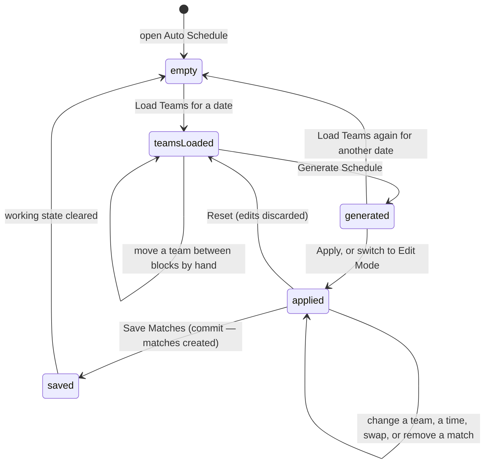

# Building the schedule

## Summary

Two dashboard sections put matches on the calendar. **Match Creation** is a form:
an admin picks a date and pairs teams by hand. **Auto Schedule** is a tool: it
reads which teams have timeslots on a date, proposes pairings, lets the admin
edit them, and writes the lot.

They overlap. Match Creation contains a cut-down copy of the auto-scheduler, and
the two copies do not produce the same result. That difference matters and is
described below.

Neither tool edits a match that already exists. Both only create. Changing or
deleting a scheduled match is done elsewhere.

Which teams are available on a date comes from timeslot assignments; see
[`manage-timeslots.md`](manage-timeslots.md).

## The simple case

An admin opens **Auto Schedule**. The settings panel on the left already shows
today's date and three switches: Avoid Rematches on, Dual Match Mode on,
Prioritize Match Quality hidden because dual mode is on.

They pick next Thursday and press **Load Teams**. The middle of the screen fills
with time blocks and the teams assigned to each, and the panel reports "Teams:
24".

They press **Generate Schedule**. A toast reports the quality rating and the
count — "Generated 12 excellent quality matches. 0 teams unmatched." — and the
Matches tab opens showing the proposed pairings.

They press **Save Matches**. A toast says "Saved 12 matches to the database", the
working state is cleared, and the schedule pages re-fetch.

## The interaction, event by event

### Arrive

**Auto Schedule** restores whatever it was doing last. Its date, its switches,
its loaded teams, its generated pairings, its edits and its edit mode are all
written to the browser tab as they change and read back on arrival. It is the
only screen in the app that keeps a working draft.

**Match Creation** starts fresh every time: the **next Thursday at noon** and one
empty match pairing. Nothing it holds is remembered.

Neither screen focuses a field on arrival.

### Leave without changing anything

Match Creation records nothing.

Auto Schedule writes its state to the browser tab, debounced by about a third of
a second, whenever anything changes — including simply flipping a switch. That
state is per browser tab and survives a reload and a trip to another dashboard
section. It is cleared only by a successful save.

### Begin editing

**Match Creation.** The first edit is choosing a team, a timeslot, or a date.
Nothing marks the form dirty. Each pairing row offers Team 1, a VS marker, Team 2
and a timeslot, plus a trash button. The team chosen on one side is removed from
the other side's list, so a team cannot play itself.

**Auto Schedule.** There are three separate editing surfaces:

- **Teams tab.** Teams can be dragged between blocks in an interactive mode, or
  added to a block from a Manual Assignment sub-tab. A **Reset** button restores
  the teams exactly as they were loaded.
- **Matches tab.** An **Edit Mode** toggle turns the proposed pairings into
  editable cards: two team pickers, a timeslot picker, a swap button and a
  remove button per match. Turning edit mode on before applying the schedule
  applies it automatically first.
- **Export tab.** No editing, only saving.

The moment edit mode holds anything different from what was generated, the screen
counts it as **unsaved edits**, shows a Reset and a Save Matches button, and
**registers a browser warning before leaving the page**. This is the only unsaved
changes guard anywhere in the product — and it catches a reload or a closed tab,
not moving to another dashboard section.

### While editing

**Match Creation** validates nothing until submit. Then it checks, in order: a
date is selected; every pairing has both teams and a timeslot; no team appears in
two pairings. The first failure raises a red toast titled "Error" and stops. The
messages are generic — "Please fill in all match details" does not say which row.

**Auto Schedule** validates continuously in edit mode and blocks Save when the
result is invalid. It refuses a match with a team missing, a team playing itself,
an empty timeslot, or the same team in two matches at the same time. Rematches
are a **warning**, not an error: the card gets an amber edge reading "Rematch —
these teams have already played", and Save still works.

Three refusals are worth knowing:

- Generating with teams loaded for a **different calendar day** raises "Teams Out
  of Date" and does nothing.
- Applying pairings generated for a **different day** raises "Schedule Stale" and
  does nothing.
- Applying a schedule that pairs teams from different time blocks raises
  "Schedule Validation Failed" and does nothing.

### Submit

**Match Creation.** "Create Matches" reads "Creating..." while it runs. It finds
the active season, builds one match per pairing at the chosen date and time, and
labels each one **Court 1, Court 2, …** by its position in the list. On success
the form resets to one empty pairing and the next Thursday, and the schedule
re-fetches. One success toast fires, naming the count and the date.

**Auto Schedule.** "Save Matches" (or "Save Schedule to Database" on the Export
tab) validates, warns about rematches, then inserts every match at once with
courts numbered per timeslot. On success a toast says "Saved *N* matches to the
database" and **the working state is cleared**, so the screen goes back to empty.

On failure both raise a red toast carrying the server's reason. Nothing is
partially rolled back: the write is one insert, so it either all lands or none of
it does.

**Neither tool checks whether these matches already exist.** Pressing Save twice
creates every match twice.

## The two auto-schedulers agree on the time

Match Creation's inline auto-schedule and the standalone Auto Schedule section
share the pairing algorithm, and both turn a time block into a real clock time
before the pairing becomes a match.

- The **inline** one alternates within the block — the block's main time for the
  first match, its second time for the next — and drops the pairing into the form
  as an ordinary editable row.
- The **standalone** one resolves the block to its two times and spreads the
  block's two rounds across them, so a `MidEarly` block fills 7:00 PM and then
  7:30 PM. Each team plays once at each.

With Dual Match Mode on, the standalone tool never sees a block name at all: its
scheduler already keys each pairing by the clock time it assigned.

A time the app cannot read is now refused before the insert, with a red toast
naming the match. It can no longer reach the database.

## Modifiers

| Modifier | Set at arrival | Changed while editing |
| --- | --- | --- |
| The user's role (visitor, player, admin) | Only an admin reaches the dashboard; see [`../foundations/accounts-and-roles.md`](../foundations/accounts-and-roles.md#how-pages-are-gated). | Losing admin elsewhere leaves both tools on screen and the save fails. |
| The record's state | Neither tool reads existing matches except to warn about rematches. Matches already on the schedule are invisible here. | No effect. A match created elsewhere while the tool is open is not noticed. |
| The season's state (active, archived, playoffs on) | Every match is attached to the **active** season. With no active season, Match Creation fails on submit and Auto Schedule saves matches attached to no season at all. | Activating a different season mid-edit changes which season the next save writes to, silently. |
| Viewport | Match Creation stacks its pairing rows. Auto Schedule keeps its settings panel above the tabs on a narrow screen; the editable match cards stack their two team pickers. | No effect beyond re-flowing. |
| Keys the form honours | Tab moves through the date button, then each pairing's controls in order, then the action buttons. | Enter opens the date picker when it is focused. Escape closes an open dropdown or the date popover and does nothing else. |

## Cancel and interrupt

| Event | Before the first edit | While editing or submitting |
| --- | --- | --- |
| Escape, or a Cancel button | No effect. Neither tool has a Cancel button. | Closes an open dropdown or date popover. Auto Schedule's **Reset** discards edits back to the generated schedule with no confirmation. Nothing aborts a request already sent. |
| In-app navigation away, or switching tab within the page | Nothing is lost. | **Match Creation loses everything with no warning**, including switching dashboard section. **Auto Schedule loses nothing** — its state is written to the browser tab. Switching between its own three tabs is always safe. |
| Browser back or forward | Leaves the dashboard. | Same as navigating away for each tool. The unsaved-changes warning does **not** fire on in-app navigation, only on a browser-level leave. |
| Reload, or the tab closed | Match Creation returns to the next Thursday and one blank row. Auto Schedule returns exactly as it was. | Auto Schedule shows the browser's own "leave site?" prompt when there are unsaved edits, then restores everything if the admin stays or reloads anyway. Match Creation loses the lot with no prompt. |
| Network lost mid-request | Nothing to lose. | The save fails, a red toast carries the reason, and nothing is queued. Auto Schedule's working state is **not** cleared, so the admin can press Save again once the connection is back. |
| The request fails or times out | Cannot happen. | Both keep everything on screen. A save that timed out may still have created the matches; pressing Save again would then create them a second time. |
| The session expires | No effect while reading. | The save fails. Nothing signs the admin out or moves them. |
| The same record changed in another tab, or by another user | No realtime. Neither tool notices matches created elsewhere. | **Two admins can generate and save schedules for the same night**, producing two full sets of matches. Nothing detects it. |
| Browser autofill or a password manager writes into the form | Nothing on either screen is a text field a password manager would fill. | Same. |
| The window loses focus | Returning re-fetches teams once past their five-minute window. Auto Schedule's loaded blocks are **not** re-fetched — they are its own state. | A team hidden or renamed elsewhere can change the team pickers under the cursor. |

## Interactions with other systems

**Permissions and roles.** Admin only, by the route gate, with the database
enforcing the same rule on the insert.

**Season scoping.** Every created match is attached to the active season at the
moment of saving. Neither tool lets an admin choose a season.

**Validation and error display.** Match Creation checks on submit and reports one
generic toast. Auto Schedule checks continuously, disables Save, and marks the
offending card in red with the reason on it. Rematch warnings never block.

**Unsaved changes.** Auto Schedule is the only place in the app with a guard, and
it covers only a browser-level leave. Match Creation has none.

**Optimistic updates and rollback.** None. Both wait for the server.

**Realtime.** None.

**Offline.** Loaded teams and generated pairings stay on screen. Saving fails.
Auto Schedule's draft survives, so the work is not lost; Match Creation's is.

**Toasts and notifications.** Frequent. Loading teams, generating, applying,
auto-assigning times, and saving each raise exactly one. Up to three are shown at
once ([B-13](../bug-triage.md#b-13-only-one-toast-is-shown-at-a-time-so-paired-messages-are-lost)),
so a rematch warning raised immediately before a success message survives.

**URL state.** Nothing. Neither the date, the settings, nor the proposed schedule
is in the address bar, so a proposed schedule cannot be shared for review.

**On a phone.** Both tools work but are cramped. The editable match cards stack
into a tall column, and the Teams tab's block view needs a lot of scrolling.

**Accessibility.** Every picker has a label tied to its match. The generated
schedule's quality badges carry text as well as colour. The team-selection grids
respond to Enter and Space as well as a click.

**Side effects the user can notice.** Saved matches appear on the schedule, on
team pages, and in every "next match" card the moment those pages re-fetch. No
notification is sent to any team.

## Edge cases

- **The Match Creation date picker allows Thursdays only.** Its caption used to
  promise "or another date for special events" and disagree with the control.
  Fixed — see [B-30](../bug-triage.md#b-30-small-copy-and-labelling-slips). The
  caption now says Thursdays only, and matches what the picker does.
- **Auto Assign Timeslots cycles a fixed list by position**, so the fourth
  pairing always gets 6:30 PM whether or not those teams are free then. It also
  waits half a second before its toast for no reason the user can see.
- **Court numbers are positional.** Match Creation numbers courts by the row's
  position in the list; Auto Schedule numbers them per timeslot. Neither knows
  how many courts the venue has.
- **A block with an odd number of teams leaves one team unmatched**, counted in
  the panel and in the generation toast, and then silently dropped.
- **"Go to Batch Matches" and "Open Full Auto Schedule" change tab in place.**
  Neither reloads the page.
- **Auto Schedule's draft is per browser tab.** A second tab starts empty and can
  save a conflicting schedule.
- **Saving twice creates every match twice.** There is no duplicate check on
  either tool.
- **A generated match removed in edit mode is gone from the proposal**, and Reset
  is the only way back.

## Open questions and verification

- **Auto Schedule saving matches at midnight is fixed, and never happened.**
  With Dual Match Mode **off**, every match in a block carried the block's *name*
  as its time — the same value for all of them. Because each team plays twice in
  a block, the duplicate-team check refused the save every time, so no time was
  ever written and no live match was ever stored at midnight. With Dual Match
  Mode on, the default, times were always correct. Both paths now save. See B-03.
- **The edit-mode timeslot picker now lists every real block time.** It is built
  from the block constants, so it covers 5:00 PM to 9:30 PM and cannot drift away
  from them again. It previously offered 6:00 PM to 10:00 PM, which both omitted
  two real block times and offered one that was not a block time at all.
- Resolved: **"Go to Batch Matches" and "Open Full Auto Schedule" did nothing.**
  Both set a URL fragment nothing listened for. They were treated as a bug
  ([B-21](../bug-triage.md#b-21-eight-controls-do-nothing-when-pressed)). The
  fragments were the admin tab ids, so tab navigation was the intent; both
  buttons now change tab in place.
- **Nothing prevents saving the same schedule twice.** A slow save that the admin
  retries doubles the night's matches, and undoing that is a matter of deleting
  matches one at a time. Worth raising as a product question.
- **"Special events" still cannot be scheduled from Match Creation at all.** The
  caption no longer promises them ([B-30](../bug-triage.md#b-30-small-copy-and-labelling-slips)),
  but a non-Thursday match must still be created another way. Worth raising as a
  product question.
- Not confirmed by hand: whether the browser's leave-page warning actually
  appears, and what it says in each browser.
- Not confirmed by hand: how the pairing algorithm ranks quality, and what makes
  a rating Excellent rather than Good. That belongs with power score; see
  [`../stats/power-score.md`](../stats/power-score.md).
- Not confirmed by hand: what Auto Schedule saves when there is no active season.
  The code attaches the matches to no season rather than refusing.
- Assumption: "Dual Match Mode" means every team plays two matches in
  consecutive blocks, as its help text says. The pairing behaviour was read from
  the code, not observed.

Verified against `717rec` commit `ea5c8f4`, except the timeslot behaviour above,
which was changed after that commit — see B-03 in
[`bug-triage.md`](../bug-triage.md#b-03-with-dual-match-mode-off-the-auto-schedulers-save-is-always-refused) —
and the two navigation buttons, changed after it too; see
[B-21](../bug-triage.md#b-21-eight-controls-do-nothing-when-pressed).
