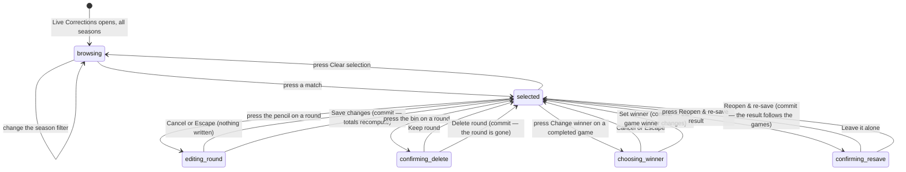

# Correcting a match that has already been scored

## Summary

A match that has been live-scored and finalised is read-only to everybody,
scorers included. This document owns the things an admin can still do to it:
**reopen** the official result, **resubmit** a different one, and **reverse** it
altogether. It also owns **Live Corrections**, the admin panel that edits the
rounds and games underneath a match, and now carries the one control that makes
the official result follow them.

| Action | Where | What it moves |
| --- | --- | --- |
| Edit a round, delete a round, change a game's winner | `/admin` → **Live Corrections** | Rounds and games only. Never the official result. |
| **Reopen & re-save result** | `/admin` → **Live Corrections**, on a finalised match | Reverses the recorded result and both teams' records, then works the result out again from the games and saves it |
| Reopen the match | `/matches/:matchId/live`, admin only | Clears the result and reverses both teams' records |
| Resubmit a result | `/admin` → **Scores** | Reverses the old result and applies a new one |
| Reverse and remove | `/admin` → **Scores**, the bin on a row | Deletes the match and reverses its statistics |

An archived season is **read-only here**. Its matches are still listed and still
readable; none of the editing controls appears, and the service refuses the write
even if one were reached. See [Season scoping](#interactions-with-other-systems).

Correcting a round *before* the result is saved is a different job and belongs to
the scorers; see [`live-scoring/correct-a-round.md`](../live-scoring/correct-a-round.md).

## The simple case

A team reports that game 2 was recorded 21–18 when it was 21–15. The admin opens
`/admin`, picks **Live Corrections**, and leaves the season filter on "All
seasons". A column of cards lists every match that was scored live — team names,
date, and a line reading "3 games · 41 rounds · finalized".

They press the match. The panel on the right lists each game with its running
totals and its winner, and under each game every round with its score and two
icon buttons.

Because the match is finalised, an amber warning sits at the top:

> This match is **finalized**. Edits here will change round/game data
> immediately, but the official result & standings won't update until you reopen
> the match from the live view and re-finalize it.

The admin presses the pencil on round 9. A dialog opens with both sides' score,
bag breakdown, and thrower. They change one score from 6 to 3, fix the bag
counts to match, and press **Save changes**. A toast says "Round updated" and
the game totals redraw.

The standings have not moved yet. Under the warning is **Reopen & re-save
result**. Pressing it asks first — it reverses the recorded result and both
teams' records before working the result out again — and confirming does the
whole job in one go. One toast reports the final game score and that the
standings are updated.

Until that press, the match disagrees with itself, and the **Matches that
disagree with their rounds** card on the admin dashboard names it.

## The interaction, event by event

### Arrive

The section names itself "Live Score Corrections" and explains itself in one
line: "Fix wrong round scores, bag breakdowns, throwers, or the winner of a
completed game. Only matches scored live are listed here."

**Only live-scored matches are listed.** A match resulted through the Scores
tool, or through a player's score report, has no games and no rounds and never
appears here. There is nothing this panel can do for it.

A season picker defaults to **All seasons**. Archived seasons are listed in it
and named as such — "Winter 1 (archived — read-only)" — and every card belonging
to one ends its counts line with "archived, read-only", because "All seasons"
mixes them in without anyone choosing them. While the list loads, "Loading
live-scored matches…". If it fails, "Failed to load matches." in red. If the
list is empty — including when a season filter emptied it — the panel says "No
live-scored matches yet."

The right-hand side starts as a dashed box reading "Select a match to view and
correct its rounds."

Nothing is written by arriving.

### Leave without changing anything

Nothing is recorded. The selected match is held in the page, so leaving the
section clears the selection. Coming back starts at "All seasons" with nothing
selected.

### Begin editing

Choosing a match loads it and draws one card per game: "Game 2 · *Team A* 21 –
15 *Team B*", the winner named beside it, then each round as "Round 9" with its
score under it and a pencil and a bin on the right.

A **Change winner** button appears on the card header of every game whose status
is completed. A game still in progress does not offer it.

None of the three buttons writes anything on its own. Each opens a dialog.

**On an archived season there are no buttons at all.** A grey banner sits where
the amber one would, naming the season and saying that its rounds, its games and
the numbers derived from them stay as the league left them. Everything below is
still shown; nothing on it can be pressed.

### While editing

**Edit round** is the only real form here. Both sides get a Score, three bag
fields — In, On, Off — and a Thrower list holding that game's players plus
"Unassigned". It is checked live and the Save button stays dead until it passes:

| Rule | Message |
| --- | --- |
| A round score must be 0–10 or 12 | "*Team* score is invalid" |
| Bag fields are all filled or all blank | "*Team*: fill all bag fields or leave all blank" |
| Four bags per side, three points per bag in the hole and one on the board | "*Team* bag breakdown doesn't add up" |

11 is not a possible round score, which is why it is missing from the list.

The dialog loads the round's stored values when it opens and **does not reload
them if the round changes underneath**, so a half-finished correction is not
wiped by a background refresh.

**Delete round** asks first: "Delete round *N*? This removes round *N* from game
*M*. The game totals shown here recompute at once, but the game's stored winner
does not: if deleting this round changes who won, use 'Change winner' above to
fix it. On a finalized match, finish with 'Reopen & re-save result' so the
official result follows." The choices are "Keep round" and "Delete round". The
dialog is telling the truth: **deleting a round does not re-decide the game.**

**Change winner** offers the two teams, pre-set to the current winner, and
states the totals so the admin can see which one the score supports. Its
description says what it does and does not reach: "This changes the game only. On
a finalized match, finish with 'Reopen & re-save result' so the official result
follows."

### Submit

None of the three writes is optimistic. Each waits, the button reads "Saving…"
or "Deleting…", and the dialog closes only on success.

| Action | On success | On failure |
| --- | --- | --- |
| Save changes | Toast "Round updated" | Red toast "Could not update round" with the league's own reason |
| Delete round | Toast "Round deleted" | Red toast "Could not delete round" with the reason |
| Set winner | Toast "Game winner updated" | Red toast "Could not change game winner" with the reason |
| Reopen & re-save | Toast "Result re-saved" with the final game score | Red toast "Could not re-save the result" with the reason |

These failure toasts are unusual in this app: they carry the real reason rather
than a fixed sentence.

After each one the match is re-read and the totals redraw. **If the match is
finalised, every match-level number is re-read too** — standings, records,
rankings — even though this write did not change any of them.

### Reopening, resubmitting, and reversing

**Reopen & re-save result** is in this panel, on a finalised match whose season
is not archived. It sits under the amber warning. It asks first — "Reopen and
re-save this result?" — because it reverses the recorded result and both teams'
records before working the result out again from the games above. The choices are
"Leave it alone" and "Reopen & re-save". Standings move twice and end up matching
the games. One toast reports the outcome, not two.

**If the second half is refused** — the games no longer decide a winner, say —
the old result is already reversed and the match is left open. The toast says so:
"The old result was reversed, but the new one could not be saved: *reason* The
match is open now — fix the games, then save the result again." Nothing is
hidden and nothing claims success. If the *reopen* itself is refused, nothing was
touched and the message does not suggest otherwise.

**Reopening alone** is still the admin-only "Reopen match (admin)" button at the
foot of the live review screen, and it is owned by
[`live-scoring/finish-the-match.md`](../live-scoring/finish-the-match.md). It
asks first, clears the winner and the completion, **reverses both teams'
records**, and keeps the games and rounds so they can be corrected and saved
again. Standings move immediately. If there was no result to reverse it says
"Nothing to reopen".

**Resubmitting** is the Scores tool, and needs no reopening first: choosing a
different result there reverses the old one and applies the new one in one
transaction. It asks nothing. See
[`enter-scores-in-bulk.md`](enter-scores-in-bulk.md).

**Reversing** completely means deleting the match, again from the Scores tool.
That asks first, and reverses the statistics as it deletes.

**Nothing reconciles the two automatically.** A match can still carry rounds that
add up to one score and an official result that says another — deleting a round
does not re-decide the game, and changing a game's winner does not re-decide the
match. What has changed is that the state is no longer silent: the **Matches that
disagree with their rounds** card on `/admin` → **League Night Status** lists
every such match in the active season, and **Reopen & re-save result** clears one
in a single press. See [`site-settings.md`](site-settings.md).

## Modifiers

| Modifier | Set at arrival | Changed while editing |
| --- | --- | --- |
| The user's role | Admin only, by the guard on `/admin`. Reopening a match likewise needs admin; **reopening a single game does not** — any scorer can do that from the live page. | Losing admin leaves the panel on screen; the writes then fail with the league's refusal as the message. |
| The record's state | A finalised match shows the amber warning, offers **Reopen & re-save result**, and refreshes standings after each edit. An unfinalised one does none of the three. Only a completed game offers Change winner. | A match finalised elsewhere while the panel is open does not show the warning until the panel is re-read. |
| The season's state | An **archived** season is read-only: a grey banner replaces the amber one, and the pencil, the bin, **Change winner** and **Reopen & re-save result** are all absent. The service refuses the write as well, naming the season. | Read from **the open match's own season**, not from the filter, so a match selected under one filter keeps the right answer after the filter changes. |
| Viewport | The list sits beside the panel on a wide screen and stacks above it on a narrow one. The dialogs are full-width on a phone. | No effect. |
| Keys the app honours | All three dialogs are proper dialogs: Escape closes, Tab is trapped, focus returns to the trigger. | Escape is the same as Cancel or "Keep round" and never writes. |

## Cancel and interrupt

| Event | Before the first edit | While editing or submitting |
| --- | --- | --- |
| Escape, or a Cancel button | Nothing to cancel. "Clear selection" empties the right-hand panel. | Closes the dialog and writes nothing. It cannot stop a save already sent. |
| In-app navigation away, or switching tab within the page | Nothing is lost. | An unsaved dialog is lost with no warning. A save already sent still lands; the admin never sees the toast. |
| Browser back or forward | As above, and the app cannot prevent it. | As above. |
| Reload, or the tab closed | The panel returns with no match selected. | An unsaved edit is gone. A sent write may have landed; the round list after reloading says which. |
| Network lost mid-request | The list fails with "Failed to load matches." | The write fails and its red toast carries the reason. Nothing is queued and the dialog stays open with the input intact. |
| The request fails or times out | As above. | As above. The admin can press Save again without retyping. |
| The session expires | The list will not load. | The write is refused and the refusal is shown as the toast's description. |
| The same record changed in another tab, or by another user | No effect. **This panel opens no realtime connection**, so it shows what it read. | If the round being edited is deleted elsewhere, the dialog closes itself as soon as the panel next re-reads the match — which, with no realtime, is after the admin's own next write. |
| Browser autofill or a password manager writes into the form | No effect. The round fields are numeric and unnamed. | No effect. |
| The window loses focus | No effect. | No effect. Nothing refetches on focus here. |

After an interrupt the round list is the record. What it shows is what is
stored; whether the official result agrees is a separate question the screen
does not answer.

## Interactions with other systems

**Permissions and roles.** Admin only, and enforced independently by the
database on the round and game tables. See
[`foundations/accounts-and-roles.md`](../foundations/accounts-and-roles.md).

**Season scoping.** The season picker is a filter over the list. The guard is
separate and sits on the match: an archived season's rounds are shown and cannot
be changed. This is the same freeze
[`foundations/seasons.md`](../foundations/seasons.md) describes for computed
numbers, now covering the rows those numbers come from.

In practice an archived season holds few matches here at all: archiving moves a
season's finished matches to the archive table and deletes them, so what is left
is its unfinished ones. Those are exactly the matches the **Unrecorded live
matches** card refuses to offer, because saving one would add an old result to
the current season's standings.

**Validation and error display.** Round rules are checked live in the dialog and
again in the service before the write. Failures are toasts carrying the league's
real message.

**Unsaved changes.** Not guarded. Closing a dialog discards its input silently.

**Optimistic updates and rollback.** None. Every write waits.

**Realtime.** None on this panel, despite what the totals imply. Only
`/matches/:matchId/live` subscribes; see
[`live-scoring/start-a-live-match.md`](../live-scoring/start-a-live-match.md).

**Offline.** Nothing loads and nothing saves.

**Toasts and notifications.** One toast per action, and the failure toasts are
specific. Nothing is sent to the teams whose match was corrected.

**URL state.** None. Neither the selected season nor the selected match is in
the address, so a correction cannot be handed to another admin as a link.

**On a phone.** The layout stacks. The edit dialog's eight numeric fields in a
four-column grid are cramped.

**Accessibility.** Each round's buttons are labelled "Edit round *N*" and
"Delete round *N*". The delete confirmation is a proper alert dialog. The
validation message is announced. The amber finalised warning is plain text and
is not announced.

**Side effects the user can notice.** Editing rounds changes what the live
review screen, the recap, and the per-player statistics show for that match.
Reopening, resubmitting, and deleting each move standings, records, badges, and
power scores. **Editing a round on a finalised match moves none of them**, so the
two disagree until someone re-saves — which the admin dashboard now lists and
**Reopen & re-save result** now does in one press.

## Edge cases

- **The panel's edits and the official result are still independent.** Fixing a
  round on a finalised match leaves the standings wrong until someone re-saves.
  Nothing enforces it — but **Reopen & re-save result** is one press, and the
  admin dashboard lists every match left in that state.
- **Deleting a round does not re-decide the game**, and changing a game's winner
  does not re-decide the match. Both still have to be done by hand, in order,
  before the result is re-saved.
- **Deleting the last round of a completed game leaves it completed, with a
  winner and no rounds.** Nothing clears the game. The dashboard card reports it
  as its own kind of disagreement.
- **Re-saving can leave a match with no result.** If the games no longer decide a
  winner, the old result is reversed and the new one is refused. The toast says
  so; the match is then open, and `/schedule` shows it as an upcoming fixture
  again until the games are fixed and the result saved.
- **An archived season is read-only.** Its rounds are visible and unchangeable,
  in the panel and in the service beneath it.
- **Changing a game winner rewrites the game's stored score** to the totals the
  rounds produce, which may not be what the recorded result assumed.
- **Only live-scored matches appear.** A match resulted in bulk has no rounds to
  correct, so the only correction available is re-scoring or deleting it.
- **A selected match survives a season filter change**, so the panel can show a
  match that the list beside it no longer contains. Whether it is read-only is
  read from that match's own season, so the answer stays right.
- **The empty state says "No live-scored matches yet"** even when a season
  filter is what emptied it.
- **Nothing records that a correction happened.** There is no audit trail on
  rounds, games, or results anywhere a user can see. The dashboard card shows the
  *state*, not the history: once a match is re-saved it drops off the list and
  nothing says it was ever corrected.
- **Reopening a match needs admin; reopening a game does not.** The two look
  alike and differ completely in reach.

## Open questions and verification

- Resolved: **a finalised match could be edited into disagreeing with itself,
  with no follow-up.** It was treated as a bug
  ([B-19](../bug-triage.md#b-19-live-corrections-can-leave-a-match-disagreeing-with-itself)).
  A dashboard card now lists every match in the active season whose result and
  rounds disagree, and **Reopen & re-save result** fixes one in a press. The
  result is still not re-decided automatically — that was the deliberate choice,
  because a round delete would otherwise move both teams' records in the middle
  of a multi-step correction.
- Resolved: **archived seasons were editable here.** It was treated as a bug
  ([B-20](../bug-triage.md#b-20-archived-seasons-are-editable-through-live-corrections)).
  They are now read-only, in the panel and in the service.
- Resolved: whether deleting the last round of a completed game leaves the game
  completed with a winner and no rounds. **It does**, and that is now one of the
  five disagreements the dashboard card reports.
- **The panel claims realtime it does not have.** It opens no channel, so a
  second admin's changes are invisible until this admin writes something.
- **The dashboard card is scoped to the active season**, so a disagreement in any
  other season is not listed. That follows from the fix being a re-save, which
  must never run on an old season. Whether the league wants a read-only report
  covering every season is open.
- Not confirmed by hand: whether the match list's game and round counts are
  correct when a season filter is applied.
- Not confirmed by hand: what the live review screen shows after a round is
  edited but the result is not re-saved.
- Not confirmed by hand: whether reopening a match that was resulted in bulk,
  rather than live-scored, behaves the same way.
- Assumption: the database refuses these writes for anyone who is not an admin.
  The service says so in a comment; it was not observed.

Verified against `717rec` commit `ea5c8f4`.
