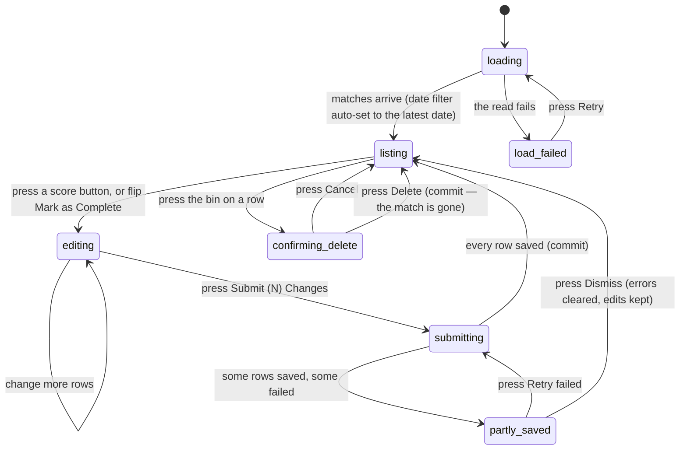

# Entering scores in bulk

## Summary

Mass Score Entry is the tool an admin uses to record a whole league night at
once. It lists every match for one date, offers four buttons per match — 2–0,
2–1, 1–2, 0–2 — and writes them all with one press. It is the fastest way to
result a match in the product, and the only way to result many at a time.

It is a section of the admin dashboard, not a route: `/admin`, then **Scores**
in the admin menu. Nothing about it is in the address bar. It is also the only
place in the app where a match can be **deleted**.

The four buttons are the whole vocabulary. A match resulted here has a winner
and a game-win split, and nothing else. Round-by-round detail belongs to live
scoring; see [`live-scoring/enter-a-round.md`](../live-scoring/enter-a-round.md).

## The simple case

The admin opens `/admin` and picks **Scores**. The tool loads every match, then
sets the date filter to the **latest match date it found** and reloads to just
that day. Matches are grouped by date, then by start time inside the date.

Each match is a card: the two team names stacked with "vs" between them, a row
of four score buttons, and a "Mark as Complete" switch. The admin presses
**2–1** on the first card. The button fills in, the switch flips itself on, and
a small blue "Edited" tag appears. The button at the foot of the panel changes
from "Submit All Changes" to **"Submit (1) Changes"**.

They work down the list. When they are done the button reads "Submit (9)
Changes". They press it. It becomes "Processing..." and every edited card shows
"Submitting..." in turn — the tool sends them **one at a time**, not together.

A toast says "✅ Matches Submitted — 9 match(es) successfully submitted. (9
saved, 0 failed.)". The edited tags clear, the list refreshes from the league,
and standings, records, and power scores are all recalculated behind it.

If some fail, the toast is red and says how many of each, and a banner stays on
screen above the list naming every match that failed with a **Retry failed**
button. The failed cards keep their edits and turn red-edged.

## The interaction, event by event

### Arrive

The section loads its own code the first time, so there is a brief "Loading
admin section..." panel. Then a skeleton in the shape of the table while the
matches load.

**Two filters sit above the list.** A date picker reading "Filter by Date", and
a bracket picker reading "Filter by Bracket" with "All Brackets" at the top. On
the very first load, and only then, the tool looks at what came back, finds the
**latest match date**, and sets the date filter to it. Clearing the filters
afterwards does not make it happen again.

> **Technical note:** the date filter is *evening-aware*. A match played on
> Sunday evening is stored with Monday's date in universal time, so the filter
> asks for a range rather than a day. A line under the picker says "Showing
> matches for the entire session (including evening games)".

Date groups are collapsed unless there are three or fewer of them. Inside a
date, time groups are open if that date has five or fewer matches. **A match
with no date never appears** — the table groups by date and drops anything
without one, silently. Nothing is written by arriving.

### Leave without changing anything

Nothing is recorded. Leaving the section, or the dashboard, keeps nothing: the
edits live in the page and the page is unmounted. The **active admin section is
remembered** for the tab, so coming back to `/admin` returns to Scores with a
freshly loaded table and no edits.

### Begin editing

The first press of a score button does three things at once:

1. Records the result on the row — the win, and the game wins.
2. **Flips "Mark as Complete" on by itself.** The admin does not have to.
3. Marks the row edited, which is what makes it eligible to submit.

An "Edited" tag appears beside the switch and the submit button's count goes up.
There is no other signal, no confirmation, and no undo. Flipping "Mark as
Complete" by hand also marks the row edited, but on its own records no score: a
row completed with no score shows a red **"Invalid Score"** tag and is not
counted by the submit button.

### While editing

Each card offers exactly four results: **2–0, 2–1, 1–2, 0–2**. Above them, the
two team names with arrows — "← *Team A*" and "*Team B* →" — abbreviated to ten
characters and an ellipsis when longer. There is no free score entry, no way to
record 3–0, and no way to record a tie.

Pressing a second button replaces the first. Pressing the same button again
re-selects it; it does not deselect. A row that is edited but not submittable
shows a grey hint under it:

| Situation | Hint |
| --- | --- |
| Scores do not make one winner | "Invalid — fix scores before submitting." |
| "Mark as Complete" switched off | "Marked incomplete — won't submit here. Use Live Corrections to reopen completed matches." |

That second hint is the important one. **Switching "Mark as Complete" off does
not un-complete a match.** The row simply stops being submittable and the change
is never sent.

A background refresh cannot overwrite an edited row: the tool merges what comes
back with what is on screen and keeps every row the admin has touched. Each row
also carries a **bin icon**, covered under [Submit](#submit) because it is a
write rather than an edit.

### Submit

**"Submit (N) Changes"** sends every row that is edited, valid, and complete.
A row missing any of the three is skipped without comment. If none qualifies, a
plain toast says "No Changes — There are no valid matches to submit." and
nothing is sent.

Rows are submitted **strictly one at a time**, in list order, each waiting for
the one before it. A batch of twenty is twenty round trips.

Each write reverses whatever result the match already had and applies the new
one, in a single transaction, then refreshes that season's team statistics.
**Re-scoring an already-completed match therefore silently un-does the old
result** — no warning, no confirmation, no mention that it is happening.

> **Technical note:** the write is idempotent. Sending the identical result
> twice records it once, which is what makes "Retry failed" safe after a partial
> failure.

When the batch ends, one toast summarises it:

| Outcome | Toast |
| --- | --- |
| All saved | "✅ Matches Submitted — *N* match(es) successfully submitted. (*N* saved, 0 failed.)" |
| Some failed | Red. "✅ Matches Submitted — *N* match(es) successfully submitted. *M* failed. (*N* saved, *M* failed.)" |
| All failed | Red. "Error — 0 match(es) successfully submitted. *M* failed." |

**This is the one bulk operation in the app that survives the single-toast
rule**, because it reports a summary rather than one message per item. See
[`foundations/messages-to-the-user.md`](../foundations/messages-to-the-user.md).
It survives it twice over: a red banner above the list also stays, reading "*N*
saved, *M* failed.", with **Retry failed**, a dismiss cross, and a **Show
details** link that lists one line per failed match — "Couldn't save *Team A* vs
*Team B* — try again." plus the league's own reason. Failed rows keep their
edits, turn red-edged, and say "Submission failed - please retry".

**Deleting a match** asks first. The dialog reads "Are you sure? This action
cannot be undone. This will permanently delete the match from the schedule." and
offers Cancel and Delete. Confirming removes the match **and reverses the
statistics it produced**, in one transaction, so a failure to reverse rolls back
the delete. The dialog does not mention the statistics. A toast says "Match
deleted — The match has been removed successfully." and the row disappears
without disturbing edits on other rows.

## Modifiers

| Modifier | Set at arrival | Changed while editing |
| --- | --- | --- |
| The user's role | Admin only. The whole dashboard is gated; see [`foundations/accounts-and-roles.md`](../foundations/accounts-and-roles.md#how-pages-are-gated). A visitor or player never reaches this tool. | Losing admin mid-session leaves the tool on screen and every write begins failing with the generic per-row message. |
| The record's state | A completed match shows its recorded result selected and its switch on. It is fully editable, and re-scoring it replaces the old result. A match with no date is not shown at all. | Another admin resulting the same match does not reach this screen. The next refresh shows the new value unless the row has been edited here, in which case the local edit wins. |
| The season's state | No effect. The tool lists matches by date and bracket, not by season, so archived seasons' matches are reachable and editable. | No effect. |
| Viewport | Cards are one column on a phone and two on a desktop. The four score buttons stay in one row of four at every width, 44 pixels tall. | No effect beyond re-flowing. |
| Keys the form honours | Tab reaches every score button, the switch, and the bin. Space or Enter presses the focused control. There is no keyboard shortcut for submit. | Escape closes the date picker, the bracket list, or the delete dialog. It never clears an edit. |

## Cancel and interrupt

| Event | Before the first edit | While editing or submitting |
| --- | --- | --- |
| Escape, or a Cancel button | Closes an open filter. There is no Cancel button on the tool itself. | Closes the delete dialog without deleting, or an open filter. **It cannot stop a batch already sent**, and it never discards edits. |
| In-app navigation away, or switching tab within the page | Nothing is lost. | **Every unsaved edit is lost with no warning.** Switching to another admin section is enough — each section is unmounted when it is left. A batch already sent still completes and still lands; the admin never sees the summary toast. |
| Browser back or forward | Returns to the previous page. Nothing is recorded. | Same as navigating away, and the app cannot prevent it. |
| Reload, or the tab closed | The tool reloads and re-picks the latest date. | Every unsaved edit is lost. Rows already written stay written. After a reload the table itself says which is which. |
| Network lost mid-request | The list fails to load and a red banner says "Couldn't load matches — retry." with a Retry button. | The batch fails row by row. Every row is marked failed, the red banner appears, and the summary toast says 0 saved. Nothing is queued. |
| The request fails or times out | As above. | The failed rows keep their edits and their errors; the rest are already saved. Retry failed re-sends only the failures. |
| The session expires | The list will not load. | Each write is refused. The admin sees per-row failures with the league's message, not a sign-in prompt. |
| The same record changed in another tab, or by another user | No effect; there is no realtime here. The list is what it was when it loaded. | **Two admins can result the same match at once.** The last write wins, reversing the other's result and applying its own. Neither is told. |
| Browser autofill or a password manager writes into the form | No effect. There are no text fields. | No effect. |
| The window loses focus | No effect. This tool deliberately does **not** refetch on focus, so unsaved edits cannot be wiped by a background refresh. | No effect. |

After any interrupt, the table is the record: a row showing a selected score
button with no "Edited" tag is saved; a row with the tag is not.

## Interactions with other systems

**Permissions and roles.** Admin only, by the route guard on `/admin`. There is
no second check inside the tool.

**Season scoping.** None. The tool filters by date and by bracket, never by
season, so it will happily list and re-score matches from an archived season.
See [`foundations/seasons.md`](../foundations/seasons.md).

**Validation and error display.** One rule: exactly one team must win. It is
checked as the buttons are pressed, shown as a red "Invalid Score" tag, and
checked again before anything is sent. Failures appear in three places at once:
the row, the banner, and the toast.

**Unsaved changes.** Not guarded. No prompt, no draft, no restore. Edits survive
a filter change only if the row is still in the new result.

**Optimistic updates and rollback.** Rows are marked "Submitting..." at once,
but no score is shown as saved before the league confirms it. A failed row is
put back to edited-with-an-error rather than rolled back to its old value.

**Realtime.** None. Nothing on this screen updates by itself.

**Offline.** Everything fails. Nothing is queued.

**Toasts and notifications.** One summary toast per batch, one per delete. No
notification is sent to anyone when a match is resulted.

**URL state.** None at all. The active admin section is remembered in the
browser for the tab, not in the address, so this tool cannot be linked to and
the filters cannot be shared.

**On a phone.** The admin menu becomes a grouped list at the top. Cards go to
one column. The four score buttons stay in a row of four and remain tappable.

**Accessibility.** Each score button reports whether it is pressed. The switch
has a real label. The delete dialog is a proper dialog. The red banner is an
alert. The "Edited", "Complete", and "Invalid Score" tags are text, so they are
readable, but nothing announces them when they change.

**Side effects the user can notice.** A batch moves standings, both teams'
records, per-team statistics, badges, and power scores. Badge processing runs
per match after the write and each badge is attempted independently, so a badge
failure does not fail the score. Deleting a match reverses all of it.

## Edge cases

- **Only four results can be entered.** A match that did not end 2–0 or 2–1
  cannot be recorded here at all.
- **Picking a score completes the match by itself.** An admin who taps a button
  to see what it looks like has staged a completed match.
- **Un-completing is impossible here.** The switch goes off, the row stops being
  submittable, and the match stays completed in the league.
- **Re-scoring a completed match asks nothing.** It reverses the old result and
  applies the new one on the same press as any other row.
- **A match with no date is invisible**, so it can never be resulted or deleted
  from this tool.
- **The empty state mentions a filter that does not exist**: "No matches match
  your current filters. Try adjusting your date range or team selection." There
  is no team filter.
- **The post-batch refresh can steal the summary toast.** After a batch the tool
  re-reads the list, and if that read fails it raises its own red toast, which
  replaces the summary the admin had one moment to read.
- **Retry failed re-sends only the failures**, and is safe to press repeatedly.
- **Dismissing the error banner keeps the edits.**
- **Deleting is the only irreversible action in the tool** and its confirmation
  says nothing about statistics being reversed.
- **Two admins editing the same night** do not see each other at all.

## Open questions and verification

- **Re-scoring a completed match is destructive and asks nothing.** One press
  reverses a recorded result, moves both teams' records, and recalculates power
  scores, with the same weight of interaction as correcting a typo. Every other
  write of that consequence in the product confirms first. **May be worth
  treating as a bug rather than documenting.**
- **Matches with no date are silently dropped from the table.** They cannot be
  resulted or deleted here and nothing says they exist. **May be worth treating
  as a bug rather than documenting.**
- **The refresh-failure toast can replace the batch summary**, which is the only
  place the saved and failed counts are stated together outside the banner.
  **May be worth treating as a bug rather than documenting.**
- The empty state's "team selection" wording describes a filter the tool does
  not have.
- Not confirmed by hand: whether the auto-set date filter picks the night the
  admin actually wants, or a future scheduled date, when the schedule runs ahead.
- Not confirmed by hand: how long a batch of twenty takes end to end, given the
  writes are serial and each rewrites season statistics, and whether badge and
  power-score recalculation has caught up by the time the table is redrawn.
- Assumption: deleting a match also removes any live-scoring games and rounds
  attached to it. The delete is a single database routine and this was not
  observed.
- The tool's own tests cover the hooks and one browser path — enter 2–0, submit,
  assert the write — so the four-button vocabulary and the partial-failure
  banner are read from the components rather than from a passing test.

Verified against `717rec` commit `ea5c8f4`.
