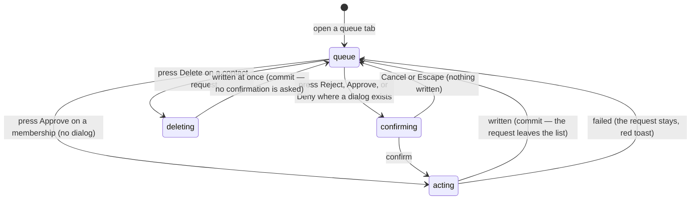

# Handling requests

## Summary

Three separate queues reach the league, and an admin clears them in three
different places. This document owns all three.

| Queue                   | Where                                                                                                    | What arrives                                                                 | Outcomes                                                                |
| ----------------------- | -------------------------------------------------------------------------------------------------------- | ---------------------------------------------------------------------------- | ----------------------------------------------------------------------- |
| **Membership requests** | `/admin` → **Teams** → **Member Approvals**                                                              | A signed-in person asked to join a team                                      | Approve, or Reject — which **deletes the request**                      |
| **Contact requests**    | `/admin` → **Contact Inbox** (filter: _League requests_), and again at the top of `/admin/notifications` | A message sent from the panel at the foot of the home page                   | Mark resolved, Reopen, or **Delete**                                    |
| **Support tickets**     | `/admin` → **Contact Inbox** (filter: _Support_), same place                                             | A message sent from the `/contact` page, which is also emailed to the league | Mark resolved or Reopen. **No Delete** — the table has no delete policy |
| **Team requests**       | `/admin` → **Requests**                                                                                  | A team asked for a time change, a bye, or an emergency cancellation          | Approve or Deny, each with optional notes                               |

Contact requests and support tickets share one screen and one set of outcome
words, but the rest share nothing: no common list, no common state words, no
common badge. Only team requests are counted on the admin menu. Only the Contact
Inbox updates by itself. Only membership requests change what someone can do.

One thing that looks like it belongs here and does not: **score submissions** are
a fourth queue, under **Pending**; see
[`scores/pending-scores.md`](../scores/pending-scores.md).

## The simple case

A player has asked to join a team. The admin opens `/admin`, picks **Teams**,
and sees a red badge on the **Member Approvals** tab. The tab lists one card:
the person's avatar and name, the words "wants to join", the team's badge and
name, and the date they asked.

Two buttons: a green **Approve** and an outlined **Reject**.

Approve writes immediately — no dialog — and a toast says "Membership Approved —
The user can now edit team details". The card disappears and the badge count
drops.

Reject asks first: "Reject membership request? Are you sure you want to reject
this membership request? The user will be removed from the team." Confirming
**deletes the request row outright**. There is no rejected state to look back at
and nothing tells the person; they simply see nothing happen, indefinitely.

## The interaction, event by event

### Arrive

**Member Approvals** loads every unapproved membership, newest first, with the
person's profile and the team's name filled in beside it. A spinner while it
loads; a red panel headed "Failed to load memberships" with the league's own
message if it fails; and, when the queue is empty, a green tick and "All caught
up! — No pending team membership requests at this time."

**Contact Inbox** loads the hundred most recent contact requests, newest first,
resolved ones included and dimmed. A red pill counts the ones still marked new.
Each entry shows a coloured type badge — Timeslot Request, Score, Join the
league, General, Other — a "Verified" badge when the sender was signed in, the
time, the sender's name and team, their contact detail as a `mailto:` or `tel:`
link where it looks like one, the message, and, for a join request, the players
they listed.

**Requests** loads team requests filtered to **Pending** by default, with a
picker offering All, Pending, Approved, Denied. Pending rows are outlined amber.
Each shows the team, the request type, the status, when it was submitted and by
whom, the dates and timeslots involved, the reason, any admin notes, and when it
was processed.

Nothing is written by arriving anywhere.

### Leave without changing anything

Nothing is recorded in any of the three. None of them marks anything as seen,
read, or opened. A contact request stays "new" until an admin explicitly resolves
it, however many times it has been looked at.

### Begin editing

**Membership.** There is nothing to edit. Approve acts on the first press.
Reject opens a confirmation.

**Contact.** There is nothing to edit either — no reply box, no note field, no
assignment. The three buttons act directly.

**Team requests.** Approve and Deny both open the same dialog, headed "Approve
Request" or "Deny Request", with one optional notes box: "Approve this request?
You can add optional notes." or "Deny this request? Consider adding a reason."
Typing in the box is the only editing anywhere in this document.

### While editing

The notes box is free text with no limit, no counter, and no validation. It is
cleared each time a dialog is opened, so notes typed for one request never leak
into another.

The dialog's buttons are Cancel and Approve, or Cancel and a red Deny.

### Submit

**Approving a membership** flips it to approved and stamps who approved it and
when. On success: "Membership Approved — The user can now edit team details". On
failure the card stays and a red toast says "Error — Failed to update membership
status". One failure has its own sentence: if the person already has an approved
membership on another team, the message reads "This user already has an approved
membership on another team. Remove that membership first." Only one approved
membership per person is allowed.

**Rejecting a membership** deletes the row. Nothing is kept: no record that the
request existed, no record of who refused it. The person can ask again the next
minute and the queue will show it as new.

**Contact requests** have three writes, none of them confirmed:

| Button        | What it does                                            | Toast           |
| ------------- | ------------------------------------------------------- | --------------- |
| Mark resolved | Sets the request resolved and records who did it        | None on success |
| Reopen        | Sets it back to new and clears who resolved it          | None on success |
| Delete        | **Removes the request permanently, on the first press** | None on success |

Failures raise "Failed to mark contact request as resolved", "Failed to reopen
contact request", or "Failed to delete contact request" — a title with no
explanation. Success says nothing at all; the list simply changes.

**Team requests** are written with the status, the notes, and who processed
them. On success the dialog closes, everything is cleared, and a toast says
"Request Approved — The request has been approved." or "Request Denied". On
failure the toast is "Error — Failed to update request. Please try again." and
**the dialog stays open with the notes intact**.

Approving a team request writes a status and nothing else. **The schedule does
not move.** Whatever was asked for — a different timeslot, a bye, a cancelled
match — an admin still has to do by hand in the schedule tools.

## Modifiers

| Modifier              | Set at arrival                                                                                                                                                                                                                   | Changed while editing                                                                                               |
| --------------------- | -------------------------------------------------------------------------------------------------------------------------------------------------------------------------------------------------------------------------------- | ------------------------------------------------------------------------------------------------------------------- |
| The user's role       | Admin only, all three, by the guard on `/admin` and `/admin/notifications`. See [`foundations/accounts-and-roles.md`](../foundations/accounts-and-roles.md#how-pages-are-gated).                                                 | Losing admin leaves every button on screen; the writes then fail with each queue's generic message.                 |
| The record's state    | A membership is either waiting or gone from the list. A contact request is new or resolved, and a resolved one is dimmed and offers Reopen instead of Mark resolved. A team request that is not Pending shows no buttons at all. | A contact request resolved in another tab updates here **by itself** — it is the only queue with a live connection. |
| The season's state    | Memberships and contact requests are not season-scoped and survive a season changeover. Team requests carry a season but the list does not filter by it, so old seasons' requests stay in the list forever.                      | No effect.                                                                                                          |
| Viewport              | All three are card lists that stack on a narrow screen. The team-request approve and deny buttons move under the header on a phone.                                                                                              | No effect.                                                                                                          |
| Keys the form honours | Tab reaches every button. The membership reject dialog and the team-request dialog are proper dialogs; Escape closes them.                                                                                                       | Escape closes a dialog without writing. It cannot stop the contact-request Delete, which has no dialog.             |

## Cancel and interrupt

| Event                                                       | Before the first edit                                                                                                                                                                               | While editing or submitting                                                                                                                                                                        |
| ----------------------------------------------------------- | --------------------------------------------------------------------------------------------------------------------------------------------------------------------------------------------------- | -------------------------------------------------------------------------------------------------------------------------------------------------------------------------------------------------- |
| Escape, or a Cancel button                                  | Nothing to cancel.                                                                                                                                                                                  | Closes the reject or approve/deny dialog and writes nothing. **There is nothing to cancel on a contact-request delete** — it is already sent.                                                      |
| In-app navigation away, or switching tab within the page    | Nothing is lost.                                                                                                                                                                                    | Typed admin notes are lost with no warning. A write already sent still lands; the admin never sees the toast. Switching admin section is enough.                                                   |
| Browser back or forward                                     | As above, and the app cannot prevent it.                                                                                                                                                            | As above.                                                                                                                                                                                          |
| Reload, or the tab closed                                   | Each queue reloads from the league. The team-request filter goes back to Pending.                                                                                                                   | Unsent notes are gone. A sent write may have landed; the reloaded list says which.                                                                                                                 |
| Network lost mid-request                                    | The membership queue shows its red failure panel. The contact list shows "Loading…" then nothing. The team-request list shows a spinner.                                                            | The write fails and the queue's generic red toast appears. Nothing is queued for later.                                                                                                            |
| The request fails or times out                              | As above.                                                                                                                                                                                           | As above. Membership and contact rows stay in place; the team-request dialog stays open with its notes.                                                                                            |
| The session expires                                         | Nothing loads.                                                                                                                                                                                      | Every write is refused, and the refusal is reported as that queue's generic failure. No queue mentions the session.                                                                                |
| The same record changed in another tab, or by another user  | **Contact requests only:** the list re-reads itself when the table changes, so another admin's work appears without a reload. Memberships and team requests do not, and keep showing the old queue. | Two admins can act on the same membership or team request; the second write simply overwrites, or fails because the row has gone, with the generic message.                                        |
| Browser autofill or a password manager writes into the form | No effect.                                                                                                                                                                                          | The admin notes box is unnamed free text and is not a target for autofill.                                                                                                                         |
| The window loses focus                                      | No effect.                                                                                                                                                                                          | Returning to the tab refetches the team-request list and the two counts once they are stale. The membership and contact queues are refetched on the same rule. Numbers can change with no message. |

After an interrupt each queue is the record: a request still listed was not
acted on; a request gone was.

## Interactions with other systems

**Permissions and roles.** Admin only. Approving a membership is the one action
in this document that changes what another person can do — it is what turns an
unapproved membership into the right to score that team's matches.

**Season scoping.** None of the three is scoped to a season, and none offers a
season filter. Team requests store a season and ignore it.

**Validation and error display.** Nothing is validated anywhere. Every failure
becomes a toast, and only the duplicate-membership case gets a specific one.

**Unsaved changes.** Only the admin notes box can hold anything, and it is not
guarded.

**Optimistic updates and rollback.** None in any of the three. Every list waits
for the league before it changes.

**Realtime.** Contact requests subscribe and refresh themselves — an exception
to the rule in
[`foundations/saving-and-freshness.md`](../foundations/saving-and-freshness.md)
that realtime exists only on live scoring. Memberships and team requests do not
subscribe.

**Offline.** Nothing loads and nothing saves.

**Toasts and notifications.** Membership and team requests toast on success and
on failure. Contact requests toast **only** on failure. Nothing at all is sent
to the person who made any of these requests — no email, no notification, no
change they can see until they happen to look.

**URL state.** None. Not the queue, not the filter, not the selected request.
`/admin/notifications` is a real route but it is the notifications page that
happens to carry a second copy of the contact inbox; see
[`send-notifications.md`](send-notifications.md).

**On a phone.** All three stack. The team-request grid of dates and timeslots
drops to two columns.

**Accessibility.** The two dialogs are proper dialogs and are announced. The
contact-request buttons are ordinary buttons with visible text. Counts in badges
are plain numbers with no label, so a screen reader reads "3" beside the tab
name with nothing to say what it counts.

**Side effects the user can notice.** Approving a membership immediately lets
that person edit their team and score its matches. Rejecting one removes the
row. Deleting a contact request removes it. Nothing else in the product changes,
and nobody is told.

## Edge cases

- **The Contact Inbox holds two kinds of message and says which is which.** The
  segmented filter reads _All_, _League requests_, and _Support_, each with a
  count. League requests come from the panel at the foot of the home page;
  support messages come from `/contact` and carry a **Support** badge. The two
  forms ask for different things and keep their own subject lists, so a support
  row shows an email address where a league row shows a team and a phone number.
  Fixed in B-10; before it, `/contact` messages reached no admin screen at all.
- **A support ticket cannot be deleted.** Its table grants admins read and update
  only, so the row offers Mark resolved and Reopen but no Delete. Deleting is
  offered on league requests only.
- **If the support-tickets migration is not applied to the project, the Support
  filter reads `(0)`** and the inbox still lists league requests normally,
  rather than failing.
- **Deleting a contact request asks nothing and cannot be undone.** It is the
  only irreversible admin action in the product with no confirmation.
- **Rejecting a membership deletes the request** rather than marking it refused,
  so a rejected person can re-request immediately and looks new again.
- **The reject dialog's wording is wrong for a pending request.** "The user will
  be removed from the team" describes an approved membership; a pending one
  never put them on the team.
- **The Contact Inbox holds only the hundred most recent requests.** There is no
  paging and nothing says older ones exist.
- **Contact requests have an admin-notes field that no screen can write.**
- **Approving a team request changes nothing but its status.** The schedule,
  the timeslots, and the match are all untouched.
- **The admin menu's red badge counts team requests only.** Pending memberships
  are counted only on the Teams tab, and pending contact requests only on the
  Contact Inbox itself.
- **One approved membership per person.** Approving a second one fails with a
  specific message and the first has to be removed by hand.
- **A resolved contact request can be reopened**, which is the only reversible
  outcome in this document.

## Open questions and verification

- **Delete on a contact request is destructive, irreversible, and unconfirmed.**
  One press, one press only, and the message is gone with no toast to say so.
  **May be worth treating as a bug rather than documenting.**
- ~~**Two contact channels, one inbox.**~~ Fixed in B-10. Both channels now land
  in the Contact Inbox behind one filter, both are emailed to the league, and
  each form says where its message goes.
- **Rejecting a membership leaves no trace**, so the league cannot tell a
  refused request from one that was never made. **May be worth treating as a bug
  rather than documenting.**
- **The team-request count polls.** It re-reads itself every thirty seconds,
  which makes it the one query in the product that refreshes on a timer, against
  the rule in
  [`foundations/saving-and-freshness.md`](../foundations/saving-and-freshness.md).
  That document lists "nothing polls" as an assumption; this is the exception.
- Not confirmed by hand: what the person who asked to join sees after approval,
  and how long it takes to reach them, given nothing notifies them.
- **The Member Approvals badge and the list can disagree.** The badge counts
  every unapproved membership; the list drops any whose profile or team could
  not be found. A request with a missing profile is therefore counted forever
  and never shown, and the badge can never be cleared. **May be worth treating
  as a bug rather than documenting.**
- Not confirmed by hand: whether team requests from previous seasons pile up in
  the All filter.
- Assumption: nothing anywhere emails or notifies a requester about any of these
  three outcomes. No such call was found on any of the paths.

Verified against `717rec` commit `ea5c8f4`.
