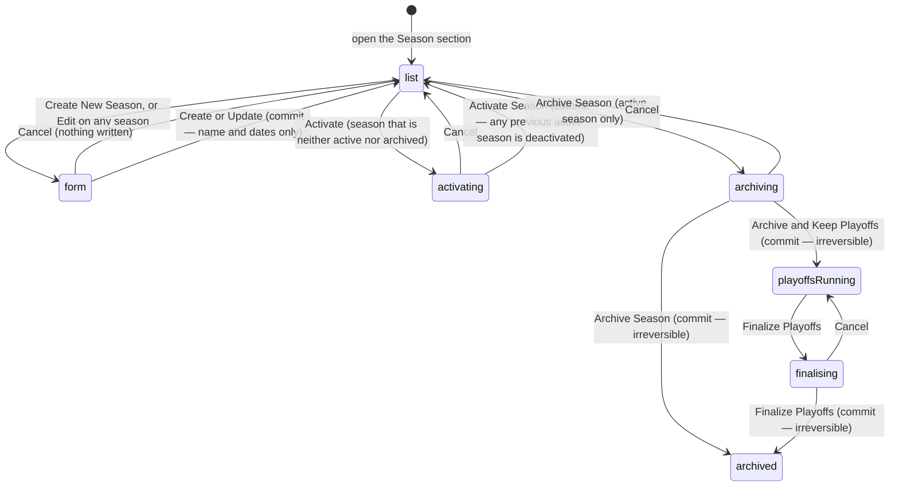

# Managing seasons

## Summary

The **Season** section of the dashboard is where a season is created, renamed,
re-dated, archived, and closed out. It is the most consequential screen in the
product: archiving rewrites every team's record and freezes a season's numbers
for good, and there is no undo anywhere on it.

What a season is, what its four flags mean, and why nearly every page is scoped
to one are settled in
[`../foundations/seasons.md`](../foundations/seasons.md). This document is only
about the admin actions.

## The simple case

An admin opens the Season section. Three cards across the top say which season is
active, how many seasons there are in total and how many are archived, and how
many are inactive.

Below them, on the left, is **Create New Season**. On the right — but only when a
season is active — a green badge reads "Current Active Season" beside an **Open
for confirmation** switch and an **Archive Season** button. Below that is every season, newest first, one card
each, with a coloured status badge and an **Edit** button. A season that is
neither active nor archived also has an **Activate** button. A season whose
playoffs are still running also has a **Finalize Playoffs** button.

Pressing Create New Season opens a small form: a name, a start date, and an
optional end date. Pressing Create Season saves it, a toast reads "*name* created.
Press Activate on its card to start it.", and the new season appears at the top of
the list as **Inactive**. Creating a season does not start it: the toast says so,
and the season sits in the list until an admin presses **Activate** on its card. That lets next season be set
up in advance, and it is why the third card counts inactive seasons as "Ready to
activate".

## The interaction, event by event

### Arrive

The list of seasons is fetched and shown newest first by creation date. While it
loads, three grey placeholder cards stand in for it.

Season data is the longest-lived cache in the app at **ten minutes**, so a season
changed in another browser can stay wrong on this screen for that long. See
[`../foundations/saving-and-freshness.md`](../foundations/saving-and-freshness.md#how-long-data-is-kept).

Each card shows the name, the start and end dates (or "Ongoing" when there is no
end date), the creation date, and a badge worked out in this order: **Active**
beats **Playoffs In Progress**, which beats **Archived**; anything else is
**Inactive**.

> **Technical note:** because the badge stops at the first match, a season that is
> both active and archived shows as Active with no hint that it is also archived.
> The four flags are independent and nothing prevents that combination.

### Leave without changing anything

Nothing is written and nothing is drafted. Opening Create New Season, typing a
name, switching to another dashboard section and coming back gives an empty
closed form.

### Begin editing

**Create New Season** opens an empty form. **Edit** on any card opens the same
form filled with that season's name and dates. Either way it appears between the
buttons and the list, and the list stays visible below it.

Only three fields exist. **None of the four flags can be set from this form.** A
season is created inactive, un-archived, with confirmation closed and playoffs
off, and the form cannot change any of that afterwards. Confirmation is switched
on and off by the switch beside the active season's badge, not here. Creating has no effect on the season
that is currently running — **Activate** is the only control that hands over.

No field is focused when the form opens. Nothing about the page shows that a form
is dirty.

### While editing

Validation runs on submit, not while typing:

| Field | Rule | Message shown |
| --- | --- | --- |
| Season Name | at least one character | "Season name is required" |
| Start Date | must be set | "Start date is required" |
| End Date | none — may be left empty | — |

Nothing checks that the end date is after the start date, and nothing checks
whether the dates overlap another season. Two seasons can cover the same weeks.

**Changing a start date silently re-numbers every week.** Week numbers are worked
out from the match date against the season start, so moving the start date moves
every match into a different week everywhere the app groups by week, with no
warning and no record. See
[`../foundations/seasons.md`](../foundations/seasons.md#weeks).

An archived season can be edited exactly like any other. The Edit button appears
on every card.

### Submit

The button reads "Creating..." or "Updating..." and is disabled while the request
is in flight. Cancel and the X in the form's corner both close it and discard
what was typed, with no confirmation.

On success the form closes and a toast reads "*name* created. Press Activate on
its card to start it." when creating, or "Season updated successfully" when
editing. The season list re-fetches.

On failure the form **stays open with everything typed still in it** and a red
toast carries the server's own reason rather than a generic sentence. This is one
of the few places in the app that reports why a write failed.

## Activating a season

**Activate is the only control that starts a season.** Creating one leaves it
inactive, and archiving never promotes a successor.

Every season card that is neither active nor archived carries an **Activate**
button. That includes a season whose playoffs are still in progress, and it
includes every un-archived season when no season is active at all — so a league
that has just archived its last season can start over from this screen.
Archived seasons never offer it: the `activate_season` function refuses them.

Pressing it opens a dialog headed "Activate Season: *name*". When another season
is currently active, the dialog warns that it will be deactivated and offers a
tick box, **Keep *X*'s playoffs active**:

- **Unticked.** The target season becomes active and the previous one is simply
  deactivated. Its matches and bracket are left alone.
- **Ticked.** The previous season's completed regular-season matches are archived
  and team win/loss counters reset, but its playoff bracket stays editable and it
  is marked "Playoffs In Progress". New regular matches schedule on the new
  season. The playoffs are finalised later from this same screen.

The tick box is absent when no season is active, because there is nothing to
overlap with.

The green button reads **Activate Season**, or **Activating...** while the
request is in flight. On success a toast names the season and the list re-fetches.
On failure the dialog stays open so the action can be retried, and a red toast
carries the server's reason.

**This is the one lifecycle action that is not irreversible.** Activating a
different season afterwards undoes it.

## The three destructive actions

### Archive Season

Only offered for the **active** season, and only when one exists. It opens a
dialog headed "Archive Season: *name*" whose description ends "**This action
cannot be undone.**" That is accurate: **nothing anywhere in the app un-archives
a season.**

A checkbox, "Keep playoffs active", chooses between two very different
operations. It is unticked every time the dialog opens, even if it was ticked and
the dialog was cancelled a moment earlier.

**Unticked — full archival.** The dialog lists what will happen: snapshot all
team stats and power scores; auto-detect division playoff champions from the
bracket; archive all completed matches to history; deactivate the season
permanently. It ends "A new season must be activated to continue league
activities." The button reads **Archive Season** and is orange.

**Ticked — partial archival.** Completed regular-season matches move to history,
team win/loss counters reset for the next season, the playoff bracket stays
editable, and the season is marked "Playoffs In Progress". The button reads
**Archive & Keep Playoffs**.

On success a toast names the season and the list re-fetches along with matches,
teams, rankings, team stats, standings, career rankings and the bracket. Numbers
across the whole app move at once. On failure the dialog stays open, the button
comes back, and a red toast carries the server's reason.

**What happens to existing data.** Matches are moved to an archive rather than
deleted, and the archived season keeps its own frozen copy of every stat. Team
win/loss counters are reset to zero for the coming season, so **every team's
record goes to 0-0 the moment this runs**. Nothing warns that the reset is about
to happen to the live standings players are looking at.

### Finalize Playoffs

Offered on any season whose playoffs are in progress. The dialog says "Only run
this once every playoff match has a winner" and again "This action cannot be
undone."

It lists five steps: refresh team season stats with final playoff results;
auto-detect champion, runner-up and playoff ranks from the bracket; snapshot team
details for the archive; rotate season badges and award placing badges; mark the
season fully archived.

The badge step switches off **this season's** revocable badges and writes its
champion, runner-up and third-place badges from the bracket's final placements.
Other seasons are untouched, and placing badges are never switched off. Third
place is only awarded where the bracket decides one — a single-elimination
bracket ranks nobody third.

**The champion is detected, never chosen.** The dialog has no team pickers; the
request sends no champion, no runner-up and no third place, and leaves all three
to the bracket. If the bracket is incomplete or wrong, the season records the
wrong champions and there is no screen that corrects them.

On success a toast says the playoffs have been finalised. On failure the dialog
stays open and a red toast carries the reason.

Full archival on a season whose bracket is unfinished detects champions from
whatever the bracket holds at that moment. Nothing checks first and nothing
refuses.

## Season participation

The separate **Participation** section reads, per season, which teams have said
they are playing. It is a table of every team with **Playing**, **Not Playing**,
or **No Response**, four count cards, a season picker, a status filter, and an
**Export CSV** button that downloads the filtered list straight from the browser.

It is read-only: an admin cannot set a team's answer from this table. The
confirmation window itself is opened and closed by the **Open for confirmation**
switch beside the active season's badge on the Season screen. Until 2026-09-01 the
"confirmation open" flag was read by the app but written by nothing, so the
window could never be opened — see
[B-31](../bug-triage.md#b-31-two-dead-features-are-visible-in-the-interface).

## Modifiers

| Modifier | Set at arrival | Changed while editing |
| --- | --- | --- |
| The user's role (visitor, player, admin) | Only an admin reaches the dashboard at all; see [`../foundations/accounts-and-roles.md`](../foundations/accounts-and-roles.md#how-pages-are-gated). Every admin sees every control. | Losing admin elsewhere leaves the buttons on screen. The server refuses the writes. |
| The record's state | An archived season shows an Archived badge and an Edit button, and no Activate button. A season that is neither active nor archived also shows Activate. A playoffs-in-progress season shows both Activate and Finalize Playoffs. Only the active season shows Archive Season. | A season archived in another browser keeps showing its old badge here for up to ten minutes. |
| The season's state (active, archived, playoffs on) | With no active season, the top card reads "None" and the Archive Season button is absent rather than disabled. Every un-archived season still offers Activate, and its dialog shows no deactivation warning and no tick box, so the league can be restarted from here. | If the active season changes elsewhere, this screen does not notice until it re-fetches. |
| Viewport | The three cards stack on a narrow screen. The form's two date fields stack. The list is one card per season either way. | No effect beyond re-flowing. |
| Keys the form honours | Tab moves through Name, Start Date, End Date, Cancel, and the submit button. | Enter in a text field submits the form. Escape closes an open dialog, which cancels the archive or the finalise. |

## Cancel and interrupt

| Event | Before the first edit | While editing or submitting |
| --- | --- | --- |
| Escape, or a Cancel button | No effect. | Cancel and the X close the form and discard everything typed, with no confirmation. Escape closes a confirmation dialog and abandons the archive or finalise. Neither aborts a request already sent. |
| In-app navigation away, or switching tab within the page | Nothing is lost. | **Everything typed is lost, with no warning.** Switching dashboard section unmounts the form. An archive already sent still completes and its toast may appear over another section. |
| Browser back or forward | Leaves the dashboard. | Same as navigating away, and the app cannot prevent it. Coming back gives a closed, empty form. |
| Reload, or the tab closed | Returns to the Season section, since the open section is remembered. | Everything typed is lost. A request already sent still lands. Nothing tells the admin which. |
| Network lost mid-request | Nothing to lose. | The write fails, the dialog or form stays as it was, and a red toast carries the failure. Nothing is queued and nothing retries. |
| The request fails or times out | Cannot happen. | The form or dialog keeps its contents and the button comes back. The message is the server's own reason, not a generic sentence. An archive that timed out may still have run. |
| The session expires | No effect while reading. | Writes fail. Nothing signs the admin out or moves them; the first sign is a refused archive. |
| The same record changed in another tab, or by another user | No realtime here. The list is up to ten minutes stale. | **Two admins can archive the same season twice** or archive different seasons at once. Nothing locks a season and nothing warns. |
| Browser autofill or a password manager writes into the form | The name field may be autofilled by a browser. The date fields are native date inputs and are not. | Same. Validation still runs only on submit. |
| The window loses focus | Returning re-fetches the season list once it is past its ten-minute window. | Returning can change the badges under the cursor while a dialog is open. |

## Interactions with other systems

**Permissions and roles.** Admin only, by the route gate. The archive, partial
archive and finalise operations are separately admin-gated on the server, so a
stale browser cannot force them through.

**Season scoping.** This is the screen that decides what "the season" means for
every other page. Archiving here changes the whole app for everybody.

**Validation and error display.** Two rules, checked on submit, shown under the
field. Server refusals appear as toasts carrying the real reason.

**Unsaved changes.** Not handled. No guard, no prompt, no draft.

**Optimistic updates and rollback.** None. Every control waits for the server.

**Realtime.** None. A season activated or archived elsewhere does not reach this
screen until it re-fetches.

**Offline.** Reads already made stay on screen. Every write fails and is lost.

**Toasts and notifications.** One toast per action. Success toasts name the
season; failure toasts carry the server's reason. **Players are told nothing** —
a season changing over produces no notification at all.

**URL state.** Nothing. The open form, the season being edited, and the dialog
are invisible to the address bar.

**On a phone.** The cards and the form's date fields stack. The dialogs are
capped at a small width and remain fully usable.

**Accessibility.** The form's fields have real labels and their errors are tied
to them. The confirmation dialogs take focus and trap it. The status badges carry
colour and text, so colour alone is never the signal.

**Side effects the user can notice.** Archiving recalculates stored statistics
across the league and those finish some time after the write, so numbers keep
moving for a while afterwards. Finalising also rotates badges, so champion,
runner-up and third-place badges appear on team pages without anyone granting
them.

## Edge cases

- **A season can be created that overlaps another**, or with an end date before
  its start date. Nothing checks the dates.
- **An archived season can still be renamed and re-dated**, which moves every one
  of its matches into different weeks in the history pages.
- **A season with playoffs active and no bracket** can still be finalised. The
  detection finds nothing and the season records no champion.
- **A season whose playoffs are in progress can be activated again.** It keeps
  its bracket, so its card then shows **Active** and still offers **Finalize
  Playoffs**.
- **Nothing shows how many matches or teams a season holds** before it is
  archived, so an admin archives without seeing what is being frozen.

## Open questions and verification

- **Fixed (was B-02): an existing season can now be activated from the season
  list.** Every season that is neither active nor archived carries an **Activate**
  button that opens the activation dialog for that season, including when no
  season is active at all. B-02 was raised as "no season can be activated at
  all", which was too strong — creating a season has always activated it, because
  the database defaults `is_active` to true. The real gap was that no *existing*
  season could be made active, so there was no way to switch back to an earlier
  season or to recover after archiving without creating a replacement.
- Resolved: **the "confirmation open" flag could be read but not written**, so the
  team confirmation feature it gates could never be turned on from the product.
  Fixed — see [B-31](../bug-triage.md#b-31-two-dead-features-are-visible-in-the-interface).
  The active season's card now carries an **Open for confirmation** switch. The
  card it reveals on the home page had no sign-in check and listed hidden teams;
  that was fixed in the same change, see
  [B-41](../bug-triage.md#b-41-the-confirm-your-team-card-has-no-sign-in-check-and-lists-hidden-teams).
- **Archiving is irreversible with a single confirmation.** One dialog, one
  press, and every team's record resets. There is no typed confirmation, no
  season name to re-enter, and no undo. Worth raising as a product question.
- Not confirmed by hand: which numbers move, and in what order, in the minutes
  after an archive, and what a full archival records as champion when the bracket
  is unfinished.
- Not confirmed by hand: whether the partial archive really leaves the bracket
  editable in the playoffs admin screens.
- Assumption: `is_archived` is set only by the archive and finalise server
  operations. No other writer was found.

Verified against `717rec` commit `ea5c8f4`.
