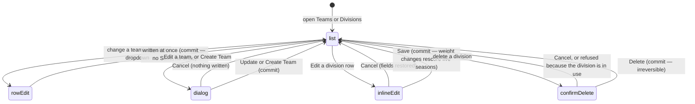

# Managing teams and divisions

## Summary

Two dashboard sections cover the league's competitors. **Teams** creates and
edits teams, sets each team's division, replaces logos in bulk, and approves
people joining a roster. **Divisions** manages the tiers themselves — their
names, their display grouping, and the weights that feed power score.

The two are joined by one idea worth stating early: **hiding a team is done by
moving it into a division called Hidden.** There is no hide switch. The division
dropdown on a team row is the hide control, and nothing on the screen says so.

What a team, a division, and a division weight are is settled in
[`../foundations/league-objects.md`](../foundations/league-objects.md) and
[`../glossary.md`](../glossary.md). Membership approvals are described in
[`handle-requests.md`](handle-requests.md); playoff seeds are set in the bracket
editor and are described in [`run-the-playoffs.md`](run-the-playoffs.md).

## The simple case

An admin opens the **Teams** section. Three cards count the teams: Total Teams,
Assigned to Divisions, Unassigned. Below them are four tabs — Manage Teams,
Create Team, Update Logos, Member Approvals — with Manage Teams open.

Manage Teams is a search box, a division filter, and a table of every team
including hidden ones. Each row is a logo, a name, a division dropdown, and an
Edit button.

The admin picks a different division from a row's dropdown. The dropdown goes
dead for a moment, a toast says "Division Updated", and the table re-fetches.
That is the whole interaction: **there is no Save.**

In the **Divisions** section, each division is a row of name, display division,
weight, and Edit and delete buttons. Pressing Edit turns the row into three
inputs; Save writes them and a toast says "Division updated".

## The interaction, event by event

### Arrive

The Teams section fetches every team **including hidden ones** and the list of
divisions, and shows a spinner until both arrive. Everywhere else in the app,
hidden teams are filtered out; this is the only screen that shows them.

The Divisions section fetches divisions ordered by weight, heaviest first, and
shows "Loading divisions…" until they arrive. With none, it shows "No divisions
yet. Create one to get started."

Nothing is focused on arrival and nothing is prefilled.

### Leave without changing anything

Nothing is recorded. The search text and the division filter are **not**
remembered: leaving the Teams section and coming back gives an empty search and
"All Divisions". The open tab within the section is not remembered either — it
returns to Manage Teams.

### Begin editing

There are four different editing surfaces and they behave differently.

**A team's division dropdown** has no editing state at all. Choosing a value
writes it immediately.

**Edit on a team row** opens a dialog headed "Edit Team: *name*" holding the
name, the division, the image, and a list of player names. It is dirty from the
first keystroke and shows nothing to say so.

**Create Team** is the same form, empty, shown inline as a card rather than a
dialog. Its Cancel button does nothing at all — it is wired to an empty
function.

**Edit on a division row** replaces the row's three cells with inputs, filled
from the row. Cancel restores all three and closes the editor.

### While editing

The team form has one rule, checked on submit: the name must not be blank
("Team name is required"). Division may be None. Players may be empty; blank
player rows are dropped when the form is submitted rather than flagged.

Uploading a team image is its own action inside the form. It runs at once,
raising "Processing Image", then "Image Uploaded" or "Image Upload Failed", and
disables the submit button while it runs. The upload happens **before** the form
is saved, so an image uploaded and then cancelled has still been uploaded.

The division editor refuses silently. Save does nothing at all — no message, no
error — when the name is blank or the weight is not a number greater than zero.
The button simply appears not to work.

A division whose display grouping is "Hidden" has both Edit and delete disabled,
with a tooltip explaining why.

### Submit

**Division dropdown.** The write goes at once. The dropdown is disabled while it
runs. Success raises "Division Updated"; failure raises "Update Failed — Failed
to update team division. Please try again." There is no undo: the previous
division is not recorded anywhere the admin can reach.

**Team form.** The button reads "Update Team" or "Create Team" and is disabled
while an image is uploading. On success the dialog closes and the list
re-fetches. A creation raises **two** success toasts in a row — one from the
save, one from the screen — and because only one toast shows at a time, the
first is replaced before it can be read.

**Division row.** Save writes name, display grouping and weight together, then
raises "Division updated" and clears the cached weights so power score
recalculates against the new value. Failure raises "Failed to update division"
with the server's own reason.

**Division delete.** The trash button opens a confirmation reading "Delete
division *name*? This cannot be undone. Divisions currently assigned to any team
or bracket cannot be deleted." Pressing Delete checks both of those and refuses
with a counted message — "Division is in use by 3 teams and cannot be deleted" —
rather than deleting. When nothing references it, the division is deleted
permanently.

## Hiding a team

To hide a team, set its division to the one named **Hidden**. From then on the
team is filtered out of the teams list, the compare page, and everywhere else
that reads the public team list. Its past matches still count for the teams that
played it. Its memberships are not revoked.

To unhide it, set its division back to a real one.

The consequences are worth stating plainly:

- **Hiding also changes the team's division**, so its power score is now weighted
  as a Hidden-division team, and its old tier is not recorded anywhere.
- **The Hidden division is matched by its name**, not by a flag. Renaming it
  un-hides every team in it at once.
- The Divisions screen protects a division whose *display grouping* is "Hidden",
  which is a different field from its name. See
  [Open questions](#open-questions-and-verification).
- **No admin screen deletes a team.** Deletion exists in the product and is
  reachable from the public teams page, not from here.

## Update Logos and Member Approvals

**Update Logos** lists every team including hidden ones as a card with its logo,
a status of Optimized, Legacy or Missing, a percentage bar, a search box, a
status filter and a sort. Choosing a file for a card uploads and saves it
immediately, with no confirmation and no preview step, and raises "Logo Updated".
There is no way to remove a logo from this tab.

**Member Approvals** carries a red count badge on its tab when people are
waiting. It is described in [`handle-requests.md`](handle-requests.md).

## Modifiers

| Modifier | Set at arrival | Changed while editing |
| --- | --- | --- |
| The user's role (visitor, player, admin) | Only an admin reaches the dashboard; see [`../foundations/accounts-and-roles.md`](../foundations/accounts-and-roles.md#how-pages-are-gated). Every admin sees every control. | Losing admin elsewhere leaves every control on screen and the writes start failing. |
| The record's state | A hidden team appears in this list and nowhere else. A division in use has its delete refused, not hidden. A division displayed as Hidden has Edit and delete disabled. | A team hidden in another browser keeps its old division here until a re-fetch. |
| The season's state (active, archived, playoffs on) | Teams and divisions are **not** season-scoped, so the screen looks the same in every season state. | Changing a division weight moves power scores in live seasons only. Archived seasons are frozen; see [`../foundations/seasons.md`](../foundations/seasons.md#what-frozen-means). |
| Viewport | The three count cards stack. The team table becomes one card per team with a full-width division dropdown. The divisions table becomes cards. | No effect beyond re-flowing. |
| Keys the form honours | Tab reaches the search box, the filter, then each row's dropdown and Edit button. | Enter in the team name field submits the form. Escape closes the team dialog, the confirmation, or an open dropdown. Escape does **not** leave a division row's inline editor. |

## Cancel and interrupt

| Event | Before the first edit | While editing or submitting |
| --- | --- | --- |
| Escape, or a Cancel button | No effect. | Escape closes the team dialog and discards it with no confirmation. The division editor's Cancel restores all three fields. **The Create Team tab's Cancel button does nothing.** Nothing aborts a request already sent. |
| In-app navigation away, or switching tab within the page | Nothing is lost. The search and filter reset when the section is reopened. | **Everything typed is lost, with no warning** — including switching between the four tabs inside the Teams section. A division change already sent still lands. |
| Browser back or forward | Leaves the dashboard. | Same as navigating away, and the app cannot prevent it. |
| Reload, or the tab closed | Returns to the same section, with an empty search and the Manage Teams tab. | Everything in a form is lost. A sent write still lands. An uploaded image stays uploaded whether or not the form was saved. |
| Network lost mid-request | Nothing to lose. | The write fails and a red toast says so. The division dropdown snaps back to the value it was showing. Nothing is queued and nothing retries. |
| The request fails or times out | Cannot happen. | The team dialog stays open with its contents. The division dropdown keeps its old value. The messages are generic for teams and the server's own for divisions. |
| The session expires | No effect while reading. | Writes fail. Nothing signs the admin out. |
| The same record changed in another tab, or by another user | No realtime here. The list is up to five minutes stale. | **Two admins editing the same team overwrite each other silently.** The last write wins and neither is told. |
| Browser autofill or a password manager writes into the form | The team name asks the browser for an organisation name and may be autofilled. The search box may be too. | Same. Validation still runs only on submit. |
| The window loses focus | Returning re-fetches teams and divisions once past their five-minute window, so rows can re-order or disappear. | A row can move under the cursor while its dropdown is open. |

## Interactions with other systems

**Permissions and roles.** Admin only, by the route gate. The database enforces
the same rule separately, so a stale browser's writes are refused rather than
applied.

**Season scoping.** Teams and divisions are not season-scoped. The same team
carries across seasons, which is what makes career numbers possible. Only the
team's *record* is per season.

**Validation and error display.** One rule on the team form, shown under the
field. The division editor validates by refusing to act, with nothing shown. The
division delete's two in-use checks produce counted, specific messages.

**Unsaved changes.** Not handled anywhere on either screen.

**Optimistic updates and rollback.** None. The division dropdown disables and
waits rather than showing the new value early.

**Realtime.** None. Another admin's changes do not arrive.

**Offline.** Lists already read stay on screen. Every write and every image
upload fails.

**Toasts and notifications.** One toast per action, except team creation which
raises two and shows only the second. Team failures use a generic per-feature
sentence; division failures carry the server's reason.

**URL state.** Nothing. The section, tab, search text, filter, and the team being
edited are all invisible to the address bar.

**On a phone.** The team table becomes cards, each with a full-width division
dropdown, so the single most consequential control on the screen is also the
easiest to hit by accident.

**Accessibility.** Every division dropdown is labelled "Set division for *team
name*". Edit buttons are labelled with the team name. The team form's fields have
real labels and their errors are tied to them.

**Side effects the user can notice.** Changing a team's division rewrites its
division name on the current season's stored stats, and leaves past seasons
alone. Changing a **division weight** clears the cached weights and re-rates every
live season's power scores; archived seasons do not move.

## Edge cases

- **Changing a division has no confirmation and no undo**, and it is a single
  dropdown press on every row of the table.
- **Hiding a team is the same press**, so a team can be removed from the whole
  public site by one mis-click on a dropdown.
- **A team can be created with no division and no players.** It appears in the
  Unassigned count and in every public list.
- **An image uploaded in a form that is then cancelled is still stored.**
- **A blank player row is dropped silently** rather than reported.
- **The Create Team tab's Cancel button is inert.** The only way out is to switch
  tab.
- **A division's weight accepts any positive number**, including values far
  outside the 0.7–1.0 range the help text suggests.
- **Deleting a division that no team uses succeeds instantly** and cannot be
  undone; the weight history it carried goes with it.

## Open questions and verification

- **The Divisions screen protects the wrong field.** Edit and delete are disabled
  when a division's *display grouping* is "Hidden", but teams are hidden by being
  in a division whose *name* is "Hidden". If those two do not coincide on the
  live data, the Hidden division can be renamed or deleted, which would un-hide
  every hidden team at once. **May be worth treating as a bug rather than
  documenting**, and it is the first thing to check by hand.
- **The division editor fails silently.** A blank name or a zero weight makes
  Save do nothing, with no message. **May be worth treating as a bug rather than
  documenting.**
- **The Create Team tab's Cancel button is wired to an empty function.** **May be
  worth treating as a bug rather than documenting.**
- **Team creation raises two toasts**, so the first is destroyed by the second.
  Minor, but it means the screen reports the same success twice.
- **A table `team_season_opt_out` exists in the schema and nothing in the app
  reads or writes it.** The Hidden division appears to have replaced it. Worth
  confirming before anyone relies on it.
- Not confirmed by hand: whether the live database's Hidden division has "Hidden"
  as its display grouping as well as its name.
- Not confirmed by hand: what a team page shows for a team whose division was
  deleted out from under it.
- Not confirmed by hand: whether an approved membership still grants scoring
  rights after its team is hidden.
- Assumption: playoff seeds are never set from these screens. Only the bracket
  editor writes them.

Verified against `717rec` commit `ea5c8f4`.
