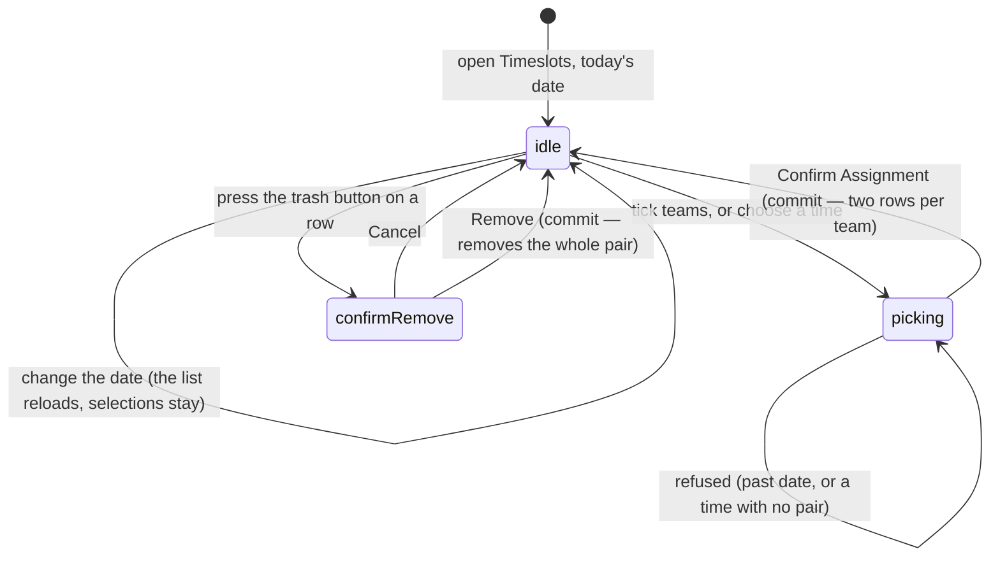

# Managing timeslots

## Summary

A **timeslot** is the time a team is expected at the venue on a given night. An
admin sets them a date at a time, picking a time and then picking the teams that
play at it. The auto-scheduler reads those assignments to work out who is
available to play whom; see [`build-the-schedule.md`](build-the-schedule.md).

There are **two screens for this**, and they are not the same. `/timeslots` is a
page of its own; **Timeslots** is the first section of the dashboard. They share
the same two components and differ in what they support.

One behaviour dominates the whole feature and is never stated on screen:
**choosing one time assigns two.** Times are organised into back-to-back pairs,
and picking a pair's first time books the team for both halves.

## The simple case

An admin opens the dashboard's **Timeslots** section. The card is headed "Assign
Timeslots" with today's date on a button in the corner. Below, two columns:
"Assign a New Timeslot" on the left, "Current Timeslots" on the right.

They change the date to next Thursday. The right column empties.

In the left column a grid lists every team, two across, each with its logo and a
tick box. They press **Select All**, then press **7:00 PM** in the row of time
buttons. The submit button reads **Confirm Assignment (18 Teams)**.

They press it. A toast says "Timeslots Assigned — 18 team timeslots have been set
for October 2, 2025". The team grid empties, because every team now has an
assignment for that date, and the right column fills with **thirty-six rows**:
each team at 7:00 PM and again at 7:30 PM.

## The interaction, event by event

### Arrive

Both screens open on **today's date**, fetch that date's assignments, and fetch
the team list. Each column shows its own loading text.

The assignment list is one of the handful of things in the app that **polls**: it
re-fetches itself every sixty seconds, pausing while the tab is hidden or the
device is offline and resuming on return. Changing the date keeps the previous
date's rows on screen until the new ones arrive rather than blanking the column.
See [`../foundations/saving-and-freshness.md`](../foundations/saving-and-freshness.md#what-makes-the-app-go-back-for-more).

The right column lists that date's rows sorted by time, with BYE last. Each row
is a time, a team name, and a trash button. With nothing assigned it says "No
Timeslots Assigned — Use the form above to assign team timeslots for this date."

The left column's team grid shows **only teams with no assignment on that date**.
A team assigned to anything, including a bye, disappears from the grid.

Nothing is selected and no time is chosen. Nothing is focused.

### Leave without changing anything

Nothing is written and nothing is remembered. The date returns to today, the team
selection empties, and the chosen time is forgotten.

### Begin editing

Selecting is the editing. Pressing a team's tile ticks it; pressing again unticks
it. **Select All** ticks every available team and turns into **Deselect All**. A
line under the grid counts what is ticked.

Pressing a time button chooses it. Only one can be chosen at a time, unless the
**Double Header** switch is on, in which case exactly two must be chosen and a
badge counts them "0/2 selected".

The times offered are **BYE, 5:00 PM, 5:30 PM, 6:00 PM, 6:30 PM, 7:00 PM,
7:30 PM, 8:00 PM, 8:30 PM, 9:00 PM, 9:30 PM**. BYE is styled orange and labelled
"BYE WEEK". In double header mode BYE is not offered, and neither is **9:30 PM**:
a double header books a time and the 30 minutes after it, and nothing follows
9:30 PM. The list runs from the block constants, so it cannot drift away from
them.

Nothing marks the form dirty, and there is no draft.

### While editing

The submit button is disabled until there is at least one team and a chosen time
— two times in double header mode — and it is also disabled when no team is
available on that date. Its label counts the ticked teams.

Changing the date **keeps the ticked teams and the chosen time** while reloading
the list. A team ticked on one date and then submitted on another is assigned to
the second date, with nothing to say the selection carried over.

Turning the Double Header switch on or off clears the chosen time or times, but
not the ticked teams.

### Submit

Assignment happens at once, with **no confirmation**.

**A single time.** Every ticked team gets **two rows** — the chosen time and the
next half hour. Picking 6:00 PM books 6:00 and 6:30. The pairs are fixed:
5:00/5:30, 5:30/6:00, 6:00/6:30, 6:30/7:00, 7:00/7:30, 7:30/8:00, 8:00/8:30,
8:30/9:00, 9:00/9:30.

**BYE.** Every ticked team gets one row reading BYE. No pair.

**Double header.** Every ticked team gets **four rows** — both halves of each
chosen pair. Two pairs that would overlap, such as 7:00 PM and 7:30 PM, are
refused because the team would be booked twice at 7:30.

On success one toast names the count and the date. The ticked teams clear; **the
chosen time stays**, so the next batch can go to the same slot without re-picking
it.

On failure one red toast appears. On the dashboard it reads "Error — Failed to
assign timeslot. Please try again."; on `/timeslots` the same. The real reason —
the server sends a specific one — is raised first and the generic one follows it;
both are visible, because up to three toasts show at a time. See
[`../foundations/messages-to-the-user.md`](../foundations/messages-to-the-user.md).

A date in the past is refused before anything is sent, with "Validation Error —
Cannot assign timeslots to past dates". A **bye** on a past date is **not**
refused; that path skips the check.

### Removing an assignment

The trash button opens a confirmation: "Remove Timeslot — Are you sure you want
to remove the timeslot for *team* at *time*? This action cannot be undone."
Cancel closes it; Remove writes.

**Removing one row removes the whole pair.** A back-to-back row is deleted by
removing every back-to-back row that team has on that date — so removing the
6:00 PM half also removes 6:30 PM, and removing one quarter of a double header
removes all four rows.

A BYE row is removed on its own.

On success a toast says "Timeslot Removed" or "Bye Week Removed". On failure a
red toast says the removal failed and the row stays.

## The two screens

| | `/timeslots` | Dashboard **Timeslots** |
| --- | --- | --- |
| Heading | "Weekly Timeslot Assignments" | "Assign Timeslots" |
| Date control | A calendar always on screen | A button that opens a calendar |
| Layout | Calendar, assignment, list — three cards | Two columns inside one card |
| Double headers | Supported | Supported |
| Reached from | Nothing in the app links to it | The dashboard menu |

`/timeslots` is one of the three route-guarded routes; the gate is described in
[`../foundations/accounts-and-roles.md`](../foundations/accounts-and-roles.md#how-pages-are-gated).
It then runs the same check a second time inside the page, with its own
"Checking access..." and its own redirect.

Both screens can now create a double header. `/timeslots` renders the assignment
form twice — once for a narrow screen, once for a wide one — and neither copy
used to pass a handler, so the button did nothing at all. See
[Open questions](#open-questions-and-verification).

## Reading team preferences

The glossary defines a *timeslot preference* as a team's statement about when it
can play. **No screen in the product lets a team state one.** What exists is:

- A team sees its own assigned timeslot for the current week on its pages,
  read-only.
- A team can send a **request** to change a timeslot, carrying the date, the
  current time and the wanted time. Those arrive in the dashboard's **Requests**
  section, not here; see [`handle-requests.md`](handle-requests.md).

So an admin building a schedule works from requests and from outside knowledge.
There is no list of who prefers what. See
[`../schedule/timeslot-preferences.md`](../schedule/timeslot-preferences.md) for
the player's side.

## Modifiers

| Modifier | Set at arrival | Changed while editing |
| --- | --- | --- |
| The user's role (visitor, player, admin) | Only an admin reaches either screen; see [`../foundations/accounts-and-roles.md`](../foundations/accounts-and-roles.md#how-pages-are-gated). | Losing admin elsewhere leaves both screens on display and the writes fail. |
| The record's state | A team already assigned on the chosen date is absent from the grid rather than shown as taken. | An assignment made in another browser reaches this screen within a minute, and the team then vanishes from the grid under the cursor. |
| The season's state (active, archived, playoffs on) | **No effect.** Timeslots carry a date and a team and no season at all. | No effect. Archiving a season does not clear or archive its timeslots. |
| Viewport | `/timeslots` stacks its three cards and drops the card frames. The dashboard section stacks its two columns. The team grid stays two across. | No effect beyond re-flowing. |
| Keys the form honours | Tab reaches Select All, then each team tile, then each time button, then submit. Team tiles respond to Enter and Space. | Enter on the submit button assigns. Escape closes the date popover or the confirmation dialog. |

## Cancel and interrupt

| Event | Before the first edit | While editing or submitting |
| --- | --- | --- |
| Escape, or a Cancel button | No effect. Neither screen has a Cancel button for the assignment form. | Escape closes the date popover or the removal confirmation. It does not clear the selection and does not abort a request already sent. |
| In-app navigation away, or switching tab within the page | Nothing is lost. | **The ticked teams, the chosen time, and the date are all lost with no warning.** An assignment already sent still lands. |
| Browser back or forward | Leaves the screen. | Same as navigating away, and the app cannot prevent it. Coming back gives today's date and an empty selection. |
| Reload, or the tab closed | Returns to today's date. | Everything selected is lost. A sent write still lands, and its rows appear on the reloaded list. |
| Network lost mid-request | Nothing to lose. | The write fails and a generic red toast appears. Nothing is queued. The selection is **not** cleared, so the admin can press again. |
| The request fails or times out | Cannot happen. | The selection stays and the button comes back. The message is generic, so a refusal that can never succeed — a time with no pair — reads the same as a lost connection. |
| The session expires | No effect while reading. | Writes fail. Nothing signs the admin out or moves them. |
| The same record changed in another tab, or by another user | No realtime, but the list polls every sixty seconds, so another admin's work appears within a minute. | **Two admins can still assign the same team to two different times on the same night** inside that minute, because each sees the team as available. Nothing detects the clash. |
| Browser autofill or a password manager writes into the form | Nothing here is a text field a password manager would fill. | Same. |
| The window loses focus | The poll stops while the tab is hidden and resumes on return, so the team grid and the list can both change the moment focus comes back. | A team can vanish from the grid mid-selection, leaving it ticked but no longer submittable. |

## Interactions with other systems

**Permissions and roles.** Admin only. `/timeslots` is checked twice — once by
the route guard and once by the page.

**Season scoping.** None. A timeslot row carries a date and a team, and no
season. Assignments from a finished season stay in the table forever.

**Validation and error display.** Four checks run before anything is sent: a
date, at least one team, a chosen time, and the date not being in the past. Those
raise a specific "Validation Error" toast. Everything else fails at the server
and is reported with a generic sentence. A failed *read* of the list is retried
twice with a growing delay, rather than the app's usual once.

**Unsaved changes.** Not handled. A selection is lost by any navigation.

**Optimistic updates and rollback.** None. The list re-fetches after the write.

**Realtime.** None. The list keeps itself current by polling instead.

**Offline.** The date's list stays on screen and the poll stops until the device
is back. Assigning and removing both fail.

**Toasts and notifications.** One toast per action. Failures collapse to a
generic sentence because a second, generic toast replaces the specific one the
service raised. Teams are not told when their timeslot changes.

**URL state.** Nothing — not even the date. `/timeslots?date=…` is not a thing,
so an admin cannot link to a particular night.

**On a phone.** `/timeslots` drops its card frames and stacks. The team grid
stays two tiles across, which is tight but usable. The time buttons wrap.

**Accessibility.** Team tiles are keyboard-operable and announce their ticked
state. The removal confirmation names the team and the time. The times are plain
buttons in a toggle group; BYE's orange styling is decoration, and its label says
"BYE WEEK".

**Side effects the user can notice.** Assignments feed the auto-scheduler and the
week's timeslot display on team pages. Nothing else changes and no message is
sent.

## Edge cases

- **9:30 PM cannot start a double header.** It is a real block time and a valid
  single assignment, but it is not the first half of any pair, so double header
  mode does not offer it. See
  [Open questions](#open-questions-and-verification).
- **The pairs overlap each other.** 5:30 PM is the second half of the 5:00 pair
  and the first half of the 5:30 pair, so a team booked at 5:00 and another
  booked at 5:30 both appear at 5:30.
- **A bye can be assigned to a past date**, because the bye path skips the
  past-date check that the other paths run.
- **A team can hold a bye and a timeslot at once** if the bye was assigned first
  in one browser and the timeslot in another.
- **The list shows "Unknown Team"** when a row's team cannot be resolved — for
  example after the team was deleted.
- **Changing the date keeps the selection**, so it is possible to tick teams for
  one night and assign them to another by changing the date and pressing submit.
- **The team grid empties once every team is assigned**, which disables the whole
  form with no explanation beyond "All teams have been assigned for this date".
- **Removing one half of a pair removes both**, and the confirmation names only
  the half that was pressed.

## Open questions and verification

- Resolved: **`/timeslots` could not create a double header.** It was treated as
  a bug ([B-21](../bug-triage.md#b-21-eight-controls-do-nothing-when-pressed)).
  The page renders the assignment form twice — once narrow, once wide — and
  neither copy passed a handler. Both do now, and the write goes through the
  same mutation the admin Timeslots tab uses.
- Resolved: **9:30 PM was offered where it could not work.** It was treated as a
  bug ([B-21](../bug-triage.md#b-21-eight-controls-do-nothing-when-pressed)).
  It is a real block time and still offered for a single assignment; it simply
  has no back-to-back partner, because nothing follows it. Double-header mode
  now lists only the times that start a pair, built from the pair constants so
  it cannot drift from them again.
- **The specific failure reason is always destroyed.** The service raises a toast
  naming the real cause, and the screen immediately raises a generic one over it.
  **May be worth treating as a bug rather than documenting.**
- **Byes skip the past-date check.** Deliberate or not, the two paths disagree.
- **The glossary's "timeslot preference" describes a feature that does not
  exist.** Teams cannot state preferences; they can only request a change. Worth
  settling in the consistency pass rather than in this document.
- Not confirmed by hand: whether the two screens really behave identically apart
  from double headers, or whether the layout differences hide others.
- Not confirmed by hand: what the list does with a very large number of rows for
  one date; it has no paging.
- Not confirmed by hand: whether removing a double header row really deletes all
  four rows rather than two.
- Assumption: nothing anywhere cleans up timeslot rows for past dates. None was
  found.

Verified against `717rec` commit `ea5c8f4`, except the double-header and 9:30 PM
behaviour above, which was changed after that commit — see
[B-21](../bug-triage.md#b-21-eight-controls-do-nothing-when-pressed).
