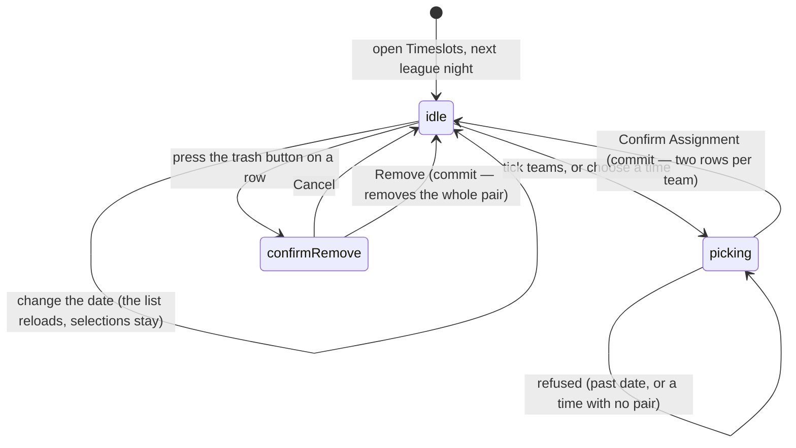

# Managing timeslots

## Summary

A **timeslot** is the time a team is expected at the venue on a given night. An
admin sets them a date at a time, picking a time and then picking the teams that
play at it. The auto-scheduler reads those assignments to work out who is
available to play whom; see [`build-the-schedule.md`](build-the-schedule.md).

There is **one screen for this**: **Timeslots**, the first section of the admin
dashboard. There used to be a second, a page at `/timeslots` that nothing linked
to and whose copy had drifted from the section's; that path now redirects to
`/admin`.

One behaviour dominates the whole feature and is never stated on screen:
**choosing one time assigns two.** Times are organised into back-to-back pairs,
and picking a pair's first time books the team for both halves.

## The simple case

An admin opens the dashboard's **Timeslots** section. The card is headed "Assign
Timeslots" with **the next league night** — the coming Thursday, or today if
today is Thursday — on a button in the corner. Below, two columns: "Assign a New
Timeslot" on the left, "Current Timeslots" on the right.

In the left column a grid lists every team, one across on a phone and two on a
wider screen, each with its logo and a tick box. Long names wrap onto a second
line rather than being cut short. They press **Select All**, then press
**7:00 + 7:30 PM** in the row of block buttons, under the line "A block is two
back-to-back times. Picking one books both." The submit button reads **Confirm
Assignment (18 Teams)**.

They press it. While the write is on its way the button reads **Booking…** and
cannot be pressed again. A toast says "Block booked — 18 teams booked for the
7:00 + 7:30 PM block on October 2, 2025". The team grid empties, because every team now has an
assignment for that date, and the right column fills with **thirty-six rows**:
each team at 7:00 PM and again at 7:30 PM.

## The interaction, event by event

### Arrive

Both screens open on **the next league night**, fetch that date's assignments,
and fetch the team list. Each column shows its own loading text.

The assignment list is one of the handful of things in the app that **polls**: it
re-fetches itself every sixty seconds, pausing while the tab is hidden or the
device is offline and resuming on return. Changing the date keeps the previous
date's rows on screen until the new ones arrive rather than blanking the column.
See [`../foundations/saving-and-freshness.md`](../foundations/saving-and-freshness.md#what-makes-the-app-go-back-for-more).

The right column lists that date's rows sorted by time, with BYE last. Each row
is a time, a team name, and a trash button. With nothing assigned it says "No
Timeslots Assigned — Use the form above to assign team timeslots for this date."

The left column's team grid shows **only teams with no assignment on that date**.
A team assigned to anything, including a bye, disappears from the grid.

Nothing is selected and no time is chosen. Nothing is focused.

### Leave without changing anything

Nothing is written and nothing is remembered. The date returns to the next league
night, the team selection empties, and the chosen block is forgotten.

### Begin editing

Selecting is the editing. Pressing a team's tile ticks it; pressing again unticks
it. **Select All** ticks every available team and turns into **Deselect All**. A
line under the grid counts what is ticked.

Pressing a block button chooses it. Only one can be chosen at a time, unless the
**Double Header** switch is on, in which case exactly two must be chosen and a
badge counts them "0/2 selected".

The blocks offered are **BYE, 5:00 + 5:30 PM, 5:30 + 6:00 PM, 6:00 + 6:30 PM,
6:30 + 7:00 PM, 7:00 + 7:30 PM, 7:30 + 8:00 PM, 8:00 + 8:30 PM, 8:30 + 9:00 PM,
9:00 + 9:30 PM** — every button names both times it books, because every booking
writes both. BYE is styled orange and labelled "BYE WEEK". 9:30 PM is not offered
on its own: it is the second half of the 9:00 block and starts no block of its
own. In double header mode BYE is not offered either, and the buttons there name
single start times rather than blocks. The list runs from the block constants, so
it cannot drift away from them.

Nothing marks the form dirty, and there is no draft.

### While editing

The submit button is disabled until there is at least one team and a chosen time
— two times in double header mode — and it is also disabled when no team is
available on that date. Its label counts the ticked teams.

Changing the date **keeps the ticked teams and the chosen block** while reloading
the list. A team ticked on one date and then submitted on another is assigned to
the second date, with nothing to say the selection carried over.

Turning the Double Header switch on or off clears the chosen block or times, but
not the ticked teams.

### Submit

Assignment happens at once, with **no confirmation**.

**A block.** Every ticked team gets **two rows** — the block's first time and the
next half hour. Picking "6:00 + 6:30 PM" books 6:00 and 6:30, which is what the
button now says. The blocks are fixed:
5:00/5:30, 5:30/6:00, 6:00/6:30, 6:30/7:00, 7:00/7:30, 7:30/8:00, 8:00/8:30,
8:30/9:00, 9:00/9:30.

**BYE.** Every ticked team gets one row reading BYE. No pair.

**Double header.** Every ticked team gets **four rows** — both halves of each
chosen pair. Two pairs that would overlap, such as 7:00 PM and 7:30 PM, are
refused because the team would be booked twice at 7:30.

On success one toast names the block, the teams and the date — "Block booked —
3 Amigos booked for the 6:30 + 7:00 PM block on October 2, 2025", by name for one
team and by count for several. The ticked teams clear; **the chosen block stays**,
so the next batch can go to the same block without re-picking it.

While a booking is on its way the submit button reads **Booking…** and is
disabled, so it cannot be pressed twice.

On failure one red toast appears, reading "Error — Failed to assign timeslot.
Please try again." The catch block
raises exactly one toast: the server's specific reason when the error carries a
user-visible one, and the generic sentence otherwise — never both. See
[`../foundations/messages-to-the-user.md`](../foundations/messages-to-the-user.md).

A date in the past is refused before anything is sent, with "Validation Error —
Cannot assign timeslots to past dates". A **bye** on a past date is **not**
refused; that path skips the check.

**A move is two writes, and they happen in this order: book, then clear.** A
team's timeslot cannot be edited — there is no such operation — so changing one
means writing the new rows and deleting the old ones. The new booking goes
first on purpose. Clearing first would leave the team with **nothing at all** on
that night if the booking then failed, and no screen shows that. Booking first
means the worst case is a team booked twice, which is visible in the list on the
right, and that case gets its own message: "Booked, but the old time is still
there — … Remove it in the list of current timeslots."

### Removing an assignment

The trash button opens a confirmation: "Remove Timeslot — Are you sure you want
to remove the timeslot for *team* at *time*? This action cannot be undone."
Cancel closes it; Remove writes.

**Removing one row removes the whole pair.** A back-to-back row is deleted by
removing every back-to-back row that team has on that date — so removing the
6:00 PM half also removes 6:30 PM, and removing one quarter of a double header
removes all four rows.

A BYE row is removed on its own.

On success a toast says "Timeslot Removed" or "Bye Week Removed". On failure a
red toast says the removal failed and the row stays.

### Arriving from an approved request

An admin who has just approved a team request can press **Open Timeslots** on
the toast. That opens this section on **the night the request named**, and shows
one card above the two columns, saying what the change would be:

> **Move 3 Amigos**
> 3 Amigos has the 6:00 + 6:30 PM block on Thursday, 17 September. This books
> the 7:00 + 7:30 PM block and removes what they have now.
> `[ Move them ]` `[ Not now ]`

Pressing **Move them** does the whole change: it books the new block and removes
the old one. A toast then names what was booked, and the card goes.

The card says what it will remove as well as what it will add, because a move is
both. It reads differently depending on what the team already has that night:

| What the team has | What the card says | Button |
| --- | --- | --- |
| Nothing | "…has nothing on Thursday, 17 September. This books the 7:00 + 7:30 PM block." | **Book the block** |
| One block, or a bye | "…This books the 7:00 + 7:30 PM block and removes what they have now." | **Move them** |
| Anything, and the request is for a bye | "A bye means they are not playing, so this removes the 6:00 + 6:30 PM block." Every game is named. | **Give the bye** |
| Already exactly what was asked for | "3 Amigos is already in the 7:00 + 7:30 PM block on Thursday, 17 September." | **None** |
| **Two games that night** | "…The request does not say which game to move, so this cannot be done in one press. Remove the one you want to move from the list of current timeslots, then book the new block below." | **None** |
| A requested time that is not a block | "The request asked for 'as early as possible', which is not one of the blocks. Pick a block below." | **None** |

**Not playing at all is the one case where a double header is still one press.**
A bye means no games, so which game was meant does not arise, and the card names
every game it removes.

**Not now** puts the card away without writing anything. So does making the
change. Either way the night stays on screen and the instruction leaves the
address, so reloading does not bring the card back.

The card also says what a move does **not** do: it changes when the team is
expected, and it does not change a match already created for that night.

## The screen

| | Dashboard **Timeslots** |
| --- | --- |
| Heading | "Assign Timeslots" |
| Date control | A button that opens a calendar |
| Layout | Two columns inside one card |
| Double headers | Supported |
| Reached from | The dashboard menu |

`/admin` is route-guarded; the gate is described in
[`../foundations/accounts-and-roles.md`](../foundations/accounts-and-roles.md#how-pages-are-gated).
This section's own address is `/admin/timeslots`. `/timeslots` is guarded the
same way and then redirects there, so an old bookmark still opens this section
and a signed-out visitor still lands on `/auth`.

## Reading team preferences

The glossary defines a *timeslot preference* as a team's statement about when it
can play. **No screen in the product lets a team state one.** What exists is:

- A team sees its own assigned timeslot for the current week on its pages,
  read-only.
- A team can send a **request** to change a timeslot, carrying the date, the
  current time and the wanted time. Those arrive in the dashboard's **Requests**
  section, not here; see [`handle-requests.md`](handle-requests.md).

So an admin building a schedule works from requests and from outside knowledge.
There is no list of who prefers what. See
[`../schedule/timeslot-preferences.md`](../schedule/timeslot-preferences.md) for
the player's side.

## Modifiers

| Modifier | Set at arrival | Changed while editing |
| --- | --- | --- |
| The user's role (visitor, player, admin) | Only an admin reaches the screen; see [`../foundations/accounts-and-roles.md`](../foundations/accounts-and-roles.md#how-pages-are-gated). | Losing admin elsewhere leaves the screen on display and the writes fail. |
| The record's state | A team already assigned on the chosen date is absent from the grid rather than shown as taken. | An assignment made in another browser reaches this screen within a minute, and the team then vanishes from the grid under the cursor. |
| The season's state (active, archived, playoffs on) | **No effect.** Timeslots carry a date and a team and no season at all. | No effect. Archiving a season does not clear or archive its timeslots. |
| Viewport | The section stacks its two columns. The team grid is one across below 640px and two above, so a long team name has room to wrap. | No effect beyond re-flowing. |
| Keys the form honours | Tab reaches Select All, then each team tile, then each block button, then submit. Team tiles respond to Enter and Space. | Enter on the submit button assigns. Escape closes the date popover or the confirmation dialog. |

## Cancel and interrupt

| Event | Before the first edit | While editing or submitting |
| --- | --- | --- |
| Escape, or a Cancel button | No effect. Neither screen has a Cancel button for the assignment form. | Escape closes the date popover or the removal confirmation. It does not clear the selection and does not abort a request already sent. |
| In-app navigation away, or switching tab within the page | Nothing is lost. | **The ticked teams, the chosen block, and the date are all lost with no warning.** An assignment already sent still lands. |
| Browser back or forward | Steps to the previously opened section, or out of the dashboard from the first one. | Same as navigating away, and the app cannot prevent it. Coming back gives the next league night and an empty selection. |
| Reload, or the tab closed | Returns to the next league night. | Everything selected is lost. A sent write still lands, and its rows appear on the reloaded list. |
| Network lost mid-request | Nothing to lose. | The write fails and a generic red toast appears. Nothing is queued. The selection is **not** cleared, so the admin can press again. |
| The request fails or times out | Cannot happen. | The selection stays and the button comes back from "Booking…". The message is generic, so any refusal reads the same as a lost connection. |
| The session expires | No effect while reading. | Writes fail. Nothing signs the admin out or moves them. |
| The same record changed in another tab, or by another user | No realtime, but the list polls every sixty seconds, so another admin's work appears within a minute. | **Two admins can still assign the same team to two different times on the same night** inside that minute, because each sees the team as available. Nothing detects the clash. |
| Browser autofill or a password manager writes into the form | Nothing here is a text field a password manager would fill. | Same. |
| The window loses focus | The poll stops while the tab is hidden and resumes on return, so the team grid and the list can both change the moment focus comes back. | A team can vanish from the grid mid-selection, leaving it ticked but no longer submittable. |

## Interactions with other systems

**Permissions and roles.** Admin only, checked by the guard on `/admin`.

**Season scoping.** None. A timeslot row carries a date and a team, and no
season. Assignments from a finished season stay in the table forever.

**Validation and error display.** Four checks run before anything is sent: a
date, at least one team, a chosen time, and the date not being in the past. Those
raise a specific "Validation Error" toast. Everything else fails at the server
and is reported with a generic sentence. A failed *read* of the list is retried
twice with a growing delay, rather than the app's usual once.

**Unsaved changes.** Not handled. A selection is lost by any navigation.

**Optimistic updates and rollback.** None. The list re-fetches after the write.

**Realtime.** None. The list keeps itself current by polling instead.

**Offline.** The date's list stays on screen and the poll stops until the device
is back. Assigning and removing both fail.

**Toasts and notifications.** One toast per action. Failures collapse to a
generic sentence because a second, generic toast replaces the specific one the
service raised. Teams are not told when their timeslot changes.

**URL state.** The section's address is `/admin/timeslots`. The date is **not**
kept in it, so an admin still cannot link to a particular night. What the address
can carry is a one-off instruction from an approved request —
`?date=&team=&slot=` — which opens the night and raises the move card. Those
three are read once on arrival and taken back out as soon as the card is used or
dismissed, so a reload does not repeat the instruction. Anything the address
does not understand is ignored: a day that does not exist, a team that is not an
id, and a time that starts no block.

**On a phone.** The section stacks. The team grid stays two tiles across, which
is tight but usable. The time buttons wrap.

**Accessibility.** Team tiles are keyboard-operable and announce their ticked
state. The removal confirmation names the team and the time. The times are plain
buttons in a toggle group; BYE's orange styling is decoration, and its label says
"BYE WEEK".

**Side effects the user can notice.** Assignments feed the auto-scheduler and the
week's timeslot display on team pages. Nothing else changes and no message is
sent.

## Edge cases

- **9:30 PM is never offered on its own.** It is the second half of the 9:00
  block and starts no block of its own, so neither the block buttons nor double
  header mode list it.
- **The pairs overlap each other.** 5:30 PM is the second half of the 5:00 pair
  and the first half of the 5:30 pair, so a team booked at 5:00 and another
  booked at 5:30 both appear at 5:30.
- **A bye can be assigned to a past date**, because the bye path skips the
  past-date check that the other paths run.
- **A team can hold a bye and a timeslot at once** if the bye was assigned first
  in one browser and the timeslot in another.
- **The list shows "Unknown Team"** when a row's team cannot be resolved — for
  example after the team was deleted.
- **Changing the date keeps the selection**, so it is possible to tick teams for
  one night and assign them to another by changing the date and pressing submit.
- **The team grid empties once every team is assigned**, which disables the whole
  form with no explanation beyond "All teams have been assigned for this date".
- **Removing one half of a pair removes both**, and the confirmation names only
  the half that was pressed.
- **A move onto a team with two games that night is refused, not guessed at.**
  The request names a time, not a game, so one press could only pick one of the
  two — and picking wrong deletes a game. The card says so and points at the
  list on the right.
- **A move can leave a team booked twice** if the new booking is written and the
  old rows will not delete. It is visible in the list, and the message says to
  remove the old row. This is the deliberate failure mode; the other order fails
  invisibly.
- **A move does not change a match.** Timeslots say when a team is expected;
  a match created for that night carries its own date and is untouched.
- **A bye assigned this way skips the past-date check**, like every other bye.

## Open questions and verification

- Resolved: **`/timeslots` could not create a double header.** It was treated as
  a bug ([B-21](../bug-triage.md#b-21-eight-controls-do-nothing-when-pressed))
  and fixed there. The page has since been deleted altogether; the path
  redirects to `/admin/timeslots`, so only the dashboard section remains.
- Resolved: **9:30 PM was offered where it could not work.** It was first
  treated as a bug ([B-21](../bug-triage.md#b-21-eight-controls-do-nothing-when-pressed)),
  and double-header mode was made to list only the times that start a pair. It
  was still offered as a single assignment, where confirming it failed for the
  same reason: it has no back-to-back partner, because nothing follows it. The
  buttons now name blocks rather than times, so it is not offered at all.
- **The specific failure reason is always destroyed.** The service raises a toast
  naming the real cause, and the screen immediately raises a generic one over it.
  **May be worth treating as a bug rather than documenting.**
- **Byes skip the past-date check.** Deliberate or not, the two paths disagree.
- **The glossary's "timeslot preference" describes a feature that does not
  exist.** Teams cannot state preferences; they can only request a change. Worth
  settling in the consistency pass rather than in this document.
- Not confirmed by hand: whether the two screens really behave identically apart
  from double headers, or whether the layout differences hide others.
- Not confirmed by hand: what the list does with a very large number of rows for
  one date; it has no paging.
- Not confirmed by hand: whether removing a double header row really deletes all
  four rows rather than two.
- Assumption: nothing anywhere cleans up timeslot rows for past dates. None was
  found.

Verified against `717rec` commit `ea5c8f4`, except the double-header and 9:30 PM
behaviour above, which was changed after that commit — see
[B-21](../bug-triage.md#b-21-eight-controls-do-nothing-when-pressed) — and
"Arriving from an approved request", which was written alongside UX audit item
L4, from the change and its tests rather than a fresh pass over the running app.
