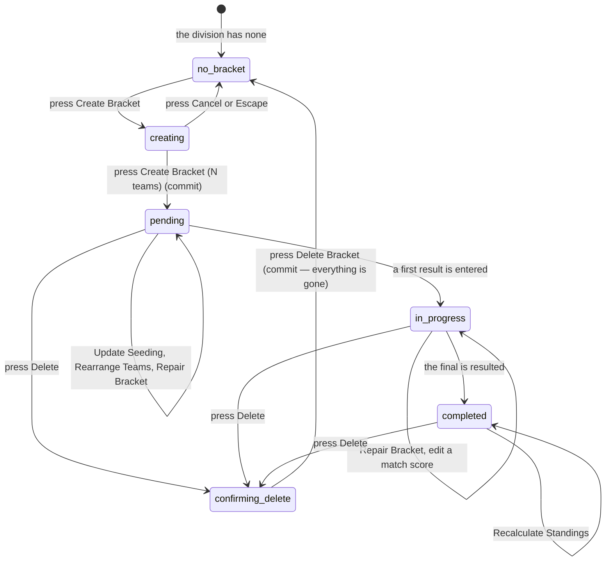

# Running the playoffs

## Summary

Running the playoffs is spread across three screens that do not link to each
other.

| Job | Where |
| --- | --- |
| Create, seed, repair, and delete brackets | `/playoffs`, which shows admins an extra set of controls |
| Manage blind draw signups and the message players see | `/admin` → **Blind Draw** |
| Turn on the Challonge fallback and list its embeds | `/admin` → **Hero** |

An admin on `/playoffs` sees the same page a visitor sees plus a Brackets/Teams
tab strip and a row of controls on each bracket. Reading a bracket is
[`playoffs/read-a-bracket.md`](../playoffs/read-a-bracket.md); the page in its
other states is [`playoffs/the-playoffs-page.md`](../playoffs/the-playoffs-page.md);
signing up for a blind draw is
[`playoffs/blind-draw-signup.md`](../playoffs/blind-draw-signup.md). Brackets are
built with the `brackets-manager` library, so their shape — rounds, byes, the
losers' side — comes from the team count and the format, not from the admin.

## The simple case

The season is over. The admin opens `/playoffs`, picks the season, and sees one
card per division reading "No brackets yet for this division" with a **Create
Bracket** button.

The dialog is "Create New Playoff Bracket": a title, a division, a format —
Single or Double Elimination, defaulting to Double — and, for a double
elimination, whether the grand final is one match or two. Under that, a team
picker with a Select tab and a Seeds tab. They tick twelve teams. A green line
says "Ready to create bracket with 12 teams (BYEs will be added)" and the button
reads **"Create Bracket (12 teams)"**.

Pressing it builds the tournament. A toast says "Bracket Created Successfully",
a second replaces it saying "Data Refreshed", and a second later the page
navigates itself to the new bracket.

## The interaction, event by event

### Arrive

`/playoffs` loads the selected season's brackets grouped by division. Each
division card names itself, counts its brackets, and lists them with a **View
Live Bracket** button — "View Final Results" once completed — and, for an admin,
a **Delete** button beside it.

**A division that already has a bracket offers no way to add another.** The
Create Bracket button only appears in the empty state of a division card. With
no divisions at all, the page shows "No Playoff Brackets Yet" and a single
"Create First Bracket" button.

Opening a bracket shows it in full, with a row of admin controls in the header:

| Control | When it appears |
| --- | --- |
| **Recalculate Standings** | The bracket is completed and has no final standings |
| **Repair Bracket** | The bracket is not completed |
| **Rearrange Teams** | Double elimination only; disabled once completed |
| **Update Seeding** | Always; disabled once completed |
| **Edit Bracket** | Always |
| **Delete** | Always |

All six are hidden below the medium breakpoint, so **none of them is reachable
on a phone**. Nothing is written by arriving.

**Edit Bracket** opens a small dialog holding the bracket's **name** and its
**division**. Saving writes both and closes. The division is disabled once the
bracket has started, with a line saying why: its teams would be left behind in
the old division. Nothing else about a bracket can be changed here — the teams,
the format and the size decided the matches it generated, so changing them would
mean deleting the bracket and every match played in it. *Update Seeding* and
*Rearrange Teams* are the controls for those.

### Leave without changing anything

Nothing is recorded. The selected season and bracket are held in the page and
lost on leaving. The Brackets/Teams tab is remembered for the browser tab.

### Begin editing

The create dialog opens empty every time. Its fields:

- **Title** — free text, required, no length limit stated.
- **Division** — required; it only labels the bracket. **Teams are not filtered
  by it**, deliberately, so a bracket can mix divisions.
- **Format** — Single or Double Elimination. Default Double.
- **Grand final** — one match or two, for double elimination only.
- **Teams** — between **2 and 32**, shown as "Select Teams (*N*/32)".

The **Seeds** tab inside the picker is a separate thing from the bracket: it
edits each team's stored seed for the division and **saves straight to the
league**, before any bracket exists. It offers Save changes and Reset to
automatic, and warns about duplicate seeds.

### While editing

The Create button stays dead until there is a title, a division, and between two
and thirty-two teams. Seeding is worked out at creation time, in this order:

1. Any team with a **manual seed** goes first, in seed order.
2. Everything else is ranked by **displayed power score** — rounded to one
   decimal, so it matches the standings table — highest first.
3. Then by division tier, higher first.
4. Then by win percentage.
5. Then by name.

Teams with no power score sink to the bottom.

**Update Seeding**, on an existing bracket, is a different screen: a drag-to-
reorder list with a live "First Round Matchup Preview" showing which seed meets
which. It only works while the bracket's state is `pending`; once a result has
been entered a red alert reads "Cannot update seeding after matches have
started." and the button is dead. There is no way back to `pending`.

### Submit

**Creating** shows "Creating Bracket..." and writes the bracket row, then asks
the library to build every match. On success it raises "Bracket Created
Successfully", closes the dialog behind a blue "Refreshing bracket data..."
panel, raises "Data Refreshed" — which **replaces the first toast**, because the
app shows one at a time, see
[`foundations/messages-to-the-user.md`](../foundations/messages-to-the-user.md) —
and one second later navigates the page to the new bracket.

On failure a red panel inside the dialog names the reason, a red toast repeats
it, and the half-made bracket row is deleted again. If that cleanup also fails
the row survives with no matches and the admin is told creation failed.

**Deleting** asks first, and says exactly what it means:

> Are you sure you want to delete the bracket **name**? This action cannot be
> undone. All matches, scores, and game data will be permanently deleted.

On success the bracket disappears and the selection clears. If the list then
fails to refresh, a plain toast says "Bracket deleted — Deleted, but list could
not refresh". On failure, "Delete failed" with the league's reason.

**Repair Bracket** and **Recalculate Standings** act on the first press, with no
confirmation. Repair reports what it changed — "*N* match(es) updated, *N*
match(es) made playable, bracket marked completed" — or "Nothing needed repair".
Recalculate says "Final standings calculated", or "Bracket still has unfinished
matches — Complete every match, then try again."

**Rearrange Teams** is the one admin write here with a preview step: drag losers
into different slots, then a confirmation screen listing "Your moves" and "What
happens automatically" before it saves.

### Blind draw

`/admin` → **Blind Draw** holds two things.

**Settings** is one field: the "Signup Confirmation Message" shown to a player
after they sign up, capped at 100 characters with no counter. Save is dead until
it differs from what is stored. A toast says "Saved — Confirmation message
updated".

**Signups** is a numbered table of first name and last initial with the time
each signed up, and a count. Each row has a bin, which asks "Remove Signup — Are
you sure you want to remove *name* from the signup list? This action cannot be
undone." A **Clear All** button asks "Clear all signups? This will remove all
*N* signups. This action cannot be undone." **Clear All removes every signup in
the league**, not just one night's; there is no date filter anywhere on the tab.

### The Challonge fallback

`/admin` → **Hero** → *Challonge Playoffs Fallback* is a switch, two header
fields, and a list of embeds.

The switch is labelled "Show Challonge bracket embeds on Playoffs page". The two
fields are a section title and subtitle. Each embed row is a Title, a **Challonge
slug** — "the part of the Challonge URL after challonge.com/" — and an Order
number, with **Add**/**Save** and a bin. Config and rows save separately, and a
saved row's bin deletes it immediately with **no confirmation**.

The fallback appears on `/playoffs` **only when the switch is on and no bracket
is selected**. Selecting a bracket hides it. It is read-only to everyone.

## Modifiers

| Modifier | Set at arrival | Changed while editing |
| --- | --- | --- |
| The user's role | A visitor or player sees `/playoffs` with no controls at all. An admin sees the tab strip and every button. Blind Draw and Hero are inside `/admin` and gated by its guard. | Losing admin leaves the controls on screen until the profile is re-read; the writes then fail. |
| The record's state | `pending` allows seeding and rearranging. `in_progress` allows neither. `completed` disables everything but Recalculate Standings and Delete. | A result entered elsewhere moves the bracket to `in_progress`; the seeding dialog does not notice until it is reopened, and the save then fails. |
| The season's state | The season picker chooses which season's brackets are listed, and a new bracket is stamped with it. When the playoff season and the active season differ, a banner says which is which. | Changing the season reloads the list and clears the selected bracket. |
| Viewport | **Every bracket admin control is hidden below the medium breakpoint.** The season picker moves to a fixed bar at the foot of the screen. | No effect. |
| Keys the form honours | The create, seeding, rearrange, and delete dialogs are proper dialogs: Escape closes, Tab is trapped. The seeding list can be reordered from the keyboard. | Escape cancels without writing — except that the Seeds tab inside the create dialog has already saved anything it saved. |

## Cancel and interrupt

| Event | Before the first edit | While editing or submitting |
| --- | --- | --- |
| Escape, or a Cancel button | Nothing to cancel. | Closes any dialog and writes nothing. It cannot stop a creation already sent, and it cannot un-do seeds saved from the Seeds tab. |
| In-app navigation away, or switching tab within the page | Nothing is lost. | A half-filled create form is lost with no warning. A creation already sent still completes and the bracket still appears. |
| Browser back or forward | As above, and the app cannot prevent it. | As above. The automatic navigation a second after creation can also land while the admin is doing something else. |
| Reload, or the tab closed | The page reloads with no bracket selected. | The form is gone. A sent creation may have landed; the division card says which. |
| Network lost mid-request | The brackets list shows its error banner. | Creation fails with "Network Error: Please check your internet connection and try again" in the dialog and a toast. Nothing is queued. |
| The request fails or times out | As above. | The dialog keeps the form and shows the reason, so the admin can retry without re-ticking twelve teams. |
| The session expires | Reading still works; `/playoffs` is public. | Every write is refused and reported as that control's failure. |
| The same record changed in another tab, or by another user | The bracket's match table has a live connection, so results appear as they are entered. The brackets **list** does not. | Two admins creating a bracket for the same division both succeed; nothing prevents duplicates. A seeding save is refused if a result landed first. |
| Browser autofill or a password manager writes into the form | No effect. | The title and slug fields are unnamed free text and are not autofill targets. |
| The window loses focus | No effect. | Returning refetches the brackets and the Challonge config once stale. Nothing announces it. |

After an interrupt the division card is the record: the bracket is listed or it
is not.

## Interactions with other systems

**Permissions and roles.** Bracket controls are shown by the admin flag on the
loaded profile. Blind Draw and Hero sit behind the `/admin` guard. See
[`foundations/accounts-and-roles.md`](../foundations/accounts-and-roles.md).

**Season scoping.** A bracket belongs to the season selected when it was made.
Blind draw signups and the Challonge fallback belong to no season at all — the
fallback is a single league-wide setting and the signup list is one flat table.

**Validation and error display.** The create form validates title, division, and
team count in three places over. Creation failures are shown twice: inside the
dialog and as a toast. Every other control reports only by toast.

**Unsaved changes.** Not guarded anywhere. The create form, the seeding order,
and an unsaved Challonge row are all lost on close.

**Optimistic updates and rollback.** None. Every write waits. A failed creation
tries to delete its own half-made bracket row.

**Realtime.** The matches inside an open bracket update live. Nothing else on
any of these three screens does.

**Offline.** Nothing loads and nothing saves.

**Toasts and notifications.** Creation raises two toasts a moment apart and only
the second is seen. Nothing is sent to any team when a bracket is created,
seeded, or deleted.

**URL state.** The address carries a division and a bracket id after the
automatic navigation, so a bracket can be linked to. The season, the tab, the
blind draw, and the Challonge settings are not in the address.

**On a phone.** Bracket admin is effectively desktop-only. Blind draw and the
Challonge settings work at every width.

**Accessibility.** The seeding list is keyboard-reorderable. The delete
confirmations are proper alert dialogs. The create dialog's team picker is a
long scroll of checkboxes with a progress bar that is not announced.

**Side effects the user can notice.** Creating a bracket makes it public
immediately — there is no draft state. Deleting one removes every match, score,
and game under it. Blind draw signups are visible to admins only; the public
sees a count.

## Edge cases

- **"Edit Bracket" changes the name and the division, and nothing else.** The
  teams, the format and the size are fixed once the bracket exists, because they
  define the matches it generated. The division can only be changed before the
  bracket starts.
- **A division card offers Create Bracket whether or not it already has one.**
- **The success toast for creation is never seen**, because the refresh toast
  replaces it within a second.
- **Creation navigates the page on a timer**, one second after the refresh,
  wherever the admin has got to.
- **Seeding is final once a result is entered.** The only fix is to delete the
  bracket and build it again.
- **Teams are not filtered by the chosen division**, so a bracket can contain
  teams from anywhere while being labelled one division.
- **The Seeds tab writes to the league before the bracket exists**, and
  cancelling the dialog does not undo it.
- **Blind draw Clear All is league-wide**, whatever night the signups were for.
- **Deleting a Challonge embed row asks nothing**, and the fallback disappears
  the moment any bracket is opened, which makes it look intermittent.
- **Every bracket admin control is hidden on a phone.**

## Open questions and verification

- Resolved: **"Edit Bracket" could not edit and created instead.** It was
  treated as a bug
  ([B-21](../bug-triage.md#b-21-eight-controls-do-nothing-when-pressed)). It now
  opens an edit dialog for the bracket in front of the admin. Its scope is the
  title and the division only: everything else defines the generated match tree,
  so changing it would mean deleting the bracket and every match played in it.
  *Update Seeding* and *Rearrange Teams* cover the structural cases. The
  division is locked once the bracket starts, because moving it would leave its
  teams behind, and the dialog says so.
- Resolved: **a division with a bracket had no Create button**, which is why the
  mislabelled Edit Bracket was the only route to a second one. The division card
  now offers Create Bracket in both states.
- **Blind draw Clear All ignores the night.** The control reads as "clear
  tonight's list" and removes every signup ever taken. **May be worth treating
  as a bug rather than documenting.**
- **Deleting a Challonge embed has no confirmation**, unlike every other delete
  on these screens.
- **The Challonge fallback settings sit inside the admin dashboard's Hero tab**,
  which makes them look like a home-page setting. This document owns them
  because they control the playoffs page;
  [`the-admin-dashboard.md`](the-admin-dashboard.md) lists that tab under
  [`site-settings.md`](site-settings.md), so one of the two cross-references
  needs settling in the consistency pass.
- **Bracket admin is unusable on a phone**, which is the device an admin is most
  likely to have on a playoff night.
- Not confirmed by hand: what the page does if the automatic navigation fires
  while a second dialog is open, and what Repair Bracket actually changes.
- Not confirmed by hand: whether a bracket created for an archived season is
  reachable from that season's page, and whether the Challonge embeds still
  load at all.
- Assumption: deleting a bracket also removes the playoff matches and games the
  library created for it. The confirmation says so; it was not observed.

Verified against `717rec` commit `ea5c8f4`, except the bracket-editing behaviour
above, which was changed after that commit — see
[B-21](../bug-triage.md#b-21-eight-controls-do-nothing-when-pressed).
