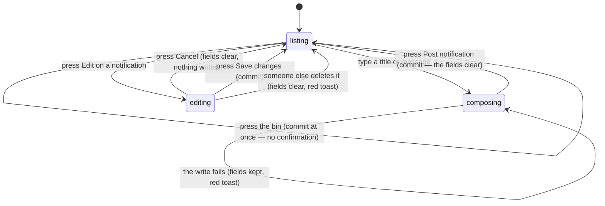

# Sending notifications

## Summary

An admin can post a short announcement that everyone who opens the app sees in
the bell in the header. This document owns the page that writes them,
`/admin/notifications`, and the quick form in the bell that does the same job in
fewer clicks.

Two things to be clear about before anything else.

**Nothing here leaves the browser.** Despite the name, a notification is an
in-app message in a popover. No email is sent, no push is delivered, and nobody
is told anything until they next open the app and press the bell.

**Everybody sees them.** The bell is in the header on every page for every role,
signed out included. There is no audience, no targeting, and no way to send a
message to one team or one person.

The page also carries a second copy of the **contact inbox**, at the top, above
the notification form. That is not a notification feature and is owned by
[`handle-requests.md`](handle-requests.md).

## The simple case

The admin opens the **Notifications** entry in the admin dashboard's sidebar, or
types `/admin/notifications` into the address bar. The page is one of only three
guarded routes; a non-admin is bounced with an "Access Denied" toast. See
[`foundations/accounts-and-roles.md`](../foundations/accounts-and-roles.md#how-pages-are-gated).

Under the contact inbox is a card headed **New notification** with two fields:
"Title (max 120 chars)" and "Message (max 1000 chars)", and a **Post
notification** button that is dead until both have something in them.

They type "Week 6 moved" and "Monday's matches are pushed to Tuesday, same
times." and press Post. A toast says "Notification posted", the fields clear,
and the message appears at the top of **Recent notifications** below with its
date and time.

Every open copy of the app now shows a red badge on the bell.

## The interaction, event by event

### Arrive

The page is a single narrow column: a heading "Admin Notifications", the contact
inbox, the form, then "Recent notifications" — the **hundred most recent**,
newest first, with no paging.

Each entry shows its title, its body with line breaks kept, when it was posted
as both an exact time and a relative one, an **Edit** button, and a **bin**. An
entry past its expiry also carries a grey **EXPIRED** tag and a line reading
"Expires *date*".

**An expiry is optional.** The New notification form carries an **Expires
(optional)** date-and-time control under the message. Leave it empty and the
notification stays until it is deleted; set it and the entry carries the EXPIRED
tag once that time passes. Until 2026-09-01 there was no such field, so the tag
and the line described a state no admin could create — see
[B-31](../bug-triage.md#b-31-two-dead-features-are-visible-in-the-interface).

The page opens a live connection to the notification list, so anything another
admin posts, edits, or deletes appears here without a reload.

Nothing is written by arriving.

### Leave without changing anything

Nothing is recorded. There is no draft. Coming back gives an empty form.

Opening the **bell** is different: it marks every notification as seen for that
browser, which clears the badge. That happens on opening the popover, not on
reading anything, and it is the only thing in this feature that a visitor's
browser records.

### Begin editing

Typing in either field is the whole of it. Nothing else changes: no dirty mark,
no warning, no character counter. The fields simply stop accepting input at 120
and 1000 characters, silently.

Pressing **Edit** on an existing notification loads its title and body into the
same form, changes the card's heading to "Edit notification", changes the button
to "Save changes", and adds a **Cancel** beside it. There is only one form, so
starting an edit **discards anything already typed in it** without asking.

### While editing

There is no validation beyond "both fields must have something in them after
trimming". A title of one character and a body of one character will post.

Nothing is checked against what already exists, so the same announcement can be
posted twice.

### Submit

The write waits; nothing is optimistic. On success the list is re-read, the
fields clear, and a toast says **"Notification posted"** or **"Notification
updated"**.

On failure the fields keep their text and a red toast says "Save failed" with
the real reason underneath — one of the few places in the app that passes the
league's own message through rather than replacing it. See
[`foundations/messages-to-the-user.md`](../foundations/messages-to-the-user.md).

**Deleting acts on the first press.** There is no confirmation, no undo, and no
success message. The row disappears. Only a failure says anything: a red toast
reading "Failed to delete notification", with no explanation.

The same bin, with the same behaviour, sits on every notification inside the
bell popover for an admin — so a notification can be destroyed from the header
of any page in the app with one click.

### The bell

The bell is in the header for everyone. It shows a red badge counting
notifications posted since this browser last opened the popover, capped at
**9+**. Its label reads "Notifications (3 unread)".

Opening it marks everything seen and shows, for an admin only, a compact **Post
notification** form — title, message, and a Post button — which writes exactly
what the page's form writes and toasts "Notification posted" the same way. Below
that is the list — the **twenty** most recent, not the page's hundred — each
entry with a dot that is filled while it is unread.

> **Technical note:** "unread" is one timestamp stored in the browser, not on
> the account. It is per browser and per device, it is shared between tabs of
> the same browser as soon as one of them opens the popover, and it is lost when
> site data is cleared. Signing in or out has no effect on it.

## Modifiers

| Modifier | Set at arrival | Changed while editing |
| --- | --- | --- |
| The user's role | The page is admin-only. The bell is visible to every role; the quick-post form and the bins inside it appear only for an admin. | Losing admin mid-session leaves the form and the bins on screen until the profile is re-read; the writes then fail with "Save failed". |
| The record's state | A notification past its expiry is tagged EXPIRED and still listed and editable for an admin, and still shown in the bell. | A notification deleted elsewhere while it is being edited clears the form and raises a red toast: "Notification deleted — The notification you were editing has been removed." |
| The season's state | No effect. Notifications belong to no season and survive a changeover. | No effect. |
| Viewport | The page is a single narrow column at every width. The bell popover is a fixed 360 pixels wide. | No effect. |
| Keys the form honours | Tab moves title, message, expiry, Post, Cancel. **Enter in the title posts the form**, because it is a real form and the button is its submit. Enter in the message adds a newline. | Escape closes the bell popover. It does nothing on the page. |

## Cancel and interrupt

| Event | Before the first edit | While editing or submitting |
| --- | --- | --- |
| Escape, or a Cancel button | Closes the bell popover. There is no Cancel on the page's form until an edit is started. | **Cancel** clears the form and abandons the edit without asking. Escape does not. Neither can stop a write already sent, and there is nothing at all to cancel on a delete. |
| In-app navigation away, or switching tab within the page | Nothing is lost. | Everything typed is lost with no warning. A write already sent still lands; the admin never sees the toast. |
| Browser back or forward | Returns to the previous page. | As above, and the app cannot prevent it. |
| Reload, or the tab closed | The page reloads with an empty form. | Everything typed is lost. A sent write may have landed; the list after reloading says which. |
| Network lost mid-request | The list shows "Loading…" and then nothing. | The write fails, the fields are kept, and "Save failed" carries the reason. Nothing is queued. |
| The request fails or times out | As above. | As above. A failed delete says only "Failed to delete notification". |
| The session expires | The guard sends the admin to sign in on the next visit, not immediately. | The write is refused and "Save failed" reports it. Nothing mentions the session. |
| The same record changed in another tab, or by another user | The list updates by itself — this is one of the few live screens in the app. | An edit in progress on a notification that is **deleted** elsewhere is abandoned with a toast. An edit in progress on one that is **changed** elsewhere is not: the form keeps the old text and saving overwrites the other admin's change. |
| Browser autofill or a password manager writes into the form | No effect. Both fields are unnamed free text. | No effect. |
| The window loses focus | No effect. | No effect. The live connection keeps the list fresh whether the tab is in front or not. |

After an interrupt the list is the record. A notification that is listed was
posted; the form's contents were never anywhere but the page.

## Interactions with other systems

**Permissions and roles.** The page is one of the three guarded routes. Inside
the bell, the quick-post form and the delete bins are shown by the admin flag on
the loaded profile, and the database enforces the same rule separately.

**Season scoping.** None. A notification is league-wide and permanent.

**Validation and error display.** Both fields must be non-empty after trimming;
that is the entire rule. Length is enforced by the input refusing further
characters, with nothing to say why. Failures are toasts.

**Unsaved changes.** Not guarded. Starting an edit, pressing Cancel, or leaving
the page all discard typed text without asking.

**Optimistic updates and rollback.** None. Every write waits for the league.

**Realtime.** The notification list subscribes and refreshes itself, on the page
and in the bell. This is an exception to the rule stated in
[`foundations/saving-and-freshness.md`](../foundations/saving-and-freshness.md);
see [Open questions](#open-questions-and-verification).

**Offline.** Nothing loads and nothing saves.

**Toasts and notifications.** Posting and updating each toast on success;
deleting toasts only on failure. The word "notification" means two different
things on this page — the toast the admin sees and the announcement they are
writing — and neither has anything to do with the other.

**URL state.** `/admin/notifications` carries nothing. The address itself is
linked from nowhere — the admin dashboard's **Notifications** sidebar entry
renders the same management inside `/admin` rather than navigating here.

**On a phone.** The page is already one narrow column and needs no change. The
bell popover is fixed at 360 pixels, which is wider than the narrowest phones.

**Accessibility.** The bell's label states the unread count. The unread dot is
marked decorative, so a screen reader hears no difference between a read and an
unread notification. The delete buttons are labelled "Delete notification" with
nothing to say which one. Nothing announces the list changing under the reader
when a live update arrives.

**Side effects the user can notice.** A posted notification appears in every
open copy of the app within moments and stays until an admin deletes it.
Nothing is emailed, pushed, or sent anywhere outside the app.

## Edge cases

- Resolved: **the page had no link**, so `/admin/notifications` had to be typed.
  Fixed — see [B-31](../bug-triage.md#b-31-two-dead-features-are-visible-in-the-interface).
  The notification management now also appears as a **Notifications** item in the
  admin dashboard's sidebar. The page itself is unchanged and still shows the
  contact inbox above it.
- **Delete has no confirmation**, on the page and in the bell popover, and
  cannot be undone.
- **A successful delete says nothing at all**, so a mis-click looks like the row
  vanishing on its own.
- Resolved: **expiry could be displayed but never set.** The EXPIRED tag, the
  "Expires" line and the timer that re-checks them all existed for a value nothing
  could write. Fixed — see
  [B-31](../bug-triage.md#b-31-two-dead-features-are-visible-in-the-interface).
  The form has an optional expiry field, and editing loads the stored value.
- **An expired notification is still shown**, in the list and in the bell.
- **Editing leaves no trace.** The list shows only when a notification was
  posted, so a message edited an hour later reads as though it always said that.
- **Starting an edit silently discards a half-written new notification**, because
  the two share one form.
- **Two admins editing the same notification** overwrite each other with no
  warning; only deletion is noticed.
- **The unread badge is per browser**, so the same person sees the same
  notification as new on their phone after reading it on a laptop.
- **Opening the bell marks everything seen**, including items below the fold and
  items never scrolled to.
- **The page lists a hundred and the bell lists twenty**, and neither says older
  ones exist.
- **Enter in the title field posts the notification**, so a half-typed
  announcement can be published by habit.

## Open questions and verification

- **Deleting a notification is destructive, irreversible, and unconfirmed** — in
  two places, one of which is the header of every page in the app. **May be
  worth treating as a bug rather than documenting.**
- **The feature is called "notifications" and notifies nobody.** The glossary
  and [`foundations/messages-to-the-user.md`](../foundations/messages-to-the-user.md)
  both describe a push notification as a message delivered outside the app that
  an admin can send. No such delivery exists at this commit: the only thing an
  admin can send is an in-app banner. **May be worth treating as a bug rather
  than documenting**, and the glossary entry needs correcting either way.
- Resolved: **the page was unreachable without typing the URL**, and **expiry
  was half-built** — displayed, timed, and unsettable. Both fixed, see
  [B-31](../bug-triage.md#b-31-two-dead-features-are-visible-in-the-interface).
- Not confirmed by hand: whether an expired notification really leaves the bell.
  The admin list keeps it — an admin-only read was added for exactly that, since
  the one SELECT policy hid expired rows from everyone, admins included.
- **Notifications are live and the foundations say nothing is.**
  [`foundations/saving-and-freshness.md`](../foundations/saving-and-freshness.md)
  states that realtime exists only on live scoring. Notifications subscribe, and
  so do contact requests and the playoff match table. That foundation needs
  correcting rather than this document softening.
- Not confirmed by hand: whether a notification posted while another admin has
  the bell open appears there without a reload.
- Not confirmed by hand: how the 360-pixel popover behaves on a 320-pixel phone.
- Not confirmed by hand: what a visitor with no account sees in the bell, and
  whether the unread badge is meaningful for someone who never signs in.
- Not confirmed by hand: whether the database refuses a non-admin's post, given
  the browser only hides the form.
- Assumption: nothing anywhere else in the product creates a notification. Every
  row in the list is one an admin typed; no automatic announcement was found.

Verified against `717rec` commit `ea5c8f4`.
