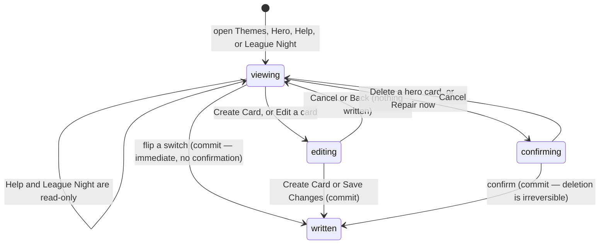

# Site settings

## Summary

Four dashboard sections change what the app looks like and tell an admin whether
it is working. **Themes** decides which colour schemes players may pick. **Hero**
owns the cards on the home page and the read-only playoff fallback. **Help** is a
static guide for admins. **League Night** is a read-only health board with one
repair button on it.

They are grouped here because none is large enough for a document of its own and
because all four are settings rather than league data. Nothing in this document
touches a match, a team, or a score — except the one repair button, which
rewrites every team's win and loss counters.

## The simple case

An admin opens **Themes**. Four rows, each a theme with an icon, a name, the
words "Visible to users", and a switch. They turn one off. The row goes grey, the
words become "Hidden from users", and a toast says "Theme disabled". Players'
theme pickers lose that option the next time they load.

They open **Hero**. A table of home page cards: order, colour, name, type,
target, an On Homepage? switch, and Edit, Duplicate and Delete buttons. They flip
a switch and a toast says "Visibility updated". The card appears on the home page
for everyone.

They open **League Night**. Two cards report the live connection and the last
power score snapshot; three tiles count what is waiting; a chart shows thirty
days of traffic; one card lists matches that were played on live scoring and
never saved; another says whether every team's record matches its match
history.

## The interaction, event by event

### Arrive

**Themes** fetches its rows in display order and shows "Loading theme
settings..." until they arrive.

**Hero** fetches every card, visible or not, ordered by its sort number, and
shows three grey bars while it waits. With none it says "No hero cards yet —
Create your first card to get started."

**Help** fetches nothing. It is a fixed page of text.

**League Night** fetches five things and then **keeps fetching them**: the last
power snapshot every minute, the three waiting counts every thirty seconds, the
traffic chart every five minutes, and the unrecorded live matches and the counter
drift once each. It also opens a
realtime channel purely to report whether the connection is alive. It is the
heaviest of the app's few polling screens; see
[`../foundations/saving-and-freshness.md`](../foundations/saving-and-freshness.md#what-makes-the-app-go-back-for-more).

Nothing on any of the four is focused on arrival.

### Leave without changing anything

Nothing is written and nothing is drafted. The hero card form is not remembered:
opening it, typing, leaving the section and coming back gives the table again.

### Begin editing

**Themes** has no editing state. A switch writes.

**Hero's** switches write too. Its **Create Card** and **Edit** replace the whole
section with a form — not a dialog — with a **Back** button above it and a live
preview of the card beside it. The preview updates as each field is typed.

The form's sections are Card Basics, Call to Action, Design & Appearance,
Targeting & Display, an editor specific to the card's type when it is Champions
or Event, and Advanced Settings holding the raw settings text and the sort
number.

**The Challonge fallback** sits below the hero card table: an enabled switch, a
header title and subtitle, and a list of bracket rows with a title and a slug
each. Its fields are ordinary inputs that are saved with an explicit Save.

**Help** and **League Night** have nothing to edit.

### While editing

The hero card form requires a card name and a headline; the browser refuses to
submit without them. Nothing else is checked. The raw settings text in Advanced
Settings is parsed on every keystroke to build the preview, and text that is not
valid is treated as empty rather than reported.

The live preview shows placeholder text — "Card Headline" — until a headline is
typed, so an empty form still previews as a card.

### Submit

**A theme switch** writes at once. One guard exists: **the last enabled theme
cannot be turned off**, and trying raises a red toast reading "At least one theme
must remain enabled". Success raises "Theme enabled" or "Theme disabled"; failure
raises "Failed to update theme setting", with no reason. While any theme write is
in flight, **every** switch on the screen is disabled.

**A hero card's visibility switch** writes at once, with no confirmation, and
raises "Success — Visibility updated". Turning it on publishes the card to the
home page for every visitor.

**The hero card form** writes on Create Card or Save Changes. On success a toast
says the card was created or updated and the form closes back to the table. On
failure a toast carries the server's own message and **the form stays open with
everything in it**.

**Duplicate** copies a card immediately, with **no confirmation**. The copy takes
the original's name with " (Copy)" appended, its slug with "-copy" appended, and
is created hidden. Pressing Duplicate twice on the same card creates two copies
whose slugs collide.

**Delete** asks first: "Delete Hero Card — Are you sure you want to delete
*title*? This action cannot be undone." That is accurate; there is no undo and no
trash. The card and its settings are gone.

**The Challonge fallback's remove button deletes a saved row at once, with no
confirmation at all.**

## League Night in detail

Everything on it is read-only except one button.

**Realtime.** A coloured dot and a label: connected, connecting, channel closed,
or error, with how long ago the state last changed. On an error it adds "If a
scorer is stuck, ask them to refresh once — that re-subscribes the channel."

**Last power snapshot.** When it ran, which week, how many teams it captured, and
the timestamp in Eastern time. At **eight days or older** it gains a red "Stale"
badge and a line naming what to check. When none has ever run it says so in red.

**Pending queues.** Three tiles counting waiting score reports, waiting team
requests, and new contact messages. **Pressing a tile reloads the whole page** to
open that section rather than switching in place.

**Traffic.** A thirty-day line chart of visitors and pageviews from the app's own
beacon, with a seven-day breakdown by platform. Only an admin can read it; a
failure says so rather than showing an error.

**Unrecorded live matches.** Matches that live scoring decided — a side won two
games — for which nobody ever pressed "Save official result". It lists up to ten,
newest first, with both team names, the game score, and the date, plus a count of
any beyond ten. Each row links to that match's live scoring screen so the games
can be checked before the result is saved. When there are none it shows a green
"All clear" line. **This card writes nothing**; saving the result is still done
by hand on the match itself. See
[`../live-scoring/finish-the-match.md`](../live-scoring/finish-the-match.md).

**Standings counters.** The one live repair. It lists every team whose stored
win-loss record disagrees with its completed matches, up to ten with a count of
the rest, or a green "In sync" line. A **Repair now** button opens a confirmation
explaining that it recomputes every team's wins, losses and game counts from
completed matches and refreshes the season stats cache, and that it is safe to
run any time. It reports how many teams it repaired, or "Already in sync".

**Quick actions.** Two buttons that reload the page into another section, and
four links that open externally: two service status pages, the database's SQL
editor, and the league's own operations playbook on GitHub.

## Help

The Help section is a fixed page and cannot be changed from the app. It holds a
six-step setup workflow, a reference list describing **eleven** of the
dashboard's twenty sections, and four tips.

It is **not** the help page players see. `/help` is a separate route with
separate content, and nothing in the admin dashboard edits it. See
[`../help/the-help-page.md`](../help/the-help-page.md).

## Modifiers

| Modifier | Set at arrival | Changed while editing |
| --- | --- | --- |
| The user's role (visitor, player, admin) | Only an admin reaches the dashboard; see [`../foundations/accounts-and-roles.md`](../foundations/accounts-and-roles.md#how-pages-are-gated). The traffic chart is additionally readable by admins only at the database, so a stale browser sees its "only admins" message rather than data. | Losing admin elsewhere leaves every control on screen and the writes fail. |
| The record's state | A hidden hero card shows in this table and nowhere else. A disabled theme shows greyed. A card of type Champions or Event gains an extra editor in the form. | Changing a card's type mid-edit swaps that extra editor in or out, keeping what was typed elsewhere. |
| The season's state (active, archived, playoffs on) | No effect on themes, hero cards, or help. A Champions card names teams and is unaffected by which season is active. | No effect. |
| Viewport | The theme rows and the League Night cards stack. The hero card form's two columns become one, putting the live preview below the fields rather than beside them. | No effect beyond re-flowing. |
| Keys the form honours | Tab reaches each switch and each button in order. | Enter in a single-line field submits the hero card form. Escape closes the delete confirmation and does nothing else. |

## Cancel and interrupt

| Event | Before the first edit | While editing or submitting |
| --- | --- | --- |
| Escape, or a Cancel button | No effect. | The hero card form's Cancel and Back both discard everything typed with no confirmation. Escape closes the delete or repair confirmation. Neither aborts a request already sent. |
| In-app navigation away, or switching tab within the page | Nothing is lost. | **Everything typed in the hero card form is lost, with no warning**, including switching dashboard section. A switch already flipped has already been written. |
| Browser back or forward | Leaves the dashboard. | Same as navigating away. The form is not a route, so Back never returns to it. |
| Reload, or the tab closed | Returns to the same section, with the form closed. | The form's contents are lost. A sent write still lands. |
| Network lost mid-request | Nothing to lose. | The write fails and a red toast appears. Theme failures say nothing useful; hero card failures carry the server's message. The switch snaps back to its stored value on the next re-fetch. |
| The request fails or times out | Cannot happen. | The hero card form keeps its contents. A theme switch that failed keeps showing its old position, which is correct. A repair that timed out may still have run. |
| The session expires | No effect while reading. League Night keeps polling and its counts keep working while the reads are public. | Writes fail. Nothing signs the admin out. |
| The same record changed in another tab, or by another user | No realtime on any of the four, apart from League Night's connection indicator, which reports the socket rather than any data. | **Two admins editing the same hero card overwrite each other silently.** The last save wins and neither is told. |
| Browser autofill or a password manager writes into the form | The hero card form's text fields could be autofilled. Nothing depends on it. | Same. |
| The window loses focus | Returning re-fetches themes and hero cards once past their five-minute window. League Night keeps polling whether or not the window is in front. | A card's row can change under the cursor. League Night's numbers change on their own timers regardless. |

## Interactions with other systems

**Permissions and roles.** Admin only, by the route gate, with the database
enforcing the same rules separately. The traffic view is admin-only at the
database as well as in the browser.

**Season scoping.** None of these settings is season-scoped. A hero card written
for one season stays on the home page into the next until somebody hides it.

**Validation and error display.** Two required fields on the hero card form,
enforced by the browser. One guard on themes. Nothing else is checked. Malformed
advanced settings text is silently treated as empty.

**Unsaved changes.** Not handled anywhere in this document's four sections.

**Optimistic updates and rollback.** None. Every switch waits for the server and
then re-reads.

**Realtime.** Only League Night's indicator, and it subscribes purely to report
whether the connection is alive — it ignores every message it receives.

**Offline.** Themes, hero cards and help stay on screen. League Night's polls
fail quietly and its numbers freeze at their last values with no error shown.
Every write fails.

**Toasts and notifications.** One per action. Theme failures are generic; hero
card failures carry the server's message. No player is notified of any change
here, but every player sees the result the next time their page re-fetches.

**URL state.** Nothing. The section, the open form, and the card being edited are
all invisible to the address bar.

**On a phone.** The hero card form's live preview drops below the fields, so an
admin editing on a phone cannot see the preview and the field at the same time.
The League Night queue tiles stay in one row of three.

**Accessibility.** Every switch has a label naming what it toggles. The colour
swatch in the hero card table is decorative, with the preset's name in a tooltip
rather than in text. League Night's status dots are decorative and every state
also has a written label.

**Side effects the user can notice.** Disabling a theme removes it from every
player's picker; a player already using that theme is affected in a way this
screen does not state. Showing a hero card publishes it to the public home page
immediately. Repairing counters rewrites the standings everybody reads.

## Edge cases

- **Duplicate has no confirmation and produces a colliding slug** the second time
  it is used on the same card.
- **Removing a Challonge fallback bracket has no confirmation.** One press,
  gone.
- **The order column has a drag handle that does nothing.** Ordering is a number
  field buried in Advanced Settings.
- **The last theme cannot be disabled**, but nothing stops an admin disabling
  every theme except one nobody uses.
- **A hero card with a headline and nothing else is publishable.**
- **Advanced settings text that is not valid is discarded silently**, taking a
  Champions or Event card's contents with it.
- **League Night's tiles reload the whole app.** Work in progress in another
  section is lost without warning.
- **The Help section lists eleven of twenty sections** and its sixth workflow
  step points at the wrong one.
- **The traffic chart's empty state blames the release**, saying the beacon
  started with it, which will read oddly a year from now.

## Open questions and verification

- **The Challonge fallback deletes a bracket row with no confirmation**, on a
  screen where deleting a hero card asks first. Inconsistent and destructive.
  **May be worth treating as a bug rather than documenting.**
- **Duplicating a hero card twice creates two cards with the same slug.** The
  slug is described in the interface as the card's internal identifier. **May be
  worth treating as a bug rather than documenting.**
- **League Night's polls have no error state.** When one fails the card keeps its
  last value with nothing to say the number has stopped moving, which is the
  opposite of what a health board should do. Worth raising as a product question.
- **Switching section by reloading the page** discards unsaved work elsewhere in
  the dashboard, including a hero card being written. Worth raising as a product
  question.
- **The admin Help section is out of date** with the dashboard it documents: nine
  sections are missing and one step names the wrong section. It is static text,
  so it will drift again.
- Not confirmed by hand: what a player already using a theme sees after that
  theme is disabled — whether they are moved to another theme or keep it.
- Not confirmed by hand: whether the hero card live preview matches what the home
  page actually renders.
- Not confirmed by hand: how long the counter repair takes on a full season, and
  what the screen shows while it runs.
- Assumption: the four theme rows seen in the code — light, dark, system and a
  winter theme — are the whole list. The rows come from the database and could
  differ.

Verified against `717rec` commit `ea5c8f4`.
