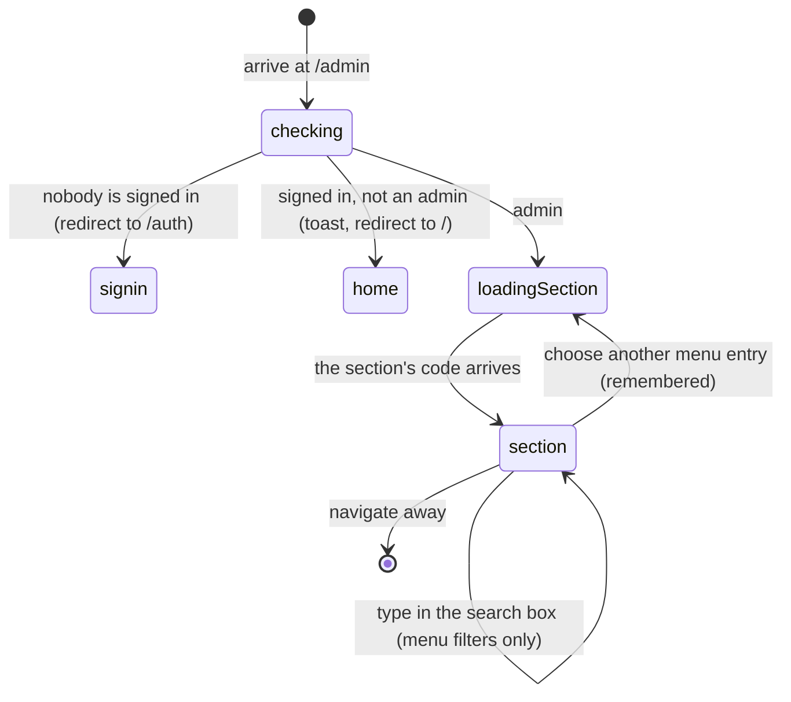

# The admin dashboard

## Summary

`/admin` is where everything an admin can do lives. It is one page, not a set of
pages: a menu down the left and one section in the middle. Choosing a menu entry
swaps the middle, and the address bar never changes.

The dashboard holds **twenty sections**. They range from a whole scheduling tool
to a single switch. Nothing groups them by importance on a wide screen, and there
is no landing view — arriving takes the admin straight into whichever section
they last used.

This document owns the shell: the gate, the menu, the search box, what is
remembered, and the inventory of sections. Each section has its own document, or
is named here and pointed at one.

## The simple case

An admin opens the user menu and picks "Admin Panel". The screen shows a spinner
and "Checking access...", then the heading **Admin Dashboard** fades in over
about a third of a second.

On the left is a bordered panel headed "Admin Menu", with a search box and
twenty entries. The centre holds one section — **Timeslots** the first time, and
after that whichever section was open last.

The admin types "sea" into the search box. The list shrinks to **Season**. They
press it, the middle of the page shows Season Management, and the left column
goes back to twenty entries as soon as the search box is cleared.

They navigate to `/schedule` to check something, come back to `/admin`, and
Season Management is still the section on screen.

## The interaction, event by event

### Arrive

The route is one of the three guarded routes in the app. The check, the
"Checking access..." screen, the redirect for a signed-out user, and the
one-time "Access Denied" toast for a signed-in non-admin are all described in
[`../foundations/accounts-and-roles.md`](../foundations/accounts-and-roles.md#how-pages-are-gated).
Nothing on this page repeats or softens that gate.

Once past the gate, the page reads which section was open last from the browser's
per-tab storage and opens it. If there is no record, it opens **Timeslots**.

**Only the chosen section is loaded.** The other nineteen are not fetched, not
mounted, and cost nothing. A section opened for the first time in a session shows
a small panel reading "Loading admin section..." while its code arrives, so every
first switch has a visible pause and every later switch to the same section does
not.

One number is fetched by the shell itself: the count of waiting team requests,
shown as a red badge on the **Requests** entry. It refreshes on its own **every
thirty seconds** — one of the handful of polls listed in
[`../foundations/saving-and-freshness.md`](../foundations/saving-and-freshness.md#what-makes-the-app-go-back-for-more).

### Leave without changing anything

Nothing is written. The only thing recorded is which section was open, and that
is recorded the moment a menu entry is pressed, not on leaving.

That record lives in the browser tab and survives a reload and an in-app trip to
another page and back. It does **not** survive closing the tab, and it is not
shared with a second tab opened later.

### Begin editing

The shell has nothing to edit. Every edit belongs to a section, and each section
document says what its own first edit does.

Two shell controls change what is on screen without changing any data:

- The **collapse toggle** in the menu header narrows the menu to icons only. It
  is labelled "Collapse sidebar" or "Expand sidebar" for a screen reader. The
  choice is **not remembered** — a reload brings the full menu back.
- The **search box** filters the menu by label. It is not remembered either.

### While editing

Search matches the menu labels only, anywhere in the label, ignoring case. It
does not match section contents, and there is no "no results" message on a wide
screen — the menu simply empties.

**Filtering does not change the section on screen.** An admin can search their
way down to one entry while a completely different section is still displayed in
the middle of the page.

Pressing a menu entry swaps the section immediately and records the choice. There
is no confirmation and no check for work in progress, which matters because one
section — Auto Schedule — holds a generated schedule that is not yet saved. See
[`build-the-schedule.md`](build-the-schedule.md).

### Submit

The shell never submits anything. Every write on `/admin` belongs to a section.

## The twenty sections

In menu order, with the document that owns each:

| Menu entry | What it is |
| --- | --- |
| Timeslots | Assign teams to timeslots for a date — [`manage-timeslots.md`](manage-timeslots.md) |
| Match Creation | Build matches by hand for one date — [`build-the-schedule.md`](build-the-schedule.md) |
| Auto Schedule | Generate a whole night's schedule — [`build-the-schedule.md`](build-the-schedule.md) |
| Matchups | Read-only opponent history between teams |
| Scores | Mass score entry — [`enter-scores-in-bulk.md`](enter-scores-in-bulk.md) |
| Live Corrections | Fix a match already scored — [`correct-a-live-match.md`](correct-a-live-match.md) |
| Season | Create, activate, edit, archive, finalise — [`manage-seasons.md`](manage-seasons.md) |
| Participation | Who has said they are playing — [`manage-seasons.md`](manage-seasons.md) |
| Requests | Team requests, with the count badge — [`handle-requests.md`](handle-requests.md) |
| Contact Inbox | Messages from the contact form — [`handle-requests.md`](handle-requests.md) |
| Teams | Teams, divisions per team, logos, member approvals — [`manage-teams-and-divisions.md`](manage-teams-and-divisions.md) |
| Divisions | Division names, display grouping, weights — [`manage-teams-and-divisions.md`](manage-teams-and-divisions.md) |
| Pending | Score reports awaiting review, and matches completed with no winner — [`../scores/pending-scores.md`](../scores/pending-scores.md) |
| Hero | Home page hero cards and the Challonge fallback — [`site-settings.md`](site-settings.md) |
| Themes | Which themes players may choose — [`site-settings.md`](site-settings.md) |
| Blind Draw | Blind draw signups — [`run-the-playoffs.md`](run-the-playoffs.md) |
| Help | A static guide for admins — [`site-settings.md`](site-settings.md) |
| League Night | Live health, queues, traffic, counter repair — [`site-settings.md`](site-settings.md) |
| Power Score Review | Revert or re-apply the power score change — [`../stats/power-score.md`](../stats/power-score.md) |
| Power Score Sandbox | Try new power score weights before applying — [`../stats/power-score.md`](../stats/power-score.md) |

`/admin/notifications` is a guarded route of its own and is **not in this menu**.
See [`send-notifications.md`](send-notifications.md).

## Modifiers

| Modifier | Set at arrival | Changed while editing |
| --- | --- | --- |
| The user's role (visitor, player, admin) | Only an admin reaches this page at all. A visitor is sent to `/auth`; a signed-in non-admin gets one "Access Denied" toast and lands on the home page. | Losing admin in another tab does not close the dashboard. The menu stays, the sections stay, and the writes start failing. |
| The record's state | No effect. The shell holds no record. | No effect. |
| The season's state (active, archived, playoffs on) | No effect on the shell. Individual sections show different things with no active season; each says so. | No effect on the shell. |
| Viewport | Below the mobile breakpoint the left menu is replaced by a stacked accordion with six groups, two quick-access buttons (Scores, Timeslots), and its own search box. Above it, the sidebar. | Crossing the breakpoint by resizing swaps the whole navigation. The open section is kept; the mobile accordion's open group is not recalculated. |
| Keys the form honours | Tab reaches the collapse toggle, the search box, then every visible menu entry in order. No shortcut opens a section. | Typing in the search box filters as each character lands. Escape does nothing; the box has no clear button on a wide screen. |

## Cancel and interrupt

| Event | Before the first edit | While editing or submitting |
| --- | --- | --- |
| Escape, or a Cancel button | No effect. The shell has no Cancel. | No effect on the shell. Whether Escape cancels anything is up to the open section. |
| In-app navigation away, or switching tab within the page | The open section is remembered. Coming back reopens it. | **Switching section discards whatever the old section held in memory, with no warning.** Only Auto Schedule survives, because it writes its working state to the browser. |
| Browser back or forward | Leaves `/admin` entirely; there is no history entry per section, so Back never steps between sections. | Same. The open section is remembered, but nothing it held is. |
| Reload, or the tab closed | A reload returns to the same section. Closing the tab forgets it, and the next visit opens Timeslots. | A reload loses everything the open section held, except Auto Schedule's working state. |
| Network lost mid-request | The request-count badge stops updating and keeps showing its last value. | The shell keeps working because it is already loaded. **A section not yet opened cannot load at all** and shows its loading panel indefinitely. |
| The request fails or times out | The badge silently keeps its old number. There is no error state for it. | Handled by the section, not the shell. |
| The session expires | The dashboard stays on screen. The gate is not re-run while the page is open. | Writes start failing with each section's own message. Nothing signs the admin out or sends them away. |
| The same record changed in another tab, or by another user | The shell subscribes to nothing; the badge is the only number it refreshes on its own. Some sections do subscribe. | Two admins in two dashboards do not generally see each other's work. |
| Browser autofill or a password manager writes into the form | The search box is a plain text input and could be autofilled, which would filter the menu. Nothing else on the shell is fillable. | Same. |
| The window loses focus | Coming back re-fetches anything past its five-minute window, so counts and lists can change under the cursor. | Same. A number can move mid-edit in a section that is reading it. |

## Interactions with other systems

**Permissions and roles.** The whole page is behind the admin gate described in
[`../foundations/accounts-and-roles.md`](../foundations/accounts-and-roles.md#how-pages-are-gated).
There are no partial admins, so every admin sees all twenty sections.

**Season scoping.** The shell is not season-scoped. Most sections silently mean
the active season; see [`../foundations/seasons.md`](../foundations/seasons.md).

**Validation and error display.** None at the shell level. A section that fails
to load shows its loading panel and nothing else.

**Unsaved changes.** Not handled by the shell. Switching sections is
unprotected. Auto Schedule guards a browser-level reload on its own.

**Optimistic updates and rollback.** None. The shell writes nothing.

**Realtime.** None on the shell. Individual sections subscribe where it matters —
the contact inbox and the League Night indicator among them; see
[`../foundations/saving-and-freshness.md`](../foundations/saving-and-freshness.md#realtime).

**Offline.** Already-loaded sections keep working and every write fails.
Un-opened sections never load. See
[`../foundations/saving-and-freshness.md`](../foundations/saving-and-freshness.md#offline).

**Toasts and notifications.** The shell raises one toast: the "Access Denied"
message on refusal, which appears after the redirect and therefore over the home
page.

**URL state.** **Nothing about the dashboard is in the URL.** The open section,
the collapsed menu, and the search text are all invisible to the address bar, so
an admin cannot link a colleague to a section, cannot bookmark one, and cannot
open two sections in two tabs by URL.

**On a phone.** The menu becomes six collapsible groups with a search box above
and two quick-access buttons. Only the group holding the active section is open,
and **only on the first render** — changing sections later does not open the new
section's group.

**Accessibility.** Menu entries are real buttons with a 44-pixel minimum height.
The collapse toggle is labelled. Swapping a section replaces the main content
with no announcement, so a screen reader user gets no notice that the page
changed under them.

**Side effects the user can notice.** Opening `/admin` records a pageview like
any route. The request-count poll issues a request every thirty seconds for as
long as the dashboard is open.

## Edge cases

- **The "Access Restricted" dialog can never be shown.** The page contains a
  modal offering "Request Access" and "Back to Home" for a signed-in non-admin,
  but the route guard redirects that user away before the page renders. See
  [Open questions](#open-questions-and-verification).
- **Search can hide the section you are looking at.** The middle of the page
  keeps rendering a section that is no longer in the list.
- **The collapsed menu is not remembered**, but the open section is. The two
  pieces of shell state behave differently for no visible reason.
- **A second browser tab starts at Timeslots**, because the memory is per tab.
- **Sections in the League Night list jump by reloading the page.** Its queue
  tiles and quick actions set the remembered section and then reload the whole
  app rather than switching in place. See [`site-settings.md`](site-settings.md).
- **The Requests badge counts team requests only.** Membership approvals have
  their own badge inside the Teams section, and the contact inbox has none.
- **Nothing marks a section as dangerous.** Archive Season sits in the menu
  beside Themes.

## Open questions and verification

- **The admin access modal is unreachable.** `/admin` is wrapped in the route
  guard, which redirects a non-admin to the home page before the page renders, so
  the modal inside the page never displays. Its "Request Access" button would
  raise two toasts, the second claiming "An administrator has been notified of
  your request" — and nothing notifies anybody. **May be worth treating as a bug
  rather than documenting.**
- **The Requests badge has no error state.** When its poll fails it keeps showing
  the last number it had, so an admin can be looking at a stale count with nothing
  to say so. Minor, but it is the one number the shell shows.
- Not confirmed by hand: whether the mobile accordion really leaves the new
  section's group closed after a section change, or whether some other render
  reopens it.
- Not confirmed by hand: how long the "Loading admin section..." panel is visible
  on a slow connection for the heaviest sections.
- Not confirmed by hand: what the search box does with leading or trailing
  spaces.
- Assumption: the section order in the menu carries no meaning. It matches the
  order the sections were added rather than any workflow.

Verified against `717rec` commit `ea5c8f4`.
