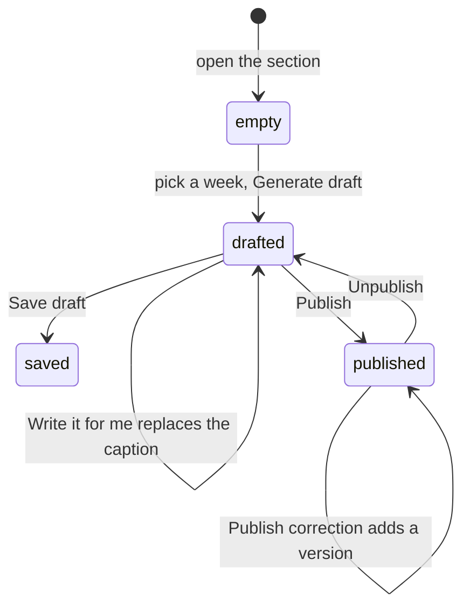

# Publish a weekly content pack

## Summary

**Admin → Weekly Content Pack** (`/admin/weekly-content`) turns one week's
verified results into something postable: a recap graphic, one standings graphic
per division, and a caption. Publishing also puts the recap on its own public
page and swaps the home page's Weekly Recap block over to it.

The important idea is that a published recap is a **saved edition**, not a live
view. It stores the numbers it was built from. Re-opening a week 3 recap in week
8 shows week 3, and a later score correction does not silently rewrite what was
published.

## The simple case

An admin opens the section after league night. They pick the active season and
the week that just finished, and press **Generate draft**.

The right-hand column fills with the whole pack, stacked in the order it would
be posted: the wrap graphic first, then Competitive, Intermediate and
Recreational standings. The left column holds a headline the app has filled in,
an empty Commissioner's note, and a caption built from the results.

They rewrite the headline, add a line about who finally beat their brother,
press **Write it for me** to get a livelier caption, tidy it, then **Download
graphics** and **Publish**.

## The interaction, event by event

### Arrive

Two dropdowns and a disabled **Generate draft** button. Nothing else is drawn
until a draft exists. The preview column says "Pick a season and week, then press
Generate draft."

The season defaults to the active one. The week does not default — picking it is
the one decision that cannot be guessed, because the pack describes whichever
week is named.

### Generate

Reads that week's results, the power-score snapshots for that week and the one
before it, and the division standings as they stood. Everything below is drawn
from that one reading.

Anything the admin has already typed is kept. Generating again after a score
correction refreshes the numbers and leaves the headline, note and caption
alone.

### Warnings

These appear above the editor, and they are specific rather than general,
because a published edition is frozen and a wrong number stays wrong:

| Warning                            | Means                                                                                                                      | Blocks publishing |
| ---------------------------------- | -------------------------------------------------------------------------------------------------------------------------- | ----------------- |
| No power score snapshot for week N | The weekly snapshot job did not run. Movers, Team of the Week and the standings columns cannot be trusted.                 | **Yes**           |
| Compared against week M            | Week N-1 has no snapshot, so movement is measured from an earlier week. The numbers are real but cover more than one week. | No                |
| Nothing to compare against yet     | First week with a snapshot. No movers, no Team of the Week.                                                                | No                |
| N matches still have no result     | Publishing describes the week as finished.                                                                                 | No                |

### Edit

Three fields, all optional:

- **Headline** — one line on the wrap graphic. Prefilled from the biggest story.
- **Commissioner's note** — what the database cannot know. It colours the
  caption and changes no result.
- **Caption** — the post itself. A line underneath says where the current text
  came from: your own words, built from the results, written by AI, or an AI
  draft you have edited.

### Write it for me

Replaces the caption with an AI draft built from the same facts plus the
commissioner's note. The model gets nothing else — no database, no history — and
is told not to invent a team, score, record, streak or week, and never to
describe individual throws or comebacks, which the league does not record.

If it is not set up, the screen says so and names what is missing. If it fails,
the plain caption stays in the box. Either way nothing is blocked.

### Download graphics

Saves each graphic as a PNG at 1080×1350, named
`717rec-fall-2026-week-6-recap.png` and
`717rec-fall-2026-week-6-standings-competitive.png`.

What downloads is exactly what the preview shows — the same component at the
same size, shrunk on screen only.

### Publish

Saves a version, points the edition at it, and makes it public at
`/recap/<season>/week-<n>`. The home page's Weekly Recap block switches to it.

Publishing again on a live edition is a **correction**: it takes a short note
saying what changed, adds a new version, and keeps the one that was live. The
public page then shows both dates.

**Unpublish** takes it back off the site. The home page returns to its live
recap card and every version stays on file.

## Modifiers

| Modifier             | Set at arrival                                                                                                | Changed while editing                                  |
| -------------------- | ------------------------------------------------------------------------------------------------------------- | ------------------------------------------------------ |
| The user's role      | Admin only, like every section of the console.                                                                | No effect.                                             |
| The record's state   | A week with no completed match generates an empty draft and cannot be published.                              | Entering scores and generating again fills it.         |
| The season's state   | Any season can be picked, active or archived. A season in playoffs has no week number, so the picker refuses. | No effect.                                             |
| Viewport             | The editor and preview sit side by side on a wide screen and stack on a narrow one.                           | Re-flows. The graphics keep their own size either way. |
| Keys the app honours | No shortcuts.                                                                                                 | None.                                                  |

## Cancel and interrupt

| Event                                  | Before the first edit                                                                                       | While editing                                                                                      |
| -------------------------------------- | ----------------------------------------------------------------------------------------------------------- | -------------------------------------------------------------------------------------------------- |
| Escape, or a Cancel button             | No effect. There is no Cancel.                                                                              | Closes an open dropdown. Nothing else.                                                             |
| In-app navigation away                 | Nothing to lose.                                                                                            | **A warning, because an unsaved draft is lost.**                                                   |
| Reload, or the tab closed              | Nothing to lose.                                                                                            | The draft is lost unless it was saved. A published edition is unaffected.                          |
| Network lost mid-request               | Generate reports the failure rather than showing an empty week.                                             | Publishing reports the failure. Nothing half-publishes: the version and the edition move together. |
| The same week published in another tab | One edition per season week, so the second attempt reports a clash instead of creating a duplicate address. | Same.                                                                                              |

## Interactions with other systems

**Permissions and roles.** Admin-only, in the browser and in the database. The
caption function checks admin separately, and rate-limits per admin rather than
per address so two people in the same room do not throttle each other.

**Season scoping.** Everything is scoped to the season and week named, never to
"the current one".

**Validation and error display.** Publishing is disabled, with the reason on
screen, when there is nothing to show or no snapshot to trust.

**Unsaved changes.** Guarded. Leaving with an unsaved draft asks first.

**Optimistic updates and rollback.** None. Nothing appears published until it is.

**Realtime.** None.

**Offline.** Generating and publishing both fail and say so.

**URL state.** The section's own address is `/admin/weekly-content`. The chosen
season and week are not in the address, so a part-finished draft cannot be
linked or restored by URL.

**On a phone.** Usable, but the preview is small. The graphics are made for a
1080×1350 post, not for reading on the device that built them.

**Accessibility.** Every control has a label. The preview graphics are decorative
copies of information that is also in the fields and on the public page.

**Side effects the user can notice.** Publishing changes the home page for every
visitor, and uploads the wrap graphic so shared links preview with it.

## Edge cases

- **A week with no snapshot cannot be published at all.** Movers, Team of the
  Week and the standings all come from that snapshot; without it the edition
  would be a guess.
- **A "gap" comparison is published with the real week named**, not silently
  labelled as this week's movement.
- **Team of the Week can differ between an edition and the live home page.**
  The edition is frozen at the week it describes. That is correct, not a bug.
- **Renaming a team after publishing does not change a published edition.** The
  name is part of what was frozen.
- **Renaming a season does not move a published address.** The slug is frozen
  when the edition is created.
- **A correction never overwrites a version.** The database has no UPDATE or
  DELETE grant on versions at all.
- **A shared link previews with the league logo unless the Cloudflare worker is
  deployed.** See [`workers/og-recap/README.md`](../../../workers/og-recap/README.md).
- **Downloading many graphics is deliberately slow.** Browsers throttle rapid
  consecutive downloads, so each one waits a moment.

## Open questions and verification

- Not confirmed by hand: how the exported PNG looks on a real Instagram post at
  full size, and whether ten standings rows stay readable there.
- Not confirmed by hand: whether every team logo inlines cleanly during export
  against the live Storage bucket. A logo that fails draws the team's initials.
- Not confirmed by hand: the AI caption against a real week, and whether the
  tone lands.
- Not confirmed by hand: the Cloudflare worker against the Facebook Sharing
  Debugger, which needs the worker deployed first.
- Not confirmed by hand: what the section does when a season has no snapshots at
  all, which is the state a brand-new season starts in.

Written from the code and its tests, not from a pass over the running app.
