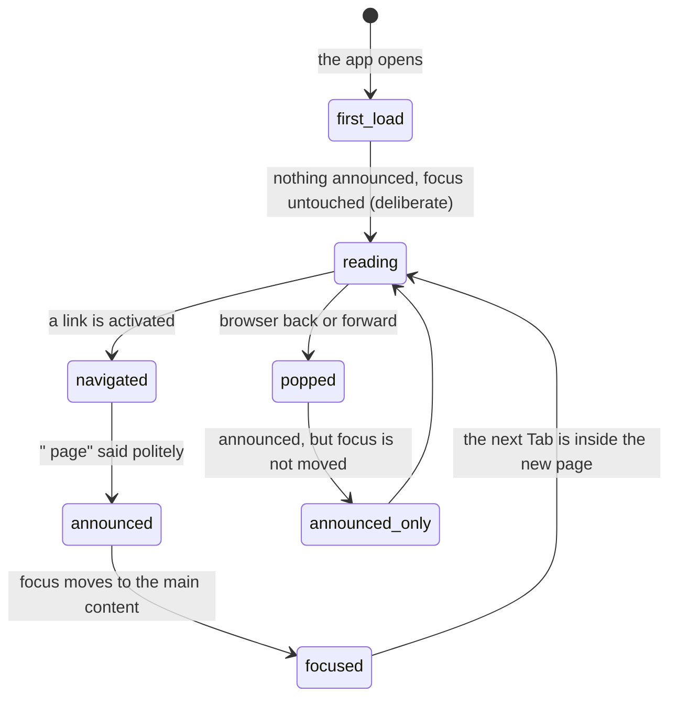

# Accessibility

## Summary

This document owns how 717rec behaves for somebody using a keyboard, a screen
reader, a reduced-motion setting, or a screen they cannot read at low contrast.
Every other document carries one "Accessibility" paragraph; this is the shared
behaviour behind them.

The picture is uneven and it is worth stating plainly at the top. **Structure is
good**: real labels, real buttons, a skip link, route announcements, focus moved
on navigation, and an accessibility scan that blocks merges. **Change is weaker**:
almost nothing that changes on its own is announced. A reduced-motion setting is
now honoured throughout, and the navigation menu now behaves properly for a
keyboard and a screen reader; both used to be gaps.

**Sections dropped.** This document drops the five named phases (**arrive**,
**leave without changing anything**, **begin editing**, **while editing**,
**submit**) and the **Modifiers** table. Accessibility is a property of every
interaction rather than one of its own, and its modifier axis — assistive
technology — is the subject of the whole document rather than a row in a table.
The state diagram, the full interrupt list, and the cross-cutting list are kept.

## The simple case

Somebody arrives with a keyboard. The first Tab reveals a "Skip to main content"
link that is invisible until it is focused. Tab again and they are in the top
bar. Every control has a visible focus ring: two pixels, offset from the control,
in the theme's ring colour.

They activate a navigation link. The page changes. A visually hidden live region
says "Schedule page", and focus moves to the page's main content area, so the
next Tab lands inside the new page rather than back at the top of the browser.
The page does **not** scroll to the top, so what is announced and what is on
screen can be two different things.

They open a dialog. Focus goes into it, Escape closes it, and focus returns.
Every dialog, dropdown, popover, and select in the app behaves this way, because
they all come from the same component library.

## Keyboard

**What works.** A skip link, first in tab order, jumping to the main content. A
visible focus ring on everything focusable. Every score button, filter, and menu
item reachable by Tab. Dialogs, dropdown menus, popovers, selects, and the bottom
drawer all trap focus, close on Escape, and restore focus afterwards.

**The one shortcut.** Cmd/Ctrl+K opens a command palette that jumps to seven
pages or to a team by name. It exists only on a screen 768 pixels or wider,
because the component that listens for the key is not rendered below that; see
[`on-a-phone.md`](on-a-phone.md). There are no other keyboard shortcuts anywhere.

**The hamburger menu is a disclosure, not a dialog.** It is a panel that expands
under the top bar and covers nothing, so it behaves the way a disclosure should:

- the button carries `aria-expanded` and names the panel it controls,
- focus moves to the first link when the panel opens,
- Escape closes it and returns focus to the button,
- and it closes on a route change.

Focus is deliberately **not** trapped. Tab walks through the panel and on into
the page, which is correct for a panel that does not cover the page. A focus trap
belongs to a modal.

## Screen readers

**Route changes are announced.** A hidden polite live region names the new page —
"Standings page", "Schedule page" — on every navigation. The very first page load
is deliberately silent so a screen reader is not interrupted mid-sentence.

**Focus follows, with one gap.** Focus moves to the main content on a normal
navigation. It is **not** moved on browser back or forward, deliberately, so the
browser can do its own restoration. The announcement still happens, so back and
forward announce a new page without moving the reader to it.

**Loading is announced.** Every spinner is a polite status region carrying its
own message: "Loading page...", "Loading match...", "Checking access...".

**Errors are announced.** The shared error bar announces itself assertively.
Toasts are announced by the component library.

**Nothing else is.** This is the pattern that matters most and it repeats in
every feature document:

- An empty state replacing a loading state is ordinary content. A page moving
  from "Loading teams" to "No teams" says nothing, so a reader cannot tell a
  slow list from an empty one.
- Data changing under the user is silent. The app shows stale numbers while it
  refetches, and the moment a number changes there is no announcement. See
  [`foundations/saving-and-freshness.md`](../foundations/saving-and-freshness.md).
- Anything arriving over a realtime channel is silent: a live score, a new
  message on the board, a new notification in the bell. The number or the list
  simply changes.
- A screen replacing itself is silent. The contact form becoming a success panel,
  a live match becoming read-only, a game-won banner appearing over the round
  input — a reader is moved to entirely new content with no signal.

**Structure.** 107 controls carry explicit labels and 14 pieces of text exist only
for screen readers. Decorative icons are hidden. Skeleton placeholders carry no
status role at all, so a page that shows a grey outline of its content while
loading is silent to a reader even though the same page's spinner would not be.

## Motion

The app animates a great deal: a fade on every route change, ten named keyframe
animations, entrance animations on empty states, headings and cards, a shimmer on
every skeleton placeholder, a spinning loader, a sliding toast, an expanding
menu, and — when the winter theme is on — two hundred continuously falling
snowflakes on the home page.

**A reduced-motion setting reaches all of them.** A user who has asked their
operating system to reduce motion gets a still app: no route fade, no entrance
animations, no sliding toast, no snowfall, and scrolling that jumps to its
destination rather than gliding.

**Spinners and skeletons keep moving, on purpose.** A spinner is how the user
knows the app is still working, and a skeleton pulses its opacity rather than
moving. Stopping either would take away information rather than motion.

> *Technical note:* three mechanisms are needed, because no one of them reaches
> everything. A stylesheet covers the CSS animations and transitions; a
> framer-motion setting covers the components that animate through inline
> styles; and a React hook covers what neither can — the snowfall, which is
> drawn on a canvas, and the scroll calls that choose their behaviour in code.

## Contrast and themes

There are three themes: light, dark, and a seasonal winter theme. One button in
the top bar cycles between whichever of them the league has enabled.

**The app defaults to dark and does not follow the operating system.** System
preference is switched off deliberately, so a device set to light mode opens
717rec in dark mode until somebody presses the toggle. The choice is then
remembered in the browser.

**A theme the league turns off is swapped for dark under the user**, silently, on
their next visit.

Nothing in the product responds to a high-contrast or forced-colours setting.

## The interaction, event by event

The interaction is one route change, from the point of view of somebody who
cannot see the screen.

Scroll position is not reset by any of this. The page announced, the element
focused, and the part of the page on screen can all disagree.

## Cancel and interrupt

| Event | Before the first edit | While editing or submitting |
| --- | --- | --- |
| Escape, or a Cancel button | Escape closes any dialog, menu, popover, or select and returns focus to whatever opened it. It closes the hamburger menu too, and returns focus to the hamburger button. | Escape closes the dialog and abandons what was in it. It does not abort a request already sent. |
| In-app navigation away, or switching tab within the page | The new page is announced and focus moves to its main content. Scroll position is not reset, so a sighted user and a reader are looking at different things. | Work is discarded with no warning and nothing is announced about the loss. |
| Browser back or forward | The new page is announced but **focus is not moved**, so the next Tab continues from wherever focus happened to be. | Same, and the discarded work is silent. |
| Reload, or the tab closed | The first load after a reload announces nothing and moves no focus, by design. The reader starts at the top of the document. | Nothing is announced about a write that may or may not have landed. |
| Network lost mid-request | Silent. Nothing announces going offline, because nothing detects it. | The failure toast is announced. It says the feature failed, never that the connection did. |
| The request fails or times out | A page that falls back to an empty state announces nothing. A page that shows the shared error bar announces it assertively. | One toast, announced once. A second failure replaces the first and the first is never heard. |
| The session expires | Silent. | The refused write's toast is announced with the feature's ordinary wording. Nothing says the session ended. |
| The same record changed in another tab, or by another user | Silent everywhere. On live scoring the score moves with no announcement; elsewhere nothing arrives at all. | Silent. |
| Browser autofill or a password manager writes into the form | A filled field reads correctly, because every field has a real label. The contact form's hidden bot trap is removed from tab order and hidden from readers, so it is never reached by keyboard or voice. | Same. Validation still does not run until submit. |
| The window loses focus | Nothing. | Returning refetches stale data and numbers change with no announcement — the single most common silent change in the product. |

After any interrupt, nothing is announced about what was lost. The app has one
live region for route names and nothing that reports state.

## What is tested, and what is not

An accessibility scan runs in continuous integration as a **required** check. It
uses axe against WCAG 2 level A and AA, with **no rules silenced** — the list of
exemptions is empty. It covers six public routes — home, teams, standings,
history, playoffs, help — and three tabs of the admin dashboard: timeslots,
scores, and teams. A Lighthouse run also blocks merges below an accessibility
score of 0.9.

Everything else is unscanned. That includes `/schedule`, a team's own page,
`/compare`, `/insights`, `/message-board`, `/my-team`, `/contact`, `/auth`,
`/setup-profile`, `/oauth/consent`, `/admin/notifications`, `/timeslots`, the
page-not-found screen, and **the whole of live scoring** — the one surface used
under pressure, on a phone, by two people at once.

## Interactions with other systems

**Permissions and roles.** A control a role may not use is absent rather than
disabled, so it is equally invisible to everyone. Being refused a guarded route
moves the user to another page with no announcement. See
[`permissions.md`](permissions.md).

**Season scoping.** No difference.

**Validation and error display.** Field errors are tied to their fields, so a
reader hears the message when it moves to the field. They appear only after a
failed submit, never as the user types.

**Unsaved changes.** No warning exists for anybody.

**Optimistic updates and rollback.** A value changing back is not announced.

**Realtime.** A live score arriving is not announced.

**Offline.** Not announced, not detected. See
[`errors-and-offline.md`](errors-and-offline.md).

**Toasts and notifications.** Announced, one at a time, and a replaced toast is
lost before it is finished.

**URL state.** Nothing about accessibility is in the URL and no preference
survives a link.

**On a phone.** Touch targets are set to 44 pixels only on live scoring and the
hamburger button. See [`on-a-phone.md`](on-a-phone.md).

**Accessibility.** This document is the definition.

**Side effects the user can notice.** None. No accessibility choice is recorded
or sent anywhere.

## Edge cases

- **Reduced motion stops spinners and skeletons short of stopping.** Everything
  else stills, but a spinner keeps turning and a skeleton keeps pulsing, because
  freezing them would remove the only sign that the app is working.
- **The app opens in dark mode on a device set to light**, because system
  preference is switched off.
- **Back and forward announce a page without moving focus to it.**
- **Skeleton placeholders are silent** while spinners are announced, so whether a
  reader is told the page is loading depends on which placeholder that page uses.
- **The hamburger menu does not trap focus.** That is deliberate: it is a
  disclosure that covers nothing, not a modal.
- **Nothing announces that a page finished loading and found nothing.**
- **The whole of live scoring is outside the accessibility scan.**
- **The scan's own comment points at a workflow file that does not exist.** The
  scan really runs inside the main build; the note in the test is stale.

## Open questions and verification

- Resolved: **reduced motion was effectively unimplemented.** Only the bracket
  viewer responded, and its stylesheet is lazily imported, so even that rule was
  not in the main bundle. It was treated as a bug
  ([B-22](../bug-triage.md#b-22-reduced-motion-is-honoured-in-one-stylesheet-and-ignored-everywhere-else)).
  Three mechanisms now cover it: a global stylesheet block, a framer-motion
  setting, and a hook for the canvas snowfall and the scroll calls.
- Resolved: **the hamburger menu's keyboard and screen-reader behaviour.** It was
  treated as a bug
  ([B-23](../bug-triage.md#b-23-the-mobile-menu-is-not-a-dialog)). It is fixed as
  a *disclosure* rather than the dialog that entry proposed: the panel expands in
  place and covers nothing, so `aria-expanded` with `aria-controls` is the right
  pattern and a focus trap is not. Still read from the component rather than
  tried with a reader.
- **The command palette shortcut contradicts a foundation.**
  [`foundations/navigation.md`](../foundations/navigation.md) says no global
  keyboard shortcut exists. Cmd/Ctrl+K does, on any screen 768 pixels or wider,
  and it suppresses the browser's own use of that key. The foundation is the
  document that needs the correction.
- Not confirmed by hand: whether toasts are actually announced, and whether a
  replaced toast is re-announced or silently swapped.
- Not confirmed by hand: whether the route announcement is heard in practice, or
  arrives too early because the page is still loading.
- Not confirmed by hand: whether every page has exactly one first-level heading.
  The page shell was corrected once to avoid two main landmarks; headings were
  not audited.
- Not confirmed by hand: contrast ratios in any of the three themes. The
  Lighthouse floor of 0.9 leaves room for contrast failures on unscanned pages.
- Not confirmed by hand: whether the reduced-motion behaviour is right in every
  case by eye. The snowfall and the page transitions were checked; the ~155 files
  that animate were not each looked at.
- Assumption: the component library's dialogs, menus, and selects behave
  accessibly out of the box. They are used unmodified, but none was tested with a
  reader.

Verified against `717rec` commit `ea5c8f4`, except the reduced-motion and
hamburger-menu behaviour above, both changed after that commit — see
[B-22](../bug-triage.md#b-22-reduced-motion-is-honoured-in-one-stylesheet-and-ignored-everywhere-else)
and [B-23](../bug-triage.md#b-23-the-mobile-menu-is-not-a-dialog).
