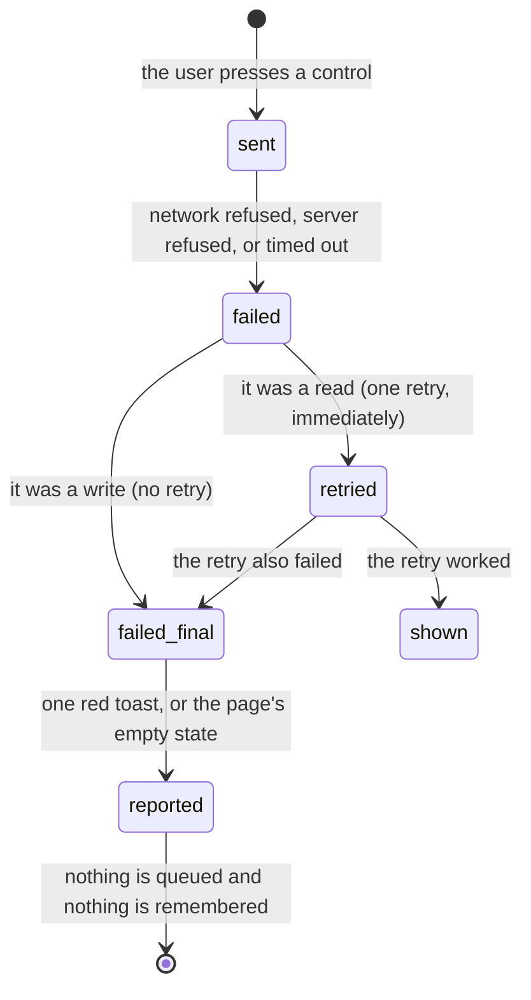

# Errors and offline

## Summary

This document owns what a user actually sees when something goes wrong: a read
that fails, a write that is refused, a page that will not render, and a
connection that drops. [`foundations/messages-to-the-user.md`](../foundations/messages-to-the-user.md)
owns the shapes a message can take and
[`foundations/saving-and-freshness.md`](../foundations/saving-and-freshness.md)
owns caching and the absence of an offline queue. **This document does not
restate either.** It says which failure produces which of those shapes, and where
the shape is the wrong one.

The one-line version: **717rec has good machinery for reporting failure and uses
almost none of it.** Errors carry codes, categories, and specific server
messages, and nearly every one of them is thrown away in favour of a fixed
sentence per feature.

**Sections dropped.** This document drops the five named phases (**arrive**,
**leave without changing anything**, **begin editing**, **while editing**,
**submit**). A failure is not a form and has no editing phase. In their place is
the life of one failing request, with the same state diagram the template asks
for. Modifiers and the full interrupt list are kept.

## The simple case

A player taps a control. The control goes dead. A second later a red panel slides
in at the edge of the screen: a bold word, then a sentence telling them to try
again. The control comes back and nothing on the page has changed.

They try again on a train, out of signal. The same thing happens, in the same
words — but a bar under the header now says they are offline, so the failure has
a reason on screen. Nothing was saved for later.

They open a page whose code has not downloaded yet. Instead of a spinner that
never ends, they get a short screen saying the page did not download and that it
will open on its own when the signal is back. It does: the moment the connection
returns the app loads the page again with nothing pressed.

## The four things that can fail

**A read fails.** The page's own business. Most pages fall back to their empty
state, some show a red bar with a Try again button, and some raise a toast. What
each page does is in each page's document. A failed read is retried **once** and
then abandoned.

**A write fails.** Always reported, because every service throws rather than
returning a quiet empty result. The report is a red toast worded for the feature
— "Failed to submit score. Please try again." — and never for the reason. Writes
are not retried at all.

**The page itself fails to render.** Replaced by the route error screen, with Try
Again, Go Back, and Home. See
[`foundations/navigation.md`](../foundations/navigation.md#when-a-page-fails).

**The app fails to start.** A dark screen reading "App configuration missing",
naming two environment variables and telling the reader to re-publish. This is a
developer's message shown to whoever loads a broken build, and it is the only
screen in the product with no navigation on it at all.

## The life of one failing request

**What is sent.** Nothing is cancelled once sent. Leaving the page, pressing
Escape, or navigating away does not abort a request, so a write already on its
way still lands.

**What comes back.** The server's reason — refused by permissions, rate-limited,
invalid, duplicated — reaches the browser and is then replaced by the feature's
own sentence. The error object keeps the code and the hint; nothing shows them.

**What is reported.** One toast per failure. Up to three are on screen at once,
so an operation that fails three times in a row shows all three; a fourth pushes
the oldest out. A bulk action that reports per item still shows one line about
one item.

**What is remembered.** Nothing. There is no queue, no retry button on the toast,
and no record that the attempt happened.

## Retrying, and where it differs

- **Ordinary reads retry once.** No backoff, no second chance.
- **Writes never retry.** A failed write is a failed write.
- **The two timeslot reads are different**: they retry **twice** with growing
  delays, and they are the only reads in the product that ask the browser
  whether it is online before polling again. Four things in the app poll on a
  timer; the list is in
  [`foundations/saving-and-freshness.md`](../foundations/saving-and-freshness.md).
- **A realtime channel reconnects by itself**, waiting one second, then two,
  then four, up to thirty, with a little randomness so several phones at the same
  match do not all retry together. Every reconnection refetches rather than
  assuming nothing was missed.
- **A page's code does not retry, but it does recover.** A failed download is
  final for the life of the page: the browser caches the failure and re-throws
  it on every later attempt, so there is nothing to retry in place. Instead the
  app loads the document again as soon as the connection returns, which is the
  only thing that clears that cache.

## Offline

**A bar under the header says so**, on every page, within a moment of the
connection dropping, and it says the opposite for a few seconds when the
connection comes back. It sits in normal flow rather than pinned, because the
site header is already pinned and a second pinned bar would slide underneath it.

That is the whole of what the app knows. There is still no badge, no
disabled-while-offline control, and no check before a form is opened.

What actually happens: data already fetched stays on screen and looks current;
pages already fetched still navigate; **a page whose code has not been fetched
shows a short "this page did not download" screen and opens itself on
reconnect**; the signed-in session lives in the browser, so every signed-in
control is still drawn; and every request fails. Apart from the bar, the user
still finds out by pressing something.

The bar reads the browser's own answer, which is optimistic: it reports a
connection whenever a network interface is up, so a captive portal or a dead
uplink still counts as online. It is reliable for "definitely offline" and not
for "definitely working", which is why nothing is blocked on it.

There is **no offline write queue anywhere in the product**. A round entered at a
venue with no signal is lost, not queued. A long message typed offline is lost on
submit. See
[`foundations/saving-and-freshness.md`](../foundations/saving-and-freshness.md).

The app is installable as a home-screen app through a third-party service, which
caches the shell. That makes an offline visit *open* rather than fail, which is
arguably worse: the app looks alive and nothing works.

> **Technical note:** the app used to carry a helper that turned a failure whose
> message mentioned the network into "Network error. Please check your connection
> and try again." No feature imported it, so that sentence was never shown to
> anyone. The helper and the hook behind it have since been **deleted** as part of
> [B-12](../bug-triage.md#b-12-failure-messages-discard-the-reason-the-server-gave),
> whose sanitiser supersedes them. See also
> [B-31](../bug-triage.md#b-31-two-dead-features-are-visible-in-the-interface).

## Modifiers

| Modifier | Set at arrival | Changed while editing |
| --- | --- | --- |
| The user's role | No effect on how failure is reported. A refused-by-permission write produces the same generic toast as a broken connection. | No effect. |
| The record's state | No effect. A stale or already-changed record fails the same way as any other. | No effect. |
| The season's state | No effect. No error message anywhere mentions a season. | No effect. |
| Viewport | On a narrow screen the toast is full width at the **top**; from 640 pixels up it is bottom right and at most 420 pixels wide. | Re-flows on rotation. |
| Keys the app honours | A toast can be dismissed from the keyboard. The route error screen's three buttons are reachable by Tab. | No shortcuts. |

A development build shows the underlying error message on both error screens; the
published build does not. A developer and a player therefore report different
things about the same failure.

## Cancel and interrupt

| Event | Before the first edit | While editing or submitting |
| --- | --- | --- |
| Escape, or a Cancel button | Dismisses a toast that is focused. There is no global Escape handler. | **Does not abort anything.** No request in the app can be cancelled once sent. Escape closes the dialog and the write still lands. |
| In-app navigation away, or switching tab within the page | A visible toast survives and stays on the next page. | The request finishes unseen. Its failure toast appears over whatever page the user is now on, with no clue which page it came from. |
| Browser back or forward | Same as navigating away; the app cannot intercept it. | Same. Coming back gives a freshly mounted page with no memory of the failure. |
| Reload, or the tab closed | Every toast is lost and every page refetches from nothing. | The request may still have landed. Nothing tells the user whether it did, so a retry after a reload can duplicate the write. |
| Network lost mid-request | Nothing is in flight, so nothing fails yet. Cached data keeps showing and looks current. | The request fails at once. The message is the feature's ordinary sentence, never a statement about the network. Nothing is queued. |
| The request fails or times out | A read is retried once, then the page falls back to its own empty or error state. | One red toast. Any optimistic display rolls back. The specific reason is discarded. |
| The session expires | Public reads keep working, so the app looks healthy. | Writes fail with the feature's generic message. No message mentions the session, so an expired session looks exactly like a bug. |
| The same record changed in another tab, or by another user | Outside live scoring the change does not arrive; the user keeps the old value. | Two people writing the same record outside live scoring overwrite each other with no conflict, no warning, and no error. |
| Browser autofill or a password manager writes into the form | No effect on error handling. | No effect. A value written by a tool fails validation exactly as a typed one would. |
| The window loses focus | Nothing. | The request continues. Returning to the tab refetches stale data, so a value can correct itself silently just after a failure the user is still reading about. |

After any interrupt, what the database accepted is what happened. The app never
reconciles the screen with a write whose answer it never saw.

## Interactions with other systems

**Permissions and roles.** A refused write and a broken connection produce the
same message. See [`permissions.md`](permissions.md).

**Season scoping.** No failure message is season-specific.

**Validation and error display.** Field rules run in the browser and appear under
the field. Server refusals never appear under a field; they become toasts.

**Unsaved changes.** Nothing anywhere protects them, so a failed submit is the
moment a user discovers there is no draft.

**Optimistic updates and rollback.** A rollback is announced only by the failure
toast; the value changing back carries no other mark.

**Realtime.** A dropped channel rebuilds itself with growing delays and refetches
on every reconnection, and several screens hold one. **Only live scoring shows
the connection's state**; everywhere else a channel can be down for half a minute
with nothing on screen to say so.

**Offline.** Defined here. No queue, no detection, no warning.

**Toasts and notifications.** Up to three at a time, about five seconds each,
surviving navigation. See
[`foundations/messages-to-the-user.md`](../foundations/messages-to-the-user.md).

**URL state.** No error state is in the URL, so a failure cannot be linked to,
bookmarked, or reproduced from an address.

**On a phone.** A phone is where failures happen most and where they are least
visible; see [`on-a-phone.md`](on-a-phone.md).

**Accessibility.** Toasts are announced. The shared red error bar announces
itself assertively. A page moving from loading to empty announces nothing, so a
screen reader user cannot tell a failed read from a genuinely empty list. See
[`accessibility.md`](accessibility.md).

**Side effects the user can notice.** Every failed read and every failed write is
counted for the league's monitoring, and errors that are not plain network
failures are reported with a stack trace. See
[`what-the-league-sees.md`](what-the-league-sees.md).

## Edge cases

- **A page whose code does not download says so and waits.** It cannot be
  retried in place — the browser caches the failed download — so recovery is the
  document loading again, which happens by itself on reconnect or on Try again.
- **A failed read and an empty list look identical** on any page that falls back
  to its empty state. The empty state is a positive claim and is sometimes false.
- **A rate-limited or over-length contact message is told to try again**, which
  cannot work. See
  [`../help/contact-the-league.md`](../help/contact-the-league.md).
- **A retry after a lost response duplicates the write.** Nothing deduplicates
  except the contact form's ticket store and the score report's own check.
- **The standings page prints the raw error message** under its "There was an
  error loading the statistics data" alert, which means database wording reaches
  the user on that one page and nowhere else.
- **Two writes failing together show both toasts**, stacked. Four in quick
  succession still lose the oldest.
- **The route error screen's Home button is a full page load**, so it discards
  everything including a toast the user had not finished reading.
- **An offline user can fill in a long form** and lose all of it at submit.
- **A brief realtime drop is invisible**, because reconnecting refetches. A long
  one shows the connection state changing on live scoring and nothing anywhere
  else, even on the several other screens that hold a channel.

## Open questions and verification

- Resolved: **the network-error message existed and was never used** — the one
  place the app could say "check your connection" was dead code. The helper and
  the hook behind it were **deleted** as part of
  [B-12](../bug-triage.md#b-12-failure-messages-discard-the-reason-the-server-gave),
  whose sanitiser supersedes them. See also
  [B-31](../bug-triage.md#b-31-two-dead-features-are-visible-in-the-interface).
- Resolved: **a visible offline indicator was wanted, and exists.** The bar
  under the header is the answer to what used to be an open product question
  here, from UX audit X-12. What still has no offline treatment is every
  individual control: nothing is disabled and no form warns before it is filled
  in.
- Not confirmed by hand: what each page shows when its first read fails. This
  needs one checklist item per page and is the largest gap in this document.
- Not confirmed by hand: whether the installed home-screen app opens offline at
  all, and what it shows if it does.
- Resolved: **a failed page download did not recover on its own, and now does.**
  It never could by re-rendering: the browser caches the failure for the life of
  the document. The app loads the document again on reconnect instead. What is
  still not confirmed by hand is whether the installed home-screen app's cached
  shell answers that reload while the signal is only partly back.
- Not confirmed by hand: whether "Try Again" on the route error screen recovers
  or re-throws immediately.
- Assumption: the toast stays about five seconds. That is the component library's
  default and no override was found.

Verified against `717rec` commit `ea5c8f4`.
