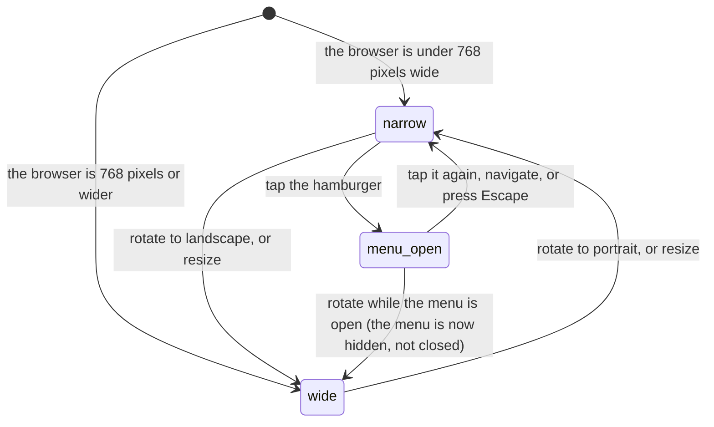

# On a phone

## Summary

This document owns what changes when 717rec is opened on a small screen in a
mobile browser. Every other document assumes a desktop browser and carries one
"On a phone" paragraph; this is where the shared behaviour behind those
paragraphs is written down once.

Most of the app does not change. Layouts re-flow, a few tables become card lists,
and two pieces of navigation swap places. **One surface is designed the other way
round** — live scoring is built for a phone first and merely tolerated on a
desktop — and it has its own six documents starting at
[`../live-scoring/start-a-live-match.md`](../live-scoring/start-a-live-match.md).

The **native app shell is out of scope**, as the README says. This is mobile web,
including the app installed to a home screen.

**Sections dropped.** This document drops the five named phases (**arrive**,
**leave without changing anything**, **begin editing**, **while editing**,
**submit**) and the **Modifiers** table. The viewport is not an interaction; it
is the modifier axis of every other document, so a modifier table here would have
one row and say nothing. The interrupt list is kept in full, because a phone
interrupts differently from a desktop and that is the most useful part of this
document.

## The simple case

A player opens the app on a phone. The top bar keeps the league's name and the
user menu, the notification bell, and the theme button, and folds every link
behind a hamburger. A tab bar appears fixed at the bottom of the screen with four
tabs: Standings, Schedule, Teams, Playoffs. The page above it is padded so the
tab bar never covers its last line.

They tap Teams. The teams list arrives grouped by division rather than in one
long list, because that is the default on a small screen and not on a large one.
They open a team, read it, and press back — and land exactly where they were,
because `/teams` is the one route in the app that restores scroll position.

They tap a control that fails. A red panel appears across the **top** of the
screen, not the bottom.

## What changes at 768 pixels

The app has exactly one JavaScript breakpoint: **768 pixels wide**. Below it, the
app calls itself mobile. Above it, desktop. The stylesheet has more breakpoints —
480, 640, 768, 1024, 1280, 1536 — but only 768 changes what is on the screen.

| Below 768 | From 768 up |
| --- | --- |
| Every navigation link is behind a hamburger button in the top bar | The links sit across the top bar |
| A fixed tab bar at the bottom of the screen, four tabs: Standings, Schedule, Teams, Playoffs | No bottom bar. A second nav row under the header with Standings, Schedule, Teams |
| No search | A Search button, and **Cmd/Ctrl+K** opens a command palette that jumps to seven pages or any of the first ten teams |
| Pages get five extra lines of bottom padding, plus the phone's own safe area, so the tab bar clears the content | Ordinary page padding |
| Toasts fill the width at the top of the screen | Toasts are at most 420 pixels wide, bottom right |
| The teams list defaults to grouped by division | The teams list defaults to one list |
| Several stats and standings tables render as stacked cards | The same data as a table |
| One dialog — playoff team divisions — opens as a bottom drawer | It opens as a centred dialog |

Everything else is the same content at a different width. Wide tables sit in
their own box and scroll sideways inside it rather than stretching the page; the
page itself never scrolls sideways.

The command palette is worth naming plainly: **the app's only keyboard shortcut
exists only on a screen wider than 768 pixels**, because the component that
listens for it is not rendered below that.

## Crossing the line while using the app

The breakpoint is watched live, not read once. Rotating a large phone into
landscape can push it past 768 pixels, and when that happens the bottom tab bar
disappears and the desktop nav row appears **while the user is looking at the
page**. Nothing is lost — no page state is tied to the breakpoint — but the
controls move under the thumb.

Rotating back does the reverse. The hamburger menu, if open, closes on the next
route change but not on rotation, so it can be left open in a layout that no
longer shows it.

## The one screen built for a phone

Live scoring is the exception to everything above. It is a single narrow column
of large controls with generous padding at the bottom for a thumb, and on a wide
screen it stays a narrow column in the middle rather than spreading out. Every
control on it is at least 44 pixels tall. It is also the only screen that keeps
an open connection to the league, so two phones scoring the same match stay in
step. Its six documents start at
[`../live-scoring/start-a-live-match.md`](../live-scoring/start-a-live-match.md).

## Touch and reach

- The hamburger button is 44 by 44 pixels. Every control on the live scoring
  screen is at least 44 pixels tall. Elsewhere, control size is whatever the
  component library gives, which is smaller.
- The phone's safe areas are honoured in four places: the top bar, the bottom tab
  bar, the padding under every page, and the playoffs page's own bottom bar. A
  notch or a home indicator does not sit over them.
- The bottom tab bar reaches four of the app's twenty routes. Everything else —
  the message board, my team, history, insights, compare, help, contact, admin —
  is reachable only from the hamburger or the user menu.
- The message board puts its list in a fixed-height scrolling box sized from the
  viewport, so the page has a scroller inside a scroller. On a phone the outer
  page barely moves and the inner list does the scrolling.

## Cancel and interrupt

| Event | Before the first edit | While editing or submitting |
| --- | --- | --- |
| Escape, or a Cancel button | A phone keyboard has no Escape, so on a phone nothing can be cancelled by key; only by tapping a Cancel or Close control. **The hamburger menu has no close-by-tapping-away** — it closes on a route change or by pressing the button again. It does close on Escape, which reaches it from an attached keyboard but not from a touch keyboard. | Same. A dialog's Cancel button works; there is no key that reaches it. |
| In-app navigation away, or switching tab within the page | The new page loads. **Scroll position is not reset**, which on a phone means arriving at the bottom of a short page looking at blank screen. Only `/teams` restores rather than resets. | Everything typed is lost with no warning, exactly as on a desktop. |
| Browser back or forward | The gesture-based back swipe is the browser's, and the app cannot intercept it. It behaves as an in-app navigation. | Same. On a phone this is the most likely way work is lost, because the swipe is easy to trigger by accident. |
| Reload, or the tab closed | Everything in memory is lost and every page refetches. A mobile browser closing a background tab to save memory looks identical to a reload when the user comes back. | A sent write still lands. An unsent one is gone. |
| Network lost mid-request | Nothing to lose. Cached data stays on screen and looks current, which on a phone at a venue is the common case. | The request fails and is lost. **Nothing is queued.** This matters most during live scoring, which is the one thing done on a phone at a place with poor signal. |
| The request fails or times out | A read retries once, then falls back to the page's own state. | One red toast across the top of the screen, covering the top bar while it is there. |
| The session expires | Public pages keep working. | Writes fail. A phone left in a pocket for hours is the most likely place for a session to lapse, and nothing says so. |
| The same record changed in another tab, or by another user | The screens that hold a realtime channel find out; standings, records, and the schedule do not. Two phones at the same live match stay in step, which is the design. | Same. Two phones editing anything without a channel overwrite each other silently. |
| Browser autofill or a password manager writes into the form | Mobile keyboards and password managers fill fields the same way as on a desktop, including the contact form's hidden bot trap. | Same. |
| The window loses focus | Switching apps suspends the tab. Coming back refetches anything past its fresh window, so numbers change as the app is re-opened — far more visible on a phone than on a desktop, because backgrounding is constant. | The request continues while the app is in the background if the browser allows it, and its toast is waiting when the user returns. |

After any interrupt the user is wherever the browser put them, on the page the
browser chose, scrolled wherever they were before.

## Interactions with other systems

**Permissions and roles.** Identical on every screen size. The route into `/admin`
is the user menu, which on a phone sits beside the hamburger. See
[`permissions.md`](permissions.md).

**Season scoping.** No difference.

**Validation and error display.** Field errors appear under fields as they do on
a desktop. Long forms stack rather than sitting side by side.

**Unsaved changes.** Unprotected, and more exposed: a back swipe, an incoming
call, or the browser reclaiming a background tab all discard typed work with no
warning.

**Optimistic updates and rollback.** No difference.

**Realtime.** Channels drop and rebuild far more often on a phone, because
backgrounding an app closes them. Each reconnection refetches, so a short drop is
invisible; only live scoring shows the connection's state while it is down.

**Offline.** No difference in behaviour, and much more likely to happen. See
[`errors-and-offline.md`](errors-and-offline.md).

**Toasts and notifications.** On a narrow screen a toast is full width at the top
of the screen. It covers the top bar and the page heading while it is there, not
the submit button at the bottom.

**URL state.** Nothing extra is in the URL on a phone. Sharing a page from a
phone shares the page, not the filter or the tab that was open.

**On a phone.** This document is the definition.

**Accessibility.** Touch target sizes are set deliberately only on live scoring
and the hamburger. See [`accessibility.md`](accessibility.md).

**Side effects the user can notice.** Every pageview is recorded with a coarse
device class — iOS, Android, other mobile, or desktop — so the league can see how
much of its traffic is phones. Nothing more precise is stored. See
[`what-the-league-sees.md`](what-the-league-sees.md).

## Edge cases

- **The message board's "Sign in to post messages" bar sits at the very bottom of
  the screen, underneath the fixed tab bar**, because it positions itself against
  a spacing value that is never defined anywhere in the app. A signed-out visitor
  on a phone probably cannot see or tap it. **May be worth treating as a bug
  rather than documenting.**
- **No route resets scroll position**, which is felt hardest on a phone: a long
  schedule followed by a short page leaves a blank screen.
- **A large phone in landscape is a desktop** as far as the app is concerned, so
  the bottom tab bar vanishes at an angle rather than at a device.
- **The command palette's keyboard shortcut is unreachable on a phone**, which is
  harmless, but so is the Search button — there is no search anywhere below 768
  pixels.
- **Only one dialog in the app becomes a drawer.** Every other dialog is a
  centred modal on a phone, including the live scoring confirmations.
- **The teams page remembers its scroll position and nothing else does.**
- **A backgrounded tab that the browser discards** returns as a cold load: the
  cache is gone, every page refetches, and any unsaved work is gone with it.
- **Winter theme adds two hundred animated snowflakes** to the home page, which
  is a battery and motion cost paid on a phone as well as a desktop — unless the
  phone asks for reduced motion, which now switches them off. See
  [`accessibility.md`](accessibility.md).

## Open questions and verification

- **The sign-in bar on the message board is very likely hidden behind the bottom
  tab bar on a phone.** Read from the positioning value and the absence of the
  variable it depends on; not seen on a device.
- **Toasts appear at the top on a narrow screen, not the bottom.**
  [`foundations/messages-to-the-user.md`](../foundations/messages-to-the-user.md)
  says a toast could cover a submit button at the bottom of a small screen. It
  cannot: below 640 pixels the toast is pinned to the top and covers the header
  instead. The foundation is the document that needs the correction.
- Not confirmed by hand: whether the layout swap at 768 pixels is smooth when a
  phone is rotated, or whether it flashes.
- Not confirmed by hand: which stats and standings tables become cards and which
  stay tables. Several components branch on the breakpoint; the list was not
  enumerated.
- Not confirmed by hand: whether any page scrolls sideways on a narrow screen.
  The app shell and every table wrapper prevent it, but no page was measured.
- Not confirmed by hand: how the app behaves when installed to a home screen and
  opened with no connection.
- Not confirmed by hand: whether touch targets outside live scoring meet the
  44-pixel guideline. Only live scoring, the hamburger, and the bracket admin
  menu and its seeding drag handle set it explicitly.
- Assumption: nothing in the product reads device orientation directly. Only the
  width is watched.

Verified against `717rec` commit `ea5c8f4`, except the reduced-motion,
hamburger-menu, and bracket admin behaviour above, all changed after that
commit — see
[B-22](../bug-triage.md#b-22-reduced-motion-is-honoured-in-one-stylesheet-and-ignored-everywhere-else),
[B-23](../bug-triage.md#b-23-the-mobile-menu-is-not-a-dialog)
and [B-24](../bug-triage.md#b-24-bracket-administration-is-unreachable-on-a-phone).
