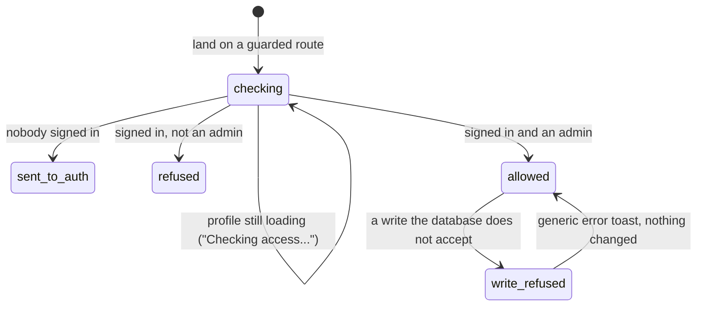

# Permissions

## Summary

Three roles use 717rec — visitor, player, admin — plus one thing that behaves
like a fourth: an **approved membership** of a team.
[`foundations/accounts-and-roles.md`](../foundations/accounts-and-roles.md) owns
what those are, how they are granted, and how the three guarded routes work.
**This document does not restate any of it.** It answers a different question:
feature by feature, who may do the thing, and what the rest of us see instead.

Two facts run through every row below. **Nearly everything in 717rec is readable
by anyone**, so roles decide writes, not reads. And **hiding a control and the
database refusing the write are two independent mechanisms** — they are written
in different places by different means, and this document names each place they
disagree.

**Sections dropped.** This document drops **Modifiers**. The user's role is the
axis of the entire document and the feature table below is that table in a more
useful shape; a second one would say the same thing twice. Everything else is
kept, including the full interrupt list, because being refused *is* an
interaction: it has an arrival, a failure, and interrupts of its own.

## The simple case

A player opens the app. Every page they can reach as a visitor is still there and
still reads the same. Their own team's page now has an Edit button. The home page
shows a card for any match still missing a score. If they have an approved
membership, a match their team is playing offers to be scored live.

They open `/admin` out of curiosity. A spinner says "Checking access..." for a
moment, a red toast says "Access Denied — You do not have admin privileges", and
they are put back on the home page. Nothing else in the app changes.

That toast is the *only* place in 717rec where a refusal is stated in words.
Everywhere else, a thing they may not do is simply not on the screen.

## What each role can do

"Member" means a player with an **approved** membership of the team in question.
An unapproved membership grants nothing and is not a column.

| Feature | Visitor | Player | Member | Admin |
| --- | --- | --- | --- | --- |
| Read teams, schedule, standings, stats, insights, compare, playoffs, history, help | yes | yes | yes | yes |
| See hidden and opted-out teams in listings | no | no | no | yes |
| Watch a match being scored live | yes | yes | yes | yes |
| Read the message board | **no — see below** | yes | yes | yes |
| Post to the message board | no | yes | yes | yes |
| Edit or delete a message | no | own only | own only | **own only** |
| Post an Announcement-category message | no | no | no | yes |
| React to a message or a match | no | yes | yes | yes |
| Report a score from the home page card | **yes** | yes | yes | yes |
| Approve or reject a score report | no | no | no | yes |
| Score a live match round by round | no | no | yes, own team's open matches | yes, any open match |
| Undo a round, reopen a game | no | no | yes | yes |
| Add a player to a roster during setup | no | no | yes | yes |
| Finalise a live match | no | no | yes | yes |
| Reopen a completed match | no | no | **no** | yes |
| Request to join a team, or leave a team | no | yes | yes | yes |
| Approve a membership request | no | no | no | yes |
| Edit the team's name and image | no | no | yes | yes |
| Create, edit, or delete a match | no | no | no | yes |
| Build the schedule, define timeslots | no | no | no | yes |
| Set a team's timeslot preferences | no | no | **no** | yes |
| Create, activate, or archive a season | no | no | no | yes |
| Change divisions, weights, or seeds | no | no | no | yes |
| Sign up for the blind draw | **yes** | yes | yes | yes |
| See the blind draw signup list | no | no | no | yes |
| Create or edit a playoff bracket | no | no | no | yes |
| Send the contact form | yes | yes | yes | yes |
| Read the contact inbox | no | no | no | yes |
| Open the notification bell and read notifications | yes | yes | yes | yes |
| Post a notification | no | no | no | yes |
| Change themes, hero cards, and help content | no | no | no | yes |
| Reach `/admin`, `/admin/notifications`, `/timeslots` | no | no | no | yes |

Three rows in that table are worth more than a cell.

**Reading the message board.** The board's own page renders for a visitor, but
the messages themselves do not arrive: reading them requires a session. The board
therefore shows "No Messages Yet — Be the first to start a conversation!" to
anybody signed out, which is not true and does not mention signing in. A separate
bar at the bottom of the screen does say "Sign in to post messages". **May be
worth treating as a bug rather than documenting.**

**Reporting a score.** The home page shows a Pending Scores card whenever any
match is missing a result, and it shows it to everyone, signed in or not. Anyone
can open it and report a score for any match. A signed-in reporter has their
typed name and team quietly replaced by their profile name and their approved
team, and the report is marked as verified; a signed-out reporter's typed name is
kept as typed and the report is marked unverified. Nothing on the form explains
either behaviour.

**Signing up for the blind draw.** Anyone can add a name. Nobody but an admin can
read the list back — not even the person who just signed up. A player who signs
up twice gets two entries and no way to see or remove either.

## The four shapes a refusal takes

Refusals in 717rec do not look alike. There are four shapes, and only one of them
tells the user anything.

**1. The control is absent.** By far the most common. The Edit button, the score
grids, the admin tab, the delete icon — none of them is greyed out, they are
simply not drawn. A user cannot tell "not allowed" from "does not exist". The
season's confirmation controls behave the same way for a different reason; see
[`foundations/seasons.md`](../foundations/seasons.md).

**2. The route turns the user away.** Only `/admin`, `/admin/notifications`, and
`/timeslots` do this, and only these produce words: a spinner, then either a
redirect to `/auth` (signed out) or the "Access Denied" toast and a redirect home
(signed in, not admin). See
[`foundations/accounts-and-roles.md`](../foundations/accounts-and-roles.md#how-pages-are-gated).

**3. The control is there and the write fails.** This happens when the browser
believes a user may do something and the database does not. It is reported as
that feature's ordinary error toast — "Failed to save round. Please try again." —
with no hint that permission was the reason; the database's own message is
discarded. See
[`foundations/messages-to-the-user.md`](../foundations/messages-to-the-user.md).

**4. The rows are simply missing.** Where a read is refused, no error is raised:
the query returns nothing and the page shows its ordinary empty state. The
message board signed out is the clearest case. This shape is the most misleading
of the four, because an empty state is a positive claim about the world.

## The interaction, event by event

The interaction here is arriving somewhere that is guarded, and then trying to
write something.

### Arrive

On a guarded route the page does not render until the session **and** the profile
have both settled. Until then the screen is a spinner and the words "Checking
access...". On an in-app navigation this is usually instant, because the profile
is already loaded. On a cold load or a reload it is a real wait.

On every other route nothing is checked at all. The page renders, and the
controls inside it decide for themselves what to draw. Admin controls appear the
instant the profile does and never flicker, because admin is read from the loaded
profile rather than asked for separately.

### Leave without changing anything

Nothing is recorded by being refused. There is no audit of attempted access a
user could later see, and no limit on trying again.

### Begin editing

Not applicable. Permission is not something the user edits.

### While editing

A role can change under a user mid-session: an admin flag granted or revoked, a
membership approved or withdrawn. **Nothing tells the browser.** No subscription
watches profiles or memberships, so the controls on screen stay exactly as they
were until something causes a refetch. In between, the browser and the database
have different opinions and the database wins.

### Submit

A refused write behaves like any other failed write. The service throws, the
feature's error toast appears, and nothing changes. Because services always throw
— see
[`foundations/saving-and-freshness.md`](../foundations/saving-and-freshness.md) —
a refused write that produces **no** message at all is a defect, not a silent
refusal by design.

## Cancel and interrupt

| Event | Before the first edit | While editing or submitting |
| --- | --- | --- |
| Escape, or a Cancel button | No effect. The guard has no dialog and its redirect cannot be cancelled. | Escape closes a confirmation dialog in front of a privileged action and abandons it. It does not abort a refused write already sent. |
| In-app navigation away, or switching tab within the page | Leaving a guarded route while it still says "Checking access..." simply unmounts it. No redirect happens and no toast appears. | The write completes or is refused regardless. The refusal toast appears on whatever page the user is now on. |
| Browser back or forward | The redirect replaces the guarded route in history, so pressing Back after being bounced from `/admin` goes to whatever was before it, not back to `/admin`. | As navigating away. Coming back gives a freshly mounted page that runs the whole check again. |
| Reload, or the tab closed | The check restarts from nothing: session, then profile, then decide. The "Checking access..." spinner is much longer than on an in-app navigation. | A sent write still lands or is still refused. The user never learns which. |
| Network lost mid-request | The profile fetch fails. The user is treated as **not** an admin and is turned away with "Access Denied", even if they are one. On a reload this happens with no other message at all. **May be worth treating as a bug rather than documenting.** | Every write fails. The message is the feature's network-flavoured or generic error, never a statement about permission. |
| The request fails or times out | Same as above: a failed profile read demotes the user for as long as the failure lasts. | The write fails with that feature's generic message. Nothing distinguishes "you may not" from "it did not work". |
| The session expires | Reads of public data still work, so the app keeps looking normal. The three guarded routes redirect to `/auth` on the next visit. | Writes fail. There is no message about the session, so an expired session and a permission refusal are indistinguishable to the user. |
| The same record changed in another tab, or by another user | An admin flag or a membership changed elsewhere does not reach this browser. Controls stay as they were. | Same. A scorer whose membership is revoked mid-match keeps the score grids and finds out at the next save. |
| Browser autofill or a password manager writes into the form | No effect. Nothing about permission is held in a form field. | No effect. |
| The window loses focus | No effect. | Returning to the tab refetches data past its fresh window, which is the usual way a stale role finally corrects itself — with no message and no explanation. |

After any interrupt, what the database accepted is what happened. The app never
re-checks a write it did not see the answer to.

## Interactions with other systems

**Permissions and roles.** This document is the feature-by-feature definition;
[`foundations/accounts-and-roles.md`](../foundations/accounts-and-roles.md) is
the role model.

**Season scoping.** Permissions are not season-scoped. A membership approved in
one season stays approved into the next, and an admin is an admin across every
season including archived ones.

**Validation and error display.** A refusal is never field validation. It arrives
as a toast, or as absence.

**Unsaved changes.** Losing a role mid-edit does not warn, block, or save. The
work is lost at the next failed submit.

**Optimistic updates and rollback.** A refused optimistic write rolls the display
back and raises the feature's error toast. The value changing back is the only
other sign.

**Realtime.** Nothing watches roles or memberships, so a permission change never
arrives on its own.

**Offline.** Every write fails offline, which looks exactly like being refused.

**Toasts and notifications.** "Access Denied — You do not have admin privileges"
is the only role-specific message in the product, and it is shown once per visit
to a guarded route.

**URL state.** No role, team, or permission is ever in the URL. The destination
remembered across a sign-in redirect is carried in navigation state and does not
survive a reload of `/auth`.

**On a phone.** Identical. The admin dashboard is reachable only from the user
menu, which on a narrow screen sits beside the hamburger button. See
[`on-a-phone.md`](on-a-phone.md).

**Accessibility.** Every refusal that redirects moves the user to a different
page without announcing it. Controls that are absent rather than disabled are
invisible to a screen reader too, which is at least consistent.

**Side effects the user can notice.** None. Being refused sends no email, writes
no record the user can see, and produces no notification to the league.

## Edge cases

- **A player with two membership rows** used to break the membership read: the
  app asked for exactly one row for the user and errored when it found two, so
  the user lost every member ability at once, including scoring, while the
  database rule went on accepting the approved membership. Two *approved* rows
  were never possible — the pair was an approved row beside a pending one, or two
  pending ones. The read now takes one row, approved first, and the database
  refuses a second row of any kind. Fixed under B-07 in
  [`../bug-triage.md`](../bug-triage.md#b-07-a-second-membership-row-permanently-breaks-every-member-ability).
- **An admin cannot delete another person's message.** The delete control is
  drawn only for the author, and the delete itself is filtered by author, so an
  admin who reached it would delete nothing and be told it worked. The board has
  no moderation.
- **A member can rename their own team** and change its image — a larger power
  than it looks, since the name is what everyone sees in standings, the schedule,
  and history. The same member cannot set that team's timeslot preferences;
  those are admin-only writes on a guarded route.
- **A completed match is read-only for everybody**, admins included, until an
  admin reopens it. The scoring rule tests completion before it tests role.
- **Finalising checks a slightly looser rule than scoring.** Scoring requires
  the match to be open; finalising does not test completion at all. Because
  finalising is idempotent, a second attempt reports that nothing was applied
  rather than failing.
- **A visitor at `/my-team`** sees the page render with the heading, the blurb,
  and the empty state "No Teams Available — There are no teams to join at the
  moment." Teams do exist; the list is empty because nobody is signed in and
  nothing asks them to sign in. **May be worth treating as a bug rather than
  documenting.**
- **Admin revoked while the page is open** leaves every admin control on screen
  and every admin write failing with a generic message.
- **The top navigation bar has no admin link.** The only route into `/admin` is
  the user menu, or typing the address.

## Open questions and verification

- **A failed profile read demotes an admin silently.** On a reload the failure
  raises no toast at all, so a real admin is told "You do not have admin
  privileges" for what is really a network problem. **May be worth treating as a
  bug rather than documenting.**
- **The message board is invisible to visitors and says so wrongly.** The empty
  state claims there are no messages. This needs confirming against the running
  app; if it is right, it is the highest-value fix in this document.
- **Two membership rows used to break the member abilities entirely.** Read from
  the membership query's use of a single-row read, and confirmed against
  `@supabase/postgrest-js` 2.112.4, which returns `PGRST116` for a multi-row
  `maybeSingle()`. Now fixed, see B-07.
- Not confirmed by hand: whether the "Access Denied" toast is ever seen at all,
  or whether the redirect completes first and replaces it.
- Not confirmed by hand: whether a signed-out visitor's score report is actually
  accepted end to end, or refused by something not visible in the function.
- Not confirmed by hand: what an admin sees in place of the reopen control on a
  match that is completed but was never live-scored.
- Not confirmed by hand: whether the database refuses any write the browser
  offers, in normal use. Every disagreement listed here is read from the policies
  and the components, not observed.
- Assumption: `is_admin` is the only column that grants admin anywhere. No second
  mechanism was found, but 388 migrations were not all read.

Verified against `717rec` commit `ea5c8f4`, except the duplicate-membership
behaviour above, which was changed after that commit — see B-07 in
[`bug-triage.md`](../bug-triage.md#b-07-a-second-membership-row-permanently-breaks-every-member-ability).
