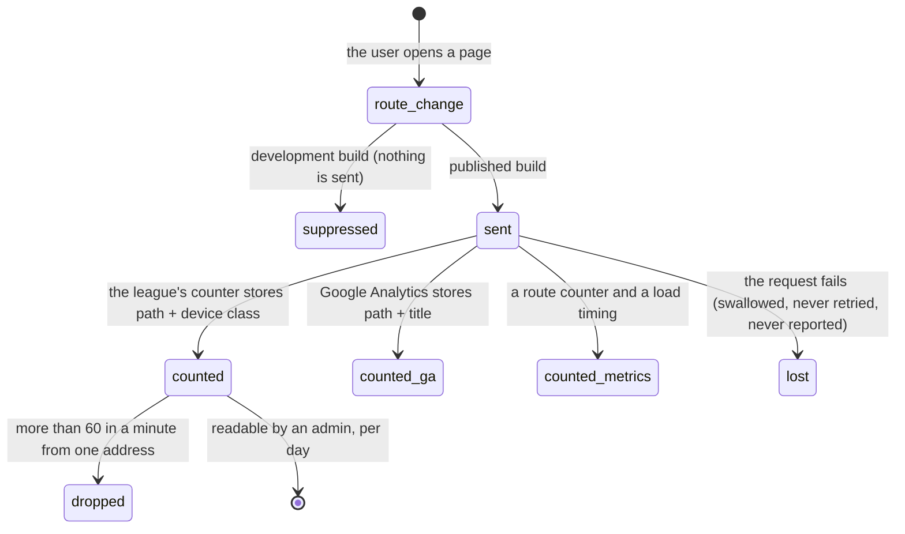

# What the league sees

## Summary

This document owns every side effect a user of 717rec can notice from the
outside: what is counted, what is stored, what reaches somebody's inbox, and what
never does. Every other document ends with a "Side effects the user can notice"
line; this is the shared list behind those lines.

Two things are worth saying at the top. **Almost nothing a player does notifies
anybody.** Submitting a score, joining a team, being approved, finalising a
match, a season changing over — none of them sends a message to anyone. The only
outbound email in the whole product comes from the contact form. And **every
route change is counted three times**, once to Google, once to the league's own
counter, and once to the error-monitoring service.

**Sections dropped.** This document drops the five named phases (**arrive**,
**leave without changing anything**, **begin editing**, **while editing**,
**submit**). Recording a pageview is not a form and has no editing phase; the
lifecycle of one recorded event replaces them, with the state diagram the
template asks for. Modifiers and the full interrupt list are kept — a phone
really is recorded differently from a desktop.

## The simple case

A player opens the schedule. Before the page has finished drawing, three things
have already left the browser: a pageview to Google Analytics carrying the path
and the page title, a pageview to the league's own counter carrying the path and
whether the device is an iPhone, an Android, another phone, or a desktop, and a
counter increment to the error-monitoring service tagged with the route.

None of the three carries their name, their email address, or their account.

They post to the message board. Their username and their team's name are stored
on the message and shown to everybody. Nobody is emailed.

They report a score. It is stored as a submission for an admin to review. Nobody
is emailed, and nothing tells the other team.

## What is recorded on every page

| What | Carries | When |
| --- | --- | --- |
| A Google Analytics pageview | The path and the page's title | Published build only. Nothing is sent from a development build; it prints to the console instead |
| A pageview to the league's own counter | The path, and a coarse device class: iOS, Android, other mobile, desktop, or unknown | Published build only |
| A route counter and a page-load timing | The route name | Published build only |

The league's own counter deliberately avoids identifying anybody. It stores no
address and no user agent. It stores a 16-character fingerprint made from the
address, the browser's user agent, **the date**, and a secret held by the league,
so the same person is one visitor within a day and an unrelated one tomorrow. The
counter accepts at most sixty pageviews a minute from one address and silently
drops the rest, so a fast browse is undercounted rather than rejected.

Only an admin can read any of it. The admin dashboard shows a per-day table:
visitors, pageviews, and how many were iOS, Android, or something else.

## What is recorded when something breaks

Errors go to a monitoring service in the published build only.

- **What is sent:** the error, its stack, and which part of the screen it came
  from; the route; and a sample of performance traces.
- **What is not sent:** who the user is. The app carries a helper for attaching a
  user id and never calls it, so every report is anonymous. Personal detail
  collection is switched off, and addresses in reported URLs have their tokens,
  keys, codes, and email parameters replaced before sending.
- **What is dropped on purpose:** plain "failed to fetch" network errors, and
  errors from a page's code failing to download. A user on a bad connection
  generates no reports at all.
- **What is counted separately:** every failed read and every failed write,
  whether or not the user was shown anything.

**Session recording.** About twelve to fifteen seconds after the app loads, a
session replay recorder is added. It records roughly one session in ten, and
**every session in which an error occurs**. A user has no way to know this is
happening, no way to opt out, and nothing in the app mentions it. This is a
recorded decision of the league rather than an oversight — see
[B-26](../bug-triage.md#b-26-session-replay-records-one-visit-in-ten-with-no-notice).

## What a user writes, and where it goes

| The user does this | It is stored | Somebody is told |
| --- | --- | --- |
| Sends the contact form | As a support ticket the admins can read | **Yes** — an email to the league, with the sender's address as reply-to, so a reply lands in their inbox. This is the only email the product sends |
| Sends a contact request from elsewhere in the app | As a contact request in the admin inbox | No |
| Reports a score | As a score submission for review | No. The other team is not told, and neither is an admin |
| Signs up for the blind draw | As a signup only admins can read | No |
| Requests to join a team | As an unapproved membership | No. An admin finds it by looking |
| Is approved for a team | The membership changes | No. The player finds out by reloading |
| Posts to the message board | With their username and team name, readable by every signed-in user | No |
| Renames their team | Everywhere the team appears, at once | No |
| Finalises a live match | The result, both teams' records, per-player statistics | No, but standings, power scores, and badges all move, and they move some time **after** the write rather than with it |

The last row is the one users notice. Completing a match starts work on the
server, so a player who looks immediately sees the match completed and the
numbers not yet moved. See
[`foundations/saving-and-freshness.md`](../foundations/saving-and-freshness.md).

## Notifications

Two unrelated things share the word.

**In-app notifications** are the bell in the top bar. An admin writes a title and
a message, optionally with an expiry, and it appears in the bell for **everybody,
including signed-out visitors**. Expired ones disappear on their own.

The bell holds an open connection on every page of the app, so a notice posted by
an admin appears in an open browser without a reload — one of the few things in
717rec that does.

Whether a notice has been *seen* is stored in the browser and nowhere else. It is
per browser and per device, it syncs between tabs on the same device, and it
never reaches the league. **Nobody can tell who has read a notice**, and the
unread badge comes back on a different phone.

**Push notifications** — messages that arrive when the app is closed — do not
come from 717rec at all. They come from the third-party service that also makes
the app installable to a home screen, and they are sent from that service's own
dashboard by whoever runs the league. Nothing in the app's code, and no function
on the league's server, sends one. Nothing a player does can trigger one. See
[`../admin/send-notifications.md`](../admin/send-notifications.md), which
describes the in-app kind.

## What the browser fetches from other people

Three third-party addresses are contacted while using 717rec:

- The installable-app and push service, on **every page**.
- Google Analytics, in the published build, loaded shortly after the page.
- A bracket-drawing script from a public code network, only on playoff pages.

## The life of one recorded event

Every one of these is fire-and-forget. A failure is swallowed silently: the user
sees nothing and the league simply has one fewer number.

## Modifiers

| Modifier | Set at arrival | Changed while editing |
| --- | --- | --- |
| The user's role | Nothing recorded differs by role. An admin is the only role that can *read* any of it. | No effect. |
| The record's state | No effect. Nothing recorded here is about a record. | No effect. |
| The season's state | No effect. No pageview, metric, or error is scoped to a season. | No effect. |
| Viewport | The device class stored with every pageview is derived from the browser's own description of itself, so a phone and a desktop are counted separately. | Rotating or resizing does not re-record anything. The class is read per pageview. |
| Keys the app honours | No effect. | No effect. |

The build matters more than any of these. **Nothing at all is recorded from a
development build** — analytics, the league's counter, and error reporting are
all switched off, and analytics prints to the console instead.

## Cancel and interrupt

| Event | Before the first edit | While editing or submitting |
| --- | --- | --- |
| Escape, or a Cancel button | No effect. Nothing recorded here can be cancelled. | Abandoning a form records nothing. Only completed writes are stored; a half-filled form leaves no trace anywhere. |
| In-app navigation away, or switching tab within the page | The new route is recorded immediately, before the page has drawn. | A write already sent still lands and is still stored, and the user never sees the result. Two rapid navigations to the same path within half a second are counted once. |
| Browser back or forward | Recorded as a fresh pageview, so bouncing between two pages inflates both counts. | Same. |
| Reload, or the tab closed | A reload records another pageview for the same path. | **The pageview survives a tab close**, because it is sent in a way the browser finishes after the page is gone. A write in flight may or may not land, and nothing records which. |
| Network lost mid-request | Nothing is recorded and nothing is queued. The league sees a gap, not an error. | The write fails and is not stored. The failure is counted for monitoring but the plain network error itself is deliberately not reported. |
| The request fails or times out | A failed pageview is swallowed. No retry, no message, no record. | The failure is counted, and the error is reported with a stack unless it is a plain network failure. |
| The session expires | Pageviews carry no session, so they keep being recorded exactly as before. | The refused write is not stored. The refusal is counted as a failed write like any other. |
| The same record changed in another tab, or by another user | Nothing announces it. Notifications are the one exception: a notice posted by an admin arrives in an open browser without a reload. | Two people writing the same record store the last write. Nothing records that there were two. |
| Browser autofill or a password manager writes into the form | Nothing is recorded. | A form filled by a tool is stored exactly like a typed one. The contact form's hidden bot trap is the one case where a submission is accepted, stored nowhere, and reported to the user as sent. |
| The window loses focus | Nothing new is recorded; there is no session-length or dwell-time measurement anywhere. | Returning to the tab refetches data, which is not recorded either. |

After any interrupt, what reached the league is what the league has. Nothing is
reconciled and nothing is re-sent.

## Interactions with other systems

**Permissions and roles.** Only an admin can read the traffic table, the support
tickets, the contact inbox, the score submissions, or the blind draw list. See
[`permissions.md`](permissions.md).

**Season scoping.** Nothing recorded here is scoped to a season, including
pageviews of season-specific pages.

**Validation and error display.** A recorded event has no user-facing validation.
The league's counter refuses a path longer than 256 characters and an unknown
device class, silently.

**Unsaved changes.** Never recorded. A draft exists nowhere, on the browser or
the server.

**Optimistic updates and rollback.** A rolled-back write leaves no record that it
was attempted.

**Realtime.** The notification bell holds an open channel on **every** page of
the app. Other screens hold their own; see
[`foundations/saving-and-freshness.md`](../foundations/saving-and-freshness.md).

**Offline.** Nothing is queued. An offline session is invisible to the league.

**Toasts and notifications.** In-app notices reach everybody; push comes from a
third party; no message is ever sent because of something a player did. See
[`foundations/messages-to-the-user.md`](../foundations/messages-to-the-user.md).

**URL state.** The recorded path is the address only. No filter, tab, or sort
order is in the URL, so none of them is ever counted.

**On a phone.** A phone is recorded with its own device class and nothing else.
See [`on-a-phone.md`](on-a-phone.md).

**Accessibility.** No accessibility choice is recorded or transmitted.

**Side effects the user can notice.** This document is the definition.

## Edge cases

- **A session recording may exist for any error a user hits**, and nothing in the
  app says so. This is a product and privacy decision worth making deliberately
  rather than inheriting.
- **The contact form's honeypot answers "sent" and stores nothing.** The league
  never sees the message and the sender waits for a reply. See
  [`../help/contact-the-league.md`](../help/contact-the-league.md).
- **Nobody is told about anything.** A score sits waiting for review until an
  admin happens to look. A join request waits the same way.
- **Approving a membership reaches nobody**, so a new player keeps seeing
  "waiting for approval" until they reload.
- **A user can be counted as two visitors** by browsing across midnight UTC, and
  as one visitor with somebody else who shares an address and a browser.
- **Fast browsing is undercounted**, not rejected, above sixty pageviews a
  minute.
- **A development build reports nothing**, so a bug reproduced locally is
  invisible to monitoring.
- **The unread badge on the bell is per device.** Reading a notice on a laptop
  leaves it unread on a phone forever.

## Open questions and verification

- **The bell subscribes to changes on every page in the app**, which makes it the
  only always-on realtime connection in the product; the rest are per screen. The
  full list is in
  [`foundations/saving-and-freshness.md`](../foundations/saving-and-freshness.md).
  Not confirmed by hand: whether a notice really does appear without a reload.
- **Session replay records 10% of sessions and every session with an error**,
  with no notice to the user. **Decided, 2026-09-01:** the league chose to keep
  the recording as configured and to add no privacy note. See
  [B-26](../bug-triage.md#b-26-session-replay-records-one-visit-in-ten-with-no-notice).
- Not confirmed by hand: whether registering actually sends a confirmation email
  in the published app. The local configuration switches confirmations off and
  the published setting was not read.
- Not confirmed by hand: what a push notification looks like when it arrives, who
  receives it, and whether a player can turn it off. That is entirely a
  third-party dashboard and is not visible in this repository.
- Not confirmed by hand: whether the contact form's email actually arrives, and
  whether replying to it reaches the sender.
- Not confirmed by hand: whether the traffic table in the admin dashboard matches
  the Google Analytics numbers, or by how much they differ.
- Not confirmed by hand: the exact wording and content of the support email as
  received.
- Assumption: no database trigger calls out to anything. One extension that could
  make outbound requests is installed if available; no migration was found that
  uses it.

Verified against `717rec` commit `ea5c8f4`.
