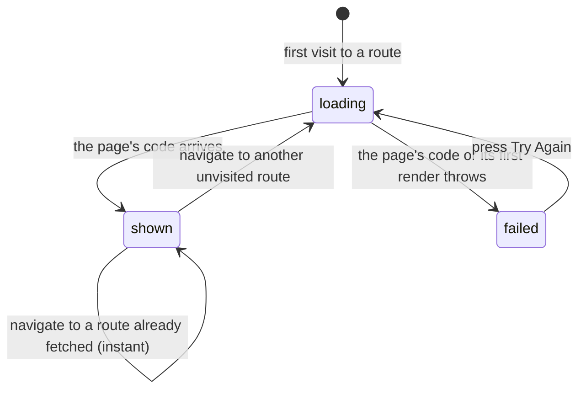

# Navigation

## Summary

717rec is one page in the browser that swaps its contents as the user moves
around. Every route is loaded on demand the first time it is visited, so moving
to a page the user has not seen yet shows a brief loading message before the page
appears.

This document owns the list of routes, what is in the URL, what a page shows
while it loads, what happens when one fails, and what the app does — and does not
do — about scroll position and focus. Other documents link here.

## The simple case

The user opens the app at `/`. A navigation bar sits at the top of every page; a
footer sits at the bottom. They click "Schedule" and the URL becomes `/schedule`.
For a moment a spinner reading "Loading page..." fills the middle of the screen,
then the schedule appears. Going back to the home page and forward to the
schedule again is instant, because the page has already been fetched.

The browser's back and forward buttons work normally. Nothing the app does can
stop them, and nothing warns before leaving a page with unsaved work.

## The routes

| Route | What it is | Signed out |
| --- | --- | --- |
| `/` | The home dashboard | Readable |
| `/teams` | The teams list | Readable |
| `/teams/:teamId` | One team | Readable |
| `/schedule` | The season schedule | Readable |
| `/stats` | Standings and rankings | Readable |
| `/playoffs` | The bracket | Readable |
| `/history` | Past seasons | Readable |
| `/compare` | Compare two teams | Readable |
| `/insights` | League insights | Readable |
| `/message-board` | The message board | Not guarded; behaviour when signed out is unconfirmed |
| `/my-team` | Manage your team | Not guarded; behaviour when signed out is unconfirmed |
| `/matches/:matchId/live` | A match being scored live | **Readable.** Watching is public; scoring is not |
| `/help` | Help | Readable |
| `/contact` | The contact form | Readable and writable |
| `/auth` | Sign in and register | Readable |
| `/setup-profile` | Finish your profile | Not guarded |
| `/oauth/consent` | Authorise another app | Not guarded |
| `/admin` | The admin dashboard | **Guarded**: redirects to `/auth` |
| `/admin/notifications` | Send notifications | **Guarded**: redirects to `/auth` |
| `/timeslots` | Manage timeslots | **Guarded**: redirects to `/auth` |
| anything else | Page not found | Readable |

Only three routes are guarded. See
[`accounts-and-roles.md`](accounts-and-roles.md#how-pages-are-gated) for what
the guard does and why the others are not.

## The interaction, event by event

The unit here is arriving at a route.

### Arrive

The URL changes and React Router matches a route. If the page's code has not been
fetched yet, a spinner reading "Loading page..." fills at least 60% of the
viewport height until it arrives.

Three things happen on every arrival, on every route:

- The route is recorded as a pageview, both to Google Analytics and to the
  league's own counter.
- Timing for how long the previous page took is recorded.
- A screen-reader announcement is made naming the new page, and focus is moved to
  the main content area — but **not on the very first page load**, only on
  navigations after it.

**Scroll position is not reset.** Moving from the bottom of a long schedule to a
short page leaves the user scrolled down on the new page, looking at nothing.

Four routes opt out of that by remembering and restoring their own scroll
position: **`/teams`, `/stats`, `/history`, and `/insights`**. Returning to one of
them from elsewhere puts the user back where they were. Every other route — the
home page, the schedule, a team's page, the playoffs, the message board, live
scoring — does nothing at all, and simply inherits whatever scroll position the
previous page had.

Nothing is prefilled or focused by arriving, beyond the main-content focus move
above. Three lightweight pages — teams, schedule, and history — are fetched
quietly in the background after the first render, so those three are usually
instant even on a first visit. The heavy pages, stats and playoffs, are
deliberately not, so they show the loading spinner.

### Leave without changing anything

Nothing is recorded beyond the pageview that already happened on arrival. No
page in the app keeps a draft of anything on leaving.

### Begin editing

Not applicable to navigation itself. Individual pages own this.

### While editing

The URL does not generally carry page state. Filters, selected tabs, and sort
orders are held in the page and lost on navigation; they are not in the URL and
cannot be linked to or bookmarked. The exceptions are the two routes that address
a record: `/teams/:teamId` and `/matches/:matchId/live`.

### Submit

Not applicable to navigation itself.

## Modifiers

| Modifier | Set at arrival | Changed while on the page |
| --- | --- | --- |
| The user's role | Decides only whether the three guarded routes render, redirect, or refuse. Every other route renders the same for every role. | Signing out in another tab takes effect here immediately and can remove controls under the cursor. It does not force a redirect off an unguarded page. |
| The record's state | Only `/teams/:teamId` and `/matches/:matchId/live` read a record from the URL. A missing or invalid id gives that page's own empty state, not the 404 page. | No effect on routing. |
| The season's state | No effect on which routes exist. | No effect. |
| Viewport | The navigation bar collapses to a menu on a narrow screen. | Re-flows on rotation. |
| Keys the app honours | No global keyboard shortcuts exist. Tab reaches a skip link to the main content first. | No global shortcuts. |

## Cancel and interrupt

| Event | Before the first edit | While editing or submitting |
| --- | --- | --- |
| Escape, or a Cancel button | No global effect. There is no global Escape handler. | No global effect; individual dialogs handle their own. |
| In-app navigation away, or switching tab within the page | The new page loads. Scroll position is not reset. | **The page's state is discarded with no warning.** No route in the app blocks navigation for unsaved work. Requests already sent still complete, unseen. |
| Browser back or forward | Works normally; the app cannot intercept it. | Same as navigating away. Coming back gives a freshly mounted page, not the one that was left. |
| Reload, or the tab closed | The whole app is re-fetched and re-initialised. Sign-in state survives; everything else does not. | Everything in memory is lost. |
| Network lost mid-request | If the page's own code has not arrived, the loading spinner stays indefinitely — there is no timeout and no error for a chunk that never loads. | Data requests fail and each page reports it in its own way. |
| The request fails or times out | A page whose code fails to load, or whose first render throws, is replaced by the route error screen described below. | Data failures do not reach the error screen; they are the page's own business. |
| The session expires | No effect on unguarded routes. On the three guarded ones, the next visit redirects to `/auth`. | No redirect happens on a page already open. The user finds out when a write fails. |
| The same record changed in another tab, or by another user | No effect on routing. | No effect on routing. |
| Browser autofill or a password manager writes into the form | No effect on routing. | No effect on routing. |
| The window loses focus | No effect. | Returning focus causes cached data older than five minutes to refetch. See [`saving-and-freshness.md`](saving-and-freshness.md). |

After any interrupt the user is wherever the browser put them. The app never
returns a user to an interrupted page or restores what was on it.

## When a page fails

Two different failures produce two different screens.

**A page that fails to load or render** is replaced by a route error screen: a
warning triangle, "Failed to load *page name*", the sentence "Something went
wrong loading this page. You can try again or navigate elsewhere.", and three
buttons — Try Again, Go Back, and Home. In a development build the underlying
error message is shown as well; in the published build it is not. "Home" is a
full page load, not an in-app navigation, so it discards everything.

**A URL that matches no route** gives the Page Not Found screen: "Oops! The page
you are looking for does not exist or has been moved.", with Go Home and Go Back
buttons. The attempted address is recorded in the log but not shown to the user.

A **failed data request** produces neither of these. It is handled inside the
page, usually as an empty state and a toast.

## Interactions with other systems

**Permissions and roles.** Only the three guarded routes behave differently by
role. See [`accounts-and-roles.md`](accounts-and-roles.md).

**Season scoping.** The active season is never in the URL, so a link to
`/schedule` means "whatever season is active when it is opened". See
[`seasons.md`](seasons.md).

**Validation and error display.** Route parameters are not validated. A malformed
team id reaches the team page, which shows its own not-found state rather than
the 404 route.

**Unsaved changes.** Not handled anywhere in the app. No route blocks navigation.

**Optimistic updates and rollback.** Not applicable to navigation.

**Realtime.** Several routes open a subscription and all of them close it when
the user navigates away. See
[`saving-and-freshness.md`](saving-and-freshness.md#realtime).

**Offline.** Already-fetched pages still navigate. Not-yet-fetched pages hang on
the loading spinner with no error.

**Toasts and notifications.** Toasts survive navigation — a toast raised on one
page is still visible on the next, because there is one toast area for the whole
app.

**URL state.** Two routes carry a record id. Nothing else is in the URL: no
filters, no tabs, no sort order, no season, no pagination.

**On a phone.** The navigation bar becomes a menu. Everything else is the same.

**Accessibility.** A skip link reaches the main content. Route changes are
announced and move focus to the main content, except on the first load. The
absence of a scroll reset is felt most by a user who cannot see the page has
changed.

**Side effects the user can notice.** Every route change is recorded twice, once
to Google Analytics and once to the league's own pageview counter. In a
development build the analytics call does nothing.

## Edge cases

- **Scroll position carries across pages.** Arriving at a short page from the
  bottom of a long one shows an apparently empty screen until the user scrolls
  up. Only the four routes with their own restoration are exempt, and they
  restore rather than reset — which is a different thing and is not what a user
  arriving from elsewhere needs.
- **A chunk that never downloads leaves the spinner forever.** There is no
  timeout, no retry, and no error.
- **"Home" on the error screen is a full page load**, unlike "Home" anywhere else
  in the app.
- **The first page load does not announce or move focus**, deliberately, so a
  screen reader is not interrupted mid-sentence on arrival.
- **`/playoffs/e2e-bracket-proof` exists** as a test route and is out of scope.
- **Filters are lost on every navigation.** Filtering the schedule, opening a
  match, and pressing back gives an unfiltered schedule.

## Open questions and verification

- **No route resets scroll position.** Four routes restore their own, which is a
  different behaviour and does not help a user arriving at any of the other
  sixteen. Confirmed by hand on 2026-08-25: scrolled 337px down `/schedule`,
  clicked through to `/help`, still at 337px. **May be worth treating as a bug
  rather than documenting.**
- Not confirmed by hand: what `/my-team`, `/message-board`, and `/setup-profile`
  show to a visitor. They have no route guard.
- Not confirmed by hand: whether the post-sign-in redirect returns the user to
  the guarded page they originally asked for.
- Not confirmed by hand: whether "Try Again" on the route error screen actually
  recovers, or re-throws immediately.
- Not confirmed by hand: how long the loading spinner is visible in practice on a
  normal connection, and whether it flashes on fast ones.
- Assumption: the three preloaded routes are teams, schedule, and history because
  they are the cheapest, as the code comment says. Not measured.

Verified against `717rec` commit `ea5c8f4`.
