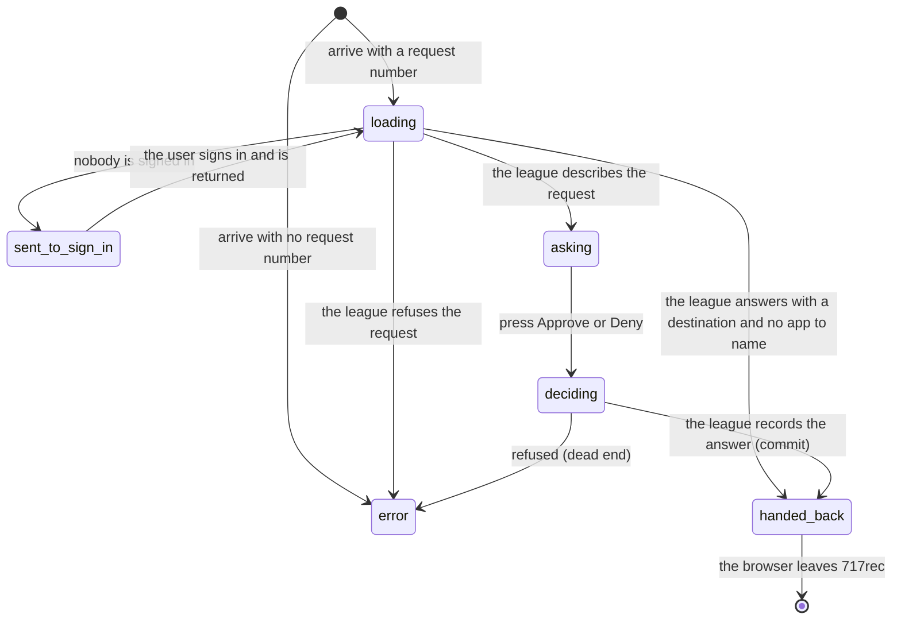

# Authorising another app

## Summary

`/oauth/consent` is the screen another application sends a user to when it wants
to act as them inside 717rec. The user answers one question — Approve or Deny —
and is sent back to whatever asked.

Nothing inside 717rec links to this page. No menu, no footer, no button. The only
way to reach it is to be sent there by another application, carrying a request
number in the URL. A user who types the address by hand gets an error and stops.

It is also the least finished page in the product. It has none of the app's own
look: no card, no heading style, no spinner, and it raises no toast at any point.
It is plain text and two buttons, sitting inside the usual navigation bar and
footer.

## The simple case

Another application opens `/oauth/consent?authorization_id=…` in the user's
browser. The page reads "Loading…" for a moment.

Then it shows a heading — "Connect *Name of app* to your 717rec account" — and one
paragraph: "This will let *Name of app* use 717rec on your behalf: read standings,
your team, your matches, and (if you are an admin) run admin ops tools as you."
Under it are two buttons, **Approve** and **Deny**.

The user presses Approve. Both buttons go dead. The browser leaves 717rec and
lands back at the other application, which now has access.

Pressing Deny does the same thing, minus the access.

## The interaction, event by event

### Arrive

The page reads one thing from the URL: the request number. Then it does three
checks in order, and the user can be moved on by any of them before they see
anything.

1. **No request number.** The page shows "Authorization error — Missing
   authorization_id" and stops. There is no button, no link, and no way forward.
2. **Nobody signed in.** The browser is sent to `/auth`, carrying this page and
   its request number so the user comes back here afterwards. This is a **full
   reload of the whole app**, not the usual in-app move, so it is slower and more
   noticeable than any other redirect in the product. Signing in is described in
   [`sign-in-and-sign-up.md`](sign-in-and-sign-up.md).
3. **The league already knows the answer.** If the league replies with a
   destination and no application to name, the browser is sent straight there
   **without asking the user anything**. This is what a repeat authorisation looks
   like: the page flashes "Loading…" and the user is back where they came from.

Otherwise the question is drawn. If the other application gave no name, it is
called "an app", and the heading reads "Connect an app to your 717rec account".

Nothing is recorded by arriving, and no toast is raised.

### Leave without changing anything

Nothing happens. The request is left undecided at the league; the app that sent
the user simply never hears back. Nothing on this page says that leaving is an
option, and there is no Cancel — Deny is the closest thing, and it is an answer,
not a withdrawal.

### Begin editing

There is nothing to edit. The page has no fields. The only interaction is pressing
one of two buttons.

### While editing

Not applicable. Nothing on the page can be changed, nothing is validated, and the
URL never changes.

**What the paragraph says is fixed.** The league sends a list of exactly what the
other application is asking for, and the page does not show it. Every request,
whatever it asks for, is described with the same sentence.

### Submit

Pressing Approve or Deny disables both buttons at once, so the answer cannot be
given twice or changed.

On success the league returns a destination and the browser leaves 717rec for it.
The buttons stay dead until the browser has gone; there is no confirmation screen
and no toast, because the page is replaced by another website.

Two things can go wrong, and both replace the entire page with an error screen —
the heading "Authorization error" and one line of text underneath:

| What went wrong | What the user is told |
| --- | --- |
| The league refused the answer | The league's own words, unchanged |
| The league accepted it but returned nowhere to go | "No redirect returned by the authorization server." |
| Anything else | "Failed to complete authorization" |

**The error screen is a dead end.** It has no Approve, no Deny, no Try Again, and
no link back. The only way out is to reload the page or leave 717rec entirely, and
a reload starts the whole question again from the beginning.

## Modifiers

| Modifier | Set at arrival | Changed while editing |
| --- | --- | --- |
| The user's role (visitor, player, admin) | A visitor is sent to sign in and returned. A player and an admin see the identical page — including the words "(if you are an admin) run admin ops tools as you", which are shown to everybody whether or not they are an admin. | No effect. The page reads the role once and never again. |
| The record's state | An authorisation the league has already decided is not asked about again; the user is handed straight back. An unknown or expired request number gives the error screen. | No effect. The request cannot change state under the user except by their own answer. |
| The season's state (active, archived, playoffs on) | No effect. This page is not scoped to a season. | No effect. |
| Viewport | The text column is capped at a readable width and the two buttons sit side by side at every width. | No effect beyond re-flowing on rotation. |
| Keys the page honours | Tab reaches Approve then Deny. Enter or Space presses the focused button. | No shortcuts. Escape does nothing. |

## Cancel and interrupt

| Event | Before the first edit | While editing or submitting |
| --- | --- | --- |
| Escape, or a Cancel button | No effect. There is no Cancel button; Deny is an answer, not a cancel. | No effect. Escape does not abort an answer in flight. |
| In-app navigation away, or switching tab within the page | The request is left undecided. There are no tabs on this page. | The answer already sent still reaches the league, but the browser is no longer here to be handed on, so the other application never gets its reply and the user sees nothing. |
| Browser back or forward | Returns to the previous page, leaving the request undecided. | Same. Coming forward again reloads the page and re-asks the league, which may now answer "already decided" and hand the browser straight on. |
| Reload, or the tab closed | The question is asked again from the start. The request number is in the URL, so a reload works. | An answer already accepted stands. A reload after approving is answered immediately and hands the browser on without asking again. |
| Network lost mid-request | The page stays on "Loading…" **indefinitely**. There is no timeout and no error for a request that never returns. | The answer fails and the page is replaced by the dead-end error screen. Nothing is queued and nothing can be retried in place. |
| The request fails or times out | The error screen replaces the page, carrying the league's own message. | As above. The dead end is the only outcome. |
| The session expires | The page finds no session and sends the browser to sign in, remembering where to come back to. | The answer is refused and the raw refusal appears on the dead-end error screen. Nothing says the session ended. |
| The same record changed in another tab, or by another user | The page reads the request once when it loads and never again. An authorisation answered in another tab is not noticed here. | No effect. Answering the same request twice from two tabs gives one success and one error screen. |
| Browser autofill or a password manager writes into the form | No effect. There are no fields on this page. | No effect. |
| The window loses focus | No effect. Nothing refetches and nothing revalidates. | No effect. An answer in flight continues. |

After any interrupt the user is wherever the browser put them. This page never
restores itself and never explains what happened to a request it was in the middle
of.

## Interactions with other systems

**Permissions and roles.** A session is required to see the question at all.
Beyond that, role changes nothing about the page — but it changes what is granted,
because the access follows whoever approved it. See
[`foundations/accounts-and-roles.md`](../foundations/accounts-and-roles.md).

**Season scoping.** None.

**Validation and error display.** Nothing to validate. Failures replace the whole
page rather than appearing beside the buttons, and they carry the league's own
words — one of only two places in the app that does not rewrite them into a
friendly sentence.

**Unsaved changes.** Nothing to lose. Leaving simply leaves the request undecided.

**Optimistic updates and rollback.** None. The buttons stay dead until the browser
leaves.

**Realtime.** None.

**Offline.** "Loading…" forever if the connection drops before the question
arrives; the dead-end error screen if it drops after.

**Toasts and notifications.** **None. This page raises no toast of any kind**, for
success or for failure, which makes it the only page in 717rec with an action and
no message. See
[`foundations/messages-to-the-user.md`](../foundations/messages-to-the-user.md).

**URL state.** The request number is the only thing in the URL, and it is the whole
of the page's state, so the page survives a reload intact. It behaves like the
record ids described in
[`foundations/navigation.md`](../foundations/navigation.md#while-editing).

**On a phone.** Plain text at a readable width with the two buttons in a row. The
bottom tab bar sits below. Nothing else changes.

**Accessibility.** The buttons are real buttons and reachable by keyboard. Two
things are wrong. The page draws its own main region inside the app's, so there
are **two main landmarks** on the page. And the error screen replaces the whole
page with no announcement. A third — the route being announced as the "Page Not
Found" page — is fixed: it is in the app's list of page names now, so a screen
reader arriving here is told it is the **"Authorize App" page**, see
[B-30](../bug-triage.md#b-30-small-copy-and-labelling-slips).

**Side effects the user can notice.** Approving grants another application the
right to act as the user inside 717rec for as long as the league allows.
**Nothing in 717rec lists what has been approved and nothing can take it back**;
there is no connected-apps page anywhere in the product.

## Edge cases

- **The page does not say what it is granting.** The league sends the exact list of
  permissions the other application asked for, and the page shows a fixed sentence
  instead. Two applications asking for very different things are described
  identically.
- **The fixed sentence describes reading only**, but the access it grants includes
  at least one admin action that changes stored numbers. A user reading the page
  would not expect that.
- **Everyone is told about admin tools.** The words "(if you are an admin)" are
  shown to every user, which reads as a warning to people it cannot apply to.
- **A repeat authorisation is silent.** The user is handed straight back with no
  chance to see what they are re-approving or to say no.
- **Typing the address by hand is a dead end.** "Missing authorization_id" with
  nothing to press.
- **Every error is a dead end.** No retry, no way back, and nothing to press.
- **"Loading…" can last forever.** A request that never returns leaves the word on
  screen with no timeout and no error.
- **Signing in from here reloads the whole app**, unlike every other sign-in
  redirect in the product.
- **The page looks like it belongs to a different product.** No card, no
  background, no spinner, and none of the app's own typography.

## Open questions and verification

- **The consent screen does not show the permissions being consented to.** The
  page receives them and ignores them. **May be worth treating as a bug rather
  than documenting.**
- **Every failure is a dead end with no way back.** **May be worth treating as a
  bug rather than documenting.**
- Resolved: **the route was announced as "Page Not Found"** because it was missing
  from the app's list of page names. Fixed — see
  [B-30](../bug-triage.md#b-30-small-copy-and-labelling-slips). It is announced as
  "Authorize App", and a test now pins that every route declared in `App.tsx` has
  a name.
- **The page adds a second main landmark** inside the app's own. **May be worth
  treating as a bug rather than documenting.**
- Not confirmed by hand: what the other application's name looks like in practice,
  and whether any application reaching this page supplies one.
- Not confirmed by hand: whether the "already decided" path really does hand the
  user straight back, or whether it only fires in cases a user never meets.
- Not confirmed by hand: how long an approval lasts, and whether it can be
  withdrawn from anywhere outside this app.
- Not confirmed by hand: what the league's own refusal messages read like, since
  they are shown unchanged.
- This page has **no tests of any kind** — no unit test, no integration test, and
  no browser test. Everything above is read from the page itself.

Verified against `717rec` commit `ea5c8f4`.
