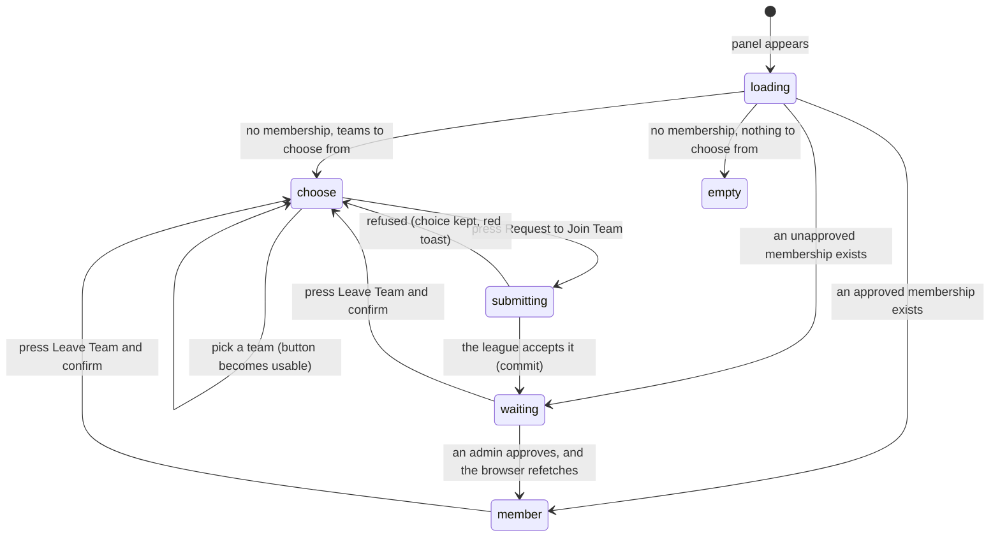

# Joining a team

## Summary

A membership is the link between a signed-in account and a team, and an
**approved** membership is what turns a player into someone who can do things:
score their team's matches and edit their team's name and picture. Asking for one
is a single choice from a dropdown and a single button. Getting one is somebody
else's decision, taken elsewhere, with nothing sent back.

The whole feature is one panel, headed "Team Membership", which appears in two
places and behaves identically in both: at the top of `/my-team`, and below the
form on [`/setup-profile`](set-up-your-profile.md). This document owns the panel.
[`foundations/accounts-and-roles.md`](../foundations/accounts-and-roles.md#membership)
owns what a membership *means*.

**An unapproved membership grants nothing.** It is worth exactly as much as no
membership at all, except that the user can see they have asked.

## The simple case

The user opens `/my-team`. Under the heading "Team Membership" is the line "Join a
team to participate in matches and track your stats. Admin approval is required."
Below it is a dropdown reading "Select a team to join", a full-width **Request to
Join Team** button, greyed out, and the note "Your request will be reviewed by an
admin before approval".

They open the dropdown, which lists every team with its badge, and pick one. The
button comes to life. They press it. It reads "Submitting Request..." with a
spinner. A toast says "Team Request Submitted — Your request to join the team has
been submitted for admin approval".

The dropdown and button vanish and are replaced by a yellow card with the team's
badge, its name, a **Pending Approval** tag with a clock, the line "Requested"
with today's date, and a **Leave Team** button.

Then nothing happens, for as long as it takes. When an admin approves it, the
card turns green and says **Approved** — but only after the user's browser next
goes back for the data. Nothing tells them.

## The interaction, event by event

### Arrive

The panel shows **a bare spinner and nothing else** while it reads the membership
— not even its heading, so the panel appears to be missing rather than loading.

Then one of four things is drawn:

- **An approved membership.** A green card: badge, team name, an **Approved** tag
  with a tick, "Approved" and the date, the line "You can edit team details", and
  a **Leave Team** button.
- **An unapproved membership.** The same card in yellow, with a **Pending
  Approval** tag and a clock, and "Requested" and the date the request was made.
- **No membership, teams to choose from.** The dropdown, the button, and the note.
- **No membership and no teams.** An empty state: "No Teams Available — There are
  no teams to join at the moment. Check back later or contact an admin."

The team list is **every team the league has**, ordered by name. It is not
filtered by season and not filtered by division, so teams that no longer play are
offered alongside the ones that do. See
[`foundations/league-objects.md`](../foundations/league-objects.md).

Nothing is recorded by arriving.

### Leave without changing anything

Nothing happens. The chosen team in the dropdown is not remembered; returning to
the page gives "Select a team to join" again.

### Begin editing

Choosing a team from the dropdown is the only edit there is. It enables the
button. Nothing else changes and nothing is sent.

### While editing

There is nothing to type and nothing to validate. The only rule is that a team
must be chosen, and it is enforced by keeping the button greyed out.

The dropdown can be reopened and changed as often as the user likes. Only the last
choice matters.

### Submit

The button reads "Submitting Request..." and goes dead. The dropdown stays usable
while the request is in flight, but changing it then has no effect on what was
sent.

What is sent is one request to the league naming this user and that team, marked
not approved. The league records the date. Nothing else is captured — there is
nowhere to write a message, nowhere to give a reason, and no way to tell the admin
who you are beyond your profile name.

On success the toast appears, the dropdown is cleared, and the panel goes back to
the league for the membership it just created and redraws itself as the yellow
waiting card.

On failure a red toast appears headed "Failed to submit request", and **its text
is whatever the database said, word for word**. This is unusual: most failures in
717rec are collapsed into a friendly sentence, and this one is not. The dropdown
keeps the chosen team and the button comes back.

### Waiting for approval

This is the part of the feature the user spends the most time in, and the app does
nothing during it.

- **Nothing is sent to the admin.** No email, no push, no message. The request
  appears in the admin's list the next time they look at it.
- **Nothing comes back.** There is no subscription on memberships, so an approval
  never reaches the waiting browser by itself. The card keeps saying "Pending
  Approval" until the app refetches: after five minutes have passed *and* the user
  returns to the tab, or reopens the page, or reloads. See
  [`foundations/saving-and-freshness.md`](../foundations/saving-and-freshness.md).
- **A refusal is invisible.** Rejecting a request deletes it. The user's panel
  simply goes back to the dropdown, with no message and no record that they ever
  asked. They cannot tell a refusal from a request that was never received.

Approving is described in
[`admin/handle-requests.md`](../admin/handle-requests.md).

### Leaving

**Leave Team** opens a confirmation: "Leave team? — Are you sure you want to leave
*team*? You will lose your association with this team and any editing privileges."
Cancel closes it. Leave Team removes the membership, approved or not, and a toast
says "Left Team — You've successfully left the team". The panel goes back to the
dropdown.

Leaving is the **only** way to change teams. There is no "switch team" control
anywhere: a user who wants a different team must leave the one they have and ask
again, losing their approval in the meantime.

## Modifiers

| Modifier | Set at arrival | Changed while editing |
| --- | --- | --- |
| The user's role (visitor, player, admin) | A visitor gets the "No Teams Available" empty state, because the app asks for nothing when nobody is signed in. A player and an admin see the same panel; an admin cannot approve their own request. | Signing out in another tab leaves the panel on screen; pressing the button then gives "Authentication required — You must be logged in to join a team". |
| The record's state | The membership decides which of the four panels is drawn. Approved adds "You can edit team details" and the team edit form below it on `/my-team`. | Nothing arrives on its own. The panel only changes state after the user's own action or a refetch. |
| The season's state (active, archived, playoffs on) | No effect. A membership is not scoped to a season and carries into the next one. | No effect. |
| Viewport | The card's contents sit in a row on a wide screen and stay in a row on a narrow one, so a long team name and the Leave Team button can crowd each other. | No effect beyond re-flowing on rotation. |
| Keys the panel honours | Tab reaches the dropdown and then the button. Space or Enter opens the dropdown; arrows move through it; Enter chooses. | Enter on the button submits. Escape closes the dropdown or the confirmation dialog. |

## Cancel and interrupt

| Event | Before the first edit | While editing or submitting |
| --- | --- | --- |
| Escape, or a Cancel button | Nothing to cancel. | Closes the dropdown, or closes the Leave Team confirmation without leaving. It does not clear the chosen team and does not abort a request in flight. |
| In-app navigation away, or switching tab within the page | Nothing is lost. | The chosen team is lost. A request already sent still lands, and its toast appears on whatever page the user is now on — but the panel that would have redrawn is gone, so returning later is the only way to see the result. |
| Browser back or forward | Returns to the previous page. Nothing is recorded. | Same as navigating away. |
| Reload, or the tab closed | The panel is drawn again from the league's copy. | The chosen team is lost. A request already accepted survives and shows as pending. |
| Network lost mid-request | The panel shows its spinner and, when the read fails, falls through to the join dropdown or the empty state **as though the user had no membership** — with no error shown anywhere. | The request fails and the raw database or network message appears in a red toast. Nothing is queued. |
| The request fails or times out | As above: a failed read is silently drawn as "no membership". | Red toast with the raw message. The chosen team is kept and the button comes back. |
| The session expires | The panel asks for nothing and draws the "No Teams Available" empty state. | The request fails. The toast carries the refusal in the database's words. |
| The same record changed in another tab, or by another user | The panel shows whatever the app last fetched, which can be up to five minutes old. | **No effect and no notice.** An admin approving or rejecting in that moment does not reach the browser. A request made in another tab is not seen here either. |
| Browser autofill or a password manager writes into the form | No effect. There is no text field on this panel for a manager to fill. | No effect. |
| The window loses focus | No effect. | Returning to the tab refetches the membership if the app's copy is more than five minutes old, which is the usual way a user finds out they were approved. |

After any interrupt the user is left wherever the interrupt took them. Whatever
reached the league stands; whatever did not is gone.

## Interactions with other systems

**Permissions and roles.** A session is required to ask. Approval is an admin
action. What an approved membership then unlocks is in
[`foundations/accounts-and-roles.md`](../foundations/accounts-and-roles.md#membership).

**Season scoping.** None. A membership has no season, so one approved last season
still counts this season.

**Validation and error display.** One rule, enforced by the greyed-out button.
Everything else is reported as a toast, and the toast carries the database's own
words rather than a friendly sentence.

**Unsaved changes.** Nothing to lose beyond the chosen team.

**Optimistic updates and rollback.** None. The card does not appear until the
league has confirmed the request and the panel has read it back.

**Realtime.** None. This is the clearest case in the app of the gap described in
[`foundations/saving-and-freshness.md`](../foundations/saving-and-freshness.md#realtime):
the user is waiting for a change that will never be pushed to them.

**Offline.** The request fails and the raw message appears. A failed *read* is
worse: it is drawn as "you are not in a team".

**Toasts and notifications.** One toast per action. No push notification is sent
to anyone at any point in this flow — not to the admin when a request is made, and
not to the user when it is decided.

**URL state.** None. Neither the chosen team nor the panel's state is in the URL.

**On a phone.** The panel is full width. The dropdown opens as a list. The Leave
Team confirmation fills most of the screen.

**Accessibility.** The dropdown and button are standard controls and are reachable
by keyboard. The Approved and Pending tags are text, so they are read out. **The
loading spinner has no text with it**, so a screen reader user is told nothing
while the panel loads. The panel changing from "pending" to "approved" after a
refetch is not announced.

**Side effects the user can notice.** An approved membership changes the user menu:
"Join a Team" becomes "My Team" and points at the team's own page. It also makes
the team edit form appear on `/my-team`, and makes the live-scoring controls
appear on the team's matches; see
[`live-scoring/start-a-live-match.md`](../live-scoring/start-a-live-match.md).

## Edge cases

- **A visitor at `/my-team` is told there are no teams.** The page has no guard, so
  it draws the panel, the panel asks for nothing because nobody is signed in, and
  the empty state "No Teams Available" is the result. It is a false statement to a
  user who is simply not signed in, and nothing on the page offers to sign them in.
- **A failed read looks like "no membership".** The panel has no error state at
  all. A user whose connection drops is shown the join dropdown for a team they
  are already on.
- **Being rejected looks the same as never having asked.** No message, no history.
- **There is no way to change teams directly.** Leave first, then ask again.
- **Only one approved membership is possible.** The database refuses a second, so
  an admin approving a request from someone who already belongs to another team is
  refused and told to remove the other membership first.
- **Two tabs can each send a request.** Nothing deduplicates them, and a user with
  two membership rows breaks their own panel: the app expects at most one and the
  read fails from then on, which is drawn as "no membership".
- **Retired teams are offered.** The dropdown is unfiltered, so teams that no
  longer play appear alongside current ones with nothing to tell them apart.
- **The date on the card is the request date, not the approval date**, until the
  membership is approved — at which point it silently becomes the approval date.
- **The panel appears twice in one session.** A user who arrives at
  `/setup-profile` and then goes to `/my-team` sees the same panel again; they are
  the same record and the same controls.

## Open questions and verification

- **A visitor at `/my-team` is told "No Teams Available".** This is the unguarded
  signed-out behaviour flagged as unknown in
  [`foundations/accounts-and-roles.md`](../foundations/accounts-and-roles.md), and
  reading the code settles it: the panel renders, its requests are switched off,
  and the empty state is drawn. **May be worth treating as a bug rather than
  documenting.**
- **A failed membership read is drawn as an empty state.** The panel computes an
  error message and never shows it anywhere. **May be worth treating as a bug
  rather than documenting.**
- **A rejected request disappears without a word.** **May be worth treating as a
  bug rather than documenting.**
- **Failure toasts carry raw database text.** The user can be shown a constraint
  name. **May be worth treating as a bug rather than documenting.**
- Not confirmed by hand: how long an approval actually takes to appear in the
  waiting user's browser, and whether returning to the tab is enough.
- Not confirmed by hand: whether teams in the Hidden division really do appear in
  the dropdown against the live database.
- Not confirmed by hand: what a user sees after they manage to create two
  membership rows, and whether it can be recovered from without an admin.
- Not confirmed by hand: what happens to an approved membership when the team is
  hidden or the season rolls over.

Verified against `717rec` commit `ea5c8f4`.
