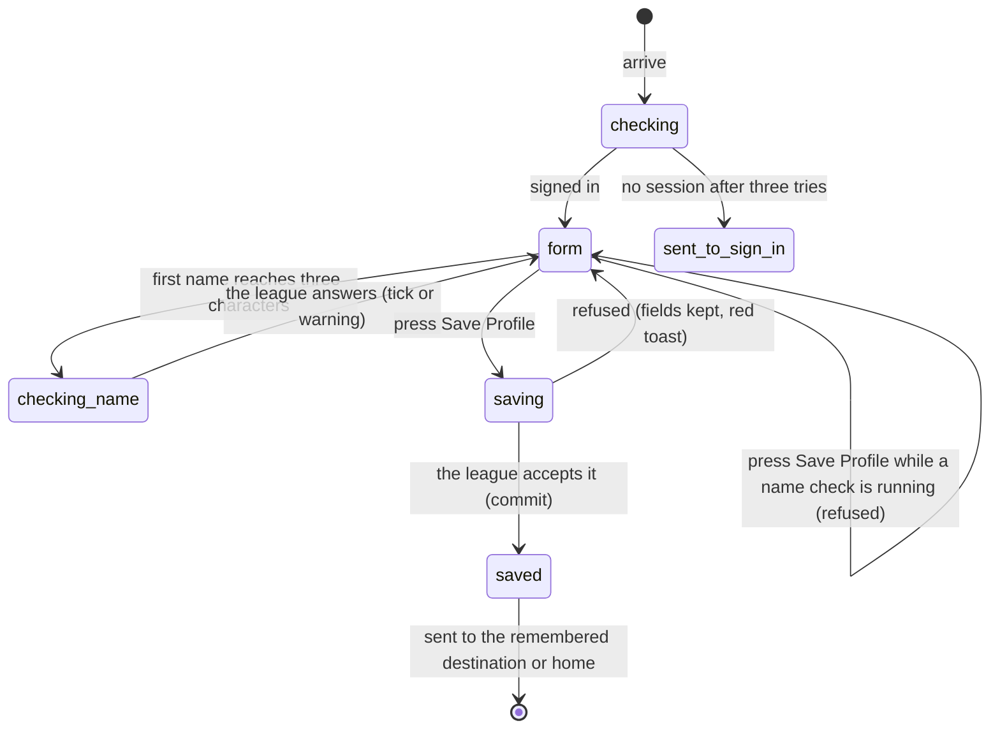

# Setting up your profile

## Summary

`/setup-profile` is where a signed-in user chooses the name the rest of the league
sees. It holds one small form — a first name and an optional full name — and,
below a divider, the panel for asking to join a team, which is described in
[`join-a-team.md`](join-a-team.md).

The page has two jobs that pull against each other. It is the **gate** a user with
no username is pushed through, and it is also the ordinary **Edit Profile** page
reached from the user menu at any time. It behaves the same either way, including
sending the user somewhere else the moment they save.

The route has no guard. It handles being signed out by itself, badly; see
[Edge cases](#edge-cases).

## The simple case

The user arrives and sees a card headed "Set Up Your Profile" with the line "Enter
your name and details". Under it are two fields: **First Name**, marked required,
and **Full Name (Optional)**. Both are already filled in with whatever the profile
holds. Under the first is the note "This is how you will be identified in the
league." A full-width **Save Profile** button sits below them, greyed out until
the first name is at least three characters long.

Below a divider is the Team Membership panel. At the foot of the card: "This
information will be visible to other players".

The user types a name. Half a second after they stop, a green tick appears at the
right of the field. They press Save Profile, the button reads "Saving...", a toast
says "Profile updated — Your profile has been successfully updated", and the page
changes to the home page.

## The interaction, event by event

### Arrive

The page first shows a card with a large spinner, the words "Checking
authentication...", and "Please wait while we retrieve your account information".

If the user is signed in, the form replaces it, **prefilled from the profile the
app already has**. Nothing is focused.

If the profile is already finished and the URL carries a `next` destination — which
is what happens when a returning user signs in with Google — the page never draws
the form at all. It forwards the user straight on, replacing itself in history so
Back does not come back to it.

If nobody is signed in, the page waits: it tries again once a second, three times,
and then sends the user to `/auth`, remembering `/setup-profile` and any `next` so
they are returned here afterwards.

Nothing is recorded by arriving.

### Leave without changing anything

Nothing happens. No draft is kept. Coming back gives the same fields prefilled
from the profile again.

**A user pushed here by the gate can simply leave.** Nothing forces them to
finish; every other page in the app is reachable from the navigation bar. The gate
fires again on the next sign-in and on the next reload of the app, so a user who
keeps their tab open is left alone and a user who comes back tomorrow is pushed
here again. Until they finish, they cannot post on the message board and the user
menu calls them by whatever name the league filled in for them.

### Begin editing

The first keystroke changes nothing visible and no error appears. The Save Profile
button becomes usable as soon as the first name is three characters long, and is
greyed out again if it drops below three.

### While editing

Two things run as the user types.

**The name check.** Half a second after the user stops typing, and only once the
name is three characters or longer, the app asks the league whether the name is
free. A green tick means free, a red warning triangle with "This name is already
taken" under the field means not. While the check is in flight neither mark is
shown. Only the answer to the most recent check is used, so typing quickly does not
leave a stale tick behind.

> **Technical note:** an ordinary player can only read their own profile, so the
> check looks for a matching name in a list that contains nobody but themselves and
> almost always answers "free". **The green tick means very little.** A name that is
> genuinely taken is refused at save time instead, and the refusal is the generic
> failure toast, which says nothing about names. An admin, who can read every
> profile, gets a correct answer.

**The field rules.** The first name must be at least 3 characters and may contain
only letters, numbers, and underscores. These are checked on submit, not while
typing.

| Field | Rule | Message shown |
| --- | --- | --- |
| First Name | at least 3 characters | "First name must be at least 3 characters" |
| First Name | letters, numbers, and underscores only | "First name can only contain letters, numbers, and underscores" |
| First Name | not already taken | "This name is already taken" |
| Full Name | none — anything, including nothing | none |

### Submit

The button reads "Saving..." and goes dead. The two fields stay editable.

Before anything is sent, two conditions block the save and raise a red toast
instead: the name check said the name is taken, or the check is still running.
The second is the one a user meets — pressing Save within half a second of typing
gives "Invalid first name — Please wait for the name check to complete" and
nothing is sent. Pressing again works.

What is sent is the first name and the full name, written over the profile. The
full name is stored as empty when the field is blank.

On success three things happen: a toast says "Profile updated", the app re-reads
the profile so the new name appears in the user menu, and **the page navigates
away** — to the `next` destination if there is one, otherwise to the home page.
There is no way to save and stay.

On failure the fields keep their text, the button returns, and a red toast says
"Error updating profile — Please try again." The reason is discarded, so a name
that is already taken and a network failure produce the same sentence.

## Modifiers

| Modifier | Set at arrival | Changed while editing |
| --- | --- | --- |
| The user's role (visitor, player, admin) | A visitor is sent to `/auth` after three seconds, but sees the form in the meantime. A player and an admin see the same page; nothing here is admin-only. | An admin flag changing has no effect. Signing out in another tab leaves the form on screen and every save then fails. |
| The record's state | A profile with no username gives empty fields and a greyed-out button. A finished profile gives prefilled fields and a usable button. A finished profile **plus** a `next` destination skips the page entirely. | No effect. The page does not notice the profile changing under it. |
| The season's state (active, archived, playoffs on) | No effect. A profile is not scoped to a season. | No effect. |
| Viewport | The card is centred and capped at a readable width. Fields are full width on a phone. | No effect beyond re-flowing on rotation. |
| Keys the form honours | Tab reaches First Name, Full Name, Save Profile, and then the team panel below. | Enter in either field submits, which can fire before the name check has finished and be refused. |

## Cancel and interrupt

| Event | Before the first edit | While editing or submitting |
| --- | --- | --- |
| Escape, or a Cancel button | No effect. There is no Cancel button on this page and no way to say "not now" other than navigating away. | No effect. Escape does not revert the fields and does not abort a save in flight. |
| In-app navigation away, or switching tab within the page | Nothing is lost. There are no tabs on this page. | **Everything typed is lost, with no warning.** A save already sent still lands, and its toast appears on whatever page the user is now on. |
| Browser back or forward | Returns to the previous page. Nothing is recorded. | Same as navigating away. Backing out of the gate works, because the gate does not re-fire until the next sign-in or the next reload of the app. |
| Reload, or the tab closed | Gives the same prefilled form. A `next` in the URL survives; one carried in memory does not. | Everything typed is lost. A save already accepted holds. |
| Network lost mid-request | The name check answers "unknown" and no tick or warning is shown. The Save button still works. | The save fails, the fields are kept, and the generic red toast appears. Nothing is queued. |
| The request fails or times out | A failed name check is silent — no tick, no warning, no message — and the save is allowed to proceed. | The generic "Error updating profile" toast. The user cannot tell a taken name from a dropped connection. |
| The session expires | The page finds no session, waits three seconds, and sends the user to `/auth` with this page remembered. | The save fails with the generic toast. Nothing tells the user their session ended, and the page does not redirect. |
| The same record changed in another tab, or by another user | The fields are filled from the copy the app already has, which may be minutes old. | No effect. There is no subscription on profiles, so a name changed elsewhere does not reach this form and the save overwrites it. |
| Browser autofill or a password manager writes into the form | Possible on both fields, which are ordinary text inputs. An autofilled first name starts the name check exactly as typing would. | Same. |
| The window loses focus | No effect. | No effect. The name check's half-second timer keeps running and its request completes. |

After any interrupt the user is left wherever the interrupt took them. Nothing is
restored and nothing is warned about.

## Interactions with other systems

**Permissions and roles.** A session is required to save, and nothing more. The
page cannot change the admin flag; the database refuses any attempt. See
[`foundations/accounts-and-roles.md`](../foundations/accounts-and-roles.md).

**Season scoping.** None. A profile belongs to the account, not to a season.

**Validation and error display.** Three rules on the first name, shown under the
field. The name-taken rule is the only one checked before submit, and it is
unreliable. Server refusals never appear under the field; they become one generic
toast.

**Unsaved changes.** Not handled. No guard, no prompt, no draft.

**Optimistic updates and rollback.** None. The name in the user menu does not
change until the save has been accepted and the profile re-read.

**Realtime.** None. No subscription on profiles anywhere in the app.

**Offline.** The save fails and the generic toast appears. The name check fails
silently and leaves no mark at all.

**Toasts and notifications.** One toast per save, plus a red toast for the two
pre-submit refusals. See
[`foundations/messages-to-the-user.md`](../foundations/messages-to-the-user.md).

**URL state.** `next` is the only thing the URL carries — an exception to the rule
in [`foundations/navigation.md`](../foundations/navigation.md#while-editing) that
nothing but a record id is ever in the URL. It decides where the user lands after
saving, and it can skip the page entirely for a finished profile.

**On a phone.** The card fills the width. Both fields are full width. The tick and
warning sit inside the right edge of the first-name field.

**Accessibility.** Both fields have real labels and descriptions tied to them, and
error messages are tied to the field. The tick and the warning triangle are hidden
from screen readers, and a line of text under the field — "Name is available" or
"Name is already taken" — carries the same answer in words, announced as it
changes. The navigation away after saving is not announced.

**Side effects the user can notice.** The name written here is what appears in the
user menu and on every message board post the user makes afterwards. Older posts
keep the name they were written under.

## Edge cases

- **A signed-out visitor sees the profile form for about three seconds** before
  being sent to `/auth`. The team panel is hidden, but both fields work and the
  Save Profile button comes to life after three characters. **Pressing it does
  nothing at all — no request, no message, no mark.** The page simply ignores it.
- **The auto-filled name can be one the form will not accept.** The league fills a
  new account's name in from the part of the email address before the `@`, which
  can contain dots and hyphens. The form forbids those, so a user who opens this
  page and presses Save without touching anything is told their first name can only
  contain letters, numbers, and underscores — about a name they never chose.
- **The green tick can be wrong.** For an ordinary player it is almost always
  green, whatever the name.
- **Saving always navigates away.** A user editing their name from the user menu
  is dropped on the home page.
- **Pressing Enter immediately after typing is refused.** "Please wait for the name
  check to complete" appears if the half-second pause has not elapsed.
- **A failed name check is indistinguishable from a free name.** Both show no mark
  and both let the save through.
- **The gate does not force anything.** A user with no username can leave this page
  and use most of the app; only message-board posting is blocked, and it is blocked
  with a "Not authenticated" toast that does not mention the profile.
- **Nothing on this page can set an avatar**, although a profile has one.

## Open questions and verification

- **The name-availability check cannot work for an ordinary player.** The app can
  only read its own profile row, so the check asks a question it cannot answer and
  answers "free". **May be worth treating as a bug rather than documenting.**
- **A signed-out visitor is shown a working-looking form whose Save button silently
  does nothing.** The three-second wait before redirecting is deliberate, but the
  form should not be visible during it. **May be worth treating as a bug rather
  than documenting.**
- **The generic save-failure toast hides the one failure a user could act on**, a
  name already taken. **May be worth treating as a bug rather than documenting.**
- Not confirmed by hand: whether the league actually fills a new account's name
  from the email address in the live database, and what a user with a dotted
  address sees on their first visit here.
- Not confirmed by hand: how long the "Checking authentication..." card is on
  screen for a signed-in user, and whether it flashes.
- Resolved: **the tick and the warning were unlabelled icons**, so a screen reader
  user got no availability feedback at all. Fixed — see
  [B-29](../bug-triage.md#b-29-results-are-distinguished-by-colour-alone-in-two-places).
  Not confirmed by hand: how the new line of text is read out by a real screen
  reader.
- Not confirmed by hand: what happens if two tabs save different names at once.
- The page's tests cover the loading branch, the redirect after three tries, and a
  successful save, but they replace the name check with one that always answers
  "free", so its real behaviour is read from the service rather than from a test.

Verified against `717rec` commit `ea5c8f4`.
