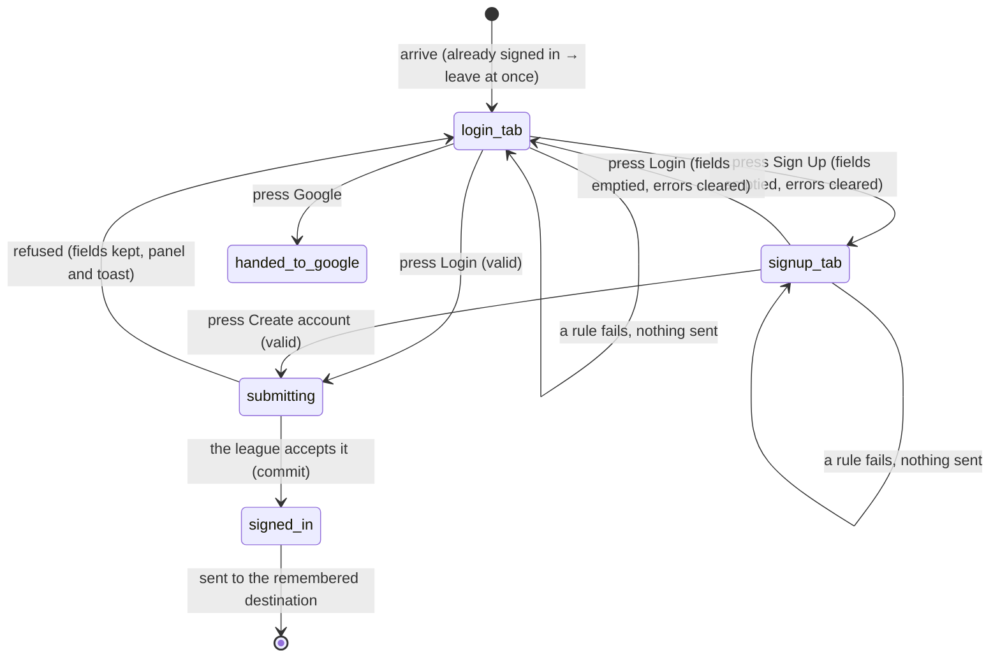

# Signing in and signing up

## Summary

`/auth` is the only page in 717rec where anyone gets a session. It offers three
ways in: sign in with an email address and password, register a new account with
an email address and password, and Google. All three sit on one card, and the
page's only other job is to remember where the user was going and send them there
afterwards.

**There is no way to reset a forgotten password anywhere in the product.** No
link, no page, no form. A user who forgets their password has to use the
[contact form](../help/contact-the-league.md). This is stated here because it is
the first thing a reader looks for and the last thing they find.

The page is reached from the Login button in the top bar, from the "Login / Sign
Up" prompt on match comments and the message board, from the admin dashboard when
a visitor asks for it, and by being redirected off `/admin`, `/admin/notifications`,
`/timeslots`, `/setup-profile`, or `/oauth/consent`. See
[`foundations/accounts-and-roles.md`](../foundations/accounts-and-roles.md).

## The simple case

The user arrives at `/auth` and sees a card headed "Welcome to 717Rec" with the
line "Login or create an account to access all features". Under it are two tabs,
Login and Sign Up, with Login already chosen. Below the tabs are an Email field
and a Password field, and a full-width **Login** button. Below those, a divider
reading "OR CONTINUE WITH" and a **Google** button. At the foot of the card:
"Don't have an account? Sign up".

Nothing is filled in and **nothing is focused**. No errors appear while the user
types. They type an address and a password and press Login. The button becomes
"Logging in..." with a spinner and both fields go dead.

A second later a toast says "Welcome back! — You've successfully logged in" and
the page changes to wherever the user was heading, or to the home page if they
were not heading anywhere.

If it fails, the fields come back to life with their text intact, a red panel
appears at the top of the card saying "Incorrect email or password", and a red
toast says the same thing under the heading "Login failed".

## The interaction, event by event

### Arrive

Nothing is fetched. The page needs no data from the league, which is why it works
with no connection to anything but the sign-in service.

Two things are decided at arrival and never revisited. First, **where to go
afterwards**: a `next` value in the URL wins, otherwise the destination handed
over by whatever redirected the user here, otherwise the home page. Anything that
is not a plain path inside the app is thrown away and becomes the home page.
Second, **whether the user is already signed in**: if they are, the page still
draws itself and then immediately sends them on, so the sign-in card can flash up
for a moment before it disappears.

Both fields start empty, the Login tab is chosen, and no field is focused. A user
who arrives and starts typing types nothing.

### Leave without changing anything

Nothing happens and nothing is kept. Coming back to `/auth` gives an empty form.
The remembered destination is not in the URL unless it arrived as `next`, so
**reloading the sign-in page loses it** and the user is sent to the home page
after signing in instead of to the page they asked for.

### Begin editing

The first keystroke changes nothing visible. There is no dirty marker, and the
Login button is enabled from the moment the page loads whether or not anything
has been typed.

**No validation runs while typing, ever.** The two rules exist and are checked
only when the button is pressed. A user can type an address with no `@` and a
one-character password and see no complaint until they try.

### While editing

Typing changes the text and nothing else. The URL never changes.

**Switching between the Login and Sign Up tabs empties both fields.** The other
tab's form is built fresh each time it is shown, so anything typed in it is gone
and cannot be recovered by switching back. Switching also clears the two field
errors and the red panel. Nothing warns that this will happen.

Pressing the button runs both rules at once and, if either fails, shows a message
under the failing field and sends nothing:

| Field | Rule | Message shown |
| --- | --- | --- |
| Email | must look like an email address | "Please enter a valid email address" |
| Password | at least 6 characters | "Password must be at least 6 characters" |

The failing field also gets a red border. Unlike the
[contact form](../help/contact-the-league.md), these messages do **not** clear as
the user corrects the field; they stay until the next submission or a tab switch.

### Submit

The button becomes "Logging in..." or "Creating account...", with a spinner, and
goes dead. Both fields are disabled while the request is in flight, and so is the
Google button. Nothing can be submitted twice.

**Signing in** sends the address and password. On success a toast says "Welcome
back!" and the page's arrival rule takes over and sends the user on.

**Registering** sends the same two values. On success a single toast says
"Account created", and the league creates the account. What follows depends on
whether the league requires email confirmation: with confirmation required the
toast reads "Please check your email to confirm your account"; with it switched
off the account is signed in at once and the toast reads "You are signed in."

> **Technical note:** the league creates a profile for a new account by itself and
> fills the username in from the part of the address before the `@`. A new account
> therefore usually already has a username, so the profile-setup gate described in
> [`foundations/accounts-and-roles.md`](../foundations/accounts-and-roles.md#profile)
> does not catch it, and the new user is sent straight to their destination rather
> than to `/setup-profile`. That auto-filled username is what other players see
> until the user changes it. See
> [`set-up-your-profile.md`](set-up-your-profile.md).

**Google** hands the browser to Google and the page ends. The app asks Google to
come back to `/setup-profile`, carrying the remembered destination with it, so a
Google user always passes through the profile page even when their profile is
finished. A second button, "Google (Native)", is drawn only inside the phone app
shell, which is out of scope here.

On any failure the fields keep their text, the button returns, a red panel appears
at the top of the card, and a red toast appears with the same words. **This page
is the one place in the app that tells the user why**: three reasons are rewritten
into plain sentences and anything else is passed through as the league sent it.

| What went wrong | What the user is told |
| --- | --- |
| Wrong address or password | "Incorrect email or password" |
| The account exists but the email was never confirmed | "Please check your email to confirm your account" |
| Registering an address that already has an account | "This email is already registered. Try logging in instead" |
| Anything else, including no network | the league's own words, unchanged |

## Modifiers

| Modifier | Set at arrival | Changed while editing |
| --- | --- | --- |
| The user's role (visitor, player, admin) | A visitor sees the form. A player or an admin is redirected off the page at once; the card can flash up first. | Signing in in another tab redirects this one to the remembered destination mid-typing. |
| The record's state | No effect. Signing in creates a session, not a record; there is nothing to be in a state. | No effect. |
| The season's state (active, archived, playoffs on) | No effect. This page is not scoped to a season. | No effect. |
| Viewport | The card is centred and capped at a readable width, so it fills a phone and floats on a desktop. The bottom tab bar sits under the card on a phone. | No effect beyond re-flowing on rotation. |
| Keys the form honours | Tab reaches the two tabs, then Email, Password, the button, and Google. Left and right arrows move between the two tabs. | Enter in either field submits. Escape does nothing. |

The remembered destination is fixed at arrival and is never re-read, so a
redirect that arrives while the user is typing does not change where they end up.

## Cancel and interrupt

| Event | Before the first edit | While editing or submitting |
| --- | --- | --- |
| Escape, or a Cancel button | No effect. There is no Cancel button on this page. | No effect. Escape does not clear the fields and does not abort a request in flight. |
| In-app navigation away, or switching tab within the page | Nothing is lost. **Switching between Login and Sign Up empties both fields** even before anything is typed, which is invisible on an empty form. | **Everything typed is lost, with no warning** — by leaving the page or by switching tab. A request already sent still completes and can still sign the user in on whatever page they are now looking at. |
| Browser back or forward | Returns to the previous page. Nothing is recorded. | Same as navigating away. **After a successful sign-in the Back button does not work**: it returns to `/auth`, which sees the session and pushes the user forward again. The user cannot get back past the sign-in page. |
| Reload, or the tab closed | Gives a fresh empty form and **loses the remembered destination** unless it was in the URL as `next`. | Everything typed is lost. A sign-in already accepted still holds, so a reload can land on a signed-in app. |
| Network lost mid-request | Cannot happen; no request is in flight. | The request fails. The fields are kept, the button returns, and the red panel and toast carry the network error in the league's own words rather than a friendly sentence. |
| The request fails or times out | Cannot happen. | The fields are kept and both the panel and the toast appear. The user decides whether to retry. Nothing is retried automatically. |
| The session expires | Not applicable; there is no session yet. | Not applicable. An expired session is one of the reasons a user is sent to this page. |
| The same record changed in another tab, or by another user | Signing in in another tab is noticed here and this tab redirects itself off the page. | Same, mid-typing. Signing **out** in another tab while sitting on `/auth` has no effect, because the page has nothing to lose. |
| Browser autofill or a password manager writes into the form | Both fields are marked for it — Email asks for the saved address, Password asks for the current password on the Login tab and a new one on the Sign Up tab — so a manager fills them without a keystroke. Validation still does not run. | Same. The filled values are treated exactly as typed ones. |
| The window loses focus | No effect. | No effect. Nothing refetches, nothing revalidates, and a request in flight continues. |

After any interrupt the user is left wherever the interrupt took them. The page
never holds them, never warns them, and never restores what they typed.

## Interactions with other systems

**Permissions and roles.** None, in the sense that everyone may use it — but a
user who already has a session is redirected away, so in practice only a visitor
can see it. See
[`foundations/accounts-and-roles.md`](../foundations/accounts-and-roles.md).

**Season scoping.** None. Accounts are not season-scoped and this page never reads
a season.

**Validation and error display.** Two rules, checked on submit only, shown under
their fields. Server refusals appear twice: once as a red panel inside the card
and once as a toast. This is the only place in the app where the league's own
reason reaches the user; see
[`foundations/messages-to-the-user.md`](../foundations/messages-to-the-user.md#what-a-failure-message-says).

**Unsaved changes.** Not handled. Leaving discards, and so does switching tab.

**Optimistic updates and rollback.** None. Nothing is shown as succeeded until the
league answers, which is why the button stays dead.

**Realtime.** None on this page. The app-wide session watcher is not a realtime
subscription, but it does react to another tab signing in or out.

**Offline.** The request fails and the error is shown as the sign-in service worded
it, which is usually a network message rather than anything about 717rec. Nothing
is queued.

**Toasts and notifications.** One toast per attempt, plus the in-card panel on
failure.

**URL state.** `next` is the only thing the URL carries, and it is the only part of
the page's state that survives a reload. It is one of the few exceptions to the
rule in [`foundations/navigation.md`](../foundations/navigation.md#while-editing)
that the URL holds nothing but a record id. The chosen tab is not in the URL, so
`/auth` cannot be linked to with Sign Up already open.

**On a phone.** The card fills the width. The email field asks for the email
keyboard. Both tab triggers are at least 44 pixels tall. The bottom tab bar stays
visible below the card.

**Accessibility.** Both fields have real labels tied to them. The failure panel is
announced as an alert when it appears. The two tabs are a proper tab list and
work with the arrow keys. **The redirect after signing in moves the user to a
different page with no announcement**, and the flash of the sign-in card before
an already-signed-in user is redirected is announced as the Sign In page.

**Side effects the user can notice.** The visit is recorded as a pageview named
"Sign In". Registering sends a confirmation email and creates a profile row with a
username taken from the address. Nothing else is written.

## Edge cases

- **Registering used to produce two toasts, and the second was wrong.** Fixed —
  see [B-27](../bug-triage.md#b-27-several-actions-raise-two-success-toasts).
  One toast is raised now, and it reads the result: a user who is signed in
  already is told so rather than being sent to check an email that never arrives.
- **Signing up with an address whose name is already taken can fail outright.**
  The league fills the username in from the part of the address before the `@`,
  and usernames must be unique. Registering `sam@example.com` when a `sam` already
  exists therefore fails at the database, and the user is shown that database
  error rather than anything about names.
- **Back is trapped after signing in.** The redirect adds a history entry instead
  of replacing the sign-in page, so pressing Back returns to `/auth` and is pushed
  straight forward again.
- **Reloading `/auth` loses where the user was going.** Everything except a `next`
  in the URL is held in memory.
- **Switching tabs silently empties both fields.** A user who types an address on
  Login, decides to register, and presses Sign Up has to type it again.
- **Field errors do not clear as they are fixed.** "Password must be at least 6
  characters" stays under a corrected field until the next submission.
- **A signed-in user who opens `/auth` sees the form for a moment.** The redirect
  runs after the first draw.
- **Nothing tells a user their session already expired.** They arrive at `/auth`
  from a guarded route with no message explaining why.

## Open questions and verification

- **There is no password reset in the product.** No forgotten-password link, no
  reset route, and no service call for one. The app does listen for a
  password-recovery sign-in, so a reset started outside the app would be
  recognised, but nothing in the app can start one. **May be worth treating as a
  bug rather than documenting.**
- **The redirect after signing in pushes rather than replaces**, which traps the
  Back button on the sign-in page. **May be worth treating as a bug rather than
  documenting.**
- Not confirmed by hand: whether the league requires email confirmation, which
  decides whether registering signs the user in immediately and therefore which
  of the two sentences the single toast carries.
- Not confirmed by hand: how long the sign-in card is visible to an
  already-signed-in user before the redirect, and what the raw sign-in-service
  message looks like when the network is down.
- The page's own tests replace the whole form with a stub, so the two field rules,
  the tab-switch emptying, and Enter-to-submit are read from the page itself
  rather than from a passing test.

Verified against `717rec` commit `ea5c8f4`.
