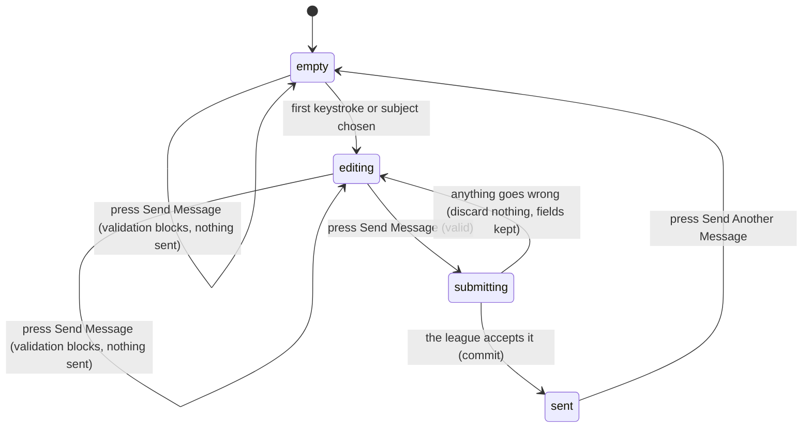

# The contact form

## Summary

The contact form is the one way anybody can send a message to whoever runs the
league from inside the app. It takes a name, an email address, a subject chosen
from a fixed list, and a message, and it sends them to the league as an email
and as a stored ticket. It is the only write in the whole app that a *visitor*
can perform without an account.

It lives at `/contact`, on its own page, reached from the footer and from the
help page. Nothing signals that it is "active"; it is a page, and arriving on it
is the whole of entering it. It is available in every state the app has: signed
out, signed in, no profile, admin, active season or none. Nothing about the
league's state changes it.

## The simple case

The user arrives at `/contact` and sees a heading, four fields, and one button
that says "Send Message". Nothing is filled in and nothing is focused. Below the
form is a line offering `admin@717rec.com` as a direct alternative.

The user types a name, an email address, picks a subject from the dropdown, and
types a message. No errors appear while they type. They press "Send Message".
The button changes to "Sending..." and goes dead.

A second later the whole form is replaced by a panel with a tick, the words
"Message Sent!", and a promise of a reply "within 24-48 hours". A toast says
"Message sent successfully!". A button offers "Send Another Message"; pressing it
returns the user to an empty form on the same page.

If it fails instead, the form stays exactly as it was — every field still filled
— and a red toast says "Failed to send message. Please try again." The button
comes back to life. The user is not told why it failed.

## The interaction, event by event

### Arrive

The page loads on its own, like every route in the app, so there is a brief blank
or skeleton the first time in a session. Nothing is fetched: the form needs no
data from the league, which is why it works when signed out and why it is the
only page in the app that cannot show stale numbers.

All four fields start empty. **No field is focused**, so a user who arrives and
starts typing types nothing. The subject dropdown reads "Select a subject" as
placeholder text, which is not a value — an unopened dropdown is an empty field,
not a defaulted one.

A fifth field exists that the user cannot see: a text input positioned far off
the left of the screen, hidden from screen readers, and skipped by Tab. It is a
trap for bots. What it does when it is filled is described under [Edge
cases](#edge-cases), and it matters more than it looks.

Nothing is recorded by arriving. There is no draft, no autosave, and no record
that the page was opened, beyond an ordinary pageview.

### Leave without changing anything

Nothing happens. No draft is kept, nothing is sent, nothing is stored. Coming
back to `/contact` later gives a fresh empty form with no memory of the visit.
This is a claim a tester can check: type nothing, leave, come back, and every
field must still be empty.

### Begin editing

The first keystroke in any field, or the first choice in the subject dropdown,
makes the form dirty. **Nothing visible changes.** No dot, no warning, no
enabling of a disabled button — the "Send Message" button is enabled from the
moment the page loads, whether or not anything has been typed.

**No validation runs on the first edit, or on any keystroke after it.** The rules
exist but they are only checked when the button is pressed. A user can type a
one-letter name and an address with no `@` in it and see no complaint at all
until they try to send.

Nothing is captured or snapshotted at this point, because there is nothing to
restore to. The form has no discard, no reset, and no undo.

### While editing

Typing does nothing except change the text. There is no live validation, no
character counter, no autosave, and no indication of how much of the message is
too much or too little. The URL never changes; `/contact` is `/contact` from
arrival to submission.

Pressing "Send Message" at any point runs every rule at once and, if any fails,
shows a message under each failing field and sends nothing:

| Field | Rule | Message shown |
| --- | --- | --- |
| Name | at least 2 characters | "Name must be at least 2 characters" |
| Email | must look like an email address | "Please enter a valid email address" |
| Subject | must be chosen | "Please select a subject" |
| Message | at least 10 characters | "Message must be at least 10 characters" |

Once a field has failed once, it is re-checked as the user types, so its message
clears as soon as the field becomes valid. Before the first failed submission it
is not checked at all.

The subject list is fixed and has six entries: Bug Report, Feature Request,
Account Issue, Score Dispute, General Question, Other. There is no free-text
subject and no "none".

### Submit

The button becomes "Sending..." and is disabled, so the form cannot be submitted
twice from the button. The four visible fields stay enabled and editable while
the request is in flight; typing during it changes nothing about what was sent.

What is sent is one request to the league carrying the name, email, subject key,
message, and the hidden field. It goes to a server function, not straight to the
database.

On success, three things happen at once: the form is emptied, the page is
replaced by the success panel, and a toast says "Message sent successfully!". The
user cannot get back to what they typed — the reset is unconditional and there is
no copy of the message anywhere the user can reach.

> **Technical note:** the league stores the message as a ticket *and* emails it,
> and treats either one succeeding as success. If the ticket stores but the email
> fails, the user is told the message was sent, and it was — it is waiting in the
> league's ticket list rather than in an inbox. Only when *both* fail does the
> user see a failure.

On failure, nothing is cleared. Every field keeps its text, the button comes
back, and one red toast appears reading "Failed to send message. Please try
again." **The toast is the same regardless of why it failed.** The league's
server distinguishes several cases — too many messages from one address in ten
minutes, too many links in the message, a message too long, the league
unreachable — and the app collapses all of them into one sentence advising a
retry. For two of those cases a retry cannot work; see [Open
questions](#open-questions-and-verification).

## Modifiers

| Modifier | Set at arrival | Changed while editing |
| --- | --- | --- |
| The user's role (visitor, player, admin) | No effect. The form looks and behaves identically for all three, and nothing is prefilled from a signed-in profile. | No effect. Signing in or out in another tab does not reach this page. |
| The record's state | No effect. The form creates a new message every time; there is no record to be in a state. | No effect. |
| The season's state (active, archived, playoffs on) | No effect. This is the only page in the app that is not scoped to a season. | No effect. |
| Viewport | The two top fields sit side by side on a wide screen and stack on a narrow one. The message box is the same height either way. | No effect beyond re-flowing on rotation. |
| Keys the form honours | Tab moves through Name, Email, Subject, Message, Send Message — the hidden field is skipped. Enter inside the message box adds a newline. | Enter in any single-line field submits the form. Escape closes the subject dropdown and does nothing else. |

Changing a variant mid-edit changes nothing here, because none of them is read at
submit time. The form sends exactly what is typed, and who is typing it is never
part of the request — the league receives the name and address given in the
fields, even from a signed-in user whose real account details differ.

## Cancel and interrupt

| Event | Before the first edit | While editing or submitting |
| --- | --- | --- |
| Escape, or a Cancel button | No effect. There is no Cancel button anywhere on this page. | Closes the subject dropdown if it is open. Otherwise no effect. It does not clear the form and it does not abort a submission in flight. |
| In-app navigation away, or switching tab within the page | Nothing is lost, because nothing was typed. | **Everything typed is lost, with no warning.** There is no unsaved-changes guard. A submission already in flight still completes and still reaches the league, but the user never sees the outcome — no success panel, no toast. |
| Browser back or forward | Returns to the previous page. Nothing is recorded. | Same as navigating away, and the app cannot prevent it. Coming forward again gives an empty form; the text is not restored. |
| Reload, or the tab closed | Gives a fresh empty form. | **Everything typed is lost.** A submission already sent still lands with the league; a submission not yet sent is gone. After a reload the user has no way to tell which happened. |
| Network lost mid-request | Cannot happen; no request is in flight. | The request fails. The fields are kept, the button returns, and the generic red toast appears. The message is not queued and no retry is attempted — there is no offline queue anywhere in this app. |
| The request fails or times out | Cannot happen. | The fields are kept and the generic red toast appears. The user decides whether to retry. Nothing distinguishes "the league never got it" from "the league got it and the reply failed"; a retry may therefore send the same message twice. |
| The session expires | No effect. | No effect. The form needs no session and works signed out, so an expired session changes nothing about whether the message sends. |
| The same record changed in another tab, or by another user | No effect. There is no shared record. | No effect. Two tabs can each hold a different draft and each send it; neither knows about the other. |
| Browser autofill or a password manager writes into the form | Name and email may be filled from the browser's saved contact details; both fields ask for it by name. Subject and message are never autofilled. The form does not become dirty in any way the user can see, and validation still does not run. | Same. **If an autofill tool also fills the hidden field, the message is silently discarded and the user is still shown the success panel.** See [Edge cases](#edge-cases). |
| The window loses focus | No effect. | No effect. Nothing refetches, nothing revalidates, and a submission in flight continues. This page is the one place in the app where losing focus is genuinely inert. |

After any interrupt the user is left wherever the interrupt took them; the form
does not try to hold them, warn them, or restore them. The only state that
survives leaving this page is what already reached the league.

## Interactions with other systems

**Permissions and roles.** None. Every role sees the same page and can submit.
This is the only write in the app with no permission check in front of it, which
is why the league's server carries its own rate limit and spam checks instead.

**Season scoping.** None. The message is not attached to a season, a team, or a
match, even when the subject is "Score Dispute". Whoever reads it has to work out
from the text which match is meant.

**Validation and error display.** Field rules run only on submit, then per-field
as the user corrects them. Errors appear under each field in the standard form
style. Server-side rejections do not appear under fields; they become the one
generic toast.

**Unsaved changes.** Not handled. No guard, no prompt, no draft. This is the
weakest part of the page.

**Optimistic updates and rollback.** None. Nothing is shown as succeeded until
the league has answered, which is why the button stays dead until then.

**Realtime.** None. No subscription is opened by this page.

**Offline.** The request fails and the user is told to try again. Nothing is
queued for later.

**Toasts and notifications.** Exactly one toast per submission attempt: a plain
one on success, a red one on failure. The success toast is redundant with the
success panel that replaces the form, so a successful submit produces two
confirmations of the same thing.

**URL state.** None. `/contact` carries nothing, so a part-filled form cannot be
shared, bookmarked, or linked to.

**On a phone.** The two top fields stack. The email field asks for the email
keyboard. The message box is 150 pixels tall before it grows. Nothing else
changes.

**Accessibility.** Every field has a real label. Error messages are tied to their
fields. The hidden bot trap is marked as hidden from screen readers and removed
from tab order, so it does not reach anyone navigating by keyboard or by voice.
The success panel replaces the form rather than appearing beside it, which means
a screen reader user is moved to new content without an announcement that this
has happened.

**Side effects the user can notice.** A successful submit sends an email to
`admin@717rec.com` with the user's address as the reply-to, so a reply arrives in
the user's inbox from the league. It also records a "contact form submitted"
analytics event carrying the chosen subject — never the name, address, or message
— and only when the app is running as the published build.

## Edge cases

- **A message that passes the app's rules can still be refused by the league.**
  The app asks for a name of at least 2 characters and a message of at least 10.
  The league additionally refuses a name over 100 characters, a message over
  5000, or an address over 255. Nothing in the form says so, and going over shows
  the generic "please try again" toast, which will never succeed no matter how
  often it is pressed.
- **A message with more than five links is refused** as spam, again with the
  generic toast and no explanation.
- **Five messages in ten minutes is the limit** from one address. The sixth is
  refused for the rest of the ten minutes, and the user is told to try again.
- **The hidden bot trap discards silently.** If anything fills that field, the
  league answers "success", stores nothing, and sends nothing — and the user sees
  "Message Sent!" and waits for a reply that will never come. Bots fill it
  deliberately; an aggressive password manager or form-filler could fill it by
  accident.
- **Pressing Enter in a single-line field sends the form**, so a user who fills
  the name and presses Enter out of habit triggers validation on a form they have
  not finished.
- **"Send Another Message" returns to a blank form**, not the previous one. There
  is no way to send a near-duplicate without retyping.
- **Two tabs can send the same draft twice.** Nothing deduplicates.
- **A retry after a failure may duplicate.** If the league stored the ticket but
  the reply to the browser was lost, the user sees a failure and retries, and the
  league gets two.
- **The success panel is not a route.** It cannot be linked to, and a reload
  after success returns to an empty form with no evidence the message was sent.

## Open questions and verification

- **The dev server's address is not in the league's allowed list.** The server
  function accepts requests from `717rec.app`, the Lovable preview addresses,
  `localhost:3000`, and `localhost:5173`. The app's own dev server runs on
  `localhost:8080` (`vite.config.ts`, and the README's own instructions). The
  contact form therefore appears to fail for anyone running the app locally,
  while working in production. **May be worth treating as a bug rather than
  documenting.**
- **The generic failure toast advises a retry in cases where a retry cannot
  work.** Rate-limited and over-length submissions are permanent refusals for
  the moment, and the user is told to try again. The server sends a specific
  message in each case and the app discards it. **May be worth treating as a bug
  rather than documenting.**
- **The silent-success honeypot has no safety net.** Not confirmed by hand
  whether any common password manager fills a field named `website` that is
  `aria-hidden`, off-screen, and `autocomplete="off"`. If one does, that user can
  never contact the league and will never know.
- Not confirmed by hand: whether the success toast and the success panel appear
  together or one replaces the other visually, and how long the toast stays.
- Not confirmed by hand: what the email actually looks like when it arrives, and
  whether the reply-to works as intended.
- Not confirmed by hand: whether a screen reader announces the switch to the
  success panel.
- The page's own tests bypass the validation layer entirely — they mock the form
  handler and call the submit path directly — so the four field rules and the
  Enter-to-submit behaviour above are read from the schema and the component, not
  from a passing test.
- Assumption: "within 24-48 hours" on the success panel is a statement of intent
  by the league, not something the product enforces or measures.

Verified against `717rec` commit `ea5c8f4`.
