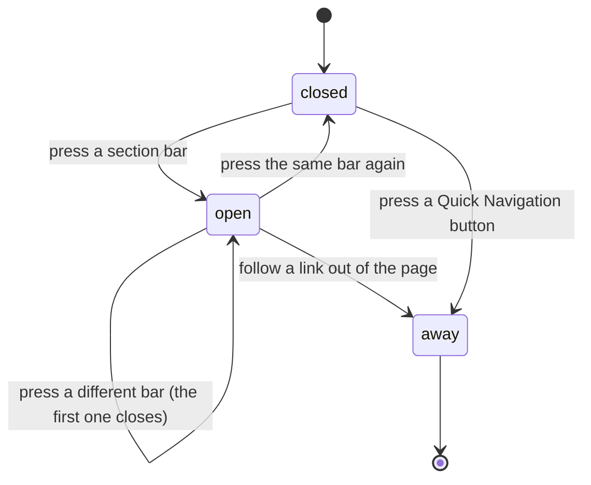

# The help page

## Summary

The help page is the app's only written explanation of itself. It lives at
`/help`, is reachable from the main navigation, and is open to everyone. It is a
short list of shortcuts followed by a stack of closed sections, each of which
opens to a few paragraphs about one part of the product.

It is a reading surface. Nothing on it can be submitted, and the only thing a
user can do is open a section or follow a link. The page it most closely belongs
beside is the contact form at
[`contact-the-league.md`](contact-the-league.md), which is what the help page
points at when its own answers run out.

**The content is not editable by anyone.** It is written into the app and changes
only when the app changes. Two numbers are the exception: the power score
breakdown quotes the league's live weights, which an admin can change.

## The simple case

The user opens `/help` and sees a heading, "Help & Getting Started", and a line
under it promising "Everything you need to know about using 717REC for league
management and participation."

Below that is a **Quick Navigation** card with four buttons — Teams, Schedule,
Standings, Playoffs — which go straight to those pages.

Under that is a stack of nine closed bars, each with an icon and a title:
Welcome to 717REC, Viewing Standings & Stats, Understanding the Schedule, Team
Pages, Playoff Brackets, Message Board, League History, Accessibility & Keyboard
Navigation, and Frequently Asked Questions.

Pressing a bar opens it and shows its content. Pressing another bar opens that one
and **closes the first**. Pressing an open bar closes it and leaves nothing open.

An admin sees more: a sub-heading reading **Admin Guide** with five further
sections between Accessibility and the FAQ, and a card at the very bottom offering
the admin dashboard.

## The interaction, event by event

### Arrive

The page loads on its own, so there is a brief blank the first time in a session.
It is one of the few routes that arrives without breadcrumbs and without the
fade-in the rest of the app uses, so it appears more abruptly than its neighbours.

One request goes out: the league's current power score weights. They are used in
two places — the "Power Score" bullet under Viewing Standings & Stats, and the
first FAQ answer — and in the machine-readable summary the page publishes for
search engines. While that request is in flight, or if it fails, the standard
40 / 45 / 15 split is used instead, so the copy is never blank and never
half-written.

Everything else on the page is fixed text. **Every section starts closed** and
their contents do not exist on the page until they are opened.

Nothing is focused on arrival and nothing is recorded beyond an ordinary pageview.

### Leave without changing anything

Nothing happens. Which section was open is not remembered, in the browser or
anywhere else, and coming back gives a fully closed page.

### Begin editing

There is nothing to edit. Opening a section is the only state this page has.

Opening one draws its content, which is why the browser's own find-in-page cannot
see anything inside a closed section. A user searching the page for a word finds
only the nine titles.

### While editing

Only one section can be open at a time. A user comparing what the help page says
about standings with what it says about playoffs has to keep pressing back and
forth; the two cannot be on screen together.

The URL never changes. `/help` is `/help` with any section open, so a particular
answer cannot be linked to, bookmarked, or sent to somebody who asked the
question.

### Submit

There is no submit. The page sends nothing to the league at any point.

The two things that end the interaction are following a Quick Navigation button
and following one of the two links inside the content: the **Contact page** link at
the foot of the Accessibility section, and the **Admin Dashboard** button an admin
sees at the bottom. The Contact link is a plain link rather than an in-app one, so
it reloads the whole app on the way to `/contact` instead of moving there
instantly.

## Modifiers

| Modifier | Set at arrival | Changed while editing |
| --- | --- | --- |
| The user's role (visitor, player, admin) | Visitors and players see nine sections and no dashboard card. An admin sees an "Admin Guide" heading, five further sections, and a card at the bottom linking to the admin dashboard. | Gaining or losing admin re-draws the page: the extra sections and the card appear or vanish, and an open section can be pushed down the page as they do. |
| The record's state | No effect. Nothing on this page is attached to a record. | No effect. |
| The season's state (active, archived, playoffs on) | No effect. The help page is the same in every season and when there is none. | No effect. |
| Viewport | The Quick Navigation buttons are four across on a wide screen and two across on a phone. Everything else is one column at every width. | No effect beyond re-flowing. |
| Keys the form honours | Tab reaches the four Quick Navigation links and every section bar. Enter and Space open a section. Arrow keys move between the bars. | Escape does nothing. There is no key that closes an open section other than pressing its bar again. |

The power score weights are the one thing on this page that can change without the
app changing. An admin who changes them elsewhere changes the sentence every user
reads here, up to five minutes later.

## Cancel and interrupt

| Event | Before the first edit | While editing or submitting |
| --- | --- | --- |
| Escape, or a Cancel button | No effect. There is no Cancel on this page. | No effect. Escape does not close an open section. |
| In-app navigation away, or switching tab within the page | Nothing is lost. | Nothing is lost. Which section was open is forgotten, so coming back means finding it again. |
| Browser back or forward | Returns to the previous page. Nothing is recorded. | Same. Opening a section adds nothing to history, so Back from an open section leaves the page entirely rather than closing the section. |
| Reload, or the tab closed | Gives the same fully closed page. | The open section closes. Nothing else is lost. |
| Network lost mid-request | The page still renders in full, because all of its text is part of the app. Only the weights request fails, and the standard split is used in its place. | No effect. Nothing else is ever requested. |
| The request fails or times out | The weights fall back to 40 / 45 / 15 silently. **Nothing tells the reader the numbers may not be the league's current ones.** | No effect. |
| The session expires | No effect. The page needs no session and is identical signed out — except that the admin sections vanish when the app notices. | No effect. |
| The same record changed in another tab, or by another user | An admin changing the weights does not reach an open page. The reader keeps the old numbers until something causes a refetch. | Same. There is no realtime here. |
| Browser autofill or a password manager writes into the form | No effect. There are no fields anywhere on this page. | No effect. |
| The window loses focus | No effect on what is displayed. | Returning to the tab can quietly refresh the weights, so the power score sentence can change between one look and the next. |

Nothing on this page can be half-done. After any interrupt the reader is either on
it or not.

## Interactions with other systems

**Permissions and roles.** Reading needs nothing. The Admin Guide and the
dashboard card are shown from the admin flag on the loaded profile, so they can
appear a moment after the rest of the page. They are only a view: the dashboard
behind them is guarded separately. See
[`../cross-cutting/permissions.md`](../cross-cutting/permissions.md).

**Season scoping.** None. Nothing on this page is scoped to a season, and nothing
on it changes when a season changes over.

**Validation and error display.** Neither applies. The page has no input and its
one request fails silently into a default.

**Unsaved changes.** None.

**Optimistic updates and rollback.** None.

**Realtime.** None. No subscription is opened.

**Offline.** The page still renders, because its text is part of the app. Only
the power score numbers fall back to their defaults.

**Toasts and notifications.** None. This page produces no messages of any kind.

**URL state.** Nothing. No section, no anchor, no fragment. An answer on this page
cannot be pointed at, which is the page's biggest single weakness — every
question has to be answered with "open /help and look for the section about X".

**On a phone.** The Quick Navigation grid drops to two columns. The sections are
full width and the keyboard-shortcut table inside the Accessibility section stays
a two-column list, which is the tightest thing on the page.

**Accessibility.** The section bars are proper accordion controls: they report
whether they are open, and arrow keys move between them. The Accessibility section
itself is built differently from the other eight — no icon panel, no border —
so it reads as a different kind of thing than the sections around it. The admin
dashboard card puts a button inside a link, which gives assistive technology two
overlapping controls for one action.

**Side effects the user can notice.** One: the page publishes its four FAQ
answers in a form search engines read, with the league's live power score weights
inside them. A search result quoting the league's formula comes from here. See
[`../cross-cutting/what-the-league-sees.md`](../cross-cutting/what-the-league-sees.md).

## Edge cases

- **The help page cannot be searched.** Closed sections are not on the page, so
  the browser's find-in-page matches only the nine titles. There is no search box
  of the app's own.
- **Only one section can be open at a time**, so two answers can never be
  compared side by side.
- **No answer has an address.** Nothing on the page can be linked to, so help
  cannot be pointed at from anywhere else in the app or from a message.
- **The Contact page link reloads the app.** It is written as an ordinary web
  link rather than an in-app one, so following it discards the whole page and
  loads the app again from scratch. **May be worth treating as a bug rather than
  documenting.**
- **The contact form is described as reachable from the footer**, in
  [`contact-the-league.md`](contact-the-league.md). The footer holds only an email
  address; the routes to `/contact` are the main navigation and this page's
  Accessibility section.
- **The Team Pages section describes tabs the team page does not have.** It names
  a Stats Tab, a Matches Tab, an H2H Tab, and an Achievements Tab; the team page is
  built from collapsible sections with those names, not tabs. **May be worth
  treating as a bug rather than documenting.**
- **The power score numbers can be out of date by up to five minutes**, and can be
  the standard defaults rather than the league's real weights if the request
  failed. Nothing on the page distinguishes the two.
- **The FAQ's answer about playoff seeds hedges** — "typically based on regular
  season standings or power rankings" — where the rest of the page states facts.
  It is the one answer that does not commit.
- **The Admin Guide appears inline, not in a separate place**, so an admin's help
  page is longer and the FAQ sits five sections further down than it does for
  everyone else.
- **The help content and the admin dashboard's own Getting Started tab are two
  different documents.** They cover the same ground in different words and neither
  points at the other; see
  [`../admin/the-admin-dashboard.md`](../admin/the-admin-dashboard.md).
- **The page makes claims about the product that nothing checks.** The
  Accessibility section lists screen readers the app is said to work with and
  promises 44-pixel touch targets; nothing in the app enforces either. See
  [`../cross-cutting/accessibility.md`](../cross-cutting/accessibility.md).

## Open questions and verification

- **The help content is not editable by an admin anywhere in the app.** The
  README's plan for `admin/site-settings.md` lists "help content" as an admin
  surface. No such surface exists at this commit: the only admin help surface is a
  fixed Getting Started tab inside the dashboard. The plan should be corrected or
  the feature is missing.
- Not confirmed by hand: whether the power score sentence visibly changes after an
  admin changes the weights, and how long it takes.
- Not confirmed by hand: whether the admin sections appear late enough after the
  page loads to move an already-open section under the reader.
- Not confirmed by hand: how the accordion behaves with a screen reader, and
  whether opening a section moves focus or announces the new content.
- Not confirmed by hand: what the machine-readable FAQ summary looks like in a
  search result, and whether the weights inside it are the live ones at the time
  the page was crawled.
- Not confirmed by hand: whether the Accessibility section's differing appearance
  is deliberate or an oversight.
- Assumption: the help page is meant to be the first place a confused user looks.
  Nothing links to it from an error state, an empty state, or a failed action
  anywhere else in the app.

Verified against `717rec` commit `ea5c8f4`.
