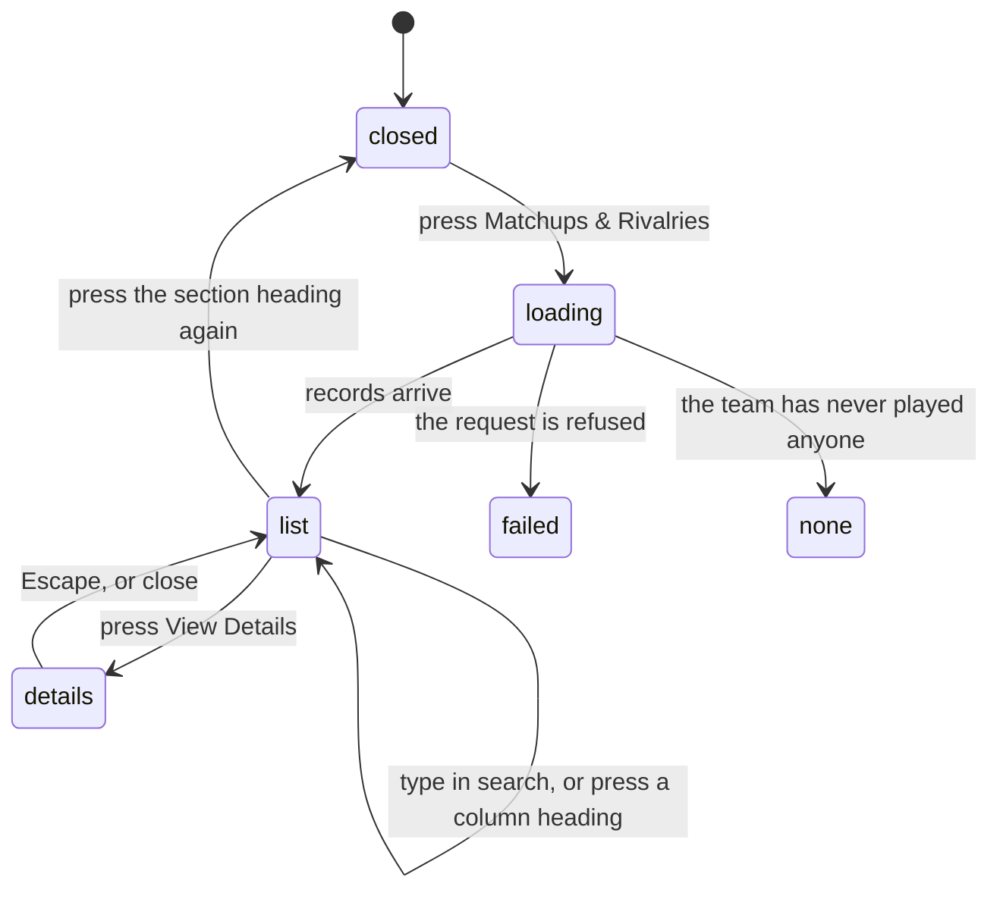

# Head to head

## Summary

Head to head is one team's record against one other team. It answers "how do we
do against them?" and it answers it **across every season the two have ever
played**, regular season and playoffs together. It is one of the few numbers in
the app that is not scoped to a season.

It has no page of its own. It appears in three places: a **Matchups & Rivalries**
section on a team's page, a one-line summary on every match card in the schedule,
and a panel on the two-team comparison page. The team page is the full version
and is what this document describes; the other two are the same numbers, shortened.

Nothing here can be written. Every control is a filter, a sort, or a way of
opening more detail.

## The simple case

The user opens a team's page and scrolls to a closed section headed **Matchups &
Rivalries**. Pressing it opens the section and fetches the team's record against
every opponent it has met.

At the top are up to three cards — Top Rival, one for a matchup the team wins,
and one for a matchup it loses — each naming an opponent and an all-time record.
Under them is a table, one row per opponent: name, wins and losses, win
percentage, matches played, game record, and the date they last met. It is sorted
by wins, most first.

A search box filters the list by opponent name as the user types. Pressing a
column heading sorts by it; pressing the same heading again reverses the order.
An **Export CSV** button downloads whatever is currently on screen.

Pressing **View Details** on a row opens a dialog headed "Head-to-Head vs
{opponent}": four large numbers, a game record, and a list of every match the two
teams have played, with date, location, and score. Escape or the close button
dismisses it.

## The interaction, event by event

### Arrive

Nothing is fetched while the section is closed — the section's contents do not
exist until it is opened, so a user who never opens it never asks the league for
this data.

Opening it sends one request for the team's record against every opponent, and a
second to look up those opponents' names and logos. While they are in flight the
section shows "Loading records...".

If the request is refused the section reads "Error loading head-to-head records"
in red, with no reason and no retry button.

If the team has played nobody, the section shows crossed swords and "No
head-to-head records yet — Records will appear after playing against other teams".

Otherwise the rivalry cards and the table appear together. The search box is
empty and **is not focused**. The sort starts on wins, highest first.

Nothing is recorded by opening the section.

### Leave without changing anything

Nothing happens. The section's open state, the search text, and the sort order
are all held in the page and are gone the moment the user navigates away. Coming
back gives a closed section again.

### Begin editing

There is nothing to edit. The nearest equivalent is the first keystroke in the
search box or the first press of a column heading.

Neither is announced, neither is stored, and neither changes the URL. The list
re-orders or shrinks under the user immediately, with no loading state, because
all of it is already in the browser.

### While editing

Typing filters the rows to opponents whose name contains what was typed,
ignoring capitals. There is no delay and no request — the filter runs on every
keystroke against the list already fetched. When nothing matches, the table is
replaced by `No opponents found matching "..."` quoting the search text.

Pressing a column heading sorts by that column, highest first. Pressing the same
heading again reverses it. There are five sortable columns: Opponent, W-L, Win%,
Matches, and Game W-L. "Last Played" is **not** sortable, which is the one column
a user is most likely to want in order.

On a phone the column headings are gone and a dropdown replaces them with four
fixed choices: Most Wins, Best Win%, Most Matches, and Name A-Z. The other
orderings cannot be reached from a phone at all.

**Export CSV** downloads the rows as they are currently filtered and sorted, named
after the team and today's date. It sends nothing to the league.

### Submit

There is no submit. The only two actions that go anywhere are the CSV download,
which is entirely local, and **View Details**, which opens the per-opponent
dialog.

The dialog asks the league for every match between the two teams. Until that
answer arrives **the dialog does not appear at all** — pressing View Details
looks like it did nothing, and then the dialog appears a moment later. There is
no loading state in between.

Once open, the dialog shows matches played, wins, losses, and win rate as four
large numbers, then the game record and game win rate, then every match with a
W or L badge, the date, the location, the match score, and the game score.

Closing it discards nothing, because nothing was entered.

## Modifiers

| Modifier | Set at arrival | Changed while editing |
| --- | --- | --- |
| The user's role (visitor, player, admin) | No effect. All three see identical numbers and identical controls. Head to head is public. | No effect. Signing in or out does not change what is shown. |
| The record's state | An opponent met fewer than three times gets no rivalry label. An opponent never met does not appear at all — the row simply is not there. | A match being completed elsewhere does not appear here until the section is opened again. |
| The season's state (active, archived, playoffs on) | **No effect, and this is the point.** Head to head spans every season, including archived ones, and counts playoff meetings alongside regular-season ones. | No effect. |
| Viewport | On a wide screen the records are a table with sortable headings and a View Details button per row. On a phone they are cards with a coloured left edge, a sort dropdown, and the whole card acting as the button. | Crossing the width swaps the layout and keeps the search text and the sort. |
| Keys the form honours | Tab reaches the search box, the sort dropdown or headings, Export CSV, each opponent name, and each View Details button. Enter and Space on an opponent name go to that team's page. | Escape closes the details dialog. **Escape does not clear the search box** — it is a plain text field, so the only way to see every opponent again is to delete what was typed. |

## Cancel and interrupt

| Event | Before the first edit | While editing or submitting |
| --- | --- | --- |
| Escape, or a Cancel button | No effect. There is no Cancel here. | Escape closes the details dialog and returns focus to the button that opened it. It does nothing in the search box. Neither cancels a request. |
| In-app navigation away, or switching tab within the page | Nothing is lost. | The search text and sort order are lost with no warning. There is nothing to save, so nothing is at risk. A request in flight is discarded. |
| Browser back or forward | Returns to the previous page. The section is closed again on return. | Same as navigating away. The dialog does not add a history entry, so Back from an open dialog leaves the team page entirely rather than closing the dialog. |
| Reload, or the tab closed | The section is closed and everything is fetched again from scratch. | The search, the sort, and the open dialog are all gone. Nothing was pending. |
| Network lost mid-request | The section shows "Error loading head-to-head records" with no reason and no retry. | The details dialog never appears. Nothing tells the user why. |
| The request fails or times out | Retried once, then the red error line. The rivalry cards above simply do not render, so the section looks half-broken rather than failed. | As above. Closing and reopening the section is the only retry. |
| The session expires | No effect. Every read here is public. | No effect. |
| The same record changed in another tab, or by another user | No effect. There is no realtime here. A match completed while the page is open does not change these numbers. | No effect. The records are held for five minutes and are deliberately **not** refetched on returning to the tab or on remounting. |
| Browser autofill or a password manager writes into the form | The search box is a plain search field and is not offered anything to fill. | Same. If something did fill it, the list would filter with no other consequence. |
| The window loses focus | No effect. | No effect. This is one of the few places in the app that explicitly refuses to refetch on focus, so the numbers stay exactly as loaded. |

After any interrupt the user is left with whatever the page holds. Nothing here
can be half-done, because nothing is ever written.

## Interactions with other systems

**Permissions and roles.** None. Head to head is readable by anyone, signed in or
not, and there is no control on it that any role lacks.

**Season scoping.** None, deliberately. This is career data. There is no way
anywhere in the app to ask "how did we do against them *this* season"; see
[`../foundations/seasons.md`](../foundations/seasons.md#what-is-scoped-to-a-season-and-what-is-not).

**Validation and error display.** Nothing is validated. Errors are a single red
line with no reason, which is less than the rest of the app manages.

**Unsaved changes.** Not applicable. There is nothing to save.

**Optimistic updates and rollback.** None.

**Realtime.** None. A match finishing does not move these numbers on an open
page.

**Offline.** The section cannot load and the details dialog cannot open. The CSV
export still works, because it uses what is already in the browser.

**Toasts and notifications.** None at all. Every failure here is a line of text
inside the section, and the CSV download is silent.

**URL state.** Nothing. The open section, the search text, the sort order, and
the open dialog are all invisible to the URL, so none of them can be linked to.

**On a phone.** The table becomes a card list, the sortable headings become a
four-choice dropdown, and the Export button shrinks to "CSV". The details dialog
fills most of the screen and scrolls.

**Accessibility.** The opponent name is a container with a button role, a tab
stop, and a label reading "View team details for {name}", so it works by
keyboard. The details dialog is a real dialog: focus is trapped and returns to
the trigger. The rivalry labels are colour-coded but also carry their words, so
colour is not the only signal.

**Side effects the user can notice.** None. Nothing is written and no email or
notification results from anything on this surface.

## Edge cases

- **The W and L badges in the details dialog are wrong.** The dialog decides
  whether a match was a win by comparing the team's identifier against a team
  *name*, which never matches, so it always ends up marking the match a win when
  the second-named team won. Half of every team's match list is therefore
  mislabelled. **May be worth treating as a bug rather than documenting.**
- **View Details looks unresponsive.** The dialog renders nothing until its data
  arrives, so the first press produces no visible change. The dialog's own
  "Loading matches..." state can only be reached after it is already open.
- **"Last Played" for a playoff meeting is the wrong date.** Playoff matches
  contribute the moment their bracket row was created, not the day they were
  played, so a playoff meeting can date the whole matchup to whenever the bracket
  was built.
- **Playoff game counts are credited to the wrong side.** The game wins and losses
  a playoff meeting contributes are worked out in a way that gives the losing team
  the winner's games and can leave the winner on zero. Match wins and losses are
  correct; the game record beside them is not. **May be worth treating as a bug
  rather than documenting.**
- **Pressing an opponent's name navigates by name, not by identity.** The link is
  built from the opponent's name, so a team that has been renamed, or two teams
  with names that reduce to the same address, will not land where expected.
- **An opponent never played is not "0-0", it is absent.** Only meetings that
  happened produce a row. On a match card the same absence is shown as "First
  meeting", which is the only place the app says so out loud.
- **Two opponents with the same name break the list.** Rows are identified by
  opponent name rather than by team, so duplicates can collapse into one another.
- **Sorting by "Game W-L" sorts by game wins only.** Game losses are ignored, so
  the order is not the order the column appears to promise.
- **The rivalry cards can be missing while the table is fine.** They need three or
  more meetings to classify anything, so a team early in its first season sees the
  table with no cards above it and no explanation.

## Open questions and verification

- **Confirmed against real data: the percentage scale is correct.** The view
  `v_head_to_head` stores `win_pct` on a 0-to-100 scale, to one decimal, and
  every consumer reads it that way. An earlier draft of this document claimed the
  opposite, from a superseded migration; both findings were withdrawn. See B-06
  in [`../bug-triage.md`](../bug-triage.md) for the evidence.
- The playoff game counts above are still read from the code only, not confirmed
  against real data.
- Not confirmed by hand: whether the details dialog's match list is capped, and in
  what order it arrives.
- Not confirmed by hand: what the schedule's match-card line shows while its own
  batched request is still in flight, and whether it and the team page can
  disagree about the same matchup at the same moment.
- Not confirmed by hand: whether the CSV opens cleanly in a spreadsheet, given
  team names containing commas and apostrophes.
- Assumption: head to head is intended to be career-wide everywhere it appears.
  Nothing in the interface says so, and a user could reasonably read the numbers
  on a team's page as this season's.

Verified against `717rec` commit `ea5c8f4`.
