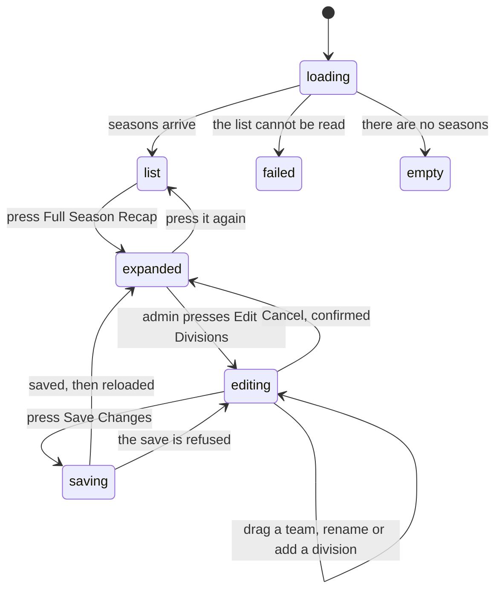

# Past seasons

## Summary

The history page is where the league's finished seasons are kept. It shows one
card per season, newest first, each carrying that season's champions, three
headline numbers, and — when opened — the full final standings split by
division.

It lives at `/history` and is open to everyone. Nothing on it can be changed by a
player. An admin gets one extra control inside an opened season: the ability to
move teams between divisions and reorder them, which is the only write this page
has.

The numbers here are frozen. An archived season's standings, power scores, and
strength of schedule do not move when the league later changes how those numbers
are worked out. See
[`../foundations/seasons.md`](../foundations/seasons.md#what-frozen-means).

## The simple case

The user opens `/history` and sees a card headed "Loading historical data..." for
a moment, then a stack of season cards with the most recent at the top.

Each card gives the season's name, the months it ran, and a line reading
something like "12 teams · 66 matches". Under that sit two small panels side by
side: **Champions**, listing each division's winning team with its record, and
**Highlights**, giving Most Wins, Best Power Score, and Most Game Wins.

At the foot of every card is a strip reading **Full Season Recap**. Pressing it
slides open the final standings, one panel per division, ordered Competitive
first and Recreational last. Each panel is a table: rank, team, match record, win
percentage, game record, game win percentage, power score, and strength of
schedule. The champion's row is tinted gold with a crown; the runner up's is grey
with a medal.

Pressing the strip again closes it. Nothing is saved, nothing is sent, and the
page is the same on the next visit.

## The interaction, event by event

### Arrive

The page loads on its own, so there is a brief blank the first time in a session.
Then one request fetches every season's name, dates, and active flag, ordered by
start date with the newest first.

**Every season is listed, not only the archived ones.** The season the league is
playing right now appears at the top with a green **Active** badge. A season with
no champion recorded and no active flag gets no badge at all.

Each season card then fetches its own standings as soon as it appears —
**before** anything is expanded, and for every card on the page at once. Ten
seasons means ten requests on arrival.

> **Technical note:** those per-season requests are marked as never fresh, so
> they run again every time the page is mounted. Most of the app keeps data for
> five minutes; this page does not. See
> [`../foundations/saving-and-freshness.md`](../foundations/saving-and-freshness.md#how-long-data-is-kept).

While a card's standings are loading, its two summary panels are grey
placeholders. When they arrive, the "N teams · M matches" line appears with them.

Nothing is focused on arrival. Nothing is recorded beyond an ordinary pageview.

### Leave without changing anything

Nothing happens. No card's open or closed state survives leaving the page.

`/history` does remember **scroll position** and restores it when the user comes
back with the browser's back button — one of the few routes that does. Every card
is closed again on return, so the restored position may not point at the same
card.

### Begin editing

There is no form here for a player. The two things that behave like beginning are
opening a recap and, for an admin, entering edit mode.

Opening a recap changes nothing outside the browser. On a wide screen every
division panel inside it starts open; on a phone every panel starts closed and
has to be tapped open one at a time.

An admin sees an **Edit Divisions** button at the top of an opened recap. Pressing
it replaces the read-only panels with a drag-and-drop board and a toolbar. The
toolbar reads "No changes" in green until the first change, then "N unsaved
changes" in amber. Nothing is written yet.

### While editing

In edit mode the admin can drag a team to another division, drag it up or down
within its division, rename a division in place, add an empty division, and
remove a division that has no teams left in it.

Every drop renumbers the ranks in both the division the team left and the
division it joined, so ranks stay 1, 2, 3 with no gaps. Removing a division that
still holds teams is refused with a red toast reading "Cannot Remove Division —
Move all teams out of this division first."

A **Reset** button appears next to Cancel as soon as there is a change. It
discards every local change at once and asks nothing.

The URL never changes. `/history` is `/history` throughout, so an opened season,
an opened division, and edit mode cannot be linked to or bookmarked.

### Submit

**Save Changes** sends only the teams whose division or rank differs from what was
loaded. They go in groups of ten, and each team is written twice: once to the
season's standings and once to the archived team record behind them.

On success a toast says "Changes Saved — Successfully updated N teams", the
season's standings are fetched again, and the board returns to the read-only
panels.

On failure a red toast says "Update Failed" followed by **the database's own
reason**. This page is unusual in that respect: most of the app replaces the
server's reason with a generic sentence. The board stays open with every change
still in place.

## Modifiers

| Modifier | Set at arrival | Changed while editing |
| --- | --- | --- |
| The user's role (visitor, player, admin) | Visitors and players see the same read-only page. Only an admin sees the Edit Divisions button inside an opened recap. | Losing admin leaves the board on screen; the save then fails and reports the refusal. Gaining admin does not add the button until the page is re-rendered. |
| The record's state | A season with a champion recorded gets the "🏆 Completed" badge. A season with standings but no champion gets no badge. A season with no standings at all shows no summary panels and no team or match count. | An admin editing one season's divisions does not affect any other card. |
| The season's state (active, archived, playoffs on) | The active season shows a green **Active** badge and, if it has no standings yet, its recap reads "Season in progress – check back later". Archived seasons show their frozen numbers. The playoffs flag has no effect here. | A season being archived elsewhere does not reach this page until it is loaded again. |
| Viewport | On a wide screen every division panel inside an opened recap starts open, the standings are a table, and a Season Awards strip appears at the foot. On a phone the panels start closed, each team is a card with a power score dial, and the awards strip is **not rendered at all**. | Crossing the phone-to-desktop width closes every division panel, because the collapse rule runs again. |
| Keys the form honours | Tab reaches every season's Full Season Recap strip, and Enter or Space opens it. Inside a recap, Tab reaches only the small chevron beside each division name, not the name itself. | In edit mode, Enter saves a division rename or a new division name and Escape cancels it. Dragging by keyboard is wired up but not documented anywhere on screen. |

## Cancel and interrupt

| Event | Before the first edit | While editing or submitting |
| --- | --- | --- |
| Escape, or a Cancel button | No effect. There is no Cancel on the read-only page and Escape does nothing. | Escape closes a division rename box. The toolbar's **Cancel** asks "You have unsaved changes. Are you sure you want to cancel?" through the browser's own confirmation box, and discards everything if confirmed. Neither can stop a save already sent. |
| In-app navigation away, or switching tab within the page | Nothing is lost. Which cards were open is forgotten. | **Every unsaved change is lost with no warning.** The confirmation only guards the Cancel button, not leaving the page. A save already sent still lands, unseen. |
| Browser back or forward | Returns to the previous page and restores this page's scroll position on the way back. Cards return closed. | Same as navigating away, and the app cannot prevent it. |
| Reload, or the tab closed | The page rebuilds itself from scratch: every season fetched again, every card closed. | **Every unsaved change is lost.** A save already sent may have landed; after reloading the standings themselves are the only evidence. |
| Network lost mid-request | The season list fails and the whole page becomes "Failed to load season history". A single card failing shows its own error inside the opened recap, with a **Try Again** button. | The save fails and the red "Update Failed" toast carries the network error. Nothing is queued and nothing is retried. |
| The request fails or times out | The season list is retried once. A single season's standings are retried **twice**, a second apart, before the card gives up. | The save is not retried. Changes stay on screen for the admin to press Save again. |
| The session expires | No effect. Everything on this page reads public data. | The save is refused by the database and the refusal is shown. The board keeps the changes, so pressing Save again after signing back in works. |
| The same record changed in another tab, or by another user | No effect until something causes a refetch. There is no realtime here, so another admin's rewrite of a season is invisible. | **The two admins' last save wins, silently.** Nothing warns that the standings were rewritten under the board, and the board still holds the version it loaded. |
| Browser autofill or a password manager writes into the form | No effect. There are no fields on the read-only page. | The division name and rename boxes are plain text inputs and could be filled, but nothing marks them as a name or address, so in practice nothing offers to. |
| The window loses focus | No effect. Nothing polls and nothing refetches on this page from focus alone. | No effect. A save in flight continues. |

After any interrupt the page is exactly what the database holds. Nothing about an
opened card, an opened division, or an unsaved drag survives leaving.

## Interactions with other systems

**Permissions and roles.** Reading needs nothing at all. Editing divisions is
admin-only, and the button is simply absent for everyone else. The database
enforces the same rule separately, so an admin flag lost between the page loading
and the save landing produces a refusal rather than a hidden button. See
[`../cross-cutting/permissions.md`](../cross-cutting/permissions.md).

**Season scoping.** This is the one page that is *not* scoped to the active
season: it names every season explicitly and shows them all at once. The active
season is included, which is surprising on a page called Season History.

**Validation and error display.** Only two rules exist, both on division names: a
name cannot be empty and cannot repeat an existing name, compared without regard
to capitals. Both show a red line under the input. Nothing validates a drag.

**Unsaved changes.** Guarded in one place only — the toolbar's Cancel button, by
the browser's own confirmation box. Navigating away, reloading, or closing the
tab discards the work with no prompt.

**Optimistic updates and rollback.** Drags are applied to the board immediately,
but that board is a working copy, not the saved record. A failed save leaves the
working copy exactly as it was, which looks like an optimistic update that was
never rolled back.

**Realtime.** None. No subscription is opened anywhere on this page.

**Offline.** The page cannot load and a save cannot be sent. Nothing is queued.

**Toasts and notifications.** Four: "Changes Saved", "No Changes", "Cannot Remove
Division", and "Update Failed". Up to three at a time, as everywhere. See
[`../foundations/messages-to-the-user.md`](../foundations/messages-to-the-user.md#toasts).

**URL state.** Nothing. Not the season, not the opened card, not edit mode. A
link to `/history` always opens on a fully collapsed page.

**On a phone.** Division panels start closed. Standings become stacked cards with
a power score dial and a four-cell grid of Win%, SOS, Games, and Game%. The
Season Awards strip is hidden entirely, so three numbers a desktop user sees are
missing. Dragging in edit mode needs a press-and-hold of about a fifth of a
second before it starts, so a normal swipe still scrolls.

**Accessibility.** The recap strip is a real button and reports whether it is
open. A division header is **not**: it is a plain container with a click handler,
and the only focusable thing in it is the small unlabelled chevron beside the
division name. A keyboard user can open a division by landing on that chevron,
but nothing tells them it is a control or what it will do, and the division name
itself cannot be focused. Opening a recap moves no focus and announces nothing.

**Side effects the user can notice.** Saving a division change rewrites both the
season's standings and the archived team record behind them, so a team's division
label changes anywhere else that reads the archive. Nothing else on the site
moves; power scores and records are untouched.

## Edge cases

- **The active season is on the history page.** The list is not filtered to
  archived seasons, so the current one appears at the top with a green badge. If
  it has no standings recorded yet, opening its recap reads "Season in progress –
  check back later".
- Resolved: **"Learn how seasons work" went nowhere.** The link on the empty state
  pointed at `/rules`, which is not a route in this app, and it was a plain
  anchor, so it reloaded the browser onto the not-found page. Fixed — see
  [B-30](../bug-triage.md#b-30-small-copy-and-labelling-slips). It goes to `/help`
  now, through the router rather than a full page load.
- **Hidden teams are counted but not shown.** Teams in a division named "Hidden"
  are dropped from the division panels and from the team count, but they are still
  included in the match count and in the Highlights panel. A season's "Most Wins"
  can therefore name a team that appears nowhere in the standings below it. **May
  be worth treating as a bug rather than documenting.**
- **The match count is a halved total.** It adds up every team's wins and losses
  and divides by two. A match recorded as a tie counts as neither, so tied matches
  are missing from the total, and hidden teams inflate it.
- **A season with no standings shows almost nothing.** No summary panels, no team
  or match line, and an empty recap. It is not distinguishable from a season the
  league never recorded.
- **The rank column is the playoff finish, not the standings position.** Teams
  with no playoff rank sort after those that have one, ordered by match wins, and
  show a dash.
- **Divisions the app does not recognise sort last**, in the order the database
  returned them. A team with no division at all is grouped under "No Division".
- **A season with more than thirty teams in one division** switches that division
  to a windowed list that only draws the rows on screen. Browser find-in-page then
  misses the rest.
- **A part-saved edit is possible.** Changes go in groups of ten and each team is
  written separately. If the fourth group fails, the first three are already
  saved. The toolbar still shows every change as unsaved and the toast reports one
  failure.
- **Adding an empty division and pressing Save reports "No Changes"**, because an
  empty division has no team to write. The division vanishes on the next load.
- **Power score is shown as a number out of 100** here, converted from the stored
  fraction. Two seasons' figures are not necessarily comparable; see
  [`../stats/power-score.md`](../stats/power-score.md).

## Open questions and verification

- **The page fetches every season's standings on arrival, whether or not the
  season is opened.** With enough seasons this is a large number of requests for
  data most users never look at, and none of it is cached between visits. **May be
  worth treating as a bug rather than documenting.**
- **`foundations/navigation.md` states that `/teams` is the only route with scroll
  restoration.** The code has it on `/history`, `/stats`, and `/insights` as well.
  One of the two is wrong and the consistency pass should settle it.
- Not confirmed by hand: whether opening a division from its chevron by keyboard
  works in practice, or whether the press is swallowed before it reaches the
  header that handles it.
- Not confirmed by hand: what the drag-and-drop board does on a phone in practice,
  and whether the press-and-hold delay is long enough to avoid fighting the scroll.
- Not confirmed by hand: whether an admin editing a season while another admin
  edits the same season produces any visible sign of the collision.
- Not confirmed by hand: how long the whole page takes to settle when the league
  has many seasons.
- Assumption: "🏆 Completed" is meant to mean "this season finished and has a
  champion". It is derived only from a team being flagged as champion, so a
  finished season whose champion was never recorded shows no badge.

Verified against `717rec` commit `ea5c8f4`.
