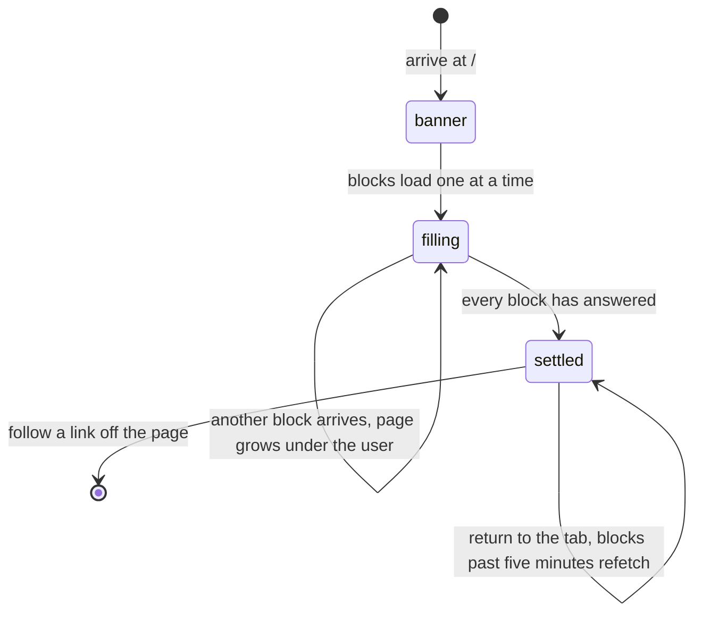

# The home page

## Summary

The home page is `/`, the address the app opens at and the only page every user
sees. It is not a dashboard in the usual sense: it is a **stack of independent
blocks**, each of which draws itself only when it has something to say. Two
users opening it at the same moment can see very different pages, and the same
user can see a different page an hour later without anything having been changed
by hand.

Almost nothing on it depends on being signed in. A visitor and a player see the
same page apart from one block — [your next match](your-next-match.md). There is
no separate signed-out home page and no marketing landing page; the route is the
same and the difference is one card.

## The simple case

A user opens the app. A dark blue banner fills the top of the screen with the
717Rec logo, the name, and the line "Where Bags Fly and Beers Flow.", and two
buttons: **View Standings** and **See Schedule**.

Below it the blocks appear one after another as their data arrives, each fading
in a beat behind the last. In a typical week that is: whatever cards the league
has put up, a wide **League History** bar, the user's own next match, the **Team
of the Week**, a **Weekly Recap**, the **Top Teams**, and a **Send us a
message** form at the bottom.

The user scrolls, taps a team, and reads it. Nothing on the home page is
editable except the message form at the very bottom.

## The interaction, event by event

### Arrive

The banner is drawn immediately, before any data. Everything below it is a
skeleton or nothing at all.

The blocks, in the fixed order they appear:

| Block | Shown when | Reads |
| --- | --- | --- |
| Banner | Always | Nothing |
| League cards | The league has published at least one | The published cards, in the order the league set |
| League History bar | Always, **desktop only** | Nothing; a link to `/history` |
| Your next match | Signed in, approved membership, at least one match | See [your-next-match.md](your-next-match.md) |
| Confirm your team | The league has a season open for confirmation | That season |
| Team of the Week | A team's power score rose this week | Weekly power score trends |
| Weekly Recap | There was an upset, a streak, or a mover | The week's results |
| Pending Scores | At least one match is waiting for a score | Up to ten waiting matches |
| Top Teams | Always | Every team, sorted by power score |
| Send us a message | Always | The signed-in profile, to prefill |

**A quiet week collapses the page to four blocks**: the banner, the history bar,
the top ten, and the message form. Nothing explains the difference, and nothing
holds the space.

The page grows downwards as each block answers, so a user who starts scrolling
immediately is scrolling a page that is still changing height. Five blocks hold
their space while they wait — league cards, your next match, team of the week,
the weekly recap, and the top ten. The other three do not, and appear from
nothing.

Nothing is focused. Nothing is prefilled except the message form at the bottom,
which fills the name and contact from a signed-in profile.

### Leave without changing anything

Nothing is recorded beyond the ordinary pageview described in
[`foundations/navigation.md`](../foundations/navigation.md). No block remembers
being scrolled past, opened, or dismissed. Coming back gives the same page,
rebuilt.

Scroll position is not reset when leaving, and the home page does not restore
its own.

### Begin editing

The only editable thing on the page is the **Send us a message** form at the
bottom, and the **Confirm your team** card when the league has one open.
Everything else is read-only.

The message form is dirty from the first keystroke. Nothing visible changes and
no validation runs while typing.

### While editing

Typing in the message form does nothing except change the text. The rest of the
page carries on refetching underneath it, so a block can appear or disappear
above a half-written message and move it down the screen.

### Submit

**The message form at the bottom of the home page is not the contact form.** It
looks similar and it is a different form for a different job. It asks for a
request type — Timeslot Request, Score update / correction, Join the league,
General message, Other — a name, a team, a contact, and a message, and it files
a request for the league to work through in
[`admin/handle-requests.md`](../admin/handle-requests.md). The contact form at
`/contact` is for support: bugs, account problems, score disputes; see
[`help/contact-the-league.md`](../help/contact-the-league.md).

**Both now end up in the same place.** Since B-10 each form both stores its
message and emails `admin@717rec.com`, and the admin Contact Inbox lists both
behind one filter. The form says as much, so a sender who picked the wrong one
can see where their message went and which form they wanted.

On success the message and player fields clear, the request type returns to
General message, and a toast says "Message sent". The name, team, and contact
stay filled for a signed-in user and clear for a visitor. On failure a red toast
carries the reason through, which is unusual for this app and better than most.

Two rules are checked in the browser: a name and a message are required, and
choosing "Join the league" also requires a proposed team name. Failing either
shows a red toast and sends nothing.

## Modifiers

| Modifier | Set at arrival | Changed while editing |
| --- | --- | --- |
| The user's role | Decides one block only. A signed-in player with an approved membership gets the next-match card; nobody else does. An admin sees exactly what a player sees — there is no admin block on this page. | Signing in elsewhere makes the next-match card appear on the next refetch. Signing out removes it. Nothing else moves. |
| The record's state | Every block is driven by whether its data exists. A block with no data is absent, not empty. | A block can appear or disappear under the user when its data refetches, changing the page's height with no warning. |
| The season's state | With no active season, the next-match card, the recap, and the team of the week all go quiet, because each reads season data. The top ten and the league cards do not. | A season activated elsewhere reaches this page within ten minutes; see [`foundations/seasons.md`](../foundations/seasons.md). |
| Viewport | The banner becomes a compact card plus a 2×2 grid of buttons — Standings, Full Schedule, History, Teams. The League History bar is removed. The top ten becomes a swipe carousel. | Re-flows on rotation. The persistent choice below is unaffected. |
| Keys the app honours | No shortcuts. Tab reaches the skip link, then the navigation, then each block in order. | Enter inside the message form's single-line fields submits it. |

The fourth mobile button is labelled **Teams** and goes to `/teams`, the list of
every team in the league. It used to be labelled "My Teams", which promised the
user's own team — see
[B-30](../bug-triage.md#b-30-small-copy-and-labelling-slips).

## Cancel and interrupt

| Event | Before the first edit | While editing or submitting |
| --- | --- | --- |
| Escape, or a Cancel button | No effect. There is no Cancel anywhere on this page. | Closes the request-type dropdown if it is open. It does not clear the message form and does not abort a submission in flight. |
| In-app navigation away, or switching tab within the page | Nothing is lost. Every block rebuilds from the cache on return, so returning within five minutes is instant. | **Anything typed into the message form is lost, with no warning.** A submission already sent still reaches the league, unseen. |
| Browser back or forward | Returns to the previous page. Scroll position is not reset, so arriving back at a long home page from a short one can land the user in the middle of it. | Same as navigating away, and the app cannot prevent it. |
| Reload, or the tab closed | The whole page refetches from scratch and every skeleton is shown again. | Anything typed is lost. A submission already sent still lands. |
| Network lost mid-request | Blocks that have not answered stay as skeletons or stay absent. The top ten shows "We couldn't load the top teams. Please try again." with a Try Again button; the other blocks show nothing at all. | The request fails and a red toast carries the reason. Nothing is queued. |
| The request fails or times out | A failed read is retried once, then that block gives up quietly. Only the top ten says so. | The message form keeps every field and a red toast explains. |
| The session expires | Reads still work, so the page looks normal. The next-match card disappears at the next refetch. | The message request fails and reports it. |
| The same record changed in another tab, or by another user | No realtime anywhere on this page. A card the league publishes or a score an admin enters does not reach an open home page until a refetch. | Same. Two tabs can hold two different drafts of the message form. |
| Browser autofill or a password manager writes into the form | Only the message form can be autofilled — name and contact. It has a hidden bot-trap field of its own. | Same. |
| The window loses focus | Nothing. | **Returning refetches every block past five minutes.** Blocks can appear, disappear, and change height while the user is reading, and a half-written message moves down the page. |

After any interrupt the user is left on whatever page the interrupt took them
to. The home page holds nothing back and warns about nothing.

## Interactions with other systems

**Permissions and roles.** One block is gated: the next-match card needs an
approved membership. Everything else, including the Pending Scores card and its
Report buttons, is drawn for a visitor. See
[`cross-cutting/permissions.md`](../cross-cutting/permissions.md).

**Season scoping.** The recap, the team of the week, the next-match card, and
the confirmation card are all scoped to the active season and none of them says
so. The top ten and the league cards are not season-scoped at all. See
[`foundations/seasons.md`](../foundations/seasons.md).

**Validation and error display.** The message form checks two rules on submit
and reports them as toasts rather than under the fields. No other block
validates anything.

**Unsaved changes.** Not handled. The message form has no guard and no draft.

**Optimistic updates and rollback.** None. Nothing on this page is optimistic.

**Realtime.** None. See
[`foundations/saving-and-freshness.md`](../foundations/saving-and-freshness.md).

**Offline.** Already-fetched blocks stay on screen. Nothing new loads and the
message form fails on submit.

**Toasts and notifications.** Only the message form and the confirmation card
raise toasts. Every other block reports failure by not appearing.

**URL state.** None. `/` carries nothing. Nothing on this page can be linked to
or bookmarked in a particular state.

**On a phone.** The banner becomes a card plus a four-button grid. The League
History bar is removed entirely. The top ten becomes a swipe carousel of ten
cards under the words "Swipe to see more →". The page reserves space at the
bottom for the fixed bottom bar.

**Accessibility.** The banner's large "717Rec" wordmark is hidden from screen
readers on desktop and read from a hidden phrase on mobile. Blocks appearing as
their data arrives are not announced, so a screen reader user is given no signal
that the page has grown. Every link has a real name.

**Side effects the user can notice.** Opening the home page records a pageview
twice, as every route does. Nothing else on the page writes anything until the
message form is submitted, which creates a request an admin will see.

## Edge cases

- **The "Top Teams" block shows four teams on a wide screen and ten on a phone.**
  The desktop grid is cut to the first four with a "View All" button beside the
  heading; the mobile carousel holds ten. The heading used to say "Top 10 Teams"
  over the grid of four — see
  [B-30](../bug-triage.md#b-30-small-copy-and-labelling-slips).
- **The top ten includes every division together.** It is a straight sort by
  power score, so a Recreational team can outrank a Competitive one.
- **A team with no power score sorts as zero**, so unrated teams sit at the
  bottom rather than being left out.
- **The Pending Scores card only appears when there is something in it.** Its
  own "All caught up! 🎉" state and its own loading skeleton exist in the code
  and cannot be reached from the home page.
- **The Pending Scores card is shown to visitors**, Report button included. What
  happens when a visitor presses it belongs to
  [`scores/submit-a-score.md`](../scores/submit-a-score.md).
- **The "Confirm your team" card lets anyone pick any team.** It is drawn
  whenever a season is open for confirmation, signed in or not, and its team list
  includes hidden teams. An admin can now open a season for confirmation
  ([B-31](../bug-triage.md#b-31-two-dead-features-are-visible-in-the-interface)),
  so this is reachable; it is filed as
  [B-41](../bug-triage.md#b-41-the-confirm-your-team-card-has-no-sign-in-check-and-lists-hidden-teams).
- **The empty top-ten state offers "View All Teams"**, which does a full page
  load of `/teams` rather than an in-app navigation, discarding the cache.
- **League cards can point anywhere.** A card's button is an ordinary link; an
  address starting `http` opens in a new tab and anything else is treated as a
  route inside the app.
- **A picture card with no picture draws nothing at all**, leaving a gap in the
  stack with no explanation.
- **The message form's request type resets to "General message" after a
  successful send**, even if the user had chosen something else and wants to send
  a second message of the same kind.

## Open questions and verification

- Resolved: **the mobile button labelled "My Teams" went to the whole-league team
  list**, while every other button in that grid went where it said. Fixed — see
  [B-30](../bug-triage.md#b-30-small-copy-and-labelling-slips). It is labelled
  "Teams" now.
- Resolved: **the desktop "Top 10 Teams" heading did not match what was drawn.**
  Fixed — see [B-30](../bug-triage.md#b-30-small-copy-and-labelling-slips). The
  heading is "Top Teams" and promises no number.
- **The "Confirm your team" card has no sign-in check in the browser.** Anyone
  who opens the home page while confirmation is open can pick any team, including
  a hidden one, and record a participation answer for it. Whether the database
  refuses the write was not checked, and hiding a control and refusing a write
  are two different mechanisms. **This now matters in practice.** Until
  2026-09-01 nothing in the app could switch confirmation on, so the card could
  never be drawn; an admin switch was added as part of
  [B-31](../bug-triage.md#b-31-two-dead-features-are-visible-in-the-interface).
  Filed as [B-41](../bug-triage.md#b-41-the-confirm-your-team-card-has-no-sign-in-check-and-lists-hidden-teams),
  and it must be fixed before confirmation is opened on a live season.
- Not confirmed by hand: how noticeable the page's growth is in practice — how
  far the content jumps as each block resolves on a normal connection.
- Not confirmed by hand: what the home page shows when there is no active season
  at all. Each block was read separately and none of them was observed.
- Not confirmed by hand: what an image card looks like when its picture fails to
  load rather than being absent.
- The page's own test mocks every block, so the order above is read from the page
  component rather than from a passing test.
- Assumption: the league publishes few cards at a time. Nothing limits how many
  can be visible at once, and they are drawn one under another above everything
  else on the page.

Verified against `717rec` commit `ea5c8f4`.
