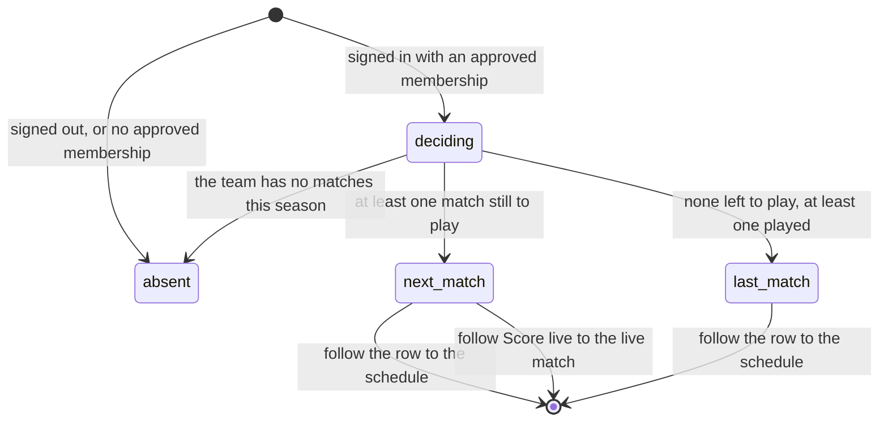

# Your next match

## Summary

The next-match card is the one part of the [home page](the-home-page.md) that
belongs to the signed-in user. It answers a single question — *when do I play
next, and who against* — and it is the only place in the app that answers it
without the user filtering the schedule themselves.

It has a second job that is not obvious from its name. When there is nothing
left to play, it turns into a **last-match** card and shows the result instead.
The user is never told the card has changed job; the heading changes and the
"vs" becomes a score.

The card is not a route. It has no address, cannot be linked to, and exists only
as a block on `/`.

## The simple case

A player signs in and opens the home page. Below the league's cards a bordered
panel appears headed **YOUR NEXT MATCH**, with a calendar icon.

Inside it: the player's own team logo on the left, the word **vs** in the
middle, the opponent's logo on the right, both names under their logos, and the
date and time on the right — "Thursday, Aug 28" above "7:00 PM". A chevron
points to the right. Under the panel, a small link reads **See full schedule**.

The whole row is a link. Tapping it opens `/schedule`.

If the player is allowed to score that match, a second full-width button sits
directly under the row: **Score live**, with a radio icon. That one opens the
match at [`live-scoring/start-a-live-match.md`](../live-scoring/start-a-live-match.md).

## The interaction, event by event

### Arrive

The card needs three things, in order: a signed-in user, an **approved**
membership of a team, and at least one match for that team in the active season.
Missing any one of them removes the card completely — there is no empty state,
no "you are not on a team yet", and nothing to explain the absence.

An unapproved membership counts as no membership. A player who has asked to join
a team and is waiting sees exactly what a visitor sees.

When it does appear, the card shows **every match on one date**, not one match:

- If there is anything still to play, it takes the **earliest date** with an
  unplayed match and shows all of that team's matches on that date. A team with
  two games on a Thursday gets two rows and the heading becomes **YOUR NEXT
  MATCHES**.
- If there is nothing left to play, it falls back to the **most recent date** on
  which the team played, and shows every match on it. The icon becomes a trophy
  and the heading becomes **YOUR LAST MATCH** or **YOUR LAST MATCHES**.

Grouping is by the local calendar day, deliberately, so a late game that starts
after midnight in UTC still counts as the same evening.

Each row shows:

| Part | Upcoming | Completed |
| --- | --- | --- |
| Centre | the word **vs** | the two teams' **game wins**, as `2 - 1`, the leader in green and the trailer in red |
| Under the centre | nothing | a green **Win** or a red **Loss** badge |
| Date and time | the match's date and time | the same |
| Below the row | **Score live**, when the user may score it | nothing |

Nothing is focused and nothing is recorded by the card being drawn.

### Leave without changing anything

Nothing happens. The card holds no state of its own; it is rebuilt from the
membership and the team's matches every time the home page mounts.

### Begin editing

Not applicable. There is nothing on the card to edit. Every part of it is a link.

### While editing

Not applicable. The card does refetch, though, and that is worth stating: the
team's matches are treated as **never fresh**, so they are re-fetched every time
the home page mounts and every time the user returns to the tab. A result
entered by the other team can therefore turn a "next match" row into a "last
match" card under the user with no action from them.

### Submit

Not applicable. The card writes nothing. Every action on it is a navigation.

## Modifiers

| Modifier | Set at arrival | Changed while editing |
| --- | --- | --- |
| The user's role | A visitor never sees the card. A player sees it only for the team they are approved on. An admin sees the same card as a player — being an admin does not show anyone else's matches — but an admin's **Score live** button appears on every match the card shows, because an admin may score any open match. | Approval granted elsewhere does not reach an open page. The card appears the next time the membership refetches, up to five minutes later. |
| The record's state | Whether any match is unplayed decides which of the two cards is drawn. | A match completed elsewhere flips the card from next to last on the next refetch. |
| The season's state | Only the active season is read. With no active season the card is absent, because the team has no matches. | A season changeover empties the card for up to ten minutes before refilling it. |
| Viewport | On a narrow screen the date and time move above the teams and a chevron sits at the right of the row. On a wide screen they sit to the right of the teams. | Re-flows on rotation. |
| Keys the app honours | Tab reaches each row, then **Score live** if it is there, then **See full schedule**. Enter follows the focused link. | No shortcuts. |

## Cancel and interrupt

| Event | Before the first edit | While editing or submitting |
| --- | --- | --- |
| Escape, or a Cancel button | No effect. There is nothing to cancel. | No effect. |
| In-app navigation away, or switching tab within the page | The card is discarded with the home page. Nothing is lost, because nothing was held. | No effect. The card sends no requests of its own. |
| Browser back or forward | Returns to a freshly built card, which may differ from the one that was left. | No effect. |
| Reload, or the tab closed | The card is rebuilt from the database. | No effect. |
| Network lost mid-request | The membership or the matches fail to load, so the card is absent. The user cannot tell "you have no matches" from "we could not check". | No effect. |
| The request fails or times out | The read is retried once, then the card stays absent, silently. No toast, no message. | No effect. |
| The session expires | The card disappears at the next refetch, with no explanation. | No effect. |
| The same record changed in another tab, or by another user | No realtime. A score entered by the opponent does not reach this card until a refetch. | Same. |
| Browser autofill or a password manager writes into the form | No effect. There are no fields. | No effect. |
| The window loses focus | Nothing. | **Returning refetches the team's matches immediately**, because they are never treated as fresh. The card can change from next to last while the user is looking at it. |

After any interrupt the card is simply rebuilt. It never holds anything that can
be lost.

## Interactions with other systems

**Permissions and roles.** An approved membership is required for the card and
decides the **Score live** button, which follows the same rule the live-scoring
screen uses: the match is not completed, and the user is an admin or is approved
on one of the two teams. See
[`foundations/accounts-and-roles.md`](../foundations/accounts-and-roles.md).

**Season scoping.** Only the active season's matches are read, and the card does
not say so.

**Validation and error display.** None. There is nothing to validate, and every
failure is silent.

**Unsaved changes.** None exist.

**Optimistic updates and rollback.** None.

**Realtime.** None. The card is a read that happens to refetch often; it is not
live. See
[`foundations/saving-and-freshness.md`](../foundations/saving-and-freshness.md).

**Offline.** The card keeps showing whatever was last fetched, and disappears
after a reload.

**Toasts and notifications.** None. The card never raises a message of any kind,
including when its data fails to load.

**URL state.** None. The card has no address and no way to link to the match it
is showing.

**On a phone.** Date and time move above the teams. Team names are truncated at
about 80 pixels, so long names are cut. The **Score live** button is at least 40
pixels tall.

**Accessibility.** The **Score live** button carries a spoken name naming both
teams. The row itself is an ordinary link whose name is read out of the logos,
scores, and dates it contains, which reads poorly. The card appearing, changing
from next to last, or vanishing is never announced.

**Side effects the user can notice.** None. The card writes nothing.

## Edge cases

- **The card cannot say "you have no matches".** A team with an empty schedule
  and a signed-out visitor produce exactly the same page.
- **An unapproved membership shows nothing.** A player waiting for approval gets
  no acknowledgement here that they have asked; that lives on
  [`my-team`](../teams/my-team.md).
- **A tie shows no badge.** A completed match where both teams have the same
  game wins draws the score in neutral colours with neither a Win nor a Loss
  badge, and nothing says why.
- **An opponent that has not been set reads "TBD"** with a placeholder logo.
- **A match with no date reads "Date TBD"** and shows no time at all.
- **The row always goes to `/schedule`**, never to the match. A user with one
  match on the card still lands on the whole season's schedule and has to find it
  again.
- **`/schedule` does not keep any filter**, so following the row and pressing
  back gives the home page and following it again gives the same unfiltered
  schedule.
- **The heading counts rows, not matches.** Two matches on one Thursday give
  "YOUR NEXT MATCHES"; one gives the singular.
- **A postponed or cancelled match is meant to be filtered out and is not.** See
  [Open questions](#open-questions-and-verification).
- **The skeleton is rarely seen.** See
  [Open questions](#open-questions-and-verification).

## Open questions and verification

- **The postponed and cancelled filter cannot do anything.** The card asks for
  matches that are not postponed and not cancelled, but a match's status is never
  loaded from the database — there is no such column on a match — so the test is
  always true. If the league marks a match postponed by some other means, it will
  still be offered here as the next match to play. **May be worth treating as a
  bug rather than documenting.**
- **The card's loading skeleton is skipped on a first load.** The card asks the
  membership for the wrong "busy" signal — the one that means "a join or leave
  request is in flight" rather than "we are still fetching your membership" — so
  while the membership is being fetched the card believes it has finished and
  draws nothing. The skeleton then appears once the matches start loading. The
  visible result is that the card is absent, then a skeleton, then the card, and
  the page jumps twice. **May be worth treating as a bug rather than
  documenting.**
- Not confirmed by hand: how long the gap is in practice between the page
  settling and the card appearing.
- Not confirmed by hand: what the card shows for a user with two membership rows.
  The membership read expects at most one and appears to fail rather than choose,
  which would remove the card silently.
- Not confirmed by hand: whether a screen reader makes anything useful of the
  row link's name.
- Assumption: the fallback to the last match is deliberate rather than a
  side effect, based on the heading and icon changing to match. Nothing in the
  code says why.

Verified against `717rec` commit `ea5c8f4`.
