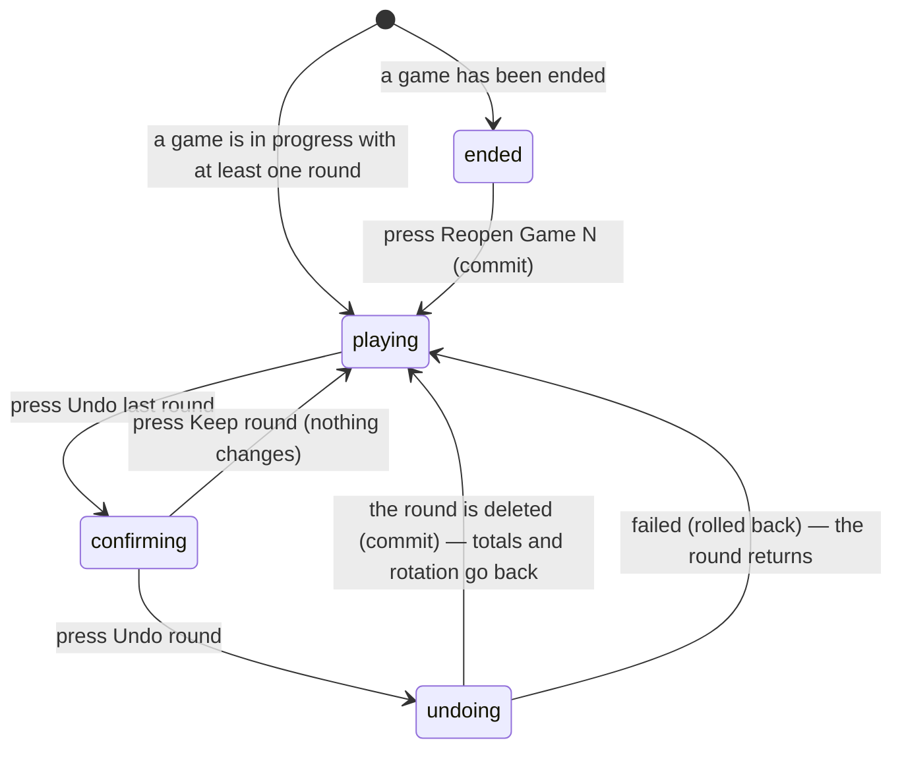

# Correcting a round

## Summary

Scorers get rounds wrong. This document owns the two ways to put one right:
**undoing the last round** of the game in progress, and **reopening a game that
has already been ended** so its rounds can be reached again.

Both work because nothing in live scoring is stored as a running total. Every
score on the screen is worked out from the round history each time it is drawn,
so removing a round removes its effect completely and instantly — including from
the thrower rotation.

Undoing is available to any scorer. Reopening a game is too. Reopening the whole
match after the result is saved is admin-only and is owned by
[`finish-the-match.md`](finish-the-match.md).

## The simple case

The scorer taps 6 when they meant 4. They press Save Round before noticing.

An "Undo last round" button sits to the right, under the round input. They press
it. A dialog asks "Undo last round?" and explains: "This removes round 7 (6–0)
from the game. You can re-enter it afterwards." They press "Undo round".

The round disappears from the history, the totals go back, the round number
returns to 7, and the thrower bar goes back to whoever was up. They enter the
round again correctly.

If the mistake was in a game that has already been ended, there is a quieter
route: a ghost button under the setup panel reading "Reopen Game 2 to fix a
score". Pressing it makes that game current again, with all its rounds, and the
undo button becomes available inside it.

## The interaction, event by event

### Arrive

**Undo** appears whenever the current game has at least one round and the user
may score. It is a small outlined button, right-aligned, reading "Undo last
round". It is dead when there is nothing to undo and while a save or an undo is
in flight.

It stays available **after the game has been won but before it is ended**, which
is deliberate: the win banner says so in as many words — "Wrong score? Undo the
last round instead of ending the game."

**Reopen a game** appears in two places, both as a quiet ghost button: under the
setup panel for the next game, and under the winner panel once the match is
decided. It names the game it will reopen — "Reopen Game 2 to fix a score" — and
always the **most recently completed** game, never an earlier one.

Nothing is written by either button appearing.

### Leave without changing anything

Nothing is recorded. Neither button does anything until it is pressed and, for
undo, confirmed.

### Begin editing

Pressing "Undo last round" opens a confirmation rather than acting. The dialog
names the round and its score, and promises that re-entering is possible. Its two
choices are "Keep round" and "Undo round".

**Reopening a game does not ask.** It acts on the first press. This is the one
destructive-looking action in live scoring with no confirmation, though what it
does is recoverable — the rounds are not deleted, the game is simply made current
again.

### While editing

Nothing lives between pressing and confirming except the open dialog. There is no
multi-round undo, no selection of which round to remove, and no history of
corrections.

**Only the last round can be undone.** To remove an earlier one, every round
after it must be undone first, one at a time, each with its own confirmation.

### Submit

**Undo is optimistic.** The round vanishes from the history and the totals go
back at once. The button reads "Undoing…".

On success the match is re-fetched and the other scorer's screen loses the round
too, over the realtime connection.

On failure the round comes back exactly where it was and a red toast says "Could
not undo round" with the reason.

**Reopening a game is not optimistic.** The screen waits. On success the ended
game becomes the current game, its rounds return to the round input's view, and
the setup panel or winner panel disappears. On failure a red toast says "Could
not reopen game" with the reason and nothing changes.

## Modifiers

| Modifier | Set at arrival | Changed while editing |
| --- | --- | --- |
| The user's role | Both controls need the right to score. Notably **reopening a game is not admin-only** — any approved member of either team can do it. Spectators see neither. | Losing the right to score leaves the buttons on screen until the screen refetches; the write then fails. |
| The record's state | Undo needs at least one round in the current game. Reopen needs at least one completed game. Neither appears on an officially completed match. | If the other scorer undoes first, this screen's undo target changes underneath. |
| The season's state | No effect. | No effect. |
| Viewport | Both are comfortable tap targets: undo is 44 pixels high, the dialogs are full-width on a phone. | No effect. |
| Keys the app honours | The dialogs are proper dialogs: Escape closes them, Tab is trapped inside, focus returns to the trigger on close. | Escape cancels the confirmation without undoing. |

## Cancel and interrupt

| Event | Before the first edit | While editing or submitting |
| --- | --- | --- |
| Escape, or a Cancel button | Nothing to cancel. | **Escape closes the undo confirmation and nothing is undone**, the same as pressing "Keep round". It cannot stop an undo already sent. |
| In-app navigation away, or switching tab within the page | Nothing lost. | An undo already sent still completes. The scorer returns to a match with the round gone and no message explaining it. |
| Browser back or forward | Nothing lost. | As above. |
| Reload, or the tab closed | The buttons return in the same state. | A sent undo may have landed. The round history after reloading says which. |
| Network lost mid-request | The match will not load. | The undo fails, the round comes back, and a red toast gives the reason. Nothing is queued. |
| The request fails or times out | Not applicable. | As above. |
| The session expires | Watching still works. | The write fails with the league's refusal as the message. |
| The same record changed in another tab, or by another user | **The dangerous case.** The other scorer may save a new round between this scorer opening the confirmation and pressing Undo. The dialog names the round it captured when it opened. | Undo targets a specific game and round number, so it removes the round it named rather than "whatever is last now". If that round has already gone, nothing is removed and the app reports it. |
| Browser autofill or a password manager writes into the form | No effect. | No effect. |
| The window loses focus | No effect. | No effect. |

After an interrupt the totals are recomputed from whatever rounds survive, so the
screen is never wrong — only possibly not what the scorer expected.

> **Technical note:** undo deletes by **both** game and round number rather than
> "the newest row", so two scorers undoing at the same moment cannot remove two
> different rounds by accident. The worst case is that one of them removes
> nothing.

## Interactions with other systems

**Permissions and roles.** Both controls need the right to score, and neither
needs admin. See
[`start-a-live-match.md`](start-a-live-match.md#who-may-score).

**Season scoping.** None.

**Validation and error display.** Nothing is validated; a round either exists to
be removed or does not. Failures carry the league's own message.

**Unsaved changes.** None. Both actions are immediate.

**Optimistic updates and rollback.** Undo is optimistic and rolls back on
failure. Reopening a game is not.

**Realtime.** An undo by one scorer removes the round from the other's screen.

**Offline.** Neither works.

**Toasts and notifications.** Failures only. A successful undo says nothing — the
round simply disappears, which is the clearest possible confirmation. A
successful reopen says nothing either, which is less obvious.

**URL state.** Nothing.

**On a phone.** Both are built for it.

**Accessibility.** The confirmation is a proper dialog with a title and a
description, so a screen reader hears what is about to be removed. Reopening a
game has no dialog, so nothing is announced and the change is silent.

**Side effects the user can notice.** None until the result is saved. Correcting
rounds after the result is saved needs the match reopened first, which does have
side effects; see [`finish-the-match.md`](finish-the-match.md).

## Edge cases

- **Only the last round can be undone.** Fixing round 3 of a twenty-round game
  means twenty confirmations.
- **Undo is available after the game is won**, and the banner tells the scorer to
  use it rather than ending the game.
- **Reopening a game has no confirmation** while undoing one round has one, which
  is the wrong way round in terms of how surprising each is.
- **Only the most recent completed game can be reopened.** Fixing Game 1 after
  Game 2 has been ended means reopening Game 2 first.
- **A successful reopen is silent.** The screen changes; nothing says why.
- **Undoing every round of a game** leaves a game in progress with no rounds,
  which is the same state as one just started.
- **The undo dialog names the round it captured when it opened**, which may no
  longer be the last round by the time it is confirmed.
- **There is no record of a correction.** Nothing anywhere shows that a round was
  entered and removed.

## Open questions and verification

- **Reopening a game is available to any scorer and asks nothing.** An opposing
  team's scorer can reopen a game the other side has just won, with one tap and
  no confirmation, no message, and no record. Whether that is intended is a
  product question worth answering. **May be worth treating as a bug rather than
  documenting.**
- **A silent successful reopen** leaves the other scorer's screen changing with
  no explanation. Worth checking with two devices.
- Not confirmed by hand: whether undoing a round that has already been undone by
  the other scorer produces a message, or passes silently.
- Not confirmed by hand: how the round history looks mid-undo, given the removal
  is optimistic.
- Not confirmed by hand: whether the thrower bar visibly steps back when a round
  is undone.
- Assumption: reopening a game does not delete its rounds. The service reopens
  rather than clears, but this was not observed.

Verified against `717rec` commit `ea5c8f4`.
