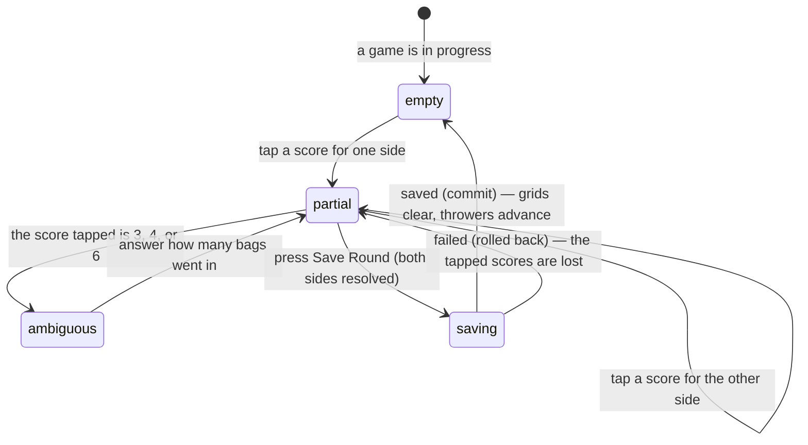

# Entering a round

## Summary

Entering a round is the core loop of a live match: it is done twenty or thirty
times in a game and it has to be fast enough to do between throws, on a phone, at
a venue. The scorer taps each side's score for the round, answers one extra
question when the score is ambiguous, and saves.

Only the difference counts. A round where both sides score four is a wash and
adds nothing to either total.

This document owns the round input, the thrower bar, and saving a round. Undoing
one is owned by [`correct-a-round.md`](correct-a-round.md); reaching 21 is owned
by [`finish-a-game.md`](finish-a-game.md).

## The simple case

The scoreboard at the top shows the game number, both totals, who is leading, and
the rule in words: "First to 21, win by 2".

Under it, the thrower bar names who is up for each side, already chosen. Under
that, a panel headed "Round 7" holds two grids of numbers, one per team, coloured
blue and red.

The scorer taps 6 on the blue grid. A second row appears asking how many bags
went in the hole: 1 or 2. They tap 2. They tap 0 on the red grid. A line at the
top right of the panel reads "*Blue team* +6". They press "Save Round".

The totals move, the round appears at the top of the round history, the grids
clear, and the thrower bar advances to the other player on each side. Round 8 is
ready.

## The interaction, event by event

### Arrive

The panel is headed with the number of the next round, worked out as one more
than the highest round already recorded in this game. Both grids start empty and
nothing is selected. "Save Round" is present but dead.

The thrower bar above already names somebody for each side, worked out from the
round history: **whoever threw last for that side, the other player throws
next.** With one player on a side, that player always throws. Before the first
round, the first player picked in setup throws.

> **Technical note:** the next thrower is derived from the saved rounds every
> time rather than being remembered, so undoing a round, correcting one, or
> reloading the page all leave the rotation correct. A round saved with nobody
> named for a side does not reset that side's rotation; the app looks back for
> the most recent round where somebody *was* named.

### Leave without changing anything

Nothing is recorded. A round is only ever created by pressing Save Round.

### Begin editing

Tapping a number on either grid selects it. The grid offers **0 to 10 and 12**.
Eleven is missing on purpose: four bags are thrown, a bag in the hole is worth
three and a bag on the board is worth one, so 11 cannot happen.

**Three scores are ambiguous — 3, 4, and 6** — because each can be reached two
ways. Tapping one of them opens a second row asking how many bags went in the
hole:

| Score | The two ways to get it |
| --- | --- |
| 3 | three bags on the board, or one in the hole |
| 4 | four on the board, or one in and one on |
| 6 | one in and three on, or two in |

Every other score has exactly one answer and no second question is asked.
Changing the score after answering clears the answer, so the question is asked
again.

Nothing is written by tapping. The whole selection lives in the panel until it is
saved.

### While editing

As soon as both sides have a number, a preview appears at the top right of the
panel: either "*Team name* +N" or "**Wash — no points**" when the two are equal.
This is the only place the cancellation rule is shown, and it updates on every
tap.

The thrower bar can be overridden. Tapping a different name changes who is
recorded for the coming round. **The override applies to that round only** — once
it is saved, the rotation resumes from the round history, so an override is a
one-off correction rather than a change of order.

The grids are disabled while a save is in flight and while an undo is in flight,
so the scorer cannot get ahead of the app.

"Save Round" stays dead until **both** sides have a resolved score — a number,
and an answer to the bags question if one was asked.

### Submit

Pressing "Save Round" writes the round with both scores, both throwers, and both
bag breakdowns. The button reads "Saving…".

**The round is optimistic.** It appears in the totals and the round history at
once, before the league has answered, and the grids clear immediately so the
scorer can start the next round without waiting.

On success the round is confirmed, the whole match is re-fetched, and the other
scorer's screen receives the round over the realtime connection.

On failure the optimistic round is removed, the totals go back, and a toast
explains. **The scorer's tapped numbers are not restored** — the grids were
cleared on pressing Save, so the round has to be entered again from memory.

One failure is treated specially. If the other scorer saved the same round number
first, the message is not an error but a plain toast: **"Round already recorded —
Another scorer saved this round first — refreshing the scoreboard."** The round
the other scorer saved stands, and this screen catches up.

Three rules are checked before the write is accepted, each with its own message:

- The score must be one of the valid ones — "Round scores must be 0-12 (11 is not
  possible in cornhole)".
- The bag breakdown must match the score, for each side — "Bag breakdown does not
  match the round score".

None of these should be reachable from the grids, which only offer valid
combinations. They exist because the league checks the data rather than trusting
the screen.

## Modifiers

| Modifier | Set at arrival | Changed while editing |
| --- | --- | --- |
| The user's role | A scorer sees the thrower bar and the grids. Anyone else sees only the scoreboard and the round history, updating as rounds arrive. | Losing the right to score leaves the controls on screen until the screen refetches; the save then fails. |
| The record's state | The round number comes from the rounds already saved. A game that has just been won shows the win banner instead of the grids. | If the other scorer's round wins the game, the grids are replaced by the banner mid-entry and the tapped scores are lost. |
| The season's state | No effect. | No effect. |
| Viewport | Built for a phone: the grids are large tap targets, the save button is 48 pixels high and full width, and the page has deep bottom padding so the button clears a thumb. | No effect. |
| Keys the app honours | Every number is a button and reachable by Tab. There is no keyboard shortcut and no way to type a score. | No shortcuts. Enter on a focused number taps it. |

Overriding the thrower is the one variant that can be changed mid-round and it
applies to the coming round only.

## Cancel and interrupt

| Event | Before the first edit | While editing or submitting |
| --- | --- | --- |
| Escape, or a Cancel button | Nothing to cancel. | **There is no way to clear the grids.** No Cancel, no Escape handler, no clear button. A wrong tap is corrected by tapping the right number instead; a fully wrong round is corrected after saving, by undoing it. |
| In-app navigation away, or switching tab within the page | Nothing lost. | **The tapped scores are lost.** A save already sent still lands, and the round appears when the scorer returns. |
| Browser back or forward | Nothing lost. | As above. |
| Reload, or the tab closed | The round input returns, empty, at the right round number. | The tapped scores are lost. A sent save may have landed; the round history after reloading says which. |
| Network lost mid-request | The match will not load. | The save fails, the optimistic round rolls back, and a red toast gives the reason. The tapped numbers are gone. Nothing is queued. |
| The request fails or times out | Not applicable. | As above. The scorer re-enters the round from memory. |
| The session expires | Watching still works. | The save fails with the league's refusal as the message. |
| The same record changed in another tab, or by another user | The round number and thrower advance as the other scorer's rounds arrive. | **The expected case.** The other scorer's round arrives, the totals move, and the round number under the scorer's fingers advances — so pressing Save now writes the *next* round, not the one they thought. If both save the same number, one wins and the other is told plainly. |
| Browser autofill or a password manager writes into the form | No effect; there are no text fields. | No effect. |
| The window loses focus | No effect. | No effect on a part-entered round. |

After an interrupt the scorer's screen is rebuilt from the saved rounds, which
are always right. What is lost is only ever the round being typed.

## Interactions with other systems

**Permissions and roles.** Only a scorer sees the input. See
[`start-a-live-match.md`](start-a-live-match.md#who-may-score).

**Season scoping.** None. A round belongs to a game, not to a season.

**Validation and error display.** The grids make an invalid score impossible to
tap. The league checks anyway and its messages are passed through in full.

**Unsaved changes.** A part-entered round is unsaved and is lost on any
interruption, without warning.

**Optimistic updates and rollback.** Rounds are the app's clearest optimistic
write: shown at once, rolled back on failure, with the failure explained. See
[`foundations/saving-and-freshness.md`](../foundations/saving-and-freshness.md).

**Realtime.** Rounds arrive from the other scorer as they are saved.

**Offline.** Nothing can be saved and nothing is queued.

**Toasts and notifications.** A failure raises a red toast with the real reason. A
duplicate raises a plain one. Because the app shows only one toast at a time, a
scorer who fails twice quickly sees only the second message; see
[`foundations/messages-to-the-user.md`](../foundations/messages-to-the-user.md).

**URL state.** Nothing about a round is in the URL.

**On a phone.** This is the screen the phone-first design exists for.

**Accessibility.** Every number is a real button. The net preview is text and is
readable, but it is not announced when it changes, so a screen reader user must
seek it out. The grids clearing on save is not announced either.

**Side effects the user can notice.** None until the match is finalised. Rounds
feed per-player statistics only once the result is saved.

## Edge cases

- **A wash scores nothing** and is still recorded as a round, with its own row in
  the history and its own throwers.
- **11 is not on the grid.** A scorer looking for it will not find it, and
  nothing explains why except this document.
- **The bags question can be skipped by changing the score.** Tapping 6, then 5,
  clears the question — the answer was tied to the 6.
- **The grids clear before the save is confirmed**, so a failed save loses the
  numbers. The scorer must remember what they tapped.
- **The round number can advance under the scorer** if the other scorer saves
  first, and there is no visible moment where this is announced.
- **An override of the thrower survives only until the round is saved.**
- **A round saved with nobody named** does not break the rotation; the app looks
  further back.
- **A side with one player** always names that player, and the override offers
  only them.
- **Two players with the same name** are indistinguishable in the thrower bar.

## Open questions and verification

- **A failed save loses the scorer's input.** The grids clear on pressing Save
  rather than on success, so a failure at a venue with poor signal costs the
  round. This is the most likely real-world annoyance in the whole feature.
  **May be worth treating as a bug rather than documenting.**
- **Nothing marks that the round number changed under the scorer.** When the
  other scorer saves first, the heading quietly becomes a different number. A
  scorer mid-entry could save a round believing it is the previous one. Worth
  checking by hand with two devices.
- Not confirmed by hand: how fast the loop actually is on a phone, and whether
  the disable-while-saving is noticeable between rounds.
- Not confirmed by hand: whether the net preview is easy to see, given it sits in
  small grey text at the top right.
- Not confirmed by hand: whether the bags question is understood by scorers, or
  whether it is answered at random to get past it.
- Not confirmed by hand: what the round history shows for a round with no
  throwers named.

Verified against `717rec` commit `ea5c8f4`.
