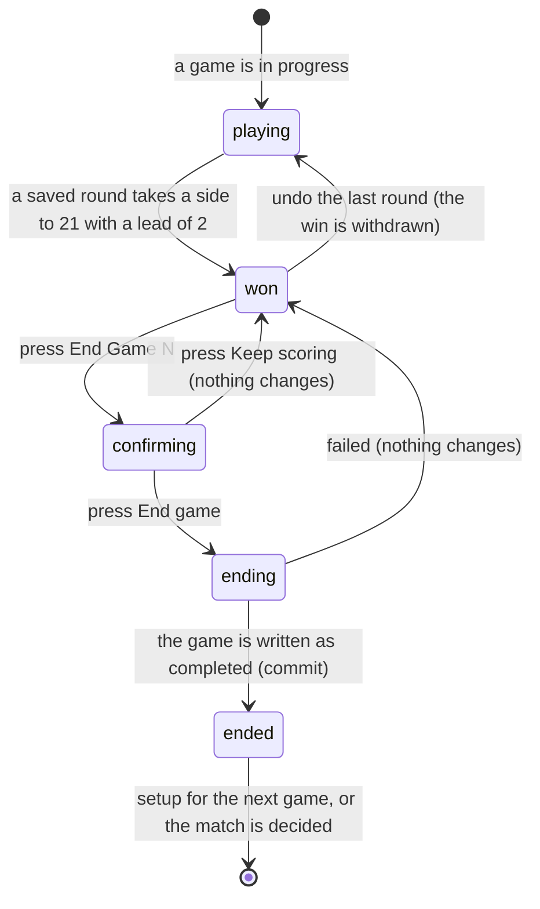

# Finishing a game

## Summary

A game ends when one side reaches 21 with a lead of at least two. The app notices
the moment the round that does it is saved, and shows a banner announcing the
winner — but it **does not end the game**. Ending it is a separate, explicit
confirmation, so a mis-entered round can still be undone first.

That gap between "won" and "ended" is the whole subject of this document. It is
the app's most deliberate design decision in live scoring and the one most likely
to confuse a scorer in a hurry.

## The simple case

The scorer saves a round that takes their side from 19 to 23 against 15. The
round input disappears. In its place, a bordered panel with a trophy reads
"*Team name* wins Game 1, 23–15", and under it in small grey text: "Wrong score?
Undo the last round instead of ending the game."

A full-width button reads "End Game 1". Pressing it opens a dialog: "End Game 1 —
*Team name* wins?" with "Final score 23–15. The next game (or the match result)
comes after this." and two choices, "Keep scoring" and "End game".

They press "End game". The banner disappears and the setup panel for Game 2
appears, with both teams' players already chosen from Game 1.

## The interaction, event by event

### Arrive

The banner appears the instant a saved round makes the totals satisfy the rule:
**a side at 21 or more, ahead, by at least two.** Nothing else ends a game. There
is no bust and no cap, so a game at 21–20 keeps going, and a game at 30–28 has
just ended.

Three things change when the banner appears:

- The round input is **removed**. No further round can be entered in this game
  until it is either ended or the winning round is undone.
- The thrower bar is removed with it.
- The undo button **stays**, and the banner points at it.

A spectator sees the banner and its score, but no button. Their screen simply
says the game is won and waits.

**Nothing is written when the banner appears.** The game is still in progress as
far as the league is concerned.

### Leave without changing anything

Nothing is recorded. The game stays won-but-not-ended indefinitely. A match can
be left in this state for days and picked up later: the banner will still be
there, because it is worked out from the rounds every time.

### Begin editing

There is nothing to edit. The only two moves are ending the game and undoing the
round that won it.

**Undoing the winning round withdraws the win.** The banner disappears, the round
input comes back, and the game continues from the round before. This is what the
banner's small print is telling the scorer to do when the score is wrong.

### While editing

Pressing "End Game N" opens a confirmation and nothing else happens. The
confirmation states the final score and what comes next, so a scorer who has lost
track knows whether this is the last game or not — though it says "the next game
(or the match result)" rather than deciding between them.

### Submit

Pressing "End game" writes the game as completed, with its winner and its final
totals. The button reads "Ending game…".

**This write is not optimistic.** The screen waits.

On success the banner is replaced. What replaces it depends on the match:

- If the winning side now has **two game wins**, the match is decided and the
  winner panel appears. See [`finish-the-match.md`](finish-the-match.md).
- Otherwise the **setup panel for the next game** appears, pre-filled from the
  game just ended.

The other scorer's screen changes at the same moment, over the realtime
connection.

On failure a red toast says "Could not complete game" with the reason, and the
banner stays exactly as it was. Nothing is lost and the scorer can press again.

> **Technical note:** the game's final totals are written onto the game record
> when it is ended, but the screen never reads them back — every total shown is
> recomputed from the rounds. The stored totals matter only to whatever reads the
> games later. If the two ever disagreed, the screen would show the rounds'
> answer and be right.

## Modifiers

| Modifier | Set at arrival | Changed while editing |
| --- | --- | --- |
| The user's role | A scorer sees the End Game button. A spectator sees the banner alone and cannot end anything. | Losing the right to score leaves the button on screen until the screen refetches; the write then fails. |
| The record's state | The banner appears only from the totals. A game already ended does not show it. | The other scorer ending the game first replaces the banner with the next stage, mid-dialog. |
| The season's state | No effect. | No effect. |
| Viewport | The banner is full width; the End Game button is 48 pixels high. The dialog fills a phone screen. | No effect. |
| Keys the app honours | The dialog is a proper dialog: Escape closes it, focus is trapped, and returns to the button on close. | Escape is the same as "Keep scoring". |

## Cancel and interrupt

| Event | Before the first edit | While editing or submitting |
| --- | --- | --- |
| Escape, or a Cancel button | Nothing to cancel. | **Escape closes the confirmation and the game is not ended**, the same as "Keep scoring". It cannot stop an end already sent. |
| In-app navigation away, or switching tab within the page | The match stays won-but-not-ended. Nothing is lost. | An end already sent still completes. The scorer comes back to the next game's setup panel with no explanation of when that happened. |
| Browser back or forward | As above. | As above. |
| Reload, or the tab closed | The banner returns, because it is worked out from the rounds. **Nothing about the won state needs to be stored.** | A sent end may have landed; the screen after reloading says which. |
| Network lost mid-request | The match will not load. | "Could not complete game" with the reason. The banner stays. Nothing is queued. |
| The request fails or times out | Not applicable. | As above. |
| The session expires | Watching still works. | The write fails with the league's refusal as the message. |
| The same record changed in another tab, or by another user | **The other scorer can undo the winning round from under this banner**, and it disappears. | If the other scorer ends the game first, this screen moves on and the open confirmation acts on a game that is already ended. |
| Browser autofill or a password manager writes into the form | No effect. | No effect. |
| The window loses focus | No effect. | No effect. |

After any interrupt the banner is either there or not, decided entirely by the
rounds that survive. There is no separate "won" flag to get out of step.

## Interactions with other systems

**Permissions and roles.** Ending a game needs the right to score. See
[`start-a-live-match.md`](start-a-live-match.md#who-may-score).

**Season scoping.** None. Ending a game changes nothing outside the match.

**Validation and error display.** Nothing is validated. The rule decides whether
the banner exists at all.

**Unsaved changes.** None.

**Optimistic updates and rollback.** Not optimistic. The screen waits.

**Realtime.** Both scorers' screens show the banner as soon as the winning round
lands, and both lose it when the game is ended or the round is undone.

**Offline.** Nothing can be ended.

**Toasts and notifications.** Failure only. A successful end says nothing; the
screen changing is the confirmation.

**URL state.** Nothing.

**On a phone.** Built for it.

**Accessibility.** The confirmation is a proper dialog and is announced. The
banner appearing — which removes the round input from under the scorer's fingers
— is **not** announced, and neither is the screen changing after the game is
ended.

**Side effects the user can notice.** None. Standings, records, and statistics do
not move until the match result is saved.

## Edge cases

- **Won is not ended.** A match can sit with a game won and not ended for as long
  as anybody likes. Nothing chases the scorer and nothing times out.
- **The round input vanishes** the moment a game is won, which is startling if the
  win was caused by a mis-entered round. The banner's small print is the only
  guidance.
- **Undoing the winning round un-wins the game** and brings the round input back.
- **A game at 21–20 has not been won.** A scorer expecting first-to-21 will
  wonder why no banner appeared. Nothing on this screen explains win-by-two
  except the scoreboard's "First to 21, win by 2" label.
- **A game can be won by a score far beyond 21** — there is no cap — and the
  banner reports whatever the totals are.
- **Both scorers can press End Game at once.** One write wins; the other's screen
  has already moved on by the time their press lands.
- **The confirmation says "the next game (or the match result)"** rather than
  telling the scorer which, even though the app knows.

## Open questions and verification

- **The banner's arrival is silent and removes the scorer's input.** For a
  sighted scorer this is obvious; for anyone using a screen reader the round
  input simply stops existing. Worth an accessibility check.
- **The confirmation could say which comes next.** The app knows whether this is
  the deciding game; the wording hedges. A small wording improvement rather than
  a defect.
- Not confirmed by hand: whether ending a game feels slow, given it is not
  optimistic and the next panel waits for the round trip.
- Not confirmed by hand: whether a scorer in practice understands "Wrong score?
  Undo the last round instead of ending the game."
- Not confirmed by hand: what happens to an open confirmation dialog when the
  other scorer ends the game first — whether it closes, or is left acting on a
  finished game.
- Assumption: leaving a game won-but-not-ended indefinitely is intended. Nothing
  cleans it up, and the state survives reloads by design.

Verified against `717rec` commit `ea5c8f4`.
