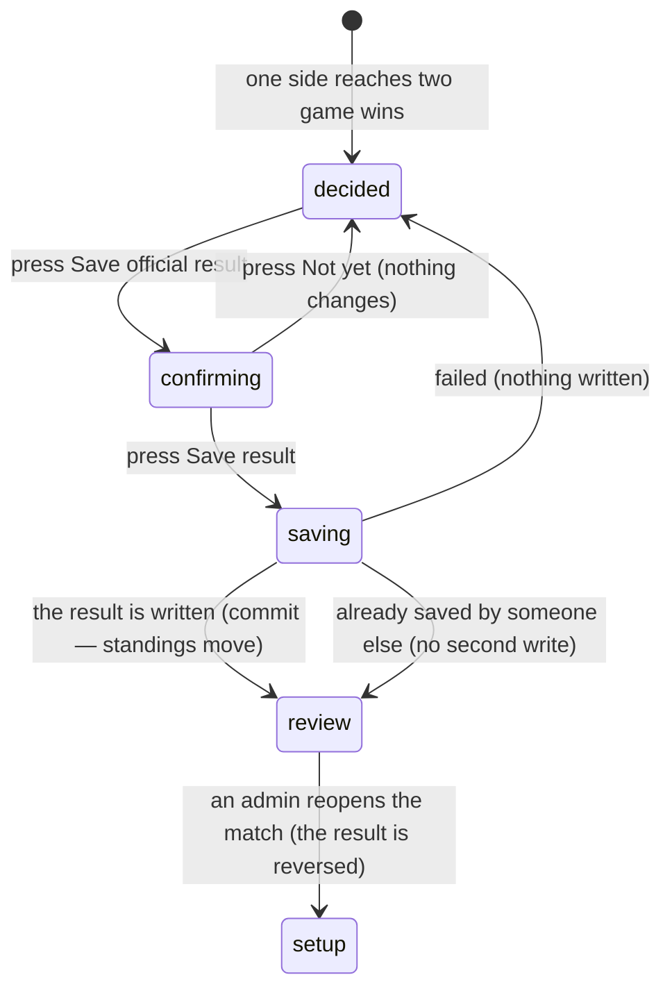

# Finishing the match

## Summary

When one side has won two games, the match is decided — but nothing outside the
match knows yet. Saving the **official result** is the moment live scoring stops
being a private scoreboard and becomes a league record: standings move, team
records change, and per-player statistics are counted.

This document owns the decided state, the save-result dialog, the read-only
review that follows, and the admin's ability to reopen the whole match. It is the
one true commit in live scoring; everything else is preparation.

## The simple case

The second game is ended. A bordered panel says "*Team name* wins the match 2–0",
with the line "Save the official result to update standings and team records."

A full-width button reads "Save official result". Pressing it opens a dialog
listing every completed game with its score and winner, and asks to confirm.
"Save result" writes it; "Not yet" does not.

On success a toast says "Match result saved — Final: 2–0. Standings updated." The
screen is replaced by a review: a trophy, the winner, the game wins in large
figures, a recap, the games, a player statistics table, and the round-by-round
history for every game.

An admin, and only an admin, sees one more control at the foot of the review: a
red-edged "Reopen match (admin)".

## The interaction, event by event

### Arrive

The decided panel appears as soon as the games say one side has two wins. Like
the game-won banner, it is **worked out rather than stored**, so it survives
reloads and appears on both scorers' screens at once.

Alongside the save button, a ghost button offers "Reopen Game N to fix a score"
for the most recently completed game — the last chance to correct a score before
the result becomes official. See
[`correct-a-round.md`](correct-a-round.md).

The full round history for the whole match is shown below.

A spectator sees the winner panel and the history, and no buttons.

**Nothing is written when the match becomes decided.**

### Leave without changing anything

Nothing is recorded. **The match stays decided-but-unsaved indefinitely.** As far
as the schedule, the standings, and every team's record are concerned, this match
has not been played. Nothing chases anyone to save it and nothing warns that it
is outstanding.

### Begin editing

There is nothing to edit. The two moves are saving the result and reopening the
last game.

### While editing

Pressing "Save official result" opens a confirmation that lists every completed
game — its number, its score, and who won it — so the scorer can check the whole
match before committing. Its choices are "Not yet" and "Save result".

If a previous attempt failed, the failure is shown **inside the panel** as a
persistent alert headed "Could not save result", with the reason, rather than
only as a toast that has since disappeared. This is the only place in the app
that keeps a failure visible after its toast has gone.

### Submit

Pressing "Save result" writes the official result. The button reads "Saving
result…". This write is **not optimistic**; the screen waits.

Three outcomes:

**Saved.** A toast: "Match result saved — Final: *N*–*N*. Standings updated." The
match, the schedule, the standings, and every team record are re-fetched. The
screen becomes the review.

**Already saved.** If somebody else — the other scorer, or an admin using a
different tool — already recorded this match's result, the write does nothing and
a plain toast says "Match already finalized — The official result was already
recorded." **This is not treated as an error**, and the screen still moves to the
review.

**Failed.** A red toast says "Could not finalize match" with the reason, and the
alert appears in the panel. Nothing is written and the scorer can try again.

> **Technical note:** saving is idempotent — asking twice records the result
> once. That is what makes the "already finalized" case safe rather than
> dangerous, and it is why two scorers both pressing save cannot double-count a
> match.

### The review

Once the result is saved, the whole screen becomes read-only for everyone,
scorers included. It shows:

- The winner, and the game wins in large figures.
- A **recap**: the key game, the top performer, and the most consistent player,
  worked out from the rounds.
- Every game with its final score.
- A **player statistics table**: rounds thrown, points, points per round, bags in
  the hole, bags on the board, and four-baggers, per player.
- The **round-by-round history**, grouped by game when there was more than one.

Points per round is shown as a dash rather than zero for a player who threw no
rounds, so an absent player is never made to look bad by a 0.00.

### Reopening the match

Only an admin sees "Reopen match (admin)". It asks first, and the dialog is
explicit about what it does:

> The official result is removed and both team records are reverted. The scored
> games and rounds are kept so you can correct them and save the result again.
> Standings update immediately.

On success a toast says "Match reopened — The official result and team records
were reverted.", or, if there was nothing to reverse, "Nothing to reopen — This
match has no recorded result." The screen returns to whatever stage the games
themselves say it is at, and scoring is possible again.

## Modifiers

| Modifier | Set at arrival | Changed while editing |
| --- | --- | --- |
| The user's role | Saving needs the right to score — an approved member of either team, or an admin. **Reopening the match needs admin**, unlike reopening a game, which any scorer can do. | Losing the right to score leaves the button on screen until the screen refetches; the write then fails. |
| The record's state | A decided match shows the save panel. A saved one shows the review. The review is read-only for every role. | The other scorer saving first moves this screen to the review, mid-dialog. |
| The season's state | No effect on saving. The result feeds the season the match belongs to. | No effect. |
| Viewport | The review is a long scroll on a phone; the statistics table scrolls sideways inside its own box. | No effect. |
| Keys the app honours | Both dialogs are proper dialogs: Escape closes, focus is trapped and returns. | Escape is the same as "Not yet" or "Cancel". |

## Cancel and interrupt

| Event | Before the first edit | While editing or submitting |
| --- | --- | --- |
| Escape, or a Cancel button | Nothing to cancel. | **Escape closes either dialog and nothing is written.** It cannot stop a save already sent. |
| In-app navigation away, or switching tab within the page | The match stays decided-but-unsaved, indefinitely. | A save already sent still completes. The scorer never sees the toast, but the result is recorded and the standings have moved. |
| Browser back or forward | As above. | As above. |
| Reload, or the tab closed | The decided panel returns, worked out from the games. | A sent save may have landed. Reloading shows which: the review means it did. |
| Network lost mid-request | The match will not load. | "Could not finalize match" with the reason, and the alert stays in the panel. Nothing is written and nothing is queued. |
| The request fails or times out | Not applicable. | As above. The persistent alert means the scorer still knows about it after the toast has gone. |
| The session expires | Watching still works. | The write fails with the league's refusal as the message. |
| The same record changed in another tab, or by another user | The other scorer may reopen a game from under this panel, withdrawing the decision. | **If the other scorer saves first, this save does nothing and says "Match already finalized".** Nothing is double-counted. This is the case the idempotent write exists for. |
| Browser autofill or a password manager writes into the form | No effect. | No effect. |
| The window loses focus | No effect. | No effect. |

After an interrupt, whether the result was saved is answered by the screen: the
review means yes, the decided panel means no. There is no third state.

## Interactions with other systems

**Permissions and roles.** Saving needs the right to score; reopening the match
needs admin. See
[`start-a-live-match.md`](start-a-live-match.md#who-may-score).

**Season scoping.** The result feeds the season the match belongs to. See
[`foundations/seasons.md`](../foundations/seasons.md).

**Validation and error display.** The failure is shown twice — as a toast and as
a persistent alert — which is better than anywhere else in the app.

**Unsaved changes.** A decided-but-unsaved match is the app's longest-lived
unsaved state, and nothing anywhere flags it.

**Optimistic updates and rollback.** Neither saving nor reopening is optimistic.

**Realtime.** Both scorers' screens move to the review when either saves.

**Offline.** Nothing can be saved.

**Toasts and notifications.** Success, already-saved, and failure each have their
own wording, and all three carry real information. No push notification is sent
to anyone when a match is resulted.

**URL state.** Nothing changes; the match id is already the address.

**On a phone.** The review is long; the statistics table scrolls sideways.

**Accessibility.** Both dialogs are announced. The screen becoming the review is
not, so a screen reader user is moved to entirely new content silently.

**Side effects the user can notice.** This is the write with the most: standings
move, both teams' records change, per-player statistics are counted, badge
processing runs, and power scores are recalculated on the server. Because the
last two happen after the write returns, **a user who looks immediately sees the
match completed but the numbers not yet moved.** See
[`foundations/saving-and-freshness.md`](../foundations/saving-and-freshness.md).

## Edge cases

- **A decided match that is never saved counts for nothing.** The teams have
  played, the app knows who won, and the standings do not. Nothing surfaces this
  anywhere in the app.
- **Saving twice is safe.** The second attempt reports that it was already done.
- **"Already finalized" is not an error** and does not stop the screen moving on.
- **Reopening reverses records but keeps the rounds**, so a match can be
  corrected and re-saved.
- **Reopening a match needs admin; reopening a game does not.** The two controls
  look similar and have very different reach.
- **Points per round is a dash, not zero**, for a player who threw nothing.
- **The review is read-only for scorers too.** A scorer who spots a mistake after
  saving must find an admin.
- **The recap is computed, not stored**, so it is recomputed on every visit and
  will change if the rounds are ever corrected.
- **A match resulted by an admin elsewhere** — through the bulk score tools —
  puts this screen straight into the review with rounds that may not match the
  recorded score.

## Open questions and verification

- **Nothing anywhere flags a decided-but-unsaved match.** A scorer who closes the
  tab after the last game leaves the league's standings wrong, and no list, no
  reminder, and no admin screen shows it. This is the most consequential gap in
  live scoring. **May be worth treating as a bug rather than documenting.**
- **A match resulted by an admin tool can disagree with its own rounds.** The
  review shows the recorded winner and game wins in the header and the rounds'
  totals below, and nothing reconciles them. Worth checking by hand.
- Not confirmed by hand: how long standings take to reflect a saved result, and
  whether power scores and badges visibly lag.
- Not confirmed by hand: what the recap actually names as key game, top
  performer, and most consistent, and whether those read sensibly for a short
  match.
- Not confirmed by hand: whether the player statistics table is usable on a phone.
- Not confirmed by hand: whether reopening a match that was resulted by an admin
  tool, rather than by live scoring, behaves the same way.
- Assumption: no notification is sent when a match is resulted. Nothing in the
  finalise path sends one, but a database trigger could.

Verified against `717rec` commit `ea5c8f4`.
