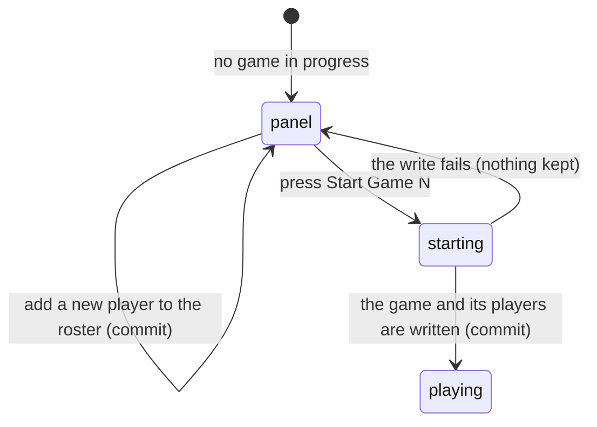

# Setting up a game

## Summary

Before any round can be entered, somebody has to say who is playing. The setup
panel picks up to two players a side and starts the game. It appears three times
in a match at most — once before Game 1, once before Game 2, and once before
Game 3 — and each time it offers the previous game's players again.

This document owns the setup panel and the act of starting a game. Arriving at
the screen at all is owned by
[`start-a-live-match.md`](start-a-live-match.md); what happens once a game exists
is owned by [`enter-a-round.md`](enter-a-round.md).

## The simple case

The scorer sees "Game 1 setup" and a line reading "Pick who is playing this game
— you can change players between games." Under it are two dropdowns, one per
team, each reading "Select players…".

They open the first, tick two names, and close it. The dropdown now reads both
names joined by an ampersand. They do the same for the other team. A large "Start
Game 1" button at the bottom becomes pressable, they press it, and the round
input replaces the panel.

Before Game 2, the same panel appears with both teams' players **already
selected** from Game 1. The scorer presses "Start Game 2" without touching
anything, unless somebody has swapped out.

A spectator sees none of this. They see one line: "Waiting for a scorekeeper to
start Game 1…".

## The interaction, event by event

### Arrive

The panel appears whenever the match has no game in progress and the match is not
yet decided. It is headed with the number of the game about to be played.

**Both dropdowns are pre-filled from the previous game**, with one filter: a
player who has since left the team's roster is dropped from the pre-fill. Before
Game 1 there is no previous game, so both start empty.

The "Start Game N" button is present but not pressable until **at least one
player is selected on each side**, with the line "Select at least one player per
team." underneath explaining why.

**Nothing is written by the panel appearing.** The game does not exist until the
button is pressed.

### Leave without changing anything

Nothing is recorded. The game is not created. Coming back shows the same panel,
pre-filled the same way — the pre-fill comes from the previous game rather than
from anything remembered about the visit.

### Begin editing

Ticking or unticking a name changes the selection. Nothing is written and nothing
else changes except the button becoming pressable once both sides have somebody.

**Each side is capped at two players.** Once two are ticked, the remaining names
in that dropdown become unpressable rather than hidden, so the scorer can see who
they would have to untick first.

Adding a player is different: it **writes immediately**. A text box at the foot
of each dropdown reads "Add a player…". Typing a name and pressing the button —
or Enter — adds that person to the team's roster for good, and a toast says
"Player added — *name* joined the roster." This is a real change to the team, not
a choice for this game, and there is no undo for it on this screen.

An empty or whitespace-only name is refused by the button staying dead.

### While editing

The selection is held only in the panel. Nothing about it is saved, shared with
the other scorer, or visible to anyone else until the game starts.

The dropdown's label updates as names are ticked: one name alone, or two joined
by " & ". With none it reads "Select players…". A team with nobody on its roster
shows an empty list with the option to add somebody.

### Submit

Pressing "Start Game N" writes the game and both sides' players. The button reads
"Starting…" while it works.

Three writes happen, the game first and then both sides' players together. On
success the panel is replaced by the scoreboard and the round input, and the
other scorer's screen changes too, over the realtime connection.

On failure a red toast says "Could not start game" with the reason. **Nothing is
kept**: the panel stays as it was, with the selection intact, and the scorer can
press again.

> **Technical note:** the game is created first and the players are attached
> after. If the game is created and attaching the players then fails, the match
> is left with a game in progress that has nobody on it. The screen would move on
> to the round input, and the thrower bar would have no names to offer. This is
> the one place in live scoring where a partial write is possible.

## Modifiers

| Modifier | Set at arrival | Changed while editing |
| --- | --- | --- |
| The user's role | A scorer sees the panel. Anyone else sees "Waiting for a scorekeeper to start Game N…" and nothing else. | Losing the right to score does not remove the panel until the screen refetches; the write then fails. |
| The record's state | The panel is headed with the next game's number, worked out from the games that already exist. Before Game 1 both dropdowns are empty; before Games 2 and 3 they are pre-filled. | If the other scorer starts the game first, the panel disappears and the round input replaces it. |
| The season's state | No effect. | No effect. |
| Viewport | Built for a phone: full-width dropdowns, a 48-pixel-high start button, a scrolling roster list capped at about eight names before it scrolls. | No effect. |
| Keys the app honours | Tab reaches both dropdowns and the button. Enter in the "Add a player…" box adds the player. | Enter in the add box adds; there is no key that starts the game. |

## Cancel and interrupt

| Event | Before the first edit | While editing or submitting |
| --- | --- | --- |
| Escape, or a Cancel button | Nothing to cancel. | Closes the open dropdown, keeping the ticks. There is no Cancel for the panel and no way to clear a selection except by unticking. |
| In-app navigation away, or switching tab within the page | Nothing lost. | **The selection is lost.** A player added to the roster is not — that was already written. A start already sent still completes, so the game may exist when the scorer returns. |
| Browser back or forward | Nothing lost. | As above. |
| Reload, or the tab closed | The panel returns, pre-filled from the previous game. | The selection is lost; an added player survives; a sent start may have landed. |
| Network lost mid-request | The match will not load at all. | "Could not start game" with the reason. The selection is kept. Adding a player fails with "Could not add player". |
| The request fails or times out | Not applicable. | As above. The scorer can press again immediately; there is no lockout. |
| The session expires | Spectator view only. | The write fails. The panel stays and the reason is shown. |
| The same record changed in another tab, or by another user | Not applicable. | **The other scorer starting the game replaces this panel mid-selection**, discarding whatever was ticked here. Their choice of players wins. Nothing warns that this happened. |
| Browser autofill or a password manager writes into the form | No effect. | The "Add a player…" box is a plain text field and could in principle be autofilled; nothing depends on it. |
| The window loses focus | No effect. | No effect. |

After an interrupt the scorer comes back to a panel rebuilt from the previous
game, not from what they had ticked. The only thing that survives is a player
they added to the roster.

## Interactions with other systems

**Permissions and roles.** Only a scorer sees the panel. See
[`start-a-live-match.md`](start-a-live-match.md#who-may-score).

**Season scoping.** None. Players belong to a team, not to a season.

**Validation and error display.** Two rules: at least one player a side to start,
at most two a side to select. Both are enforced by the controls rather than by a
message after the fact. The two-player cap is also enforced when the write
reaches the league.

**Unsaved changes.** The selection is unsaved until the game starts, and is lost
on any interruption with no warning.

**Optimistic updates and rollback.** None here. The panel waits for the league to
answer before moving on.

**Realtime.** A game started by the other scorer arrives over the subscription
and replaces this panel.

**Offline.** Nothing can be started or added.

**Toasts and notifications.** "Player added" on success; "Could not add player"
and "Could not start game" on failure, both carrying the real reason.

**URL state.** Nothing about the selection is in the URL.

**On a phone.** This panel is designed for a phone; see Modifiers.

**Accessibility.** Each name is a labelled checkbox. A name that cannot be ticked
because the side is full is disabled rather than removed, so its state is
readable. The panel being replaced by the round input is not announced.

**Side effects the user can notice.** Adding a player changes the team's roster
everywhere in the app, not just for this game.

## Edge cases

- **Adding a player is permanent and immediate.** It is offered inside a
  throwaway setup panel but it is not throwaway. There is no undo here.
- **A one-player side is allowed.** The rules cap a side at two but the panel
  requires only one, so a team playing a man short can still be scored. Thrower
  rotation then always names the same person.
- **A player removed from the roster between games** is silently dropped from the
  pre-fill, so a scorer pressing straight through may start Game 2 with fewer
  players than Game 1.
- **Both scorers can set up at once.** The first to press Start wins; the other's
  selection is discarded without a word.
- **A team with an empty roster** shows an empty list and can only proceed by
  adding somebody.
- **Two players with the same name** are indistinguishable in the dropdown, in
  the thrower bar, and in the round history.
- **A game can be started with players attached to nobody** if the second write
  fails; see the technical note above.

## Open questions and verification

- **A failed player attach leaves a game with no players.** The game is created
  first and the players after, without a transaction, so this is possible. The
  screen would move on and offer no way back except reopening the game. **May be
  worth treating as a bug rather than documenting.**
- **Adding a player from inside game setup is permanent, and nothing says so.**
  The toast reads "joined the roster", which is accurate but easy to miss. Worth
  a product decision about whether a confirmation is wanted.
- Not confirmed by hand: whether the other scorer's screen visibly jumps when a
  game is started, or transitions.
- Not confirmed by hand: what the roster list looks like for a team with many
  players, and whether the scroll is usable on a phone.
- Not confirmed by hand: whether a duplicate player name is rejected when added.
- Assumption: the pre-fill filter exists to stop a departed player being carried
  into a later game. Nothing states this, but nothing else explains it.

Verified against `717rec` commit `ea5c8f4`.
