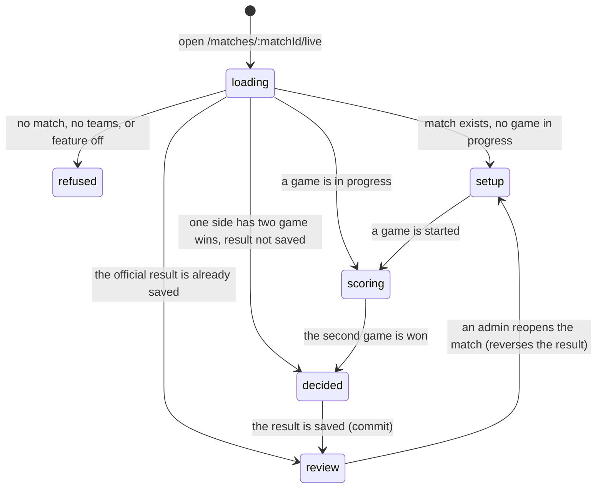

# Starting a live match

## Summary

Live scoring is the screen two teams use to record a match round by round while
they are playing it, instead of reporting a final score afterwards. It is the
densest part of 717rec and the only part with realtime: two phones at the same
board stay in step, and anybody else can watch.

It lives at `/matches/:matchId/live`, reached from a match on the schedule. This
document owns arriving there — what loads, who may score, what the header shows,
and every state in which the screen refuses to open. The rest of the flow is
owned by [`set-up-a-game.md`](set-up-a-game.md),
[`enter-a-round.md`](enter-a-round.md),
[`correct-a-round.md`](correct-a-round.md),
[`finish-a-game.md`](finish-a-game.md), and
[`finish-the-match.md`](finish-the-match.md).

## The simple case

A player opens their match from the schedule. A back link to the schedule sits at
the top. Under it, a header shows both team names, both badges, the match score
in games, and a small indicator for the live connection.

Below that, the screen shows whichever stage the match is at. A match nobody has
started yet shows the setup panel for Game 1. A match in progress shows the
scoreboard and the round input. A match already decided shows the winner and asks
for the result to be saved. A match already saved shows a read-only review.

Someone who is not allowed to score sees exactly the same screen with the
controls missing. They can watch the score change as it is entered, and do
nothing else.

## The interaction, event by event

### Arrive

The page loads the whole match at once: the match itself with both teams, every
game, every round, and which players are on each side of each game. Until that
arrives, the screen shows a spinner reading "Loading match…". Permission is
worked out at the same time, and the screen waits for both.

Two subscriptions open. One watches games and rounds for this match and pushes
changes in as they happen. Its state is shown in the header, so a scorer can see
whether the screen is live.

**Nothing is written by arriving.** Opening a match does not start it, claim it,
or tell anyone else that somebody is looking.

Five refusals can happen instead of the match appearing, each with its own
wording:

| What is wrong | What the screen says |
| --- | --- |
| Live scoring is not switched on for this league yet | "Live scoring is not enabled yet — The database update for live scoring has not been applied. Check back soon!" |
| No match with that id | "Match not found — This match does not exist or was removed from the schedule." |
| The match could not be loaded for any other reason | "Could not load the match — Something went wrong loading live scoring. Please try again." |
| The match exists but one or both teams are not set | "Teams not set — Live scoring opens once both teams are assigned to this match." |
| The three games are in a state that cannot be true | "The games in this match look inconsistent. An admin can reopen a game to fix the scores." — shown with the full round history below it, rather than a blank screen |

None of these is a dead end: the back link to the schedule is always above them.

### Leave without changing anything

Nothing is recorded. The realtime subscription closes. Coming back re-fetches the
whole match, so nothing is stale and nothing is lost.

### Begin editing

There is no "begin editing" for the screen as a whole. Each stage has its own
first action, owned by its own document.

### While editing

The header stays put through every stage. It shows both teams, the games won by
each, and the connection state. On an officially completed match it shows the
saved game wins; otherwise it shows the game wins worked out from the games
themselves.

### Submit

Not applicable to arriving. The match's one true commit is saving the official
result, owned by [`finish-the-match.md`](finish-the-match.md).

## Who may score

The rule, in full:

> A user may score a match if the match is **not yet officially completed**, and
> they are **an admin**, or they have an **approved membership** of one of the two
> teams playing.

Everyone else is a spectator. Spectators see the scoreboard, the round history,
and the header. They do not see the score grids, the thrower bar, the undo
button, the setup panel, the confirm-game banner, or the save-result dialog.

> **Technical note:** the browser applies this rule to decide what to draw, and
> the database applies the same rule independently to decide what to accept. They
> are separate mechanisms and they can disagree. A scorer whose membership is
> revoked mid-match keeps seeing the controls until the page refetches, and their
> next save fails.

**The match being completed removes scoring from everyone, including admins.** An
admin who needs to change a completed match must reopen it first.

## Modifiers

| Modifier | Set at arrival | Changed while editing |
| --- | --- | --- |
| The user's role | Decides whether the controls are drawn at all. An admin can score any open match; a player only their own team's. A visitor watches. | Admin granted or revoked elsewhere does not reach this screen until it refetches. Controls stay as they were, and writes start or stop being accepted without warning. |
| The record's state | The match's stage decides which of the five screens is shown. A completed match is read-only for everyone. | The stage changes under the user as rounds are saved, by them or by anyone else. |
| The season's state | No effect. Live scoring does not read the active season; it reads the match. | No effect. |
| Viewport | The whole screen is built for a phone: one narrow column, large touch targets, generous bottom padding for a thumb. On a wide screen it stays a narrow column in the middle. | No effect. |
| Keys the app honours | Nothing is focused on arrival and there are no shortcuts. Every control is reachable by Tab. | No shortcuts. |

Live scoring is the one part of 717rec designed phone-first, because that is
where it is used. Nothing about it changes on a desktop except the surrounding
whitespace.

## Cancel and interrupt

| Event | Before the first edit | While editing or submitting |
| --- | --- | --- |
| Escape, or a Cancel button | Nothing to cancel. There is no Cancel on this screen. | Closes the save-result dialog if it is open. Does not abort a save in flight. |
| In-app navigation away, or switching tab within the page | The subscription closes. Nothing is recorded. | **A save already sent still lands.** The scorer does not see its result. Anything typed but not saved — a part-chosen round score — is lost. |
| Browser back or forward | Returns to the schedule. | Same as navigating away. Coming back re-fetches everything, so the screen is correct, but any part-entered round is gone. |
| Reload, or the tab closed | Re-fetches everything. | **Every saved round survives; nothing else does.** This is the screen's central safety property: the whole match is rebuilt from the saved rounds, so a phone that dies mid-match loses at most the round being typed. |
| Network lost mid-request | The match does not load; the "could not load" screen appears. | The save fails, the optimistic round is rolled back, and a red toast explains. The realtime indicator changes. Nothing is queued. |
| The request fails or times out | As above. | As above. The tapped scores stay selected, so the scorer retries rather than re-entering the round. |
| The session expires | A signed-out visitor can still watch. | Writes begin failing. The controls stay on screen because the browser still thinks the user is signed in. |
| The same record changed in another tab, or by another user | Not applicable before arriving. | **This is the normal case, not an edge case.** A round saved by the other scorer arrives over the subscription and the screen updates. Two scorers saving the same round number produce one winner and one friendly message; see [`enter-a-round.md`](enter-a-round.md). |
| Browser autofill or a password manager writes into the form | No effect. There are no text fields on this screen except when adding a player by name. | No effect. |
| The window loses focus | No effect. | The subscription stays open in the background on desktop. A phone that suspends the tab drops it and rebuilds it on return, re-fetching the match. |

After any interrupt the scorer returns to a screen rebuilt from what was saved.
The screen never asks them to confirm what state the match was in, and never
shows a stale total, because every total is recomputed from the round history
rather than read from a stored counter.

## Interactions with other systems

**Permissions and roles.** The full rule is above. See
[`foundations/accounts-and-roles.md`](../foundations/accounts-and-roles.md).

**Season scoping.** None on this screen. Saving the result feeds season standings;
see [`finish-the-match.md`](finish-the-match.md).

**Validation and error display.** Every failure on this screen becomes a toast
with the underlying message passed through, which is unusual for this app and
much better than the generic sentences used elsewhere. See
[`foundations/messages-to-the-user.md`](../foundations/messages-to-the-user.md).

**Unsaved changes.** A part-entered round is the only unsaved state, and it is
lost without warning on any navigation. Everything else is saved as it is
entered.

**Optimistic updates and rollback.** Rounds are optimistic. Starting, completing,
and reopening a game are not. See [`enter-a-round.md`](enter-a-round.md).

**Realtime.** The one place in the app with a subscription. It reconnects by
itself, waiting one second, then two, then four, up to thirty, with a little
randomness. Every reconnection re-fetches the whole match rather than assuming
nothing was missed.

**Offline.** The screen is unusable offline: the match cannot load, and no round
can be saved or queued. This is worth stating plainly because live scoring is
used at a venue, which is exactly where the connection is worst. See
[Open questions](#open-questions-and-verification).

**Toasts and notifications.** Failures and conflicts are toasts. Nothing about a
live match sends a notification to anyone.

**URL state.** The match id is in the URL. Nothing else is, so a link to a live
match is a link to that match at whatever stage it has reached.

**On a phone.** This screen is designed for a phone first; see Modifiers.

**Accessibility.** Touch targets are large. Icons are hidden from screen readers.
The stage of the match changing — from scoring to decided, say — replaces the
content with no announcement.

**Side effects the user can notice.** None until the result is saved. Scoring a
match round by round changes nothing anywhere else in the app.

## Edge cases

- **A spectator link is a live link.** Anyone given the URL can watch, with no
  account. Nothing marks the match as private and nothing can.
- **Two scorers, one from each team, is the expected case** and is handled
  deliberately rather than being prevented.
- **A match with only one team assigned** refuses to open and says so.
- **An officially completed match** is read-only for everyone, admins included,
  until it is reopened.
- **Three completed games with no side on two wins** is impossible in normal play
  and is shown as an inconsistency rather than a blank screen.
- **The connection indicator can say connected while the data is minutes old** if
  the subscription reconnected and the refetch has not finished.
- **Opening the same match in two tabs** works, and both stay in step.

## Open questions and verification

- **Live scoring cannot work offline, and it is the feature most likely to be
  used on a bad connection.** There is no queue, no local buffer, and no warning.
  A venue with poor signal makes the whole feature unusable. This is a product
  question rather than a defect, and it deserves a decision.
- Not confirmed by hand: what the realtime indicator actually shows in each
  state, and whether a scorer would understand it.
- Not confirmed by hand: whether "Live scoring is not enabled yet" can still
  appear on the league's live database, or whether that migration is long since
  applied.
- Not confirmed by hand: how a phone locking and unlocking mid-match behaves —
  whether the subscription survives, and how long the refetch takes.
- Not confirmed by hand: whether the schedule links to this screen for every
  match, or only for some.
- Assumption: spectators being able to watch is deliberate. Nothing in the code
  says so, but the permission rule is explicitly about scoring rather than
  viewing.

Verified against `717rec` commit `ea5c8f4`.
