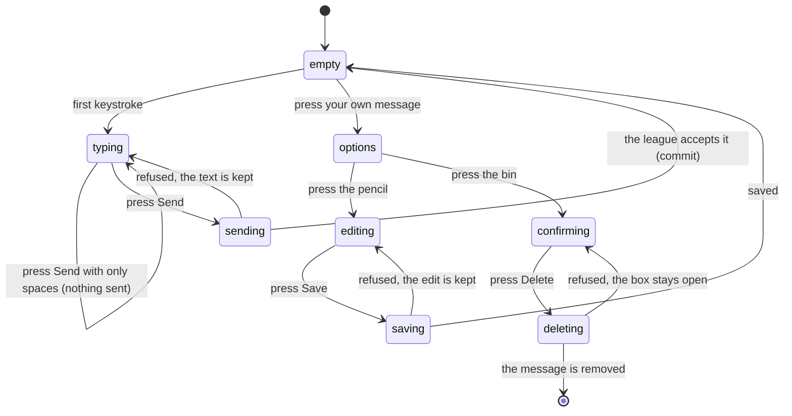

# Posting and removing a message

## Summary

Posting is the one thing a player can write on the message board. The composer
sits at the foot of `/message-board`: one box, one send button, and a count of the
characters left. Reading the board is described in
[`read-the-board.md`](read-the-board.md).

**There is no reply.** A message cannot be attached to another message, quoted, or
addressed to anyone. The only way to answer somebody is to post a new message
that happens to mention them, and it lands at the top of the list like any other.

An author can edit and delete their own messages, and nobody else's. **An admin
cannot remove another person's message** from anywhere in the app, which means the
board has no moderation at all.

## The simple case

A signed-in player scrolls to the bottom of the board and finds a box reading
"Type a message...". To its right, inside the box, is a round send button. Under
it, on the right, is "500 left".

They type. The box grows to fit what they write and the count comes down. They
press the send button.

The button and the box go dead for a moment. The box then empties, and the
message appears at the top of the list with their name, their team badge, and the
time. No toast confirms it; the message arriving is the confirmation.

If it fails instead, the box keeps every word and a red toast says "Error posting
message — Your message could not be posted. Please try again."

## The interaction, event by event

### Arrive

The composer exists only for a signed-in account. A visitor gets a bar reading
"Sign in to post messages" in the same place instead.

The box starts empty and **is not focused**, so someone who opens the board and
starts typing types nothing. The counter reads "500 left". The send button is
live from the start, whether or not anything has been typed.

An admin sees one extra control beside the counter: a category picker with two
choices, General and Announcement. It starts on General. A player has no picker
at all and every message they post is General.

Nothing is drafted, autosaved, or recorded by arriving.

### Leave without changing anything

Nothing happens. There is no draft. Coming back gives an empty box.

### Begin editing

The first keystroke makes the box dirty. **Nothing visible changes** beyond the
counter and the box growing taller. No warning appears, no button is enabled that
was disabled, and nothing is stored.

Nothing validates on the first edit or on any keystroke after it. The rules are
only checked when Send is pressed.

### While editing

The counter counts down and turns yellow with fewer than 50 characters left. Past
500 it turns red, shows a negative number, and **the send button goes dead** — the
only rule the composer enforces as the user types.

Pressing Send runs two checks:

| Rule | What happens when it fails |
| --- | --- |
| The message must not be empty or only spaces | Red toast "Empty message — Please enter a message before sending". Nothing is sent. |
| The message must be 500 characters or fewer | Red toast "Message too long — Please keep your message under 500 characters". Nothing is sent. In practice the dead button gets there first. |

Neither rule puts a message under the box; both are toasts, which is unlike the
rest of the app's forms.

Enter inside the box adds a newline rather than sending, so a multi-line message
is typed the way it is read. Line breaks are kept exactly as typed when the
message appears on the board.

### Submit

The box and the button are disabled while the request is in flight, so the same
message cannot be sent twice from the button.

What is sent is the trimmed text, the category, and — invisibly — the author's
account, their username, and their team. **What the browser sends for the last
three is not what is stored.** The league overwrites the username from the
author's profile and works the team name out from the membership itself, so a
message always carries the author's real name and current team no matter what the
browser claimed.

On success the box empties and the category picker stays where it was. There is
no success toast and no optimistic insert: **the author's own message reaches
their screen through the board's live connection, exactly as everyone else's
does.** If that connection is down, the author sees nothing happen until they
refresh.

On failure nothing is cleared. Every word stays in the box, the button comes back,
and one red toast appears. **The toast is the same regardless of why it failed** —
the league's own reason is discarded.

### Editing a message already posted

An author reaches their own message's controls by pressing it: a click on a
desktop, a press and hold on a phone. Two small buttons appear in the corner, a
pencil and a bin. Pressing anywhere else closes them.

The pencil replaces the message with a box holding the current text, focused,
with the cursor at the end, and a line reading "Press Esc to cancel, Ctrl+Enter to
save". Save is dead until the text is both non-empty and different from what was
there.

Saving shows a green toast "Message updated — Your message has been updated", and
the message comes back with "(edited)" after it. Hovering that word gives how long
ago it was edited. Failure shows a red toast and **keeps the edit box open with
the new text**, so nothing is lost.

**The edit box has no character counter and no length limit.** A message that
could not have been posted at 700 characters can be edited to 700 characters.

### Removing a message

The bin opens a confirmation reading "Delete Message — Are you sure you want to
delete this message? This action cannot be undone." with Cancel and Delete.

Delete removes the message from every filtered view at once, and a green toast
says "Message deleted — Your message has been deleted".

If the delete is refused, a red toast says "Error deleting message" and **the
confirmation stays open** with the Delete button live again. Pressing it again
repeats the same failure.

## Modifiers

| Modifier | Set at arrival | Changed while editing |
| --- | --- | --- |
| The user's role (visitor, player, admin) | A visitor gets the sign-in bar and no composer. A player gets the composer with no category picker. An admin gets the composer plus a General-or-Announcement picker. | Signing out in another tab does not reach this page: the composer stays on screen and the post is then refused. |
| The record's state | A message the reader wrote is tinted and is a control; anyone else's is inert. A message whose author's account has been removed belongs to nobody and can never be edited or deleted. | An author editing the same message in another tab wins or loses on whoever saves last, with no warning either way. |
| The season's state (active, archived, playoffs on) | No effect. A message belongs to no season. | No effect. |
| Viewport | On a phone the composer is pinned above the bottom navigation and the author's controls open with a press and hold rather than a tap. | No effect beyond re-flowing as the box grows. |
| Keys the form honours | Tab reaches the box, the category picker, and the send button. Enter in the box adds a newline; it never sends. | In the edit box, Escape cancels and Ctrl+Enter (or Cmd+Enter) saves. The composer honours neither. |

The composer and the edit box therefore disagree about their keys: Ctrl+Enter
saves an edit and does nothing at all in the composer.

## Cancel and interrupt

| Event | Before the first edit | While editing or submitting |
| --- | --- | --- |
| Escape, or a Cancel button | No effect. The composer has no Cancel and Escape does nothing in it. | Escape cancels an **edit** and throws the change away with no confirmation. It does nothing in the composer, and it closes the delete confirmation without deleting. Neither can stop a request already sent. |
| In-app navigation away, or switching tab within the page | Nothing is lost, because nothing was typed. | **Everything typed is lost, with no warning.** There is no unsaved-changes guard on the composer or the edit box. A post already sent still lands, and the author never sees the outcome. |
| Browser back or forward | Returns to the previous page. Nothing is recorded. | Same as navigating away, and the app cannot prevent it. Coming forward again gives an empty composer. |
| Reload, or the tab closed | Gives a fresh empty composer. | **Everything typed is lost.** A post already sent still lands. After reloading, the board itself is the only way to tell which happened. |
| Network lost mid-request | Cannot happen; no request is in flight. | The post, edit, or delete fails and its red toast appears. The text is kept. Nothing is queued and nothing is retried. |
| The request fails or times out | Cannot happen. | The text is kept and the generic red toast appears. Nothing distinguishes "the league never got it" from "the league got it and the answer was lost", so a retry can post the same message twice. |
| The session expires | The composer is still on screen, because it is drawn from the session the browser thinks it has. | The post is refused and the generic toast appears. Nothing says the session is the reason, and nothing offers to sign in again. |
| The same record changed in another tab, or by another user | No effect on the composer. | **An author's message deleted in another tab disappears from under an open edit box**, and saving then writes nothing and still reports success. Two tabs can each hold a different draft and each post it. |
| Browser autofill or a password manager writes into the form | The message box is a plain multi-line field with no name a form-filler recognises, so nothing offers to fill it. | Same. If something did fill it, no validation would run until Send was pressed. |
| The window loses focus | No effect. | No effect. Nothing refetches and a request in flight continues. |

After any interrupt the author is left with whatever the box still holds. The only
state that survives leaving the page is what already reached the league.

## Interactions with other systems

**Permissions and roles.** Posting needs a signed-in account with a profile.
Editing and deleting need the account that wrote the message, checked by the
browser *and* independently by the database. Admin adds exactly one thing —
the Announcement category — and takes nothing away. See
[`../cross-cutting/permissions.md`](../cross-cutting/permissions.md).

**Season scoping.** None. A message is attached to no season and no match, even
when it is about one.

**Validation and error display.** Two rules, both as toasts rather than messages
under the field, and both only on submit. The edit box has no rules at all beyond
"not empty and not unchanged".

**Unsaved changes.** Not handled anywhere. No guard, no prompt, no draft, in
either the composer or the edit box.

**Optimistic updates and rollback.** An edit is written to the screen as soon as
the league accepts it. A delete removes the message from every cached view at
once. A new post is **not** optimistic and arrives only through the live
connection.

**Realtime.** The author's own post, edit, and delete all reach their screen the
same way everyone else's do. This is the only place in the app where a user's own
successful write depends on a live connection to become visible.

**Offline.** Nothing can be posted, edited, or deleted. There is no queue.

**Toasts and notifications.** Seven: empty message, message too long, post failed,
message updated, update failed, message deleted, delete failed. Success is
reported for an edit and a delete but not for a post. See
[`../foundations/messages-to-the-user.md`](../foundations/messages-to-the-user.md#toasts).

**URL state.** Nothing. A half-written message cannot be shared or restored, and a
posted message has no address of its own.

**On a phone.** The composer is fixed above the bottom navigation. The author's
edit and delete controls need a press and hold of about half a second, which is
the same gesture that opens the reaction panel on somebody else's message.

**Accessibility.** The send button carries the label "Send message" and the
category picker is labelled. The edit box is labelled "Edit message" and takes
focus when it opens. **The author's own message card is a control with no label**,
so a screen reader announces a button with only the message text and no hint that
pressing it reveals edit and delete.

**Side effects the user can notice.** None beyond the message appearing. Nobody
is emailed or notified, including for an Announcement — the category changes only
how the message looks.

## Edge cases

- **A player waiting for team approval may not be able to post at all.** The
  browser attaches whatever membership the account has, approved or not, and the
  league refuses a message attached to a team the author is not an approved member
  of. The author sees only the generic "could not be posted" toast, with nothing
  about approval, and retrying can never work. **May be worth treating as a bug
  rather than documenting.**
- **A message with reactions on it may be undeletable.** Reactions point at the
  message and nothing appears to clear them when the message goes, so the delete is
  refused and the author gets the generic failure toast for a message they will
  never be able to remove. **May be worth treating as a bug rather than
  documenting.**
- **Nobody can remove anyone else's message.** There is no moderation control
  anywhere in the app, admin included. The only route to removing a message is the
  database directly.
- **An account that is deleted leaves its messages behind.** The name stays
  visible and the message becomes nobody's, so it can never be edited or deleted
  through the app.
- **The edit box has no length limit**, so an edited message can be far longer
  than one that could be posted.
- **The 500-character limit is only in the browser.** Nothing in the league
  refuses a longer message, so anything that gets past the box is stored and shown
  in full.
- **A successful post produces no confirmation.** If the live connection is down,
  the box empties and nothing else happens, which looks exactly like a message that
  went nowhere.
- **A failed delete leaves the confirmation open** with the Delete button live, so
  it can be pressed repeatedly to the same effect.
- **Announcement is only a colour.** It gives a blue border and a badge, and does
  not notify anybody, pin the message, or keep it at the top.
- **Editing a message keeps its place in the list**, because the order is by when
  it was posted. An edit made weeks later stays where it was and is easy to miss.
- **The name on a message is the name at the time of posting.** The league copies
  it from the profile as the message is stored, so changing a display name later
  leaves every old message under the old one.
- **The category picker survives a post.** An admin who posts an Announcement and
  then types again is still on Announcement unless they change it back.

## Open questions and verification

- **Whether a message with reactions can be deleted** depends on how the reaction
  link was defined on the live database, which the migrations guard rather than
  define. It should be tested by reacting to a message and then deleting it.
- **Whether a player with an unapproved membership can post** should be tested
  directly: request to join a team, do not have it approved, and try to post.
- Not confirmed by hand: whether the author's own message really only appears
  through the live connection, or whether something else refreshes the list on a
  successful post.
- Not confirmed by hand: what happens when an author edits a message that another
  tab has already deleted.
- Not confirmed by hand: whether the press-and-hold gesture on a phone reliably
  distinguishes an author opening their own controls from a reader opening the
  reaction panel.
- Assumption: the absence of replies and moderation is deliberate rather than
  unfinished. Nothing in the interface hints at either.

Verified against `717rec` commit `ea5c8f4`.
