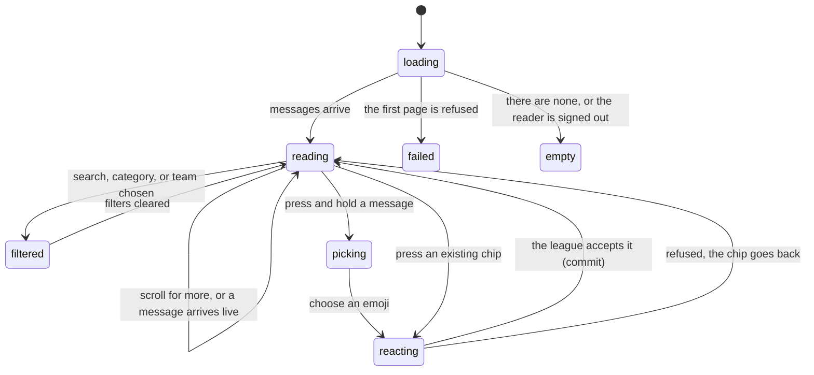

# Reading the message board

## Summary

The message board is the league's one shared conversation. It lives at
`/message-board` and it is a single flat list: newest message at the top, ten at
a time, more as the user scrolls. Anyone signed in can read it and post to it;
writing is described in [`post-and-reply.md`](post-and-reply.md).

**There are no threads.** A message cannot be attached to another message,
there is no reply, and nothing is nested. Every message sits at the same level in
one list, and the only grouping the board offers is a filter.

The board is the one part of the app outside live scoring where other people's
changes arrive on their own: a message posted by someone else appears without the
reader doing anything.

## The simple case

A signed-in player opens `/message-board`. A sticky bar at the top holds the
title, a search box, a refresh button, and a filter button. Below it, a card
holds the messages.

Each message shows who wrote it, their team as a small coloured badge, and the
time. Under that is the text, exactly as it was typed, with its line breaks kept.
If anyone has reacted, a row of emoji chips sits at the bottom of the message with
a count on each.

The reader scrolls. When the tenth message goes past, a line reading "Loading
more messages..." appears and ten more arrive. While the page is open, a message
posted by anyone else drops in at the top.

Pressing an emoji chip adds the reader's own reaction to it, and the count goes
up at once. Pressing it again removes it. To use an emoji nobody has used yet,
the reader has to press and hold on the message for about half a second, which
opens a panel of twenty-four emoji.

At the foot of the screen is the box for writing a new message.

## The interaction, event by event

### Arrive

The page loads on its own, then asks for the ten most recent messages. While that
is in flight the card shows five grey message-shaped placeholders.

**A signed-out visitor sees an empty board.** The route has no guard, so the page
renders in full, but the league only lets signed-in accounts read messages. The
request succeeds and comes back with nothing, so the visitor gets the empty state
— crossed message icon, "No Messages Yet", and "Be the first to start a
conversation!" — which is an invitation they cannot act on. Under it is a fixed
bar reading "Sign in to post messages" with a **Sign In** button that goes to the
sign-in page and returns here afterwards.

If the request itself is refused, the card turns into a red panel reading "Failed
to load messages" and "Please try refreshing the page". There is no retry button.

**Filters survive from the reader's last visit.** The category, team, and search
filters are kept in the browser for the session, so arriving at the board can
show a filtered list with no obvious sign that it is filtered — the advanced
filter panel that holds the removal chips starts closed. The filter button is
tinted and carries a count, which is the only clue.

Nothing is focused on arrival. The message list is announced as a live region, so
a screen reader is told when it changes.

### Leave without changing anything

Nothing is written. The filters stay in the browser for the rest of the session;
everything else — how far the reader scrolled, which messages had been loaded, an
open reaction panel — is discarded.

Coming back re-fetches the first ten messages every time. The board is never
served from cache without checking.

### Begin editing

Reading has no editing. Three things behave like it: typing a search, choosing a
filter, and starting a reaction.

Typing in the search box does **not** filter anything by itself. The search only
runs when the reader presses Enter or the magnifying glass, and it runs on the
league's side, not in the browser — the whole list is fetched again, matching on
the message text.

Choosing a category or a team from the filter panel applies immediately and
fetches again.

### While editing

Every filter change starts a fresh request and resets the list to the first ten
matches. The scroll position is not reset with it, so a reader who was a long way
down a filtered list can be left looking at nothing.

Filters combine: a category, a team, and a search term all apply at once. Each one
that is set appears as a chip inside the filter panel with an X to remove it, and
a **Clear filters** button removes all three and closes the panel.

The **refresh** button re-fetches the first page and always reports "Messages
refreshed — Latest messages have been loaded", including for a signed-out visitor
for whom nothing was loaded at all.

The URL never changes. `/message-board` is `/message-board` with every filter set,
so a filtered board cannot be linked to or bookmarked.

### Submit

The only write on this surface is a reaction.

Pressing a chip adds the reader's reaction, or removes it if it is already theirs.
The chip's count changes **immediately**, before the league has answered, and the
chip is tinted while the reaction is the reader's own. If the write is then
refused, the count goes back and a red toast says "Error — Failed to add
reaction" or "Failed to remove reaction".

A reader who is not signed in gets a plain toast reading "Sign in required —
Please sign in to react to messages" and nothing is sent.

Reactions from other people arrive while the page is open, so a count can go up
under the reader with no action from them.

## Modifiers

| Modifier | Set at arrival | Changed while editing |
| --- | --- | --- |
| The user's role (visitor, player, admin) | A visitor gets an empty board and a sign-in bar. A player sees every message and the composer. An admin additionally sees a category picker on the composer; on the reading side an admin sees exactly what a player sees. | Signing in in another tab does not reach this page. The board stays empty until it is reloaded. |
| The record's state | A message marked as an announcement gets a blue border and an "Announcement" badge. An edited message carries "(edited)" with the time in a tooltip. A message with no reactions shows no reaction row at all. | An edit or a delete made by the author elsewhere arrives live and rewrites or removes the message under the reader. |
| The season's state (active, archived, playoffs on) | No effect. The board belongs to no season and is never cleared between them, so the top of the list can be from a season that ended. | No effect. |
| Viewport | On a phone the message list fills the screen and the sign-in or composer bar is pinned to the bottom above the navigation bar. Reaction chips are taller so they can be tapped. | No effect beyond re-flowing. |
| Keys the form honours | Tab reaches the search box, the refresh and filter buttons, every reaction chip, and — for the author only — each of their own messages. Enter in the search box runs the search. | Enter and Space activate a reaction chip. **There is no key that opens the reaction panel**, so a keyboard-only reader can only use emoji somebody else has already used. |

## Cancel and interrupt

| Event | Before the first edit | While editing or submitting |
| --- | --- | --- |
| Escape, or a Cancel button | No effect. There is no Cancel on the reading side. | The reaction panel has its own X button; Escape does not close it. Escape in the search box clears the box but does not undo a search already run. |
| In-app navigation away, or switching tab within the page | Nothing is lost except the scroll position and how many pages had been loaded. | A reaction already sent still lands. Its result is never seen, and the toast for a failure can appear over whatever page the reader moved to. |
| Browser back or forward | Returns to the previous page. The filters persist; the scroll position does not. | Same as navigating away, and the app cannot prevent it. |
| Reload, or the tab closed | The first ten messages are fetched again. Filters are restored from the browser. | A reaction already sent may have landed. After reloading, the chip itself is the only evidence. |
| Network lost mid-request | The first page fails and the red "Failed to load messages" panel replaces the card. | A reaction is rolled back and its red toast appears. A "load more" failure keeps the messages already on screen and shows "Error loading messages — Could not load additional messages. Please try again." Nothing is queued. |
| The request fails or times out | Retried once, then the red panel. | As above. A failed refresh shows "Refresh failed — Could not refresh messages. Please try again." |
| The session expires | Reads stop working, so the board silently becomes empty — the same as being signed out, with nothing to say why. | A reaction is refused and rolled back with the generic red toast. The composer stays on screen. |
| The same record changed in another tab, or by another user | **This board is live.** A new message appears at the top, an edit rewrites in place, and a delete removes the message, all without the reader acting. A message that does not match the current filters is not added. | The same, including in the middle of choosing a reaction. A message being deleted under an open reaction panel leaves the panel with nothing to act on. |
| Browser autofill or a password manager writes into the form | The search box is a plain search field and is not offered anything to fill. | Same. Filling it would not run a search, because the search only runs on Enter. |
| The window loses focus | No effect on its own. Nothing polls. | No effect. If the live connection dropped while away, it is rebuilt and the first page is fetched again on reconnecting. |

After any interrupt the board is whatever the league holds, plus whatever the live
connection has delivered since. Nothing about reading it is ever half-done.

## Interactions with other systems

**Permissions and roles.** Reading needs a signed-in account, enforced by the
database rather than by the route. Reacting needs one too. There is no admin-only
view of the board. See
[`../cross-cutting/permissions.md`](../cross-cutting/permissions.md).

**Season scoping.** None. The board is not attached to a season and is not
cleared when one changes over. See
[`../foundations/seasons.md`](../foundations/seasons.md#what-is-scoped-to-a-season-and-what-is-not).

**Validation and error display.** Nothing on the reading side is validated.
Failures are a red panel for the first page, and toasts for everything else.

**Unsaved changes.** None. There is nothing on this side to lose.

**Optimistic updates and rollback.** Reactions are optimistic: the chip changes
first and is put back if the write fails. Everything else waits for the league.

**Realtime.** The board holds an open connection for messages, and one more for
every message currently on screen for its reactions. Ten visible messages means
eleven channels. If the connection drops it is rebuilt with a growing wait
between attempts, and the first page is fetched again on reconnecting so nothing
missed while away is lost.

**Offline.** The board cannot load, and a reaction fails and rolls back. Nothing
is queued.

**Toasts and notifications.** Six: refresh succeeded, refresh failed, load-more
failed, add-reaction failed, remove-reaction failed, and sign-in-required. One at
a time, as everywhere. See
[`../foundations/messages-to-the-user.md`](../foundations/messages-to-the-user.md#toasts).

**URL state.** Nothing at all. Not the filters, not the search, not a message.
**A single message cannot be linked to**, which is the board's largest gap: there
is no way to point anyone at anything said on it.

**On a phone.** The composer or sign-in bar is fixed above the bottom navigation.
The message list is a fixed-height panel inside the page, so the page and the list
scroll separately — reaching the bottom of one does not always continue into the
other.

**Accessibility.** The list is a live region and reports itself as busy while
loading, so a screen reader is told when messages arrive. Reaction chips carry
labels naming the emoji and its count. The reaction panel cannot be opened by
keyboard at all, and an author's own message is a clickable card with no label
saying what pressing it does.

**Side effects the user can notice.** None from reading. A reaction is stored
against the message and is visible to everyone; nobody is notified of it.

## Edge cases

- **A signed-out visitor is told to be the first to start a conversation.** They
  cannot read the board and cannot post to it, but the empty state is the same one
  a signed-in reader would see on a genuinely empty board. Nothing says the board
  is hidden rather than empty. **May be worth treating as a bug rather than
  documenting.**
- **The refresh button reports success when it loaded nothing.** It reports on the
  request completing, not on anything arriving, so a signed-out visitor pressing it
  is told "Latest messages have been loaded".
- **Three of the five category filters can never match anything.** The filter
  offers General, Question, Announcement, Event, and Other, but the composer can
  only produce General, and Announcement for an admin. Choosing Question, Event, or
  Other always empties the board.
- **Filters are remembered but not shown.** They survive across visits for the
  session, and the panel that lists them starts closed, so a reader can come back
  to a board filtered to one team and read it as the whole board.
- **The board pages by time, not by position.** More messages are asked for by
  "older than the last one I have". Two messages stored at the same instant can
  therefore straddle the boundary and one of them be skipped.
- **The live list is capped at a hundred messages.** Once a hundred are on screen,
  a new arrival pushes the oldest out of the list, and scrolling back down fetches
  it again.
- **Every message shows a clock time and no date.** A message from three weeks ago
  reads "3:42 PM", exactly like one from this afternoon. There is no day
  separator anywhere in the list. **May be worth treating as a bug rather than
  documenting.**
- **The first reaction on a message is hidden behind a press-and-hold.** Nothing
  on screen suggests it, and there is no keyboard equivalent, so most readers can
  only use emoji somebody else started.
- **For the author of a message, press-and-hold on a desktop does two things at
  once**: it opens the reaction panel, and releasing the button also opens the
  edit and delete controls.
- **The team badge is coloured by that team's current power score**, not by
  anything about the message, so the colour on an old message changes as the
  season goes on.
- **Match comments are a different feature.** The comments and reactions attached
  to a match on the schedule are stored separately and never appear here; see
  [`../schedule/a-match-card.md`](../schedule/a-match-card.md).

## Open questions and verification

- **`foundations/saving-and-freshness.md` states that only live scoring
  subscribes to anything and that there is no realtime anywhere else.** The
  message board subscribes to messages and to every visible message's reactions.
  One of the two is wrong and the consistency pass should settle it.
- **The glossary says a visitor can read the message board.** The database only
  allows signed-in accounts to read messages, so a visitor gets an empty board.
  The app's own help page agrees with the database — it lists the message board
  under what a *player* gets and not under what a visitor gets — so the glossary
  is the entry most likely to be wrong.
- Not confirmed by hand: whether a signed-out visitor really gets an empty list
  rather than an error. It is read from the row-level rules, which filter rather
  than refuse, but the outcome depends on the live database and should be checked.
- Not confirmed by hand: whether the fixed-height list inside the page behaves
  sensibly on a phone, and whether infinite scrolling reliably triggers there.
- Not confirmed by hand: how many open channels the board really holds with a full
  list on screen, and whether that is a problem in practice.
- Not confirmed by hand: whether a reaction added by someone else visibly arrives
  on an open page, or only on the next load.
- Assumption: the board is intended to be readable only by signed-in accounts.
  Nothing in the interface says so, and the page is built as though visitors were
  expected.

Verified against `717rec` commit `ea5c8f4`.
