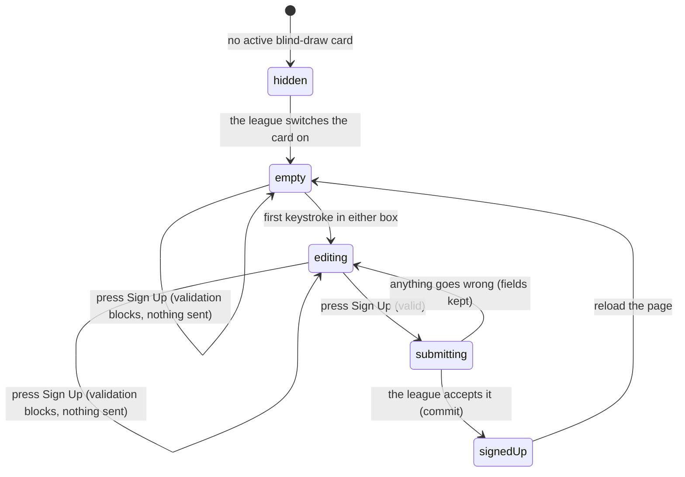

# Signing up for the blind draw

## Summary

The blind draw is a separate competition from the league season: players sign up
as individuals on the night and are paired at random, instead of playing on their
season team. It is nothing to do with brackets, seeds, divisions, or power score,
and it produces no record anywhere in the rest of the app.

Signing up is a two-field form: a first name and a last initial. That is all the
league stores. It needs no account and no membership, which makes it — with the
[contact form](../help/contact-the-league.md) — one of only two writes a visitor
can perform.

**The form is not on `/playoffs`.** It appears on the home page, inside an event
card, and only while the league has that card switched on. There is no page for
it, no link to it, and no way to reach it once the card is off.

## The simple case

A player opens the home page during blind-draw week. Near the top is a green card
with the event's name, the date, a countdown reading something like "3h 20m until
start", the check-in time, the buy-in, and the payouts. Past winners are listed
under that.

At the bottom of the card is a small panel headed "Sign Up" with two boxes: a
wide one marked "First Name" and a narrow one marked "L.I.". Above it, once at
least one person has signed up, a pill reads "7 signed up".

The player types their first name and a single letter, and presses "Sign Up". The
button shows a spinner. A second later the whole panel is replaced by a tick and
the league's confirmation message — by default "You're signed up! See you there!"
— and the same sentence appears as a toast.

That is the end of it. There is no withdraw button, no list of who has signed
up, and no confirmation anywhere else.

## The interaction, event by event

### Arrive

The card is drawn from the league's hero cards, which are cached for five
minutes. The signup panel appears only when **all** of these are true: the card
is an event card, its slug is `blind-draw`, it is marked as an active event, and
it carries a start time. Miss any one and the card renders without a signup
panel, or does not render at all.

The event's date is worked out from that start time **in Eastern time**, not the
viewer's. A player in another time zone still signs up for the league's night.

Both boxes start empty and **nothing is focused**, so a player who arrives and
starts typing types nothing. The signup count loads separately and is cached for
two minutes; while it is loading, or while it is zero, the pill is absent rather
than showing "0 signed up".

**Nothing is recorded by arriving.** There is no draft and no memory of a
previous visit.

### Leave without changing anything

Nothing happens. Coming back gives an empty form again — including for somebody
who already signed up, because the app has no way to know that. See
[Edge cases](#edge-cases).

### Begin editing

The first keystroke in either box makes the form dirty. **Nothing visible
changes**: the "Sign Up" button is enabled from the moment the panel is drawn.

**No validation runs while typing.** The rules are checked only when the button
is pressed. Two things do happen as the user types: the first-name box stops
accepting characters at 30, and the last-initial box takes only the first
character typed and shows it in upper case.

### While editing

Pressing "Sign Up" checks both fields at once and, if either fails, shows a small
red message under it and sends nothing:

| Field | Rule | Message shown |
| --- | --- | --- |
| First Name | at least 1 character after trimming | "Name required" |
| First Name | at most 30 characters | "Too long" |
| L.I. | exactly one character | "Single letter" |
| L.I. | a letter, not a digit or symbol | "Letter only" |

The messages clear on the next press, not as the field is corrected.

### Submit

The button becomes a spinner and is disabled, so it cannot be pressed twice. Both
boxes stay editable while the request is in flight; typing during it changes
nothing about what is sent.

One row is written: the event date, the trimmed first name, and the upper-cased
initial. **Nothing that identifies the person is stored** — no account id, no
email, no timestamp beyond when the row was created. A signed-in player's signup
is indistinguishable from a visitor's.

On success three things happen: both boxes are cleared, the panel is replaced by
the tick and the confirmation message, and the same message appears as a toast.
The signup count and the admin's list are both refreshed.

On failure nothing is cleared. Both boxes keep their text, the button comes back,
and one red toast says "Error — Failed to sign up. Please try again." **The toast
is the same whatever went wrong**, and the reason from the server is discarded.

## Withdrawing

**A player cannot withdraw.** There is no button, no link, and no page. The
database refuses a delete from anyone who is not an admin, so even a crafted
request fails.

Removing a signup is an admin action on the admin dashboard's blind-draw tab,
where each row has a bin icon and a confirmation dialog. The tab also has a
"Clear All" button. See
[`admin/run-the-playoffs.md`](../admin/run-the-playoffs.md).

A player who signs up by mistake has one option: ask the league. There is nothing
on the confirmation panel that says so.

## Modifiers

| Modifier | Set at arrival | Changed while editing |
| --- | --- | --- |
| The user's role | No effect on the form. A visitor, a player, and an admin see and use exactly the same two boxes, and nothing is prefilled from a signed-in profile. Only an admin can *see* the resulting list. | No effect. Signing in or out in another tab does not reach this panel. |
| The record's state | No effect. Each press creates a new row; there is no existing record to be in a state. | No effect. |
| The season's state | No effect. A blind draw is not attached to a season, a division, or a bracket. Whether the panel appears depends on the hero card alone, not on `playoffs_active`. | No effect. |
| Viewport | The card is one column on a phone and two on a wide screen. The two boxes stay side by side at every width, and both are sized for a thumb. | No effect beyond re-flowing on rotation. |
| Keys the form honours | Tab reaches First Name, then L.I., then Sign Up. | Enter in either box submits the form, because both are single-line. Escape does nothing. |

## Cancel and interrupt

| Event | Before the first edit | While editing or submitting |
| --- | --- | --- |
| Escape, or a Cancel button | No effect. There is no Cancel anywhere on this panel. | No effect. It does not clear the boxes and it does not abort a request in flight. |
| In-app navigation away, or switching tab within the page | Nothing is lost, because nothing was typed. | **Everything typed is lost, with no warning.** A request already sent still lands and the signup is recorded, but the player never sees the confirmation — no tick, no toast. |
| Browser back or forward | Returns to the previous page. Nothing is recorded. | Same as navigating away. Coming back gives an empty panel; the text is not restored, and neither is the confirmation for a signup that succeeded. |
| Reload, or the tab closed | Gives a fresh empty panel. | **Everything typed is lost.** A signup already sent still lands. After a reload the panel is empty again with no sign of a successful signup, so the player cannot tell which happened. |
| Network lost mid-request | Cannot happen; no request is in flight. | The request fails, both boxes are kept, and the generic red toast appears. Nothing is queued and nothing is retried. |
| The request fails or times out | Cannot happen. | Both boxes are kept and the generic red toast appears. A retry may sign the same person up twice, because nothing deduplicates. |
| The session expires | No effect. | No effect. The form needs no session and works signed out. |
| The same record changed in another tab, or by another user | No effect. There is no shared record. | No effect. There is no realtime here. The "N signed up" pill is up to two minutes old and never updates on its own; other people signing up are invisible until something refetches. |
| Browser autofill or a password manager writes into the form | The first-name box asks the browser for a given name and may be filled from saved contact details. The initial box is never autofilled. Validation still does not run. | Same. An autofilled name over 30 characters is truncated as it is typed but is not flagged until the button is pressed. |
| The window loses focus | No effect. | No effect on the form. Returning to the tab can refetch the signup count and the hero cards, so the pill can jump — and, if the league switched the card off meanwhile, the whole panel can vanish while a name is half-typed. |

After any interrupt the player is left with an empty panel and no way to check
whether their name reached the league.

## Interactions with other systems

**Permissions and roles.** Anyone may insert; only an admin may read or delete.
That split is enforced by the database, not by the browser. The count everyone
sees comes from a separate server function that is allowed to count rows nobody
is allowed to read.

**Season scoping.** None. A blind-draw signup carries a date and nothing else. It
is not attached to a season, so it survives a season changeover untouched. See
[`foundations/seasons.md`](../foundations/seasons.md).

**Validation and error display.** Two rules per field, run only on submit, shown
under the field. Server rejections do not appear under a field; they become the
one generic toast.

**Unsaved changes.** Not handled. No guard, no prompt, no draft.

**Optimistic updates and rollback.** None. The panel does not switch to its
confirmation until the league has answered.

**Realtime.** None. The count is a cached number, not a live one.

**Offline.** The request fails and the player is told to try again. Nothing is
queued.

**Toasts and notifications.** One toast per attempt: the league's confirmation
message on success, a generic red one on failure. The success toast repeats what
the panel already says, so a successful signup is confirmed twice. Nothing is
emailed and nothing is pushed.

**URL state.** None. The form has no address of its own and a signup cannot be
linked to, bookmarked, or shared.

**On a phone.** Both boxes and the button are 44 pixels tall, which is the point:
this form is used standing at a venue. Nothing else changes. See
[`cross-cutting/on-a-phone.md`](../cross-cutting/on-a-phone.md).

**Accessibility.** Neither box has a real label — both rely on placeholder text
alone, which disappears as soon as the player types and is not reliably announced
by a screen reader. The error messages are plain text next to the field rather
than being tied to it. Replacing the panel with the confirmation is not
announced.

**Side effects the user can notice.** One row appears on the admin's blind-draw
list and the public count goes up by one. Nothing else in the app changes.

## Edge cases

- **The same person can sign up any number of times.** Nothing checks for a
  duplicate name, and there is no unique rule in the database. Two players called
  "Mike S." are also indistinguishable — which is the same problem from the other
  direction.
- **A player cannot tell whether they already signed up.** The panel resets on
  every reload, and the list is admin-only. The only evidence is the count going
  up, which is up to two minutes stale.
- **"Clear All" clears every date, not just tonight.** The admin's list is
  unfiltered, and the clear removes every row in the table.
- **The event date comes from the card's start time in Eastern time.** A card
  whose start time is set wrongly signs everybody up for the wrong day, and
  nothing on the panel shows which date is being written.
- **Switching the hero card off hides the form immediately** on the next
  refetch, mid-typing if necessary. Existing signups are untouched and stay
  visible to the admin.
- **The confirmation message is set by the league** and can be anything up to 100
  characters. If the settings row is missing, the default "You're signed up! See
  you there!" is used instead, and nobody is told.
- **Pressing Enter after the first name submits the form**, so a player who fills
  one box and presses Enter out of habit gets "Single letter" under a box they
  have not reached.
- **The signup count hides itself at zero.** An empty blind draw and a
  still-loading one look identical.

## Open questions and verification

- **There is no way for a player to withdraw, and nothing says so.** The panel
  confirms the signup and offers nothing else — no "made a mistake?" line, no
  contact link. **May be worth treating as a bug rather than documenting.**
- **Neither field has a real label.** "First Name" and "L.I." are placeholders
  only, which fails the same standard the rest of the app's forms meet. **May be
  worth treating as a bug rather than documenting.**
- **Duplicate signups are silently accepted.** Whether that is a problem depends
  on how the league runs the draw, and that is a decision for the league.
- Not confirmed by hand: whether the hero card is normally switched on and off by
  hand each week, and how long before the event.
- Not confirmed by hand: what the admin's list looks like with several dates in
  it at once, and whether the missing date filter is a real problem in practice.
- Not confirmed by hand: whether the count pill updates for a player who signs up
  — the mutation invalidates it, so it should, but only for their own browser.
- Assumption: "L.I." is understood by players to mean last initial. Nothing on
  the panel expands it.

Verified against `717rec` commit `ea5c8f4`.
