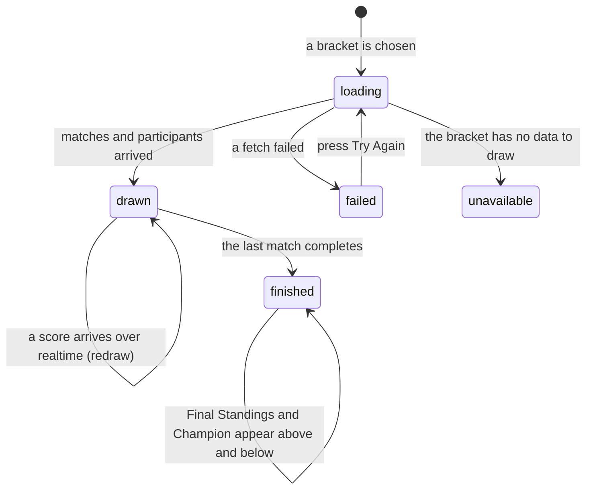

# Reading a bracket

## Summary

A bracket is the playoff tree for one division: a grid of match cards where the
winner of one feeds the next, drawn left to right, round by round. This document
describes what is on the screen once a bracket is open, what every part of a
match card means, and what the empty slots say before a team reaches them.

The drawing is done by an external library, not by 717rec. The league's own
rules — best of three, first to 21, win by two — do not appear here at all. What
the bracket shows is a *match* score in games, and the shape of the tree comes
from the library's rules about seeding and byes rather than the league's.

Opening a bracket is owned by
[`the-playoffs-page.md`](the-playoffs-page.md). The objects a bracket is made of
are defined in
[`foundations/league-objects.md`](../foundations/league-objects.md).

## The simple case

A player presses "View Live Bracket". A progress bar counts through four steps —
"Loading bracket info...", "Fetching stage & participants...", "Loading
matches...", "Fetching team details..." — and then the bracket appears inside a
card.

The card's header names the bracket, its division, its format, and its state as a
coloured pill: grey "Pending", blue "In progress", green "Completed".

Under the header is the bracket itself. Columns run left to right, one per round,
each with a heading: "Winners Round 1", "Winners Semi-Final", "Winners Final",
then "Losers Round 1" and so on, and finally "Grand Final". Each match is a small
card with two rows, one per team, each row showing the team's logo, its name and
its score in games. The winning row is marked.

A slot with nobody in it yet is not blank. It reads what will fill it: "Winner of
WB 1.1", "Loser of WB Semi 1". A slot that will never be filled reads "BYE".

When the bracket is finished, a "Final Standings" card appears above it listing
every team in placement order with a trophy, a medal and an award badge for the
first three, and each team's match and game record. Below the bracket, a
"Tournament Champion" panel names the winner.

## The interaction, event by event

### Arrive

The bracket loads in four steps and shows its progress as a percentage while it
does: 20, 50, 75, 90, done. This is the only progress bar in the app; everywhere
else a wait is a spinner or a skeleton.

Two more things load quietly beside it. The bracket's participants are fetched so
seed numbers can be drawn, and — only when the bracket is completed — its final
standings.

The drawing itself waits for the browser's fonts to finish loading before it
runs, because the connector lines between matches are positioned from the drawn
text. A bracket therefore appears all at once rather than reflowing.

**Nothing is written by arriving**, and nothing about a bracket is personal: two
people looking at the same bracket see exactly the same thing.

### Leave without changing anything

Nothing is recorded. The drawing is thrown away and rebuilt from scratch next
time, though the underlying data stays cached for a minute.

### Begin editing

For a player there is no editing. **Pressing a match card does nothing at all.**
There is no detail view, no popup, and no link out to the teams.

For an admin, pressing a match card opens the score editor — unless both slots
are still empty, in which case the press is ignored, because there is nothing yet
to score.

### While editing

The bracket redraws whenever the data changes: an admin saving a score, or a
realtime message arriving. It compares the new data with the old and skips the
redraw when nothing that shows has changed, so a burst of writes produces one
redraw rather than five.

The bracket is wider than the screen almost always. It scrolls sideways inside
its own card; the page behind it does not.

### Submit

Not applicable. A player commits nothing here. Saving a playoff score is an admin
action, described in
[`admin/run-the-playoffs.md`](../admin/run-the-playoffs.md).

## What a match card shows

| Part | What it means |
| --- | --- |
| Two rows | The two sides of the match, top and bottom. |
| A name | The team. Names come from the bracket's own participant list, so a team renamed after the bracket was built keeps its old name here. |
| A logo | The team's image, if it has one. |
| A number before a name | The team's seed. The first round gets its seed markers from the library; later rounds get a "#N" badge added afterwards, so a team's seed follows it through the bracket. |
| A number after a name | The team's score for that match, in **games won**, not points. A best-of-three final therefore reads 2–1, never 21–18. |
| A highlighted row | The winner. |
| "Winner of WB 1.1" | The slot is empty and will be filled by the winner of that match. `WB` is the winners bracket, `LB` the losers bracket, and `1.1` is round one, match one. |
| "Loser of WB Semi 1" | Same, for a slot in the losers bracket fed by a loss. |
| "BYE" | The slot will never be filled. The team facing it advances without playing. |
| An empty slot with no text | Its feeder match is already finished, or the flow could not be worked out. |

Round headings and the labels inside the cells use **two different naming
schemes**. The column heading says "Winners Final"; a hint pointing at that same
match says "Winner of WB Final". They are the same match.

## Byes, and why there are no play-ins

The number of teams in a bracket is rounded **up** to the next power of two, and
the gap is filled with byes. Eleven teams make a sixteen-slot bracket with five
byes; the byes go to the top five seeds, who skip round one.

**The current engine never draws a play-in.** A play-in — an extra match before
round one, used when the team count is not a power of two — exists in the data
model and in older brackets, but a bracket built today uses byes instead. If a
bracket shows a play-in, it is a legacy bracket.

A bye slot and a to-be-decided slot look different and mean different things. A
bye says "BYE" and never changes. A to-be-decided slot names the match that will
fill it and changes when that match finishes. Conflating them is how a bracket
appears stuck.

## Modifiers

| Modifier | Set at arrival | Changed while editing |
| --- | --- | --- |
| The user's role | A visitor and a player get an identical, inert bracket. An admin gets clickable match cards and a toolbar above the bracket: Repair Bracket, Rearrange Teams, Update Seeding, Edit Bracket, Delete, and — on a completed bracket missing its standings — Recalculate Standings. | Admin granted or revoked elsewhere does not reach this card until it refetches. |
| The record's state | A completed bracket shows the Final Standings card and disables Rearrange and Update Seeding for admins. A pending or in-progress bracket shows neither. | A bracket completing while it is open adds the standings card and announces "Tournament Complete! Final standings have been calculated." |
| The season's state | No effect. A bracket is drawn the same way whatever season it belongs to, including an archived one. | No effect. |
| Viewport | The bracket scrolls sideways in its own container at every width; it is never scaled down to fit. On a phone the whole admin toolbar is hidden. | No effect beyond re-flowing on rotation. |
| Keys the page honours | Nothing is focused and there are no shortcuts. The bracket is drawn as plain elements, so Tab does not step through matches. | No shortcuts. |

## Cancel and interrupt

| Event | Before the first edit | While editing or submitting |
| --- | --- | --- |
| Escape, or a Cancel button | No effect. There is no Cancel here. | Closes an admin's score editor. It does not close the bracket. |
| In-app navigation away, or switching tab within the page | The drawing is discarded and both subscriptions close. Nothing is recorded. | An admin switching to the Teams tab keeps the bracket mounted but hidden; coming back shows it without reloading. |
| Browser back or forward | Back removes `?bracket=<id>` and returns to the list. | Same. Nothing about the drawn bracket is in the history, so back never steps through rounds. |
| Reload, or the tab closed | The bracket in the address reloads from scratch, progress bar and all. | An admin's unsaved score in the editor is lost. Everything drawn is rebuilt from the database. |
| Network lost mid-request | The four-step load stops and the failure state appears: "Failed to load bracket: *reason*" with a "Try Again" button. This one **passes the real reason through**, unlike most of the app. | The realtime pill disappears and the bracket freezes at its last drawing. Nothing is queued. |
| The request fails or times out | As above. The read is retried twice automatically before the failure is shown. | An admin's failed save is reported and rolled back; the bracket redraws from the server. |
| The session expires | No effect. Brackets are public to read. | An admin keeps seeing the toolbar and the clickable cards; the next save fails. |
| The same record changed in another tab, or by another user | Not applicable before arriving. | **Expected.** A score entered anywhere arrives over realtime and the bracket redraws in place, with a toast. Winners advance into the next round as the redraw happens. |
| Browser autofill or a password manager writes into the form | No effect. There are no text fields in a bracket. | No effect except inside an admin's score editor. |
| The window loses focus | No effect. | The subscription stays open. The bracket does not refetch when focus returns, so anything realtime missed stays missing until something else refetches. |

## Interactions with other systems

**Permissions and roles.** Reading is open to everyone. Every control on and
around a bracket is admin-only and hidden from everyone else. See
[`cross-cutting/permissions.md`](../cross-cutting/permissions.md).

**Season scoping.** A bracket belongs to one season and is drawn from its own
stored data, so an archived season's bracket is drawn exactly as it finished.

**Validation and error display.** Three separate failure screens can replace the
bracket: "Invalid bracket ID", "Failed to load bracket: *reason*" with a retry,
and "Data Structure Error — Bracket found but matches data is corrupted". A crash
inside the drawing itself is caught and shown as "Bracket Rendering Error" with
the message and the bracket id, and a retry that redraws.

**Unsaved changes.** None for a player.

**Optimistic updates and rollback.** None for a player.

**Realtime.** The bracket subscribes to its own matches. Every change redraws it.
See [`the-playoffs-page.md`](the-playoffs-page.md).

**Offline.** The bracket cannot load and shows its failure screen with a retry.

**Toasts and notifications.** "Bracket Updated" on every realtime change, and
"Tournament Complete!" once, the first time the bracket completes while the page
is open.

**URL state.** The bracket id only. There is no address for a round, a match, or
a team inside a bracket.

**On a phone.** The bracket scrolls sideways and is genuinely hard to read: it is
never scaled to fit, and a sixteen-team double-elimination bracket is several
screens wide. The admin toolbar is hidden entirely. See
[`cross-cutting/on-a-phone.md`](../cross-cutting/on-a-phone.md).

**Accessibility.** The bracket is a labelled region: "Playoff Bracket: *name*".
Inside it, the drawing is the library's own markup — the match cards are not
buttons, are not in the tab order, and carry no roles, so a keyboard or screen
reader user cannot reach an individual match. Flow hints are added as plain text
with a matching tooltip, so they are readable. The Final Standings card is an
ordinary list and reads well.

**Side effects the user can notice.** None from reading. The library is loaded
on demand the first time any bracket is opened, which is why the first bracket of
a session takes noticeably longer than the second.

## Edge cases

- **A bracket can show a walkover before anyone has played.** When a slot faces a
  stored bye, the engine records the win in advance. The card shows a result for
  a match that has not happened.
- **A match with two byes is a real shape**, not corruption. Brackets with many
  first-round byes produce them, and the bye passes through to the next round.
- **A "Grand Final - Round 2" column appears only in a double-elimination bracket
  that needs a reset match** — when the team from the losers bracket wins the
  first grand final. Its slots deliberately carry no flow hints, because both
  teams come from the round before it rather than from the two bracket finals.
- **Team names in a bracket are frozen at build time.** A team renamed
  mid-playoffs shows its old name in the bracket and its new name everywhere
  else.
- **The seed badge and the library's own seed marker are different mechanisms.**
  Round one gets the library's; every later round gets 717rec's. They are meant
  to look the same.
- **Long UUIDs are hidden after the fact.** The library occasionally prints an
  internal id as text; the page finds and hides those a moment after drawing, so
  one can flash on screen.
- **A completed bracket with no standings row shows no Final Standings card at
  all** rather than an empty one. Only an admin sees anything is missing, via the
  "Recalculate Standings" button that appears for exactly that case.
- **The champion panel reads the bracket's stored champion**, not the final
  match. A bracket whose last match is scored but whose champion was never
  written shows a finished bracket and no champion.

## Open questions and verification

- **The bracket is unreachable by keyboard and by screen reader.** The drawn
  matches are plain elements with no roles and no tab stops, so an admin cannot
  score a playoff match without a mouse or a touchscreen. **May be worth treating
  as a bug rather than documenting.**
- **Round headings and flow hints use different names for the same match**
  ("Winners Final" versus "Winner of WB Final"). Harmless but confusing, and both
  strings are defined in the app rather than the library.
- Not confirmed by hand: how a 32-team double-elimination bracket behaves on a
  phone, and whether sideways scrolling inside a card fights the browser's
  back-swipe gesture.
- Not confirmed by hand: what the library draws for a bye slot exactly — the word
  "BYE" is inferred from the class the decoration code skips.
- Not confirmed by hand: how long the four-step progress bar takes on a real
  bracket, and whether all four steps are ever visible.
- Not confirmed by hand: whether the "Data Structure Error" screen has ever
  appeared in practice.
- Assumption: byes going to the top seeds is intended. It follows from rounding
  the team count up and seeding in order; nothing in the app states it as a rule.

Verified against `717rec` commit `ea5c8f4`.
