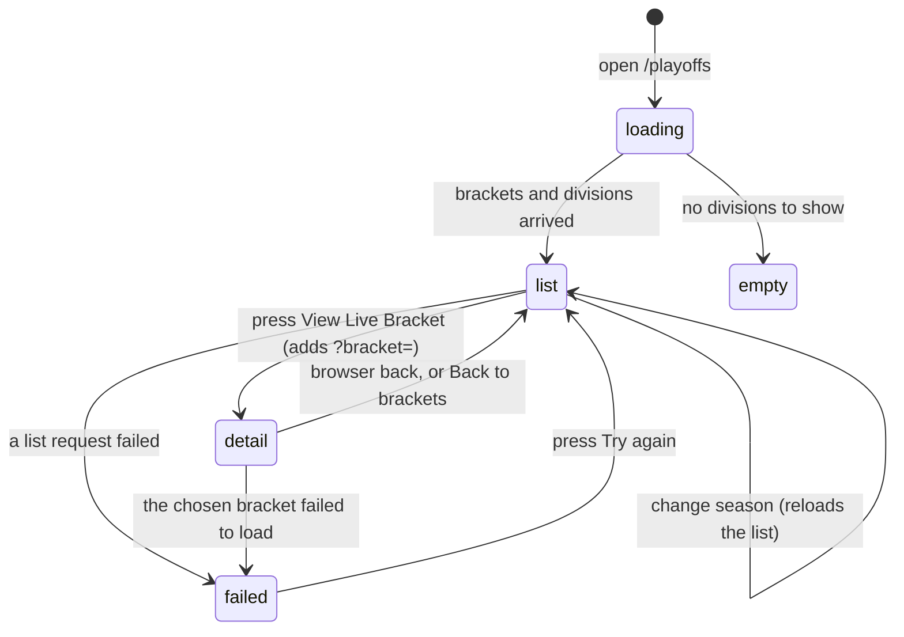

# The playoffs page

## Summary

`/playoffs` is where the league's brackets live. It is a read-only page for
everybody except an admin: it lists the brackets for one season, grouped by
division, and opens one of them into a drawn bracket. It is the only page other
than live scoring that updates under the user without a refresh.

The page picks its own season. There is no "current playoffs" flag it reads on
arrival — it prefers the season whose playoffs are still running, and falls back
to the active season. A season picker appears only when the league has more than
one season on record.

This document owns arriving at `/playoffs`, choosing a season, choosing a
bracket, and every state the page can be in across a season. How the bracket
itself is drawn is owned by [`read-a-bracket.md`](read-a-bracket.md). The blind
draw is a different thing entirely and lives somewhere else; see
[`blind-draw-signup.md`](blind-draw-signup.md). Everything an admin does here is
in [`admin/run-the-playoffs.md`](../admin/run-the-playoffs.md).

## The simple case

A player opens `/playoffs`. The page shows a heading, "Playoffs", and a line
under it reading "Tournament brackets and playoff schedules". On a wide screen a
"Season:" dropdown sits under the heading; on a phone it is pinned to the bottom
of the screen instead.

Below that is one card per division, strongest division first. Each card names
the division, says how many brackets it has, and lists them. Each bracket shows
its name, its format, and one button: "View Live Bracket", or "View Final
Results" once the bracket is finished.

Pressing the button replaces the list with the drawn bracket and adds
`?bracket=<id>` to the address. Pressing browser back returns to the list.

Out of playoff season the same page shows the same division cards, each reading
"No brackets yet for this division". Nothing says "the playoffs have not started
yet"; an empty division card is the whole message.

## The interaction, event by event

### Arrive

Four things load at once: the list of seasons, the season whose playoffs are
active, the active season, and the divisions. The bracket list waits for a
season to be chosen, then loads.

The season is chosen for the user in this order: **the season with playoffs
active**, then **the active season**. The page waits until both answers are back
before choosing, so a cached active season cannot win the race against a
still-loading playoff season.

> **Technical note:** `/stats` resolves the same pair the other way round —
> active season first. That is deliberate. The standings should follow the new
> season as soon as it is activated; the playoffs page should keep showing the
> bracket that is still being played.

While the brackets, the divisions, or the admin check are still loading, the
whole body of the page is replaced by a spinner reading "Loading...". The
heading and the season picker stay.

The bracket list itself is deliberately never cached: it is refetched every time
the page mounts. A bracket created or deleted elsewhere therefore appears or
disappears on the next visit rather than up to five minutes later.

**Nothing is written by arriving.** No pageview beyond the ordinary one, no
record that a bracket was looked at.

If the league has switched the Challonge fallback on, a block of embedded
Challonge brackets appears above the list whenever no bracket is selected. It has
its own heading, its own subtitle, and an "Expand All" button; each bracket is a
collapsed panel that opens into an embedded frame from `challonge.com`. It is
read-only and it comes from outside the app.

### Leave without changing anything

Nothing is recorded and nothing is kept. The realtime subscription, if one was
open, closes. Coming back re-runs the whole load.

The one thing that survives is the address: a link carrying `?bracket=<id>` opens
straight to that bracket. Nothing else about the page is in the URL — not the
season, not the admin tab.

### Begin editing

There is no editing here for a player. The page has exactly two controls: the
season dropdown and the per-bracket buttons. Neither makes the page dirty,
because neither is a form.

An admin sees more: a Brackets/Teams tab strip, a Create Bracket button on an
empty division, a Delete button beside each bracket, and — inside a bracket — a
row of admin tools. Those are owned by
[`admin/run-the-playoffs.md`](../admin/run-the-playoffs.md).

### While editing

Changing the season reloads the bracket list for that season. The choice is held
in memory only: it is not in the URL, not in storage, and it is lost on reload,
which returns to the automatic choice.

Choosing a bracket does three things at once: it sets `?bracket=<id>`, it starts
loading that bracket, and it starts a realtime subscription to that bracket's
matches. While the bracket loads, the list stays on screen; the drawn bracket
replaces it only when the data has arrived and its id matches the one asked for.

When the subscription is live, a small green pill reading "Live updates enabled"
sits in the bottom-right corner. A score entered by an admin anywhere else
arrives within a second or two: the bracket redraws and a toast says "Bracket
Updated — Match scores have been updated." One admin save writes several rows;
the page collapses that burst into a single refresh and a single toast.

### Submit

Not applicable. A player commits nothing on this page. The only writes here are
admin writes.

## Modifiers

| Modifier | Set at arrival | Changed while editing |
| --- | --- | --- |
| The user's role | A visitor and a player see the same page. An admin sees the Brackets/Teams tabs, the create/delete controls, and the bracket's admin toolbar. The page shows the loading spinner until the admin check resolves, so the controls never flash in and out. | Admin granted or revoked elsewhere does not reach this page until it refetches. The controls stay as they were and the database quietly starts or stops accepting the writes behind them. |
| The record's state | A bracket's state decides its button and its badge: pending and in-progress read "View Live Bracket", completed reads "View Final Results" and carries a grey "Completed" badge. A bracket not built with the current engine carries a "Legacy" badge. | A bracket completing while the page is open changes the drawn bracket over realtime, but the list behind it keeps the old button until the page refetches. |
| The season's state | The page prefers the season with playoffs active and falls back to the active season. When those are two different seasons, a banner says so by name. An archived season is selectable and shows its brackets frozen. | Changing the season in the dropdown reloads the list. Any bracket already open stays open, because the selection lives in the URL rather than in the season. |
| Viewport | On a wide screen the season picker sits under the heading and the admin toolbar buttons are a row. On a phone the season picker is a fixed bar across the bottom of the screen, and the admin toolbar buttons collapse into one **⋯** menu. | No effect beyond re-flowing on rotation. |
| Keys the page honours | Nothing is focused on arrival and there are no shortcuts. Tab reaches the season dropdown, then each bracket button in turn. | Escape closes the season dropdown. Arrow keys move within it. Nothing else. |

The season picker is **absent, not disabled**, when the league has one season or
none. A league in its first season therefore never sees it.

## Cancel and interrupt

| Event | Before the first edit | While editing or submitting |
| --- | --- | --- |
| Escape, or a Cancel button | No effect. There is no Cancel on this page. | Closes the season dropdown if it is open. It does not close an open bracket — "Back to brackets" and browser back are the only ways out of one, and "Back to brackets" appears only when the bracket failed to load. |
| In-app navigation away, or switching tab within the page | Nothing is lost, because nothing was entered. The realtime subscription closes. | The admin's Brackets/Teams choice is remembered for the browser session and restored on return. The chosen season is not. An in-flight load is abandoned. |
| Browser back or forward | Returns to the previous page. Nothing is recorded. | Back from an open bracket removes `?bracket=<id>` and returns to the list, which is the intended way out. Forward re-opens it. Scroll position is not restored on this route. |
| Reload, or the tab closed | Reloads the page from scratch. | A bracket in the address survives, so a reload returns to the same bracket. **The chosen season does not survive** — a reload snaps back to the automatic choice, which can be a different season from the one whose bracket is now on screen. |
| Network lost mid-request | The page shows its loading spinner and then the failure banners for whichever request failed. | The realtime pill disappears. The bracket keeps showing what it last had. Nothing is queued; the next refetch recovers. |
| The request fails or times out | Each failing request gets its own banner, stacked above the list: "Loading brackets" and "Loading divisions" for the list, "Loading bracket" for the chosen one. The brackets banner has a "Try again" button. | The chosen bracket failing shows a "Loading bracket" banner with both "Try again" and "Back to brackets". **"Back to brackets" is the only thing that clears `?bracket=<id>`**, so without it a reload just retries the same broken bracket forever. |
| The session expires | No effect. Everything on this page is public to read. | No effect for a player. An admin keeps seeing the admin controls and their next write fails. |
| The same record changed in another tab, or by another user | Not applicable before arriving. | **This is normal here, not an edge case.** With a bracket open, a score entered by an admin arrives over realtime and the bracket redraws with a toast. The bracket *list* has no subscription: a bracket created, renamed, or deleted elsewhere is invisible until the page is remounted. |
| Browser autofill or a password manager writes into the form | No effect. There are no text fields on this page. | No effect. |
| The window loses focus | No effect. | The realtime subscription stays open in the background. Neither the bracket nor the list refetches on focus returning — both have that switched off — so returning to the tab shows whatever realtime delivered, and nothing else. |

After any interrupt the page rebuilds itself from the address and from the
automatic season choice. Nothing the user picked, apart from the bracket, is
remembered.

## Interactions with other systems

**Permissions and roles.** Reading needs nothing at all. Every write on this page
is admin-only, and each control is hidden rather than disabled for everyone else.
See [`cross-cutting/permissions.md`](../cross-cutting/permissions.md).

**Season scoping.** The bracket list is scoped to one season on the server. The
season is chosen by the page, never by the URL. See
[`foundations/seasons.md`](../foundations/seasons.md).

**Validation and error display.** Nothing to validate. Failures appear as
stacked banners above the list rather than as toasts, each naming what failed.

**Unsaved changes.** None. Nothing on this page can be half-done.

**Optimistic updates and rollback.** None for a player. An admin's score save is
optimistic; see [`admin/run-the-playoffs.md`](../admin/run-the-playoffs.md).

**Realtime.** Present, and the only place outside live scoring where it is. Two
subscriptions open once a bracket is chosen: one watches that bracket's matches
and refreshes the drawing, one watches the bracket itself and announces
"Tournament Complete! Final standings have been calculated." when it finishes.
Both reconnect by themselves and refetch on reconnecting.

**Offline.** The page cannot load and shows its failure banners. Nothing is
cached for offline use and nothing is queued.

**Toasts and notifications.** Three toasts can appear here without any action
from the user: "Bracket Updated", "Tournament Complete!", and — for an admin —
the result of a save. Nothing about the playoffs is pushed outside the app.

**URL state.** Only `?bracket=<id>`. The season, the admin tab, and the scroll
position are all lost on navigation. A link shared during one season therefore
opens on a different season's brackets in the next, unless it names a bracket.

**On a phone.** The season picker moves to a fixed bar across the bottom of the
screen and the page reserves room for it. The admin toolbar inside a bracket
collapses into a single **⋯** menu, so an admin on a phone can repair, reseed,
rearrange, edit, and delete a bracket as well as view it. See
[`cross-cutting/on-a-phone.md`](../cross-cutting/on-a-phone.md).

**Accessibility.** The season dropdown has a real label. The drawn bracket is a
labelled region. The failure banners are alerts. Replacing the list with a
bracket is not announced — a screen reader user is moved to new content with no
warning that it happened.

**Side effects the user can notice.** None from viewing. Opening a bracket
preloads its data into the cache, which is why a bracket opened once and closed
opens again instantly.

## Edge cases

- **A bracket that predates the current engine cannot be opened.** Its row shows
  a "Legacy" badge and a working button, but the loader returns nothing for it,
  no error is raised, and the list simply stays on screen with `?bracket=<id>`
  now in the address. Nothing tells the user what happened. See
  [Open questions](#open-questions-and-verification).
- **The season shown and the season being played can differ**, and the page says
  so: "Showing *X* playoffs — regular season play is on *Y*." That banner appears
  only when both seasons exist, differ, and the playoff one is selected.
- **Divisions come out strongest first** because they are ordered by division
  weight. Nothing labels them as ordered.
- **A division with no bracket still gets a card.** For a player it reads
  "No brackets yet for this division" and offers nothing to press.
- **With no divisions at all**, the whole list is replaced by one empty state:
  "No Playoff Brackets Yet — Playoff brackets will appear here once they're
  created. Check back during playoff season!"
- **The Challonge block and a native bracket never appear together.** Choosing
  any bracket hides the Challonge block completely.
- **A deleted bracket still in the address** shows the bracket's own empty state
  rather than a failure: "No bracket selected — Choose a bracket from the list
  above", with the attempted id printed underneath.
- **Two seasons with playoffs active** is refused outright: the season lookup
  throws, and the page falls back to whatever it can show.

## Open questions and verification

- **A legacy bracket's "View Live Bracket" button does nothing visible.** The
  loader returns null for any bracket not built with the current engine, so the
  page keeps the list, adds `?bracket=<id>` to the address, and shows no message
  at all. The row already carries a "Legacy" badge, so the state is known.
  **May be worth treating as a bug rather than documenting.**
- **The chosen season is lost on reload while the bracket in the address is
  not.** After a reload the season dropdown can name one season while the open
  bracket belongs to another. **May be worth treating as a bug rather than
  documenting.**
- **Realtime here contradicts the foundations.**
  [`foundations/saving-and-freshness.md`](../foundations/saving-and-freshness.md)
  says realtime exists only on live scoring. This page opens two subscriptions
  and shows a "Live updates enabled" pill. The foundation needs correcting.
- **No route resets scroll position, but `/stats`, `/insights` and `/history`
  restore it and `/playoffs` does not.** Returning to a long bracket list by
  browser back leaves the user wherever the browser puts them.
- Not confirmed by hand: how long the "Loading..." spinner is visible in
  practice, and whether the admin check is what usually holds it.
- Not confirmed by hand: whether the Challonge embed renders at all on a phone,
  and whether its fixed 500-pixel frame is usable there.
- Not confirmed by hand: what the page shows when the league has no active
  season and no season with playoffs active.
- Assumption: the automatic season choice is meant to be invisible. Nothing in
  the page explains it, and the only sign is the overlap banner.

Verified against `717rec` commit `ea5c8f4`.
