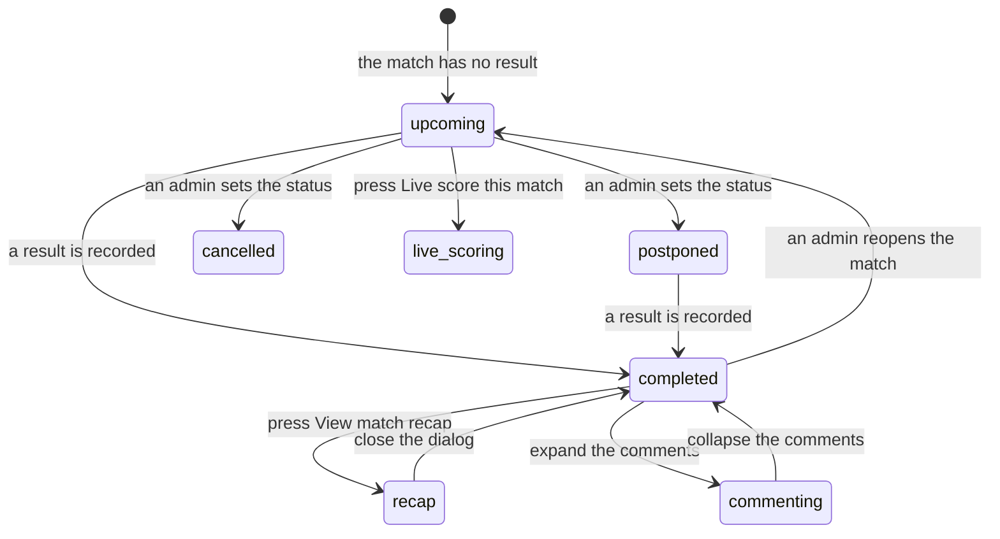

# A match card

## Summary

A match card is one match drawn as a small panel: two teams, a score, and
whatever else is worth knowing about that particular meeting. It is the unit the
schedule is built from, and the same card is used in the Upcoming list and the
Completed list. What it contains depends almost entirely on **the match's own
state** — upcoming, postponed, cancelled, or completed — and only a little on who
is looking.

The page the cards sit on is [`the-schedule-page.md`](the-schedule-page.md). This
document owns one card: everything it can show, every control it can offer, and
what each one does.

A card is not a link. There is no page for a single match; the only match route
in the app is the live scoring screen at `/matches/:matchId/live`.

## The simple case

An upcoming match shows two team logos with names under them, a score pill
reading "0 – 0" between them, and a head-to-head line: "H2H: Team Alpha leads
3–1". Under that is a countdown — "2d 6h until match" — with a thin bar that
fills as the date approaches, and a win-probability bar splitting the card
between the two teams.

A player on either team, and any admin, also sees a full-width **"Live score this
match"** button.

A completed match replaces all of that. A "Final" badge sits at the top. The score
pill shows **games won**, not points, and the winner's number and name are green.
Under it, if the match was scored live, is a **"View match recap"** button. At the
bottom sit a comment count and a row of emoji reactions.

An admin sees a small pencil and a small bin in the bottom-right corner of every
card.

## The interaction, event by event

### Arrive

A card is drawn from data the schedule already fetched, so it does not load on
its own. Three extra things are fetched around it:

- **Head to head**, for every card in a time group at once, and only when that
  group is expanded. Until it lands the card shows a small grey bar where the
  H2H line will be.
- **A prediction**, from career rankings, this season's numbers, and the same
  head-to-head figures.
- **Which completed matches were live-scored**, once for the whole list, to
  decide which cards get a recap button.

Whether the viewer may score the match is worked out at the same time, from the
admin flag and an approved membership of either team.

**Nothing is written by a card appearing.**

The score pill runs a short scale-in animation on first draw and again whenever
either match-score number changes.

### Leave without changing anything

Nothing is recorded. Expanded comments and an expanded prediction breakdown are
lost.

### Begin editing

A card has no edit mode. Its four actions each start something else: a route
change to live scoring, a dialog, an admin dialog, or a comment.

### While editing

**Live score this match** appears only when the match is not completed, is not
postponed or cancelled, and the viewer is an admin or has an approved membership
of one of the two teams. It navigates to `/matches/:matchId/live`. What happens
there is [`live-scoring/start-a-live-match.md`](../live-scoring/start-a-live-match.md).

**View match recap** appears only on a completed match that has live-scoring data
recorded. It opens a dialog headed "Match Recap" that fetches the whole match on
opening, shows "*Winner* won" with the game-wins score, a per-player summary, and
an "Open full recap" link to the live scoring screen in its read-only state. A
match completed by any other route — an admin's bulk entry, an approved score
report — has no recap button at all.

**The prediction bar** can be expanded to show the factors behind it.

**Comments and reactions** appear on completed matches only. The comment row is a
button reading "3 Comments"; expanding it shows the comments and, for a signed-in
user, a box to add one. A visitor sees a prompt to sign in instead. The reaction
row shows each emoji already used with its count; pressing one adds or removes the
viewer's own reaction, and a plus button opens a picker of twenty-four emoji in
three groups. A visitor pressing an emoji gets a toast reading "Sign in required".

**Edit and Delete** are drawn only for an admin. Edit is offered on an upcoming
match only. Delete is offered on both, and on a completed match it is styled red
and labelled "Permanently delete completed match", because deleting a completed
match also reverses the statistics it produced.

### Submit

A card commits nothing itself. Every commit it can start belongs to another
document: a round to live scoring, a comment or reaction to itself, an edit or a
deletion to the admin dialogs.

## Modifiers

| Modifier | Set at arrival | Changed while editing |
| --- | --- | --- |
| The user's role (visitor, player, admin) | A visitor sees the card and no controls except the recap and the comment list. A player sees the live-scoring button on their own team's upcoming matches, and can comment and react. An admin sees the live-scoring button on every open match plus Edit and Delete. | Admin or membership granted or revoked elsewhere does not reach the card until the profile or the membership is re-fetched. The controls stay as they were and a write started from a stale control fails at the database. |
| The record's state | Decides nearly everything: which badges appear, whether the score pill shows points or games won, whether there is a countdown and a prediction or a recap and comments. | The card does not update when the match changes elsewhere. It re-draws only when the whole schedule is re-fetched. |
| The season's state (active, archived, playoffs on) | No effect on the card. It draws whatever match it is given. | No effect. |
| Viewport | On a wide screen cards sit up to three across inside a time group. On a narrow screen they are one column, full width, and the whole date group is inside the schedule's carousel. | No effect beyond re-flowing. |
| Keys the form honours | Tab reaches both team links, the live-scoring or recap button, the comment toggle, each reaction, and the admin buttons. Nothing is focused by default. | Enter or Space activates whatever is focused. Escape closes the recap dialog, the reaction picker, and the delete confirmation. There are no shortcuts. |

The card is drawn from the light or dark theme in force at the moment, and
switching theme re-draws it with no other effect.

## Cancel and interrupt

| Event | Before the first edit | While editing or submitting |
| --- | --- | --- |
| Escape, or a Cancel button | No effect. A card has no Cancel. | Closes the recap dialog, the reaction picker, or a confirmation dialog. The delete confirmation has an explicit Cancel. Escape does not abort a comment or a deletion already sent. |
| In-app navigation away, or switching tab within the page | Nothing is lost. | A half-typed comment is lost with no warning. A comment or reaction already sent still lands; the card that would have shown it is gone. |
| Browser back or forward | Returns to the previous page. | Same as navigating away. Coming back to the schedule gives a fresh card with the comments collapsed. |
| Reload, or the tab closed | The card is rebuilt from the database. | A half-typed comment is lost. A sent comment survives. Nothing tells the user which happened. |
| Network lost mid-request | The head-to-head line and the recap button may never appear, leaving the card thinner but not broken. | Posting a comment fails and a red toast says "Failed to post comment". A reaction is rolled back. Nothing is queued. |
| The request fails or times out | As above. The card still draws with the data the schedule already had. | The comment box keeps its text and the send button comes back. A failed reaction returns the count to what it was, with a toast. |
| The session expires | No effect on reading. | Comments and reactions begin failing. The controls stay on screen because the browser still believes it is signed in. The live-scoring button also stays and the write fails on the other screen. |
| The same record changed in another tab, or by another user | Not applicable before arriving. | **Comments and reactions arrive live** — the card has its own subscriptions for both and updates under the user. **The match itself does not.** A match completed by somebody else keeps its countdown and its live-scoring button until the schedule is re-fetched. |
| Browser autofill or a password manager writes into the form | No effect. | The comment box is a plain unlabelled text area that no password manager targets. No effect observed in the code. |
| The window loses focus | Nothing. | The comment and reaction subscriptions stay open on a desktop. A phone that suspends the tab drops them and re-syncs on return. The match data itself does not re-fetch. |

After any interrupt the card is rebuilt from what was saved. It never asks the
user to confirm what state the match was in.

## Interactions with other systems

**Permissions and roles.** The live-scoring rule is stated in full in
[`live-scoring/start-a-live-match.md`](../live-scoring/start-a-live-match.md);
the card mirrors it to decide what to draw. The general rules are in
[`cross-cutting/permissions.md`](../cross-cutting/permissions.md).

**Season scoping.** None of its own. The card belongs to whichever list handed it
a match.

**Validation and error display.** A comment must not be empty; the send button
stays dead until something is typed. There is no other rule and no field message
anywhere on a card.

**Unsaved changes.** A half-typed comment is the only unsaved state and it is lost
without warning.

**Optimistic updates and rollback.** Reactions are optimistic: the count moves at
once and returns if the write fails. Deleting a comment is optimistic; adding one
is not — it waits, then appears.

**Realtime.** A completed card opens **two** subscriptions, one for comments and
one for reactions on that match. Both reconnect by themselves and re-sync on
reconnection. This is the only realtime in the app outside live scoring, and it
means a busy Completed tab holds two open channels per card.

**Offline.** The card keeps drawing. Comments and reactions fail and are lost.

**Toasts and notifications.** Failures produce a red toast; a visitor pressing a
reaction gets a plain one. Nothing about a card sends a notification to anyone.

**URL state.** None. A card cannot be linked to. The nearest thing to a link for
one match is its live scoring address, and that only exists for matches that have
been opened there.

**On a phone.** Cards are full width and one per row. The live-scoring and recap
buttons are 40 pixels tall and full width, so they are the easiest things on the
card to press. The recap dialog scrolls inside itself and is capped at 85 percent
of the screen height.

**Accessibility.** Both team names are links with visible text. Every icon-only
control has a label — "Edit match", "Delete match", "Live score *A* vs *B*", "View
match recap for *A* vs *B*", and each reaction as its emoji followed by "reaction"
and its count. Icons are hidden from screen readers. The reaction row is a
labelled group. The winning team's name carries a **"Won"** tag as well as the
emerald colour, so the result does not rest on colour alone.

**Side effects the user can notice.** None from the card itself. Following the
live-scoring button is what leads to a write, and deleting a completed match
reverses the statistics that match produced.

## Edge cases

- **An upcoming card's score pill always reads "0 – 0"**, because the number it
  shows before completion is the match-score field, which is only ever set to 0 or
  1 when a result is entered.
- **A completed card shows game wins, not points.** "2 – 1" is games, never
  points; a game's points are only visible on the live scoring screen.
- **A postponed or cancelled match keeps its badge and loses its live-scoring
  button**, but keeps its countdown and its prediction, so a cancelled match can
  still count down to a match nobody is playing.
- **The countdown disappears once the start time passes.** It is only drawn for a
  future date, so a match that is late shows nothing rather than "Starting now".
- **A completed match that was not live-scored has no recap**, and nothing on the
  card explains why some Finals offer one and others do not.
- **Both team names can read "Unknown Team"** if the match arrived without team
  details, though the schedule normally drops such matches before they reach a
  card.
- **"Upset" appears on a completed match** when the winner's pre-match probability
  was 30 percent or less. It is computed now, from today's ratings, not stored
  from the match date.
- **Rivalry tags need at least three previous meetings**; below that the H2H line
  shows the record with no tag.
- **The head-to-head line vanishes entirely** when the fetch fails, rather than
  showing an error.
- **An admin's Delete on a completed match is destructive and irreversible.** Its
  confirmation now says so in full: "This will permanently delete the match from
  the schedule. The standings, team records and statistics it counted towards are
  reversed with it." The second sentence was added as part of
  [B-30](../bug-triage.md#b-30-small-copy-and-labelling-slips).
- **Comments and reactions exist only on completed matches**, so there is no way
  to talk about a match before it is played.

## Open questions and verification

- **Comments and reactions have realtime subscriptions.** This contradicts
  "realtime exists only on live scoring" in
  [`foundations/saving-and-freshness.md`](../foundations/saving-and-freshness.md).
  The foundation needs correcting; the behaviour itself looks deliberate.
- **A Completed tab with many cards opens two realtime channels per card.** No
  limit, no pooling, and no lazy start were found. Whether this is a problem
  depends on how many completed matches a season has. Worth measuring rather
  than assuming.
- Resolved: **the winner used to be shown by colour alone**, with nothing else on
  the card marking which team won. Fixed — see
  [B-29](../bug-triage.md#b-29-results-are-distinguished-by-colour-alone-in-two-places).
  A small "Won" tag now sits beside the winning team's name.
- Not confirmed by hand: whether the score-pill animation plays on every scroll
  into view or only once, since it is triggered by the score values being defined
  rather than by them changing.
- Not confirmed by hand: what the recap dialog shows for a live-scored match whose
  rounds were later corrected by an admin.
- Not confirmed by hand: how long the head-to-head skeleton is visible when a time
  group is expanded for the first time.
- Assumption: hiding the live-scoring button on a postponed match is deliberate,
  and a postponed match that is played anyway must be scored by an admin.

Verified against `717rec` commit `ea5c8f4`.
