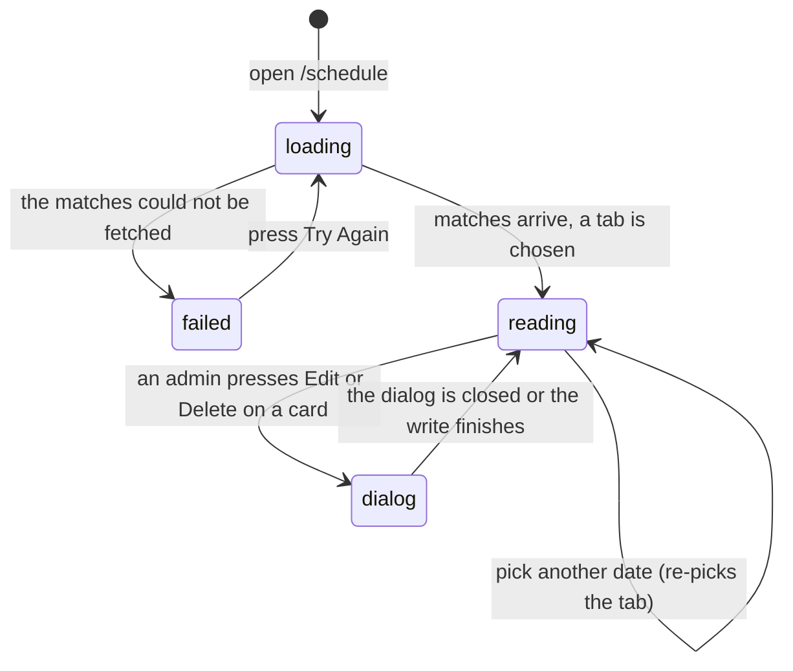

# The schedule page

## Summary

The schedule page is where anybody finds out who plays whom, when, and how it
went. It is one route, `/schedule`, open to everyone including visitors, and it
holds three views of the same league night behind three tabs: **Timeslots**,
**Upcoming**, and **Completed**.

It is a reading page. Nothing on it is a form. The only writes it can start
belong to an admin — editing or deleting a match — and they happen in dialogs
that this document hands off to [`admin/build-the-schedule.md`](../admin/build-the-schedule.md).
One match inside a list is owned by [`a-match-card.md`](a-match-card.md); the
Timeslots tab is owned by [`timeslot-preferences.md`](timeslot-preferences.md).

The page shows only the **active season**. There is no season picker.

## The simple case

A player opens `/schedule`. Across the top is a strip of fourteen dates, from
three days ago to ten days ahead, with an orange dot under each date that has
matches. One date is already selected: **the next Thursday**, or today if today
is Thursday. Below the strip are a search box and a small calendar button.

Under those are the three tabs. The page picks one for them: a past date opens
**Completed**, a date from today onward opens **Upcoming** if the season has any
upcoming matches, and otherwise **Timeslots**.

The Upcoming tab lists matches grouped by date, oldest first. Each date is a
collapsible heading like "Thursday, June 12". Inside a date, matches are grouped
again by start time — "7:00 PM", with a count badge — and inside that sit the
match cards. The first date group and its first time group are open; the rest are
closed.

The Completed tab is the same, newest date first, and every card reads "Final".

Typing in the search box narrows the list to matches whose team name or location
contains what was typed.

## The interaction, event by event

### Arrive

The page fetches every match in the active season in one request, with both
teams' details joined. Until it lands, the page shows a skeleton: two greyed date
groups of card outlines under a **two**-tab bar reading "Upcoming Matches" and
"Completed Matches". The real page has three tabs with shorter labels, so the tab
bar visibly changes shape when the data arrives.

If the fetch fails, the whole tab area is replaced by a card headed "Loading
schedule" that shows **the actual failure message** and a Try Again button. This
is unusual for 717rec and better than the generic sentences used elsewhere; see
[`foundations/messages-to-the-user.md`](../foundations/messages-to-the-user.md).

Three things are decided at arrival and never re-decided:

- **The date strip's window** is built once, from the clock at first render. A tab
  left open overnight keeps yesterday's fourteen days.
- **The selected date** starts at the next Thursday. League night is Thursday.
- **The tab** starts from `scheduleActiveTab` in session storage, then is
  overwritten by the rule above once matches and timeslots have both finished
  loading.

The strip scrolls the selected date into the middle of itself, once.

**Nothing is written by arriving.** No draft, no record that the page was opened
beyond an ordinary pageview.

### Leave without changing anything

The chosen tab survives, in session storage, and is used the next time the page
is opened in the same browser tab. Everything else — the search text, the
selected date, which groups were expanded — is thrown away. Coming back gives the
default Thursday, an empty search box, and the first group open.

### Begin editing

There is nothing to edit. The page's controls change what is shown, not what is
stored.

### While editing

Four controls change the view.

**The date strip.** Pressing a date selects it. This does **not** filter the
Upcoming or Completed lists. It changes the Timeslots tab, highlights that date's
group heading, and re-runs the tab rule. A user who presses a date expecting to
see only that date's matches sees the whole season's matches with one heading
highlighted.

**The calendar button.** It opens a month picker with no limits, so a date
outside the fourteen-day strip can be chosen. When one is, no date in the strip
appears selected.

**The search box.** It matches, case-insensitively, against either team's name or
the match's location. It applies to Upcoming and Completed and does nothing to
Timeslots. There is no clear button and no result count. Searching to zero
results gives the ordinary "No Upcoming Matches" empty state, not a
search-specific one.

**The tabs.** Switching tabs writes the choice to session storage at once.

Groups remember being opened only until the data under them changes.

### Submit

Not applicable. The page commits nothing. An admin's Edit and Delete open dialogs
that own their own commits.

## Modifiers

| Modifier | Set at arrival | Changed while editing |
| --- | --- | --- |
| The user's role (visitor, player, admin) | A visitor and a player see the same page. A player who may score one of the listed matches also sees "Live score this match" on that card. An admin additionally sees an Edit and a Delete button on every card. | Admin granted or revoked elsewhere does not reach this page until something re-fetches the profile. The buttons stay as they were. |
| The record's state | Each match's own state decides which card it gets and which tab it appears in. Completed matches are only in Completed, everything else only in Upcoming. | A match completed elsewhere does not move between tabs here until the schedule is re-fetched, which this page does not do on its own. |
| The season's state (active, archived, playoffs on) | Only the active season's matches are ever listed. With no active season the page is empty rather than broken. Archived seasons are read at [`history/past-seasons.md`](../history/past-seasons.md). | A season activated elsewhere does not reach this page until a reload. |
| Viewport | On a wide screen every date group is stacked down the page and time groups lay their cards out in up to three columns. On a narrow screen the date groups become a **swipeable carousel**: one date at a time, with Previous and Next, a row of dots, and a "Swipe to see more dates" hint. | Rotating a phone to landscape can cross the breakpoint and swap the stacked list for the carousel, losing which groups were open. |
| Keys the form honours | Nothing is focused on arrival. Tab reaches the date strip, the search box, the calendar button, the tabs, and every group heading. | Left and Right arrows move between the three tabs. Escape closes the calendar popover. Enter or Space opens and closes a group. There are no shortcuts and no type-ahead. |

## Cancel and interrupt

| Event | Before the first edit | While editing or submitting |
| --- | --- | --- |
| Escape, or a Cancel button | No effect. There is no Cancel on this page. | Closes the calendar popover if it is open, or an admin's dialog. It does not clear the search box and does not abort a write already sent. |
| In-app navigation away, or switching tab within the page | Nothing is lost. | The search text, the selected date, and every expanded group are lost. The chosen page tab survives in session storage. An admin's write already sent still lands, and the toast may appear over the next page. |
| Browser back or forward | Returns to the previous page. Nothing is recorded. | Same as navigating away, and the page cannot prevent it. Coming forward again gives the default view, not the one that was left. |
| Reload, or the tab closed | Re-fetches everything from scratch. | **Everything except the chosen tab is lost.** Session storage survives a reload, so the tab comes back; nothing else does. |
| Network lost mid-request | The matches do not load and the "Loading schedule" error card appears with a Try Again button. | Reading carries on with what is already on screen. The Timeslots tab's minute poll pauses while the browser reports itself offline. An admin's write fails and reports through its own dialog. |
| The request fails or times out | The error card appears. The failed read is retried once before that. | Same. Try Again re-runs the fetch. The Timeslots query retries twice on its own, waiting longer each time. |
| The session expires | No effect. Every read on this page is public. | Reads keep working. An admin's Edit or Delete fails at the database, and the buttons stay on screen because the browser still believes it is signed in. |
| The same record changed in another tab, or by another user | Not applicable before arriving. | **The match list does not update.** It is fetched once and neither tab focus nor page re-mount brings it back for more; only an explicit invalidation after a write on this device, Try Again, or a reload does. The Timeslots tab is the exception and updates within a minute. |
| Browser autofill or a password manager writes into the form | The search box asks the browser not to autofill. | No effect. There is no form on this page to fill. |
| The window loses focus | Nothing. | **The match list does not re-fetch on return**, unlike most of the app. The Timeslots tab pauses its poll while the tab is hidden and resumes on return, so timeslots can visibly change and matches cannot. |

After any interrupt the user comes back to a schedule rebuilt from what was
loaded. Nothing is held for them and nothing warns them that they lost a filter.

## Interactions with other systems

**Permissions and roles.** Reading is open to everyone. The two per-card controls
that depend on who is asking — the live-scoring link and the admin buttons — are
described in [`a-match-card.md`](a-match-card.md) and
[`cross-cutting/permissions.md`](../cross-cutting/permissions.md).

**Season scoping.** Total. The page asks for the active season and then for that
season's matches. No active season means an empty schedule, which looks the same
as a season with no matches yet.

**Validation and error display.** Nothing here is validated. The one error path is
the failed match fetch, which shows the underlying message and a retry.

**Unsaved changes.** None to protect. The search text and the selected date are
lost on navigation and nothing warns about it.

**Optimistic updates and rollback.** None on this page.

**Realtime.** None for the match list. Comments and reactions inside a completed
match card do subscribe; see [`a-match-card.md`](a-match-card.md).

**Offline.** Whatever is already loaded stays readable. Nothing new arrives, the
Timeslots poll stops, and an admin's write fails and is lost. See
[`foundations/saving-and-freshness.md`](../foundations/saving-and-freshness.md).

**Toasts and notifications.** The page raises none of its own. Toasts seen here
come from an admin's dialogs or from a write started on another page.

**URL state.** `/schedule` carries nothing. The tab, the date, the search text,
and the expanded groups are all invisible to the URL, so a filtered schedule
cannot be linked to, bookmarked, or shared.

**On a phone.** The date strip scrolls sideways. The date groups become a swipeable
carousel that starts on today's group, or the next future one. The tab bar sticks
to the top of the screen as the list scrolls under it.

**Accessibility.** Every group heading is a real button and reports whether it is
expanded. The date strip's buttons are reachable by Tab but announce only a
weekday and a number, not the full date or whether that date has matches. The
carousel's dots carry full dates. The tab bar keeps a 44-pixel touch height.

**Side effects the user can notice.** The page publishes its first twenty upcoming
matches as structured data for search engines, including team names, date,
location, and whether a match is postponed or cancelled. Opening it records an
ordinary pageview.

## Edge cases

- **Picking a date does not filter the matches.** This is the page's biggest
  surprise. See [Open questions](#open-questions-and-verification).
- **The list is grouped by date, not by week.** No week number or week heading
  appears anywhere on this page.
- **A match whose team details are missing is silently dropped** from the list. It
  is not shown as "TBD" and nothing says a match is hidden.
- **The loading skeleton has two tabs and the real page has three.** If the stored
  tab was Timeslots, the skeleton shows a tab bar that does not contain it.
- **Time groups sort by parsing the label as a time.** A label the browser cannot
  parse sorts unpredictably rather than being rejected.
- **A date group with matches but no parsable times** falls into a group named "No
  Time".
- **The strip's fourteen days are frozen at page load.** After midnight the strip
  still starts three days before yesterday.
- **A date chosen from the calendar can be outside the strip**, and then no strip
  date looks selected.
- **The search box searches locations too**, so typing a venue name finds matches
  the user was not looking for by team.
- **Expanding a later timeslot on the Timeslots tab can collapse again** when the
  minute poll brings back changed data.
- **A completed match with no game wins recorded** shows "0 – 0" under a "Final"
  badge.

## Open questions and verification

- **The selected date filters the Timeslots tab but not the match lists.** The
  date strip, the calendar button, and the highlighted date heading all look like
  a filter and none of them is. **May be worth treating as a bug rather than
  documenting.**
- **The match list never re-fetches by itself.** It is marked as always stale and
  simultaneously told not to re-fetch when the page mounts or when the tab regains
  focus, so a schedule loaded once in a browser tab stays as it was until a
  reload. This contradicts the refetch triggers in
  [`foundations/saving-and-freshness.md`](../foundations/saving-and-freshness.md).
  **May be worth treating as a bug rather than documenting.**
- **The Timeslots tab polls every sixty seconds.** That is the only poll in the
  schedule area and it contradicts "nothing polls" in
  [`foundations/saving-and-freshness.md`](../foundations/saving-and-freshness.md).
  The foundation is the document that needs correcting, not this one.
- A search-specific empty state exists in the code and is not reachable from any
  page, so searching to zero results shows the generic "No Upcoming Matches"
  panel with buttons that do not help.
- Not confirmed by hand: how the carousel behaves when a search removes the group
  it was showing.
- Not confirmed by hand: whether the tab bar's sticky backdrop reads correctly
  over a long list on a phone.
- Not confirmed by hand: what the page shows in the seconds between the matches
  arriving and the timeslots arriving, since the tab rule waits for both.
- Assumption: Thursday is the league's night. It is written into the page as a
  fixed default with no setting behind it.

Verified against `717rec` commit `ea5c8f4`.
