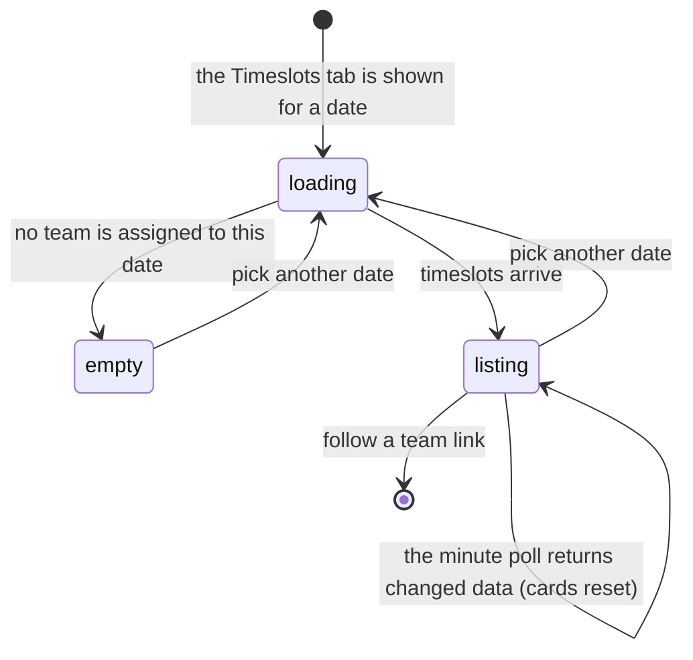

# Timeslot preferences

## Summary

A timeslot is a named half-hour slot a match can be scheduled into — "7:00 PM",
"8:30 PM" — and each league night every playing team is put in one of them, or
marked BYE. The glossary calls the stored record a *timeslot preference*, a team's
statement that it can play a given slot.

**In the app as built, no team can state a preference.** There is no control
anywhere for a player to say which slots their team can play. What is stored is an
**assignment** made by an admin, and the only player-facing surface is a read-only
view of it: the **Timeslots** tab on [`the-schedule-page.md`](the-schedule-page.md).
This document owns that tab. The admin side is
[`admin/manage-timeslots.md`](../admin/manage-timeslots.md), and how the
assignments feed the auto-scheduler is
[`admin/build-the-schedule.md`](../admin/build-the-schedule.md).

The gap between the word and the product matters and is stated plainly in
[Open questions](#open-questions-and-verification).

## The simple case

A player opens `/schedule` and lands on the **Timeslots** tab — which is where the
page starts when the chosen date has no upcoming matches. The tab shows one card
per timeslot for **the selected date**, earliest first.

Each card has a dark navy header with the time and a count: "7:00 PM · 6 teams".
Only the first card is open. Opening one shows a row per team: the team logo, the
team name as a link to its page, and, for a team playing twice that night, an
amber "Double Header (7:00 PM & 8:30 PM)" badge.

Teams not playing that week are last, in an orange card headed "BYE WEEK". Each
row there reads "Not playing this week".

If nothing is assigned for the chosen date, one line says "No timeslots scheduled
for this date."

## The interaction, event by event

### Arrive

The tab asks for every timeslot row whose date matches the selected date, with
each team's name and logo joined. While it waits it shows a spinner reading
"Loading timeslots…". Previous data is kept on screen while a later fetch runs, so
the tab does not blank when the date changes back to one already seen.

Two filters are applied before anything is drawn:

- **Only the first slot of a back-to-back pair is shown.** Assigning a team to
  7:00 PM also stores 7:30 PM as the second half of the pair; the second half is
  filtered out here, so the tab shows one row per team per pair.
- **A team playing a double header appears only in its earlier slot**, with the
  badge naming both times, rather than once in each card.

Slots are then sorted by their label and BYE is forced last.

**The first card is open and the rest are closed.** Which one is "first" is
decided from the sorted list each time the data changes.

**Nothing is written by arriving.**

### Leave without changing anything

Nothing is recorded and nothing is remembered. Coming back to the tab gives the
first card open again.

### Begin editing

There is nothing to edit here. A player cannot add, change, or remove a timeslot
from any screen in the app.

### While editing

The only control is a card header, which opens or closes that timeslot.

Behind it, the tab **re-fetches every sixty seconds**. The poll stops while the
browser tab is hidden or the device reports itself offline, and resumes on return.
A failed fetch is retried twice, waiting longer each time, up to ten seconds.

When a poll brings back changed data, the open and closed cards are **reset** to
"first one open". A player who opened the 9:00 PM card to look for their team can
have it close under them within a minute.

Choosing a different date on the schedule's date strip replaces the whole tab with
that date's assignments. This is the one place on the schedule page where the
selected date does what it looks like it does.

### Submit

Not applicable. This tab commits nothing. Every write to a timeslot happens on an
admin screen.

## Modifiers

| Modifier | Set at arrival | Changed while editing |
| --- | --- | --- |
| The user's role (visitor, player, admin) | No effect on this tab. A visitor, a player, and an admin see exactly the same read-only list, with no marker for the viewer's own team. An admin has separate screens to change assignments — `/timeslots` and the admin dashboard's Timeslots tab — and neither is linked from here. | No effect. |
| The record's state | An assignment is either a real timeslot or BYE. BYE rows are orange, sorted last, and carry the words "Not playing this week". A back-to-back second slot and a double header's later slot exist but are never drawn. | An assignment changed by an admin arrives within a minute, because this is the one polled query on the page. |
| The season's state (active, archived, playoffs on) | No effect. Timeslot rows carry a date and a team and **no season**, so the tab shows whatever is stored for that date regardless of which season is active. | No effect. |
| Viewport | On a wide screen each team is a full-width row with the logo, the name, and its badges. On a narrow screen the rows become a two-column grid of small tiles, each a tap target that opens the team page. | No effect beyond re-flowing. |
| Keys the form honours | Tab reaches each card header and each team link. Nothing is focused on arrival. | Enter or Space opens and closes a card. There are no shortcuts. |

## Cancel and interrupt

| Event | Before the first edit | While editing or submitting |
| --- | --- | --- |
| Escape, or a Cancel button | No effect. There is no Cancel on this tab. | No effect. There is nothing in progress to abort. |
| In-app navigation away, or switching tab within the page | Nothing is lost. | Which cards were open is lost. Switching to Upcoming and back gives the first card open again. |
| Browser back or forward | Returns to the previous page. Nothing is recorded. | Same as navigating away. |
| Reload, or the tab closed | Re-fetches from scratch. | The open cards are lost; nothing else was held. |
| Network lost mid-request | The tab shows the spinner, then keeps whatever it had. | The poll pauses while the browser reports itself offline. The last fetched list stays on screen with nothing to say it is old. |
| The request fails or times out | The fetch is retried twice with a growing wait. If all three fail, the tab shows the empty "No timeslots scheduled for this date" line rather than an error. | Same. A failed poll leaves the previous list on screen and says nothing. |
| The session expires | No effect. These rows are public. | No effect. |
| The same record changed in another tab, or by another user | Not applicable before arriving. | **Arrives within a minute** through the poll, with no announcement, and resets which cards are open. This is the only part of the schedule page that updates by itself. |
| Browser autofill or a password manager writes into the form | No effect. There is no form. | No effect. |
| The window loses focus | Nothing. | **The poll stops** while the tab is hidden and resumes when it comes back, so returning to a tab left open for an hour re-fetches once rather than sixty times. |

After any interrupt the tab is rebuilt from the database. Nothing was held that
could be lost beyond which cards were open.

## Interactions with other systems

**Permissions and roles.** Reading is open to everyone. Writing is admin-only and
happens elsewhere; `/timeslots` is one of the three guarded routes in the app and
sends a signed-out visitor to `/auth` and a signed-in non-admin to the home page
with an "Access Denied" toast. See
[`cross-cutting/permissions.md`](../cross-cutting/permissions.md).

**Season scoping.** None. A timeslot row has a date and a team and nothing else, so
assignments are not attached to a season and do not disappear when a season is
archived.

**Validation and error display.** Nothing on this tab is validated. A failed fetch
shows no error at all — it falls through to the empty state.

**Unsaved changes.** None. Nothing is editable.

**Optimistic updates and rollback.** None on this tab.

**Realtime.** None. The minute poll is not realtime and does not use a
subscription; see
[`foundations/saving-and-freshness.md`](../foundations/saving-and-freshness.md).

**Offline.** The last fetched list stays readable and the poll stops. Nothing can
be written from here in any case.

**Toasts and notifications.** This tab raises none.

**URL state.** None. The date, the tab, and which cards are open are all invisible
to the URL, so "who plays at 8:30 on the 12th" cannot be linked to.

**On a phone.** Team rows become a two-column grid of tiles with the logo above the
name. Card headers keep a 44-pixel touch height. The double-header badge shrinks to
"DH 7:00 PM/8:30 PM".

**Accessibility.** Card headers are real buttons and report expanded or collapsed.
Team names are ordinary links. The BYE cards are distinguished by an orange
background and a calendar icon as well as the words "BYE WEEK", so the meaning does
not rest on colour. The minute poll changes content with no announcement.

**Side effects the user can notice.** None from this tab. The assignments it shows
are what the auto-scheduler reads when an admin builds a schedule, so a wrong
assignment turns into a wrong match date later.

## Edge cases

- **The division badge never appears.** Every row is built with an empty division,
  so the badge the layout reserves space for is always absent. See [Open
  questions](#open-questions-and-verification).
- **Assigning one slot stores two.** A batch assignment writes the chosen slot and
  the next half-hour as a back-to-back pair. Only the first is shown here, so the
  tab under-reports what is stored.
- **"9:30 PM" cannot be assigned in a batch.** It is the only slot in the picker
  that is not the first half of a pair, so the assignment is refused and the admin
  sees a generic failure.
- **Timeslots are not attached to a season**, so an old season's assignments for a
  date still show if that date is chosen.
- **Two rows for the same team on the same date are possible**, and are what a
  double header is. Nothing prevents a third.
- **A team hidden or opted out of the season still shows here** if it has an
  assignment, because the row's team name comes from the assignment's own join
  rather than from the filtered public teams list.
- **Slots sort by their text label**, so a label that is not in the "H:MM AM/PM"
  shape sorts somewhere arbitrary rather than being rejected.
- **A BYE card always sorts last**, even before a 9:30 PM slot.
- **Nothing marks the viewer's own team.** A player has to read every card to find
  out when they play.

## Open questions and verification

- **There is no way for a team to state a preference.** The glossary defines a
  timeslot preference as a team's statement about what it can play, and no screen
  in the app collects one. Either the product is missing the feature or the word
  is wrong. This needs a decision from the league rather than a change to this
  document.
- **The division badge is dead code on this tab.** The two queries behind it never
  ask for the division and the shared transformer sets it to nothing with a comment
  saying it will be filled in "if needed". **May be worth treating as a bug rather
  than documenting.**
- **The open and closed cards reset whenever the polled data changes.** On a league
  night, when assignments are being edited, a player's open card can close under
  them. **May be worth treating as a bug rather than documenting.**
- **A failed fetch is indistinguishable from an empty date.** After three failed
  attempts the tab says "No timeslots scheduled for this date", which is a
  statement about the league rather than about the request.
- Not confirmed by hand: whether the minute poll is visible as a flicker, or
  whether the list changes silently.
- Not confirmed by hand: whether the league actually uses back-to-back pairs and
  double headers, or whether those rows exist only from earlier seasons.
- Not confirmed by hand: what the tab shows for a date in an archived season.
- Assumption: the second half of a back-to-back pair is hidden deliberately, to
  keep one row per team, rather than by accident.

Verified against `717rec` commit `ea5c8f4`.
