# Confirm or dispute a score

## Summary

When one team reports the result of a match, the other team gets no say. There is
**no confirm step and no dispute step** anywhere in 717rec. A
[score submission](submit-a-score.md) goes straight from the reporter to the
league's review list, and the only person who ever sees it is an admin.

This document describes that absence honestly, and describes what the other team
can actually do instead — because they do have moves, they are just not the ones
the name suggests. It also states what they can and cannot see, which is the part
most likely to surprise.

The mechanism that really does get both teams to agree on a result is **live
scoring**, where two phones at the same board share one running score; see
[`live-scoring/start-a-live-match.md`](../live-scoring/start-a-live-match.md).

## The simple case

Team Alpha's captain reports "Alpha beat Beta 2-1" from the home page.

Team Beta sees nothing. Their home page still lists the match under **Pending
Scores** with a **Report** button, exactly as before. No badge, no note, no
"reported by Alpha", no email, no notification.

If somebody from Beta presses Report and writes "Beta beat Alpha 2-1", that report
is stored beside Alpha's. Neither team is told the other one exists. An admin now
has two contradictory reports and decides between them by some means outside the
app.

If nobody from Beta does anything, Alpha's version is the only account the league
has.

## The interaction, event by event

```mermaid
stateDiagram-v2
    [*] --> unaware : the other team's report is stored
    unaware --> unaware : open the home page (the match still shows Report)
    unaware --> counter_report : press Report and send a different account
    unaware --> contact_form : send a Score Dispute through /contact
    counter_report --> unaware : the toast fades; nothing else changes
    contact_form --> unaware : the message goes to the league, not to the match
    unaware --> settled : an admin records a result on the match
    settled --> commenting : the match becomes Final and gains comments
```

### Arrive

There is nowhere to arrive at. No route, no dialog, and no card in the app shows a
submitted score to anybody except an admin.

The database is stricter than the interface. Score submissions can only be read by
an admin, or by the account that sent them. **No screen in the app reads a user's
own submissions**, so even that narrow permission has nothing behind it — a
reporter cannot see their own report either.

**Nothing is written by anyone looking.** Nobody can look.

### Leave without changing anything

The usual case. The other team does nothing because there is nothing presented to
them to do, and the match is decided on one team's account.

### Begin editing

Not applicable. There is no record the other team can open, correct, agree with,
or object to.

### While editing

Three things the other team can actually do:

**File their own report.** The Pending Scores card stays available to everybody
until the match is given a result, so a second, third, and fourth report can all be
filed. This is the closest thing to a dispute the product has. It is described in
full in [`submit-a-score.md`](submit-a-score.md).

**Send a message to the league.** The contact form's fixed subject list includes
**Score Dispute**. The message is not attached to a season, a team, or a match, so
whoever reads it has to work out from the text which match is meant. See
[`help/contact-the-league.md`](../help/contact-the-league.md).

**Comment on the match — afterwards.** Comments and reactions appear on a match card
only once the match is completed, so they are a way to argue about a result that
has already been recorded, not a way to challenge a report that is still waiting
for review. See
[`a-match-card.md`](../schedule/a-match-card.md).

### Submit

There is no submit. A counter-report commits a new score submission; the contact
form commits a support ticket; a comment commits a comment. None of them is
attached to the report being disputed.

## Modifiers

| Modifier | Set at arrival | Changed while editing |
| --- | --- | --- |
| The user's role (visitor, player, admin) | **The only modifier that matters.** A visitor and a player cannot see any submission. An admin sees every pending one at `/admin`, in the Pending section, with the submitter's name, their team, the message, and Approve and Reject buttons. Being on the team in the match grants nothing extra. | Admin granted or revoked elsewhere does not change what is on screen until the profile is re-fetched. |
| The record's state | A submission is pending, approved, or rejected. **Only pending ones are ever listed**, so approving or rejecting one makes it vanish from the only screen that shows it and it cannot be found again from inside the app. | An admin acting on a submission in another tab does not remove it from this one until it is re-fetched, and pressing Approve on an already-decided submission simply stamps it again. |
| The season's state (active, archived, playoffs on) | No effect. Submissions carry a match, not a season. | No effect. |
| Viewport | The admin review list is one card per submission at any width; the two buttons sit at the bottom right. | No effect. |
| Keys the form honours | Tab reaches Reject then Approve on each card. Nothing is focused on arrival. | Enter or Space activates the focused button. There are no shortcuts and no confirmation step before either. |

## Cancel and interrupt

These rows are answered for the admin reviewing a submission, since that is the
only interaction that exists.

| Event | Before the first edit | While editing or submitting |
| --- | --- | --- |
| Escape, or a Cancel button | No effect. There is no Cancel and no confirmation dialog on either button. | No effect. Neither Approve nor Reject can be undone or called back once pressed. |
| In-app navigation away, or switching tab within the page | Nothing is lost. | The write still lands. The card was already removed from the list optimistically, so leaving looks identical to succeeding. |
| Browser back or forward | Returns to the previous page. | Same as navigating away. |
| Reload, or the tab closed | The list is fetched again from scratch every time the section is opened. | A sent decision still lands. The list after the reload is the truth. |
| Network lost mid-request | The list fails to load and a red toast says "Failed to load score submissions. Please try again." | The decision fails, **the card slides back into the list at the position it left**, and a red toast names which action failed. |
| The request fails or times out | As above. | As above. This is the one rollback in the whole score area. |
| The session expires | Reads fail, because only an admin may read these rows at all. | The decision is refused by the database, the card returns, and the toast appears. |
| The same record changed in another tab, or by another user | Not applicable before arriving. | **No realtime.** Two admins can act on the same submission and neither sees the other; the second decision simply overwrites the first's reviewer and timestamp. |
| Browser autofill or a password manager writes into the form | No effect. There are no fields. | No effect. |
| The window loses focus | Nothing. | Nothing. The list re-fetches when the section is next opened. |

After an interrupt the list is rebuilt from the database. A decision that reached
the database is final and there is no screen from which it can be reviewed or
reversed.

## Interactions with other systems

**Permissions and roles.** Reading and deciding are both admin-only, enforced by
the database as well as by what is drawn. Submitting is open to everyone. That
asymmetry is the whole shape of this feature. See
[`cross-cutting/permissions.md`](../cross-cutting/permissions.md).

**Season scoping.** None. Submissions are listed newest first across every season.

**Validation and error display.** Nothing to validate. Failures become one generic
toast naming the action.

**Unsaved changes.** None. There is nothing to type.

**Optimistic updates and rollback.** Approving or rejecting removes the card at
once and puts it back in its old position if the write fails.

**Realtime.** None. Two admins reviewing at the same time do not see each other.

**Offline.** The list cannot load and no decision can be sent. Nothing is queued.

**Toasts and notifications.** One toast per decision — "Score submission approved
successfully." or the rejected equivalent. **Nobody outside the admin screen is
told anything**: not the reporter, not either team.

**URL state.** None. A submission has no address, so an admin cannot send a
colleague a link to the one they are arguing about.

**On a phone.** The review cards stack and stay usable. Nothing else changes.

**Accessibility.** Both buttons have visible text as well as icons. A card
disappearing when a decision is made is not announced; the toast carries it.

**Side effects the user can notice.** **Approving a submission does not change the
match.** It stamps the submission as approved and records who did it and when, and
nothing else. Standings, records, and power scores do not move. The result still
has to be recorded separately; see [`pending-scores.md`](pending-scores.md).

## Edge cases

- **The other team is never told a score was reported.** No badge, no email, no
  notification, and the match keeps its Report button.
- **Any number of contradictory reports can be filed for one match**, by anyone,
  including people on neither team.
- **Two reporters with byte-identical wording produce one report**, so a second
  team agreeing in exactly the same words is silently discarded and told it worked.
- **A reporter cannot see their own report.** The database allows it; no screen
  asks for it.
- **A decided submission cannot be found again.** The list asks only for pending
  score submissions, so an approved or rejected report leaves no trace an admin
  can revisit.
- **There is no confirmation before Approve or Reject**, and no undo.
- **Two admins can decide the same submission**, and the last write wins with no
  warning.
- **A submission survives its match being completed by another route**, and still
  waits in the review list for a decision that no longer means anything.
- **A submission is deleted with its match.** Deleting a match removes its reports.
- **The Score Dispute subject on the contact form carries no match reference**, so a
  dispute sent that way arrives as free text with no link to what it is about.

## Open questions and verification

- **There is no confirm-or-dispute feature.** The README plans this document as
  "what the other team does with a submitted score", and the answer is "nothing,
  and they are not told". Either the feature is missing or the plan is wrong. This
  needs a decision from the league rather than a change to this document.
- **Approving a submission does not write the result onto the match.** It only
  stamps the submission row. Everything downstream — the match, the standings, the
  power scores — is untouched, and an admin who presses Approve and walks away has
  changed nothing about the league. **May be worth treating as a bug rather than
  documenting.**
- **A decided submission is unreachable afterwards.** There is no history view and
  no audit screen, so "who approved what, and when" is stored and never shown.
- **The reporter's own read permission has no screen behind it.** A migration was
  written to let people see their own submissions and nothing was built to use it.
- Not confirmed by hand: what an admin actually does when two reports contradict
  each other, and whether the league has a convention for it.
- Not confirmed by hand: whether the admin review list is discoverable — it is one
  section of the admin dashboard labelled only "Pending".
- Not confirmed by hand: whether any part of the league's process outside the app
  tells the second team that a result was reported.
- Assumption: reports are expected to be honest and rare, and the league is
  expected to sort out conflicts by talking to people. Nothing in the product
  supports any other reading.

Verified against `717rec` commit `ea5c8f4`.
