# Pending scores

## Summary

"Pending" means three different things in 717rec, and telling them apart is the
whole point of this document. Every other document in this set qualifies the word
and links here.

| What it is called | What it actually is | Who sees it | Who can act |
| --- | --- | --- | --- |
| **Pending Scores** (a card on the home page) | Matches with **no result yet**, more than sixteen hours after their start time | Everyone, including visitors | Anyone can send a report |
| **Pending score submission** | One person's **report** of a result, waiting for review | Admins only | Admins only |
| **Pending match** | A match marked completed with **no winner** — a tie | Admins only, in `/admin` → **Pending** → **Unresolved matches** | Admins only |

The card and the submissions are named alike and are not the same thing: the card
lists matches nobody has entered, and a submission is one attempt to say what
happened. Reporting a match **does not remove it from the card**, because the card
is about the match's missing result and a report is not a result.

Reporting is [`submit-a-score.md`](submit-a-score.md). Reviewing a report is
[`confirm-or-dispute-a-score.md`](confirm-or-dispute-a-score.md). This document
owns the queues themselves — what is in them, how they are ordered, and who can
act.

## The simple case

A player opens the home page on a Friday morning. Part-way down is a card headed
**"Pending Scores"** with the line "4 matches awaiting score reports". Last night's
matches are there, each with a Report button. When every match has a result the
card disappears entirely — it is only drawn when the list is not empty.

An admin opens `/admin` and picks the section labelled **Pending**. It holds two
lists.

**Score submissions** comes first. Under the line "Review score reports sent in by
users. Approving asks you for the result." is one card per report: which match it
is about, who sent it, which team they said they were on, what they wrote, when
they sent it, and a Reject and an Approve button. Approve opens a dialog offering
the four results a best-of-three match can end in. When there is nothing to review
the section says "No pending score submissions to review."

**Unresolved matches** follows, and is drawn only when the list is not empty.
Under the line "These matches are finished but have no winner. Name the winner or
record a tie." is one card per match, with both team names, the date, the games
already recorded, and three buttons: one per team to name it the winner, and "It
was a tie".

## The interaction, event by event

```mermaid
stateDiagram-v2
    [*] --> no_result : a match is played and nothing is entered
    no_result --> waiting : sixteen hours pass; the match joins the Pending Scores card
    waiting --> waiting : somebody sends a report (the match does not move)
    waiting --> reviewing : an admin opens the Pending section
    reviewing --> decided : Reject (the report is stamped, the match is untouched)
    decided --> waiting : the match still has no result
    reviewing --> resolved : Approve — the admin enters the result and it is written
    waiting --> resolved : a result is recorded by live scoring or bulk entry
    resolved --> tie : the result was recorded with no winner
    tie --> resolved : an admin names a winner or records the tie
```

### Arrive

**The Pending Scores card** asks for its list on every trigger and caches it for no
time at all, so it is always current when the home page is drawn. Its rule is
narrow:

> not completed, has two teams, has a date, and that date is **more than sixteen
> hours in the past**.

It is ordered oldest first, capped at fifty by the league and at **ten** by the
app, and **not scoped to a season**. A match abandoned two seasons ago is still in
it.

**The admin review list** asks for every submission whose status is still pending,
newest first, across every season and every match, and re-fetches every time the
section is opened. There is no filter, no search, and no grouping by match.

**The tie list** asks for every match marked completed that still has no winner,
oldest first, across every season, and re-fetches with the rest of the tab. The
two decisions an admin makes on one differ in kind. Awarding it to a side writes
the result through an atomic, idempotent database function. Confirming a tie
writes no result at all — the match already has no winner, so it *is* the tie —
and instead stamps the match as settled so it drops out of this list.

**Nothing is written by looking at any of the three.**

### Leave without changing anything

Nothing is recorded. The Pending Scores card is rebuilt from scratch next time.
The admin list is re-fetched every time its section is opened.

### Begin editing

There is nothing to edit in a queue. The three actions available are Report (see
[`submit-a-score.md`](submit-a-score.md)) and Approve or Reject (see
[`confirm-or-dispute-a-score.md`](confirm-or-dispute-a-score.md)).

### While editing

The queues do not filter, sort, or page. Their length is their only variable.

The admin dashboard's league-night view shows a tile counting **Score reports**
beside tiles for team requests and the contact inbox, and pressing it jumps to the
Pending section. That count is of pending submissions, not of matches missing a
result, so it can read zero on a night when four matches have no score at all.

### Submit

Rejecting a submission stamps its row with the outcome, the admin's id, and the
time, and does not touch the match. Approving does more: it opens a dialog asking
for the winner and the games each team won, writes that result (which also marks
the match complete), and only then stamps the submission. A failed write leaves
the submission pending, so the queue never clears on a stale match.

A match can also be resulted without going through the submissions queue, by:

- **Live scoring**, finalised by a player or an admin —
  [`live-scoring/finish-the-match.md`](../live-scoring/finish-the-match.md).
- **Bulk entry** by an admin —
  [`admin/enter-scores-in-bulk.md`](../admin/enter-scores-in-bulk.md).
- **A correction** to a match already scored —
  [`admin/correct-a-live-match.md`](../admin/correct-a-live-match.md).

Any of these writes moves standings, records, badges, and power scores.

## Modifiers

| Modifier | Set at arrival | Changed while editing |
| --- | --- | --- |
| The user's role (visitor, player, admin) | A visitor and a player see the Pending Scores card and its Report buttons and nothing else. An admin sees the same card **plus** the review list at `/admin`. Being on a team in a listed match grants nothing extra — no team owns its own pending matches. | Admin granted or revoked elsewhere does not change what is on screen until the profile is re-fetched. |
| The record's state | Decides which queue a thing is in. A match with no result is on the card; a report awaiting review is in the admin list; a completed match with no winner is in neither and is invisible. | A match given a result elsewhere leaves the card the next time the home page fetches. A submission decided in another tab stays on screen here until this list is re-fetched. |
| The season's state (active, archived, playoffs on) | **No effect on any of the three.** None of these queues filters by season, which is unusual for this app — nearly everything else does. | No effect. |
| Viewport | The card's rows stack on a narrow screen, putting the Report button under the team names. The review cards stack at any width. | No effect beyond re-flowing. |
| Keys the form honours | Tab reaches each Report button on the card, and Reject then Approve on each review card. Nothing is focused on arrival. | Enter or Space activates the focused button. There are no shortcuts, no select-all, and no bulk action. |

## Cancel and interrupt

| Event | Before the first edit | While editing or submitting |
| --- | --- | --- |
| Escape, or a Cancel button | No effect. Neither queue has a Cancel. | Closes the report dialog if it is open, discarding what was typed. Neither Approve nor Reject can be cancelled or confirmed. |
| In-app navigation away, or switching tab within the page | Nothing is lost; neither queue holds any state. | A decision already sent still lands. The card was already removed from the list, so leaving looks the same as succeeding. |
| Browser back or forward | Returns to the previous page. | Same as navigating away. |
| Reload, or the tab closed | Both queues are fetched again from scratch. Neither caches. | A sent decision still lands; an unsent one is gone. The list after the reload is the truth. |
| Network lost mid-request | Both queues fail to load. The card is simply absent from the home page; the admin list shows a red toast reading "Failed to load score submissions. Please try again." | A report fails and keeps its dialog open. A decision fails, the card returns to its old position in the list, and a red toast names the action. |
| The request fails or times out | As above. The Pending Scores card failing to load is **invisible** — the home page draws nothing where it would have been. | As above. |
| The session expires | The Pending Scores card still loads; it is public. The admin list stops loading, because only an admin may read those rows. | A report still sends, as an unverified one. A decision is refused by the database and the card returns. |
| The same record changed in another tab, or by another user | Not applicable before arriving. | **Neither queue has realtime.** A match scored by somebody else stays on the card until the home page re-fetches; a submission decided by another admin stays in the list until this one re-fetches, and acting on it again simply overwrites the first decision. |
| Browser autofill or a password manager writes into the form | No effect. Neither queue has fields. | No effect. |
| The window loses focus | Nothing. | Returning to the tab re-fetches the Pending Scores card, because it is never considered fresh. The admin list re-fetches when its section is next opened. |

After any interrupt each queue is rebuilt from the database. Nothing was held that
could be lost.

## Interactions with other systems

**Permissions and roles.** Reading the Pending Scores card is open to everyone.
Reading and deciding submissions is admin-only, enforced by the database as well
as by what is drawn. See
[`cross-cutting/permissions.md`](../cross-cutting/permissions.md).

**Season scoping.** None, in any of the three queues. This is the exception to the
rule in [`foundations/seasons.md`](../foundations/seasons.md) that nearly
everything is season-scoped, and it is why an old unfinished match never goes
away.

**Validation and error display.** Nothing to validate. Every failure becomes one
generic toast.

**Unsaved changes.** None. Neither queue holds anything unsaved.

**Optimistic updates and rollback.** Approving or rejecting removes the card at
once and restores it to its old position if the write fails. The Pending Scores
card is not optimistic and does not change when a report is sent.

**Realtime.** None on either queue.

**Offline.** Neither loads. Nothing can be reported or decided, and nothing is
queued. See
[`foundations/saving-and-freshness.md`](../foundations/saving-and-freshness.md).

**Toasts and notifications.** One toast per decision. **No notification is sent to
anyone** when a match joins the pending list, when a report arrives, or when a
decision is made.

**URL state.** None. Neither queue has an address; the admin section is a tab
inside `/admin` and is not in the URL.

**On a phone.** The card's rows stack. The admin review cards keep their two
buttons side by side at the bottom.

**Accessibility.** Every button has visible text. A card vanishing from either
queue is not announced. The Pending Scores card's count is in ordinary prose — "4
matches awaiting score reports" — so a screen reader user hears the size of the
queue.

**Side effects the user can notice.** None from a queue itself. The write that has
side effects is the one that gives a match a result, and that happens on other
screens; it starts badge processing and a power-score recalculation on the server,
so numbers elsewhere move some time afterwards.

## Edge cases

- **Reporting a match does not remove it from the Pending Scores card.** The card
  is about the missing result, and a report is not a result.
- **The card is capped at ten matches.** A league night with twelve unscored
  matches shows ten and says nothing about the rest.
- **The card disappears when the list is empty**, so "everything is scored" and
  "the list failed to load" look identical from the home page.
- **The card's own "All caught up!" empty state is effectively unreachable**,
  because the home page only draws the card once the list is known to be
  non-empty.
- **Nothing ever ages out of the card.** A match from a finished season with no
  result is on it forever.
- **The admin section is labelled "Pending" and contains score reports**, while its
  internal name and the ordinary meaning of "pending match" both point at ties.
- **The league-night tile counts reports, not unscored matches**, so it can read
  zero while four matches are waiting.
- **A tie is admin-only.** A match completed with no winner appears in
  **Unresolved matches** in the admin Pending tab, and on no player-facing card.
- **Approving a report records the result.** The admin picks one of four fixed
  results, the match is marked complete, and it leaves the Pending Scores card.
- **The sixteen-hour delay means a match played this evening is not on the card
  until the following afternoon.**

## Open questions and verification

- **Fixed (was B-09): the pending-match list now exists.** Ties are listed under
  **Unresolved matches** in the admin Pending tab, and an admin resolves one by
  naming a winner or recording the tie.
- **Fixed (was B-01): approving a report now records the result.** Approve opens a
  dialog offering the four results a best-of-three match can end in, writes the
  chosen one to the match, and only then stamps the submission. A failed write
  leaves the submission pending.
- **The Pending Scores card fails silently.** A failed fetch shows a toast that is
  raised from the home page's own copy of the query, but the card itself simply
  does not appear, so the reader has no idea a list is missing.
- **None of the three queues is season-scoped**, so they accumulate across seasons
  with nothing to clear them.
- Not confirmed by hand: whether the league in practice enters results by live
  scoring, by bulk entry, or by reading reports and typing them in.
- Not confirmed by hand: how many unresolved matches the live database actually
  holds, which decides how long the Unresolved matches list is on first use.
- Not confirmed by hand: whether an admin can reach a decided submission through
  any other tool.
- Assumption: the sixteen-hour delay exists so that a match is not asked about
  while it is still being played. Nothing in the code says why.

Verified against `717rec` commit `ea5c8f4`.
