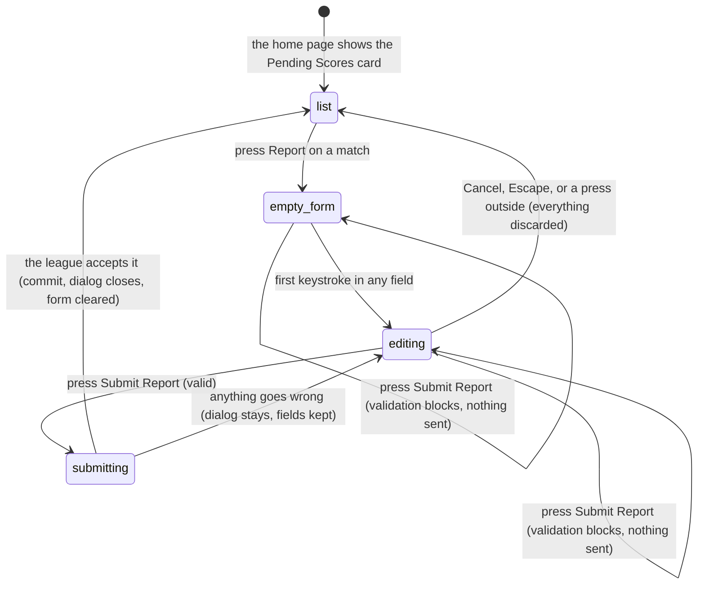

# Submit a score

## Summary

Submitting a score is how somebody tells the league who won a match that has
already been played. It is **a message, not a result**: what it produces is a
*score submission* — a request holding a name, an optional team, and a free-text
report — that waits for an admin to read it. Nothing about the match itself
changes.

It lives in one place: a dialog headed **"Report Match Score"**, opened by the
**Report** button on the **Pending Scores** card on the home page. There is no way
to submit a score from `/schedule`, from a match card, or from a team page.

Two other routes produce a real match result and are not this:
[live scoring](../live-scoring/finish-the-match.md), which writes the result at
the end of the match, and [bulk entry](../admin/enter-scores-in-bulk.md), where an
admin types results straight onto matches. A score submission is the path for
everyone else.

**Anyone can submit, including a visitor with no account and somebody on neither
team.** This is one of only two writes in the app open to a visitor, the other
being [the contact form](../help/contact-the-league.md).

## The simple case

A player opens the home page. Part-way down is a card headed **"Pending Scores"**
with the line "3 matches awaiting score reports". Each row shows the two team
logos and names either side of "vs", the date and time on the right, and a small
outlined **Report** button.

Pressing Report opens a dialog. At the top it repeats the match — both teams, the
date, the time, and the location — so the reporter can check they picked the right
one. Under that are three fields: **Your Name** (required), **Your Team**
(optional), and **Score Report** (required), a three-line box with the hint
"Include the final score and any relevant details about the match." Nothing is
filled in and nothing is focused.

The reporter types a name and a sentence like "Team Alpha beat Team Beta 2-1.
Great match!" and presses **Submit Report**. The button reads "Submitting…" and
goes dead.

The dialog closes and a toast says **"Score Submitted — Your score report has been
submitted for admin review."** The match stays in the Pending Scores list, and
nothing anywhere shows that a report was sent.

## The interaction, event by event

### Arrive

The Pending Scores card appears on the home page **only when there is at least one
match waiting**. What counts as waiting is narrow and worth stating exactly:

> A match with two teams and a date, **not marked completed**, whose start time
> was **more than sixteen hours ago**.

The list is capped at ten, is re-fetched on every trigger rather than cached, and
is **not scoped to a season**, so a match left incomplete in an old season sits in
it forever. See [`pending-scores.md`](pending-scores.md).

Opening the dialog fetches nothing. All three fields start empty, **nothing is
focused**, and nothing is prefilled — not even for a signed-in user whose name and
team the league already knows.

**Nothing is recorded by opening the dialog.**

### Leave without changing anything

Nothing happens. No draft is kept. Re-opening the same match gives three empty
fields.

### Begin editing

The first keystroke makes the form dirty. **Nothing visible changes.** There is no
mark, no warning, and no enabling of a disabled button — Submit Report is live from
the moment the dialog opens.

**No validation runs while typing**, until a first failed submit.

### While editing

Pressing **Submit Report** checks both rules at once and, if either fails, shows a
message under the field and sends nothing:

| Field | Rule | Message shown |
| --- | --- | --- |
| Your Name | must not be empty | "Your name is required" |
| Your Team | none — it is optional | — |
| Score Report | must not be empty | "Score report is required" |

That is the whole of the browser's validation. **A single character passes.** There
is no check that the report contains a score, names either team, or is even about
this match. Once a field has failed once, it is re-checked as the reporter types
and its message clears when it becomes valid.

### Submit

The Submit button reads "Submitting…" and both it and Cancel go dead. The three
fields stay editable.

What is sent is one request to a league server function carrying the match id, the
name, the team, and the message. It does not write to the database directly.

The league then does four things the reporter never sees:

> **Technical note:** it refuses more than **five reports in ten minutes** from one
> address; it trims and caps the name and team at 120 characters and the message at
> 2000; if the request carries a signed-in session it **replaces the typed name and
> team with the profile's name and the approved membership's team**, and marks the
> report verified; and if an identical pending report already exists for the match
> it answers "success" and stores nothing.

On success the fields are cleared, the dialog closes, and one toast says "Score
Submitted". The reporter cannot get back to what they wrote and there is no copy
of it anywhere they can reach.

On failure nothing is cleared. **The dialog stays open**, every field keeps its
text, the buttons come back, and one red toast says **"Error — Failed to submit
score. Please try again."** The reason is discarded: too many reports, a message
too long, a match that no longer exists, and the league being unreachable all
produce that one sentence.

## Modifiers

| Modifier | Set at arrival | Changed while editing |
| --- | --- | --- |
| The user's role (visitor, player, admin) | No effect on what is drawn. All three see the same card, the same button, and the same three empty fields, and all three may submit. | **Effect at submit time, invisibly.** A signed-in reporter's typed name and team are thrown away and replaced with their profile name and approved team, and the report is stamped as verified. A visitor's typed name and team are used as typed and the report is unverified. Nothing in the dialog says so. |
| The record's state | Only matches that are not completed and are more than sixteen hours old are offered at all. A match already reported looks exactly like one that has not been. | A match completed by somebody else mid-typing still accepts the report; it lands as a pending score submission against a finished match. |
| The season's state (active, archived, playoffs on) | No effect. The list is not season-scoped, so matches from any season can appear and be reported. | No effect. |
| Viewport | On a wide screen the dialog is a centred panel about 28 rem across. On a narrow screen it is a **bottom drawer** that slides up. The card's rows stack the team names above the date and the Report button. | No effect beyond re-flowing on rotation. |
| Keys the form honours | Tab moves through Your Name, Your Team, Score Report, Cancel, Submit Report. Focus is trapped inside the dialog. | Enter in either single-line field submits. Enter in the Score Report box adds a newline. Escape closes the dialog and discards everything. |

## Cancel and interrupt

| Event | Before the first edit | While editing or submitting |
| --- | --- | --- |
| Escape, or a Cancel button | Closes the dialog. Nothing was typed, so nothing is lost. | **Discards everything typed with no confirmation.** Cancel is disabled while a request is in flight, but Escape and a press outside the dialog are not, so the dialog can still be dismissed mid-request — the report still lands and its toast appears over whatever comes next. |
| In-app navigation away, or switching tab within the page | Nothing is lost. | **Everything typed is lost, with no warning.** There is no unsaved-changes guard. A request already sent still reaches the league; the reporter sees the toast but not the dialog closing. |
| Browser back or forward | Returns to the previous page. Nothing is recorded. | Same as navigating away, and the dialog cannot prevent it. Coming forward again gives the home page with the dialog closed. |
| Reload, or the tab closed | Gives a fresh home page. | **Everything typed is lost.** A request already sent still lands with the league; one not yet sent is gone. After a reload nothing distinguishes the two — the match is still in the list either way. |
| Network lost mid-request | Cannot happen; no request is in flight. | The request fails. The dialog stays open, the fields keep their text, and the generic red toast appears. Nothing is queued and no retry is attempted; there is no offline queue anywhere in this app. |
| The request fails or times out | Cannot happen. | The fields are kept and the generic red toast appears. The reporter decides whether to retry. A retry with the **same wording** is de-duplicated by the league and cannot produce two reports; a retry with different wording produces two. |
| The session expires | No effect. The dialog needs no session and works signed out. | The report still sends, but as an **unverified** one under the typed name, because the league only upgrades a report it can attach to a live session. Nothing tells the reporter this happened. |
| The same record changed in another tab, or by another user | No effect. There is no shared draft. | No effect on the dialog. The Pending Scores list behind it does not update, so a match completed by somebody else stays in the list until the home page re-fetches. |
| Browser autofill or a password manager writes into the form | Your Name may be filled from saved contact details. Your Team and Score Report are never autofilled. The form does not become dirty in any way the reporter can see and validation still does not run. | Same. There is no hidden trap field in this dialog, so an autofill tool cannot cause a silent discard here. |
| The window loses focus | Nothing. | Nothing. Nothing re-fetches, nothing revalidates, and a request in flight continues. |

After any interrupt the reporter is left wherever it took them. The only state
that survives is what already reached the league, and nothing in the app shows
them that it did.

## Interactions with other systems

**Permissions and roles.** None in front of the write. Anyone who can see the card
can report any match on it, for any team; the league's rate limit and its identity
check on signed-in reporters are the only controls. See
[`cross-cutting/permissions.md`](../cross-cutting/permissions.md).

**Season scoping.** None. The list that feeds this dialog is built from every
incomplete match in the database, not from the active season.

**Validation and error display.** Two emptiness rules, checked on submit and then
per field. Everything the league refuses becomes the one generic toast; no server
reason is ever shown under a field.

**Unsaved changes.** Not handled. No guard, no prompt, no draft.

**Optimistic updates and rollback.** None. The dialog waits for the league before
closing.

**Realtime.** None. The Pending Scores list has no subscription and does not
change when somebody else reports a match.

**Offline.** The request fails and the reporter is told to try again. Nothing is
queued. See
[`foundations/saving-and-freshness.md`](../foundations/saving-and-freshness.md).

**Toasts and notifications.** Exactly one toast per attempt: a plain one on
success, a red one on failure. Nobody is notified that a report arrived — not the
admin, not the other team.

**URL state.** None. The dialog is not a route, so a part-filled report cannot be
linked to and a reload closes it.

**On a phone.** The dialog becomes a bottom drawer. The Score Report box is three
rows tall. The card's rows stack, putting the Report button under the team names.

**Accessibility.** Every field has a real label and required fields are marked with
a red asterisk as well as the word "required" in their error message. Errors are
tied to their fields. The dialog is properly modal and traps focus. The dialog
closing on success moves focus back without announcing that the report was sent;
the toast carries that.

**Side effects the user can notice.** A stored report waiting in the league's
review list, and nothing else. No email is sent, no notification is raised, and
the match is not marked in any way.

## Edge cases

- **The match stays in the Pending Scores list after being reported.** The list is
  built from matches without a result, and a report does not give a match a result.
  The same match can be reported by five different people and look untouched to all
  of them.
- **A signed-in reporter's typed name and team are silently overwritten.** Typing
  "Dave from Alpha" and submitting stores whatever the profile says. If the profile
  has no name, the username is used; if there is no approved membership, no team is
  stored at all — including the one that was typed.
- **Two people reporting the same match with byte-identical wording produce one
  report.** The league de-duplicates on the match and the message alone, so the
  second person's report is silently discarded and they are told it succeeded.
- **The sixth report in ten minutes from one address is refused**, as is a message
  over 2000 characters, both with the same "please try again" toast. Nothing in the
  dialog counts characters, and a retry cannot help in either case.
- **A report can be filed against a match that is already completed**, because the
  dialog does not re-check the match's state before sending it.
- **The dialog can be dismissed while the request is in flight** with Escape or a
  press outside, and the toast then appears over the home page.
- **"Your Team" is free text**, not a choice between the two teams playing, so a
  report can name a team that is not in the match.

## Open questions and verification

- **Nothing acknowledges a submitted report.** The match stays in the list, the
  reporter has no record of what they sent, and the other team is never told. This
  is the largest gap in the feature. **May be worth treating as a bug rather than
  documenting.**
- **Fixed: the allowed-origins list did not include the app's own dev server.**
  The function accepted `717rec.app`, the Lovable preview addresses,
  `localhost:3000`, and `localhost:5173`, but the dev server runs on
  `localhost:8080`. Submitting a score therefore failed for anyone running the
  app locally, exactly as [the contact form](../help/contact-the-league.md) did.
  `localhost:8080` is now on the list. See [`bug-triage.md`](../bug-triage.md)
  B-15.
- **The two de-duplication rules disagree.** The function looks for an identical
  pending report from the **same name**; the database's unique index ignores the
  name. A second reporter with identical wording passes the first check, is refused
  by the second, and is told it worked. **May be worth treating as a bug rather
  than documenting.**
- **The generic failure toast advises a retry in cases where a retry cannot work**,
  the same defect the contact form has and for the same reason: the server sends a
  specific message and the app discards it.
- The dialog's own tests assume the submit path can report failure by returning
  false. It cannot — the hook always reports success or throws.
- Not confirmed by hand: whether the sixteen-hour rule uses the league's own
  timezone as intended. Both sides of the comparison are converted the same way,
  which makes the conversion have no effect.
- Assumption: free text rather than two number boxes is deliberate, so a reporter
  can explain an unusual match rather than only record it.

Verified against `717rec` commit `ea5c8f4`.
