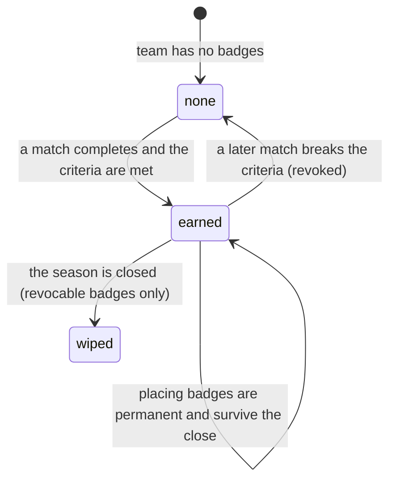

# Badges

## Summary

A badge is an award a team earns. Badges are small round icons that sit beside a
team's name in the standings and on its page, and they are the app's only
recognition of anything other than a number.

There are **twenty** badge types in three families: nine for playoff placings,
nine for patterns of results, and two for streaks. Every one except a single
hand-granted badge is computed rather than awarded by a person. Most are also
**revoked** automatically when the pattern that earned them stops being true.

The ten revocable badges are season-scoped and are switched off when their
season is closed. The nine placing badges are permanent and survive it. Nothing
anywhere in the app lists the badges a team could earn, or how; the only
explanation is the sentence on each badge's tooltip.

## The simple case

A player looks at the standings. Beside their team's name are two small round
icons: an orange flame and a green target. Hovering the flame on a desktop shows
"Hot Streak — Currently on a winning streak of 4+ matches". On a phone, tapping
it opens a panel with the same words.

Their team's page has an "Achievements" section showing the same badges larger,
up to twelve of them. A team with none reads "No achievements yet — Keep
competing to earn badges and trophies!".

The team then loses a match. The next time the standings load, the flame is gone.
Nothing announces it.

## The interaction, event by event

### Arrive

Badges load with whatever page shows them. The standings fetch every team's
badges in one request and hand them down, so a table of thirty teams makes one
badge request rather than thirty. A team page fetches only its own. Either way
they are cached for five minutes.

While a team page's badges load, three grey circles stand in for them. In the
standings there is no placeholder — the badges simply appear.

**Nothing is written by looking at a badge.**

### Leave without changing anything

Nothing is recorded. Which badge was tapped is not remembered.

### Begin editing

Nobody edits a badge. There is no control anywhere in the product that grants,
removes, or hides one — not even for an admin. Badges appear and disappear as a
consequence of results.

The one exception is **Cool Fun Team**, which exists only because somebody wrote
it into the database by hand.

### While editing

Badges are computed the moment a match result is written, **whichever way it was
entered** — scored live, reported as a score, or approved from a submitted
report. All three paths call one shared routine in the database, which runs
fifteen checks for a decided match: six for each team, two more for the winner,
and King Slayer for the pairing.

They run **inside the same transaction as the result**, on the server. Nothing
depends on a browser staying open, and a check that fails cannot undo the result
or stop the other checks.

Placing badges are different: they are written when the **season is closed**,
from the final placements of each bracket.

### Submit

Not applicable. No user action commits a badge.

## The twenty badges

### Playoff placings — nine badges, permanent

| Badge | Awarded for |
| --- | --- |
| Recreational / Intermediate / Competitive **Champion** | Winning that division's playoff bracket. |
| Recreational / Intermediate / Competitive **Runner-Up** | Second place in that division. |
| Recreational / Intermediate / Competitive **Third Place** | Third place in that division. |

All nine are written when a season is closed. The close works out each bracket's
final placements, and writes a badge for first, second and third from them.

**Third place depends on the bracket's shape.** It is the loser of the last
losers-bracket match, so only a double-elimination bracket produces one. A
single-elimination bracket ranks nobody third — two teams lose in the
semi-finals and it does not separate them — and no third-place badge is awarded
there.

The nine placing badges are **permanent**: closing a later season does not
switch them off.

An Intermediate champion or runner-up whose stored division name mentions "high"
or "low" is renamed and recoloured — "Intermediate High Champion" in cyan,
"Intermediate Low Champion" in the standard orange.

### Patterns of results — nine badges, revocable

| Badge | Awarded for | Revoked when |
| --- | --- | --- |
| **King Slayer** | Beating a team from a tougher division whose career power score is 25 or more above yours. | The same win no longer qualifies, or the opponent turns out not to be from a tougher division. |
| **Clutch Performer** | Winning five or more matches 2–1 this season. | The count drops below five. |
| **Consistent Performer** | Beating five or more different teams in your own division this season. | The count drops below five. |
| **Ice Cold** | Your last three completed matches this season are all 2–1 wins. | The next match is anything else. |
| **Broom Crew** | Your last three completed matches this season are all 2–0 wins. | The next match is anything else. |
| **Gatekeeper** | Winning three or more matches this season against teams with a higher power score than yours. | The count drops below three. |
| **Chaos Agent** | Your last six matches this season alternate win, loss, win, loss exactly. | The run is broken. |
| **Bully** | Winning four or more matches this season against teams whose division weight is more than 0.20 below yours. | The count drops below four. |
| **Cool Fun Team** | Nothing. It is granted by hand and never revoked. | Never. It also survives a season being archived. |

### Streaks — two badges, revocable

| Badge | Awarded for | Revoked when |
| --- | --- | --- |
| **Hot Streak** | A current run of four or more wins. | The run ends, or a Cold Streak is earned instead. |
| **Cold Streak** | A current run of four or more losses. | The run ends, or a Hot Streak is earned instead. |

A team can never hold both. Every badge check for a team runs on every result,
for **both** teams, so a badge can appear on the losing team as easily as the
winning one.

## Where a badge appears

| Place | How many |
| --- | --- |
| A standings row, desktop | Up to 4, then a "+N" chip |
| A standings card, phone, detailed | Up to 3, then "+N" |
| A standings card, phone, compact | 1, then "+N" |
| A team's page, "Achievements" | Up to 12, with an empty state |

They are always ordered the same way: **championships first, then most recently
awarded first**. The "+N" chip is not pressable and there is no way to see the
badges it hides except on the team's own page.

Hovering a badge on a desktop shows its name and description in a tooltip.
Tapping one on a phone opens a dialog with the same words and a larger icon.
Streak badges pulse slowly; championship badges glow on hover.

For a placing badge the tooltip's description is replaced by a line built at
display time: the **year of the date the badge was awarded**, the division taken
from the badge's own type, and the placing. So a badge reads "2026 Recreational
Champion" — where 2026 is the year the season was archived, not necessarily the
year in the season's name.

## Modifiers

| Modifier | Set at arrival | Changed while editing |
| --- | --- | --- |
| The user's role | No effect. A visitor, a player, and an admin see identical badges. No role can grant, revoke, or hide one from inside the app. | No effect. |
| The record's state | Only completed matches count. A pending score submission earns nothing until it is approved — approving it now runs the checks. Reopening a match, or marking one a tie, does not re-run them. | A result completed elsewhere changes badges on the next refetch, up to five minutes later. |
| The season's state | Every revocable badge is scoped to the active season and counts only that season's matches. Closing a season switches off **that season's** revocable badges and writes its placing badges. Other seasons are untouched, and placing badges are never switched off. | A season activated elsewhere leaves a team's badges apparently intact until the close of the old one runs, which is a separate admin action. |
| Viewport | Badges are 24px on a desktop and 32px on a phone at the smallest size, and up to 48px on a phone in the largest. A desktop gets a hover tooltip; a phone gets a tap dialog. | No effect. |
| Keys the app honours | **None.** A badge is a `
`, not a button or a link. It is not in the tab order and cannot be opened from a keyboard. | None. |

## Cancel and interrupt

| Event | Before the first edit | While editing or submitting |
| --- | --- | --- |
| Escape, or a Cancel button | No effect. Badges have no controls. | Escape closes a badge dialog on a phone. There is nothing else to cancel. |
| In-app navigation away, or switching tab within the page | Nothing is lost. | Nothing is lost. The badge checks run on the server inside the result's own transaction, so navigating away cannot interrupt them. |
| Browser back or forward | No effect. | Same as navigating away. |
| Reload, or the tab closed | Refetches badges. | Same: the badges are already written, or the result was not saved either. |
| Network lost mid-request | Badges do not load. The team page shows its grey circles; the standings show no badges at all, which is indistinguishable from a team having none. | The result and its badges are written together or not at all. |
| The request fails or times out | As above. | As above. A single badge check that fails is recorded in the routine's return value and does not disturb the result or the other checks; the scorer sees no message. |
| The session expires | No effect. Badges are public to read. | The write is refused, so no result and no badges. |
| The same record changed in another tab, or by another user | Not applicable before arriving. | No realtime. A badge earned by somebody else's result appears on the next refetch with no announcement. |
| Browser autofill or a password manager writes into the form | No effect. | No effect. |
| The window loses focus | No effect. | No effect. The checks are not running in the browser. |

## Interactions with other systems

**Permissions and roles.** Reading is public. Writing is done by server functions
that run with elevated rights, as part of saving the result — so completing a
match writes badges for both teams. No client can call the badge routine
directly. See
[`cross-cutting/permissions.md`](../cross-cutting/permissions.md).

**Season scoping.** Every revocable badge counts only the active season's
matches, and every badge check gives up immediately when there is no active
season. Placing badges are stamped with the season they were won in. See
[`foundations/seasons.md`](../foundations/seasons.md).

**Validation and error display.** Nothing to validate. A badge check that fails
is reported in the routine's return value and never shown to the user.

**Unsaved changes.** Not applicable.

**Optimistic updates and rollback.** None. A badge appears only after the server
has written it and the page has refetched.

**Realtime.** None.

**Offline.** Badges do not load, and a team with no badges looks the same as a
team whose badges failed to load.

**Toasts and notifications.** **None at all.** Earning a badge produces no toast,
no notification, and no highlight. A team can win a championship badge and never
find out unless somebody opens the page.

**URL state.** None. A badge cannot be linked to.

**On a phone.** Badges are larger and are tapped rather than hovered. In compact
standings only one is shown, so a team with a championship and a streak shows
the championship and "+1". See
[`cross-cutting/on-a-phone.md`](../cross-cutting/on-a-phone.md).

**Accessibility.** Badges are the worst-served controls in the app. They are
plain elements with no role, no label, no tab stop, and no keyboard activation,
so their meaning is available only by hovering a mouse or tapping a touchscreen.
A screen reader user gets an icon and nothing else.

**Side effects the user can notice.** Completing a match runs the badge checks
inside the same database transaction as the result, which is part of why
finalising a match is not instant. It is one request rather than the fifteen it
used to be.

## Edge cases

- **A championship badge's tooltip can show the wrong year.** It uses the year
  the badge was written, which is the day the season was archived. A season
  called "Fall 2025" archived in January reads "2026".
- **Ice Cold and Broom Crew look at the last three matches by the order the rows
  were created**, not by match date. A batch of results entered out of order can
  award or withhold either badge wrongly.
- **Gatekeeper compares against opponents' power scores as they are today**, not
  as they were on the day of the match, and it is only re-checked when that team
  plays again. A badge can therefore be stale in both directions.
- **King Slayer is decided by a career power score computed in the database**,
  which is not the career power score shown on screen. See
  [`power-score.md`](power-score.md).
- **Bully compares division weights**, so it depends on the league's current
  weights rather than the divisions at the time.
- **Losing a match can earn a badge.** Every check runs for both teams, so a
  loser can pick up Cold Streak or Chaos Agent from the same result.
- **No third place in a single-elimination bracket.** Third place is the loser of
  the last losers-bracket match, so a single-elimination bracket produces none.
  Both semi-final losers finish level and neither gets the badge.
- **A King Slayer can still be taken away later in the same season.** The badge
  is one per team per season, and every later win is re-judged against the same
  threshold — so a subsequent narrow win can revoke a badge an earlier
  giant-killing earned.
- **The "+N" chip cannot be opened.** On a phone in compact view, a team with
  five badges shows one and "+4".
- **A team page shows a friendly empty state; a standings row shows nothing.**
  The same team looks badge-less in two different ways.

## Open questions and verification

- **Fixed:** live-scored matches awarded no badges. All three result paths now
  call one shared routine in the database. See
  [B-32](../bug-triage.md#b-32-live-scored-matches-award-no-badges).
- **Fixed:** badge processing no longer depends on a browser staying open, and
  there is no failed-operation queue to retry — the checks run in the same
  transaction as the result.
- **Fixed:** Runner-Up and Third Place now have a writer. See
  [B-33](../bug-triage.md#b-33-six-of-the-twenty-badge-types-can-never-be-awarded).
- **Fixed:** closing a season no longer deactivates other seasons' badges, and
  never deactivates a placing badge.
- **Not recovered:** a King Slayer lost on a live-scored match in a season that
  has already been closed stays lost. The replay only covers the active season,
  because the check stamps the badge with whichever season is active now.
- **Reopening a completed match, or marking one a tie, still does not re-run the
  badge checks**, so a badge earned by a result that was later corrected can
  survive until the team plays again. **May be worth treating as a bug rather
  than documenting.**
- **Badges are unreachable by keyboard and unreadable by a screen reader.**
  **May be worth treating as a bug rather than documenting.**
- Not confirmed by hand: whether Cool Fun Team is still on the team it was
  granted to, and whether the league considers it a live feature.
- Not confirmed by hand: what the placing badges actually look like on a team
  that has several seasons of them, and whether twelve is enough.
- Not confirmed by hand: how much the badge checks add to finalising a match now
  that they run inside the result's own transaction.
- Assumption: the badge descriptions in the app are accurate statements of the
  criteria. Two are not — Gatekeeper says "Keeps beating teams ranked above them"
  without a number, and Bully says "lower divisions" without saying how much
  lower.

Verified against `717rec` commit `ea5c8f4`; B-32 and B-33 re-verified against the
fixes on `claude/badge-processing-bugs-e03j2p`.
