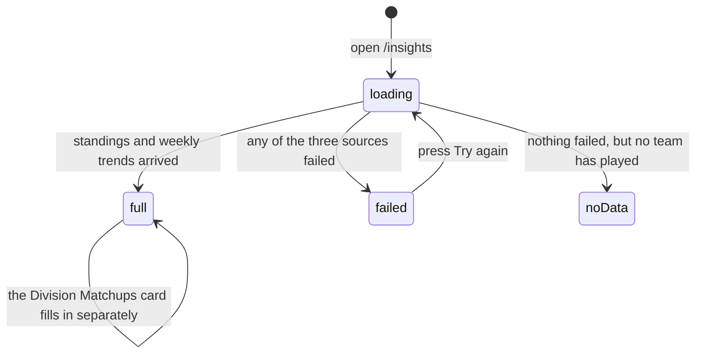

# League insights

## Summary

`/insights` is a single page of league-wide numbers: how big the league is, how
strong each division is, how even the competition is, how the divisions do
against each other, and which teams lead in six categories. It is the only page
in the app that describes the league rather than a team, a match, or a season's
table.

It is entirely read-only and entirely derived. It fetches nothing of its own
beyond what `/stats` already fetches, plus one extra query for the
division-against-division records. Everything else is arithmetic done in the
browser over the standings.

The page is reached from an "Insights" button at the top of
[`standings-and-rankings.md`](standings-and-rankings.md), and from nowhere else
in the app's navigation.

## The simple case

A player presses "Insights" on the standings. A spinner reads "Crunching the
numbers...". A second later the page shows a heading, "League Insights — A look
at the state of the league", and five blocks down the page:

1. **Four stat cards**: Teams, Matches Played, Avg Power Score with the median
   underneath, and Avg Win Rate.
2. **Division Strength**: a horizontal bar chart, one bar per division, showing
   each division's average power score on a 0–100 axis. Hovering a bar shows its
   average power score, average win rate, and team count.
3. **League Parity**: a 0–100 parity index with a word for it — Very High down to
   Very Low — a coloured bar, and three numbers: standard deviation of power
   score, the gap between the best and worst team, and how many teams sit within
   ten points of the average.
4. **Division Matchups**: the combined head-to-head record between every pair of
   divisions, six rows.
5. **Top Performers**: up to six cards — Top Power Score, Best Win Rate, Toughest
   Schedule, Longest Win Streak, Most Improved, Biggest Drop — each naming a team
   and linking to it.

## The interaction, event by event

### Arrive

Three things load: the standings, this week's biggest risers, and this week's
biggest fallers. The whole page waits for all three — there is one spinner for
everything, not a skeleton per card.

A fourth query, for Division Matchups, runs independently and fills that one card
in later. Its card shows six grey bars while it waits.

The page restores its scroll position when the user comes back with the browser's
back button.

**Nothing is written by arriving.**

### Leave without changing anything

Nothing is recorded and nothing is kept.

### Begin editing

There is nothing to edit. The page has no controls at all beyond the links inside
the Top Performers cards. It is the most inert page in the app.

### While editing

Not applicable. Nothing on this page responds to anything except new data.

### Submit

Not applicable.

## What is counted, and what is not

The page divides teams into two populations and mixes them in one place.

**Active teams** are teams that have played at least one match **and** have a
power score. Everything on this page is computed over active teams: the averages,
the median, the division strength bars, the parity numbers, and every top
performer.

**All teams** is every team in the standings, including teams that have not
played. Only one number uses it: the **Teams** card.

The "Competitive Teams" figure on the parity card is therefore shown as
"*n* / *total*" where the numerator counts active teams and the denominator
counts all teams. In a season that has just started, that reads badly.

**Matches Played** is worked out by adding up every active team's wins and
losses and halving the result, on the assumption that both sides of every match
are in the population. A match played against a team that has no power score —
one that has only ever tied, say — is counted once and then halved, so the figure
can come out half a match wrong and is rounded.

## What each number means

| Number | How it is worked out |
| --- | --- |
| **Teams** | Every team in the standings, played or not. |
| **Matches Played** | Active teams' wins plus losses, divided by two, rounded. |
| **Avg Power Score** | The mean power score of active teams, one decimal. |
| **Median** | The middle power score of active teams. Shown under the average so the two can be compared. |
| **Avg Win Rate** | The mean win percentage of active teams, one decimal. |
| **Division Strength** | Per division: average power score, team count, average win rate, average strength of schedule. Sorted strongest first. Divisions come from the team's division name, so a team with none is grouped as "Unassigned". |
| **Parity Index** | 100 minus four times the standard deviation of power score, floored at 0. A perfectly even league scores 100; a spread of 25 points scores 0. |
| **Std Deviation** | The spread of power scores, one decimal. |
| **Top-Bottom Gap** | Best active team's power score minus the worst active team's. |
| **Competitive Teams** | Active teams within ten power-score points of the league average. |
| **Division Matchups** | Combined wins between each pair of divisions, **across every season the league has ever played**, including playoffs. |
| **Top Performers** | Six single-team superlatives, described below. |

The six top performers, in order:

- **Top Power Score** — the first team in the standings, with its record.
- **Best Win Rate** — highest win percentage among active teams.
- **Toughest Schedule** — highest strength of schedule.
- **Longest Win Streak** — the longest current run of wins. Absent when nobody
  is on one.
- **Most Improved** — the biggest weekly power-score rise. Absent when nobody
  rose.
- **Biggest Drop** — the biggest weekly fall. Shown whenever there is one, even
  if it is a rise.

## Modifiers

| Modifier | Set at arrival | Changed while editing |
| --- | --- | --- |
| The user's role | No effect. A visitor, a player, and an admin see an identical page. Nothing here is gated and nothing is highlighted for the signed-in user's team. | No effect. |
| The record's state | With no team having played, the whole page is replaced by "No Data Yet — League insights will appear once teams have played some matches." A card whose input is missing is absent rather than empty: no divisions means no Division Strength chart, no performers means no Top Performers block. | A first result being completed elsewhere turns the empty page into a full one on the next refetch. |
| The season's state | Everything except Division Matchups is the active season, and nothing says so — there is no season badge on this page. Division Matchups is every season ever. | A season activated elsewhere empties the page back to "No Data Yet" until matches are played, while Division Matchups keeps its all-time totals. |
| Viewport | The stat cards are two across on a phone and four on a wide screen. The two charts sit side by side above a large screen and stack below it. Top Performers is one, two, or three columns. | No effect beyond re-flowing. |
| Keys the page honours | Nothing is focused on arrival and there are no shortcuts. Tab reaches each Top Performer card in turn; nothing else on the page is focusable. | No shortcuts. |

## Cancel and interrupt

| Event | Before the first edit | While editing or submitting |
| --- | --- | --- |
| Escape, or a Cancel button | No effect. There is no Cancel on this page. | No effect. Nothing on this page can be in progress. |
| In-app navigation away, or switching tab within the page | Nothing is lost. There is nothing to lose. | Nothing is lost. |
| Browser back or forward | Returns to the standings, which is where nearly everybody arrives from. | Coming back restores the scroll position. Nothing else about the page has state. |
| Reload, or the tab closed | Reloads everything, spinner and all. | Same. |
| Network lost mid-request | The whole page is replaced by a card reading "We could not load league insights. Please try again", with a "Try again" button that refetches all three sources. **The underlying reason is discarded** in favour of that sentence. | A background refetch that fails leaves the numbers on screen unchanged, with nothing marking them stale. |
| The request fails or times out | As above. Any one of the three sources failing replaces the whole page, even when the other two succeeded. | As above. The Division Matchups query failing is different: that card shows its grey bars forever, with no error and no retry. |
| The session expires | No effect. The page is public. | No effect. |
| The same record changed in another tab, or by another user | Not applicable before arriving. | **No realtime.** A result completed by an admin does not reach this page until it refetches. Every number here is an aggregate, so one result changes almost all of them at once. |
| Browser autofill or a password manager writes into the form | No effect. There are no fields on this page. | No effect. |
| The window loses focus | No effect. | Returning to the tab refetches the standings, so the whole page can recompute while it is being read. |

## Interactions with other systems

**Permissions and roles.** None. Everything is public and read-only. See
[`cross-cutting/permissions.md`](../cross-cutting/permissions.md).

**Season scoping.** Everything except Division Matchups is the active season, and
the page never names it. Division Matchups is all-time and says so only in a line
of small print. See [`foundations/seasons.md`](../foundations/seasons.md).

**Validation and error display.** Nothing to validate. One failure replaces the
whole page with a generic sentence and a retry.

**Unsaved changes.** None.

**Optimistic updates and rollback.** None.

**Realtime.** None.

**Offline.** The page shows its generic failure card. Nothing is cached for
offline reading.

**Toasts and notifications.** None. This page produces no messages at all.

**URL state.** None beyond the path. There is nothing on the page to put in a
URL.

**On a phone.** The layout stacks and the Insights button that leads here moves
into the standings' top bar. The Division Strength chart keeps a fixed height of
240 pixels and its division labels keep 110 pixels of width, so long division
names are squeezed on a narrow screen. See
[`cross-cutting/on-a-phone.md`](../cross-cutting/on-a-phone.md).

**Accessibility.** The Top Performer cards are real buttons and work from the
keyboard. Team logos on them are marked decorative, which is right, because the
name is beside them. **Both charts are unreadable without sight**: the bar chart
and the parity bar carry no text alternative, and the numbers behind the bar
chart are available only in a hover tooltip.

**Side effects the user can notice.** None. The page shares its data with
`/stats`, so arriving here from the standings is usually instant and arriving
here directly is not.

## Edge cases

- **"Competitive Teams" mixes two populations.** The numerator counts teams that
  have played; the denominator counts every team. Early in a season it can read
  "3 / 22" when only four teams have played at all.
- **Matches Played can be wrong by one.** Halving a total that includes a
  one-sided match rounds to the nearest whole match.
- **"Biggest Drop" can show a rise.** It takes the first of the week's fallers
  without checking that the change is negative, so in a week when nobody fell it
  shows the smallest riser as a drop. "Most Improved" does check.
- **Both weekly performers vanish together** when the weekly snapshots are
  missing, because both come from the same snapshot comparison.
- **A parity index of 0 does not mean no parity**; it means a standard deviation
  of 25 points or more, which is where the scale bottoms out.
- **Division Matchups counts every season ever**, so the numbers there are far
  larger than anything else on the page and cannot be reconciled with the Matches
  Played card.
- **Same-division rows in Division Matchups are always symmetric** — "Competitive
  vs Competitive 112–112" — because every match inside a division adds one win to
  each side. That is arithmetic, not a tie.
- **A division pair with no matches reads "0 – 0 no matches"** rather than being
  hidden.
- **Top Performers links to a team by its internal id**, while every other link
  to a team in the app uses its name.
- **Divisions in the strength chart are coloured by position**, not by identity,
  so a division's colour changes when the order changes.

## Open questions and verification

- **"Biggest Drop" can be a rise.** The risers list is filtered for a positive
  change and the fallers list is not. **May be worth treating as a bug rather
  than documenting.**
- **The "Competitive Teams" ratio compares two different populations.** **May be
  worth treating as a bug rather than documenting.**
- **One failing source blanks the entire page**, including the cards whose data
  arrived successfully. **May be worth treating as a bug rather than
  documenting.**
- **Both charts have no non-visual equivalent.** The parity index and the
  division averages are read out nowhere but a hover tooltip and a coloured bar.
- **Division Matchups is all-time while the rest of the page is one season**, and
  the card's small print says only that it uses "each team's display division at
  the time of the match".
- Not confirmed by hand: whether the Division Matchups query is slow enough on
  the live database to leave its skeleton visible for long — it reads every match
  ever played, every archived match, every playoff match, and every team-season
  row.
- Not confirmed by hand: what the parity index actually reads for this league,
  and therefore whether the 0–100 scale is usefully spread.
- Assumption: the page is meant to be found from the standings. Nothing else in
  the app links to `/insights`.

Verified against `717rec` commit `ea5c8f4`.
