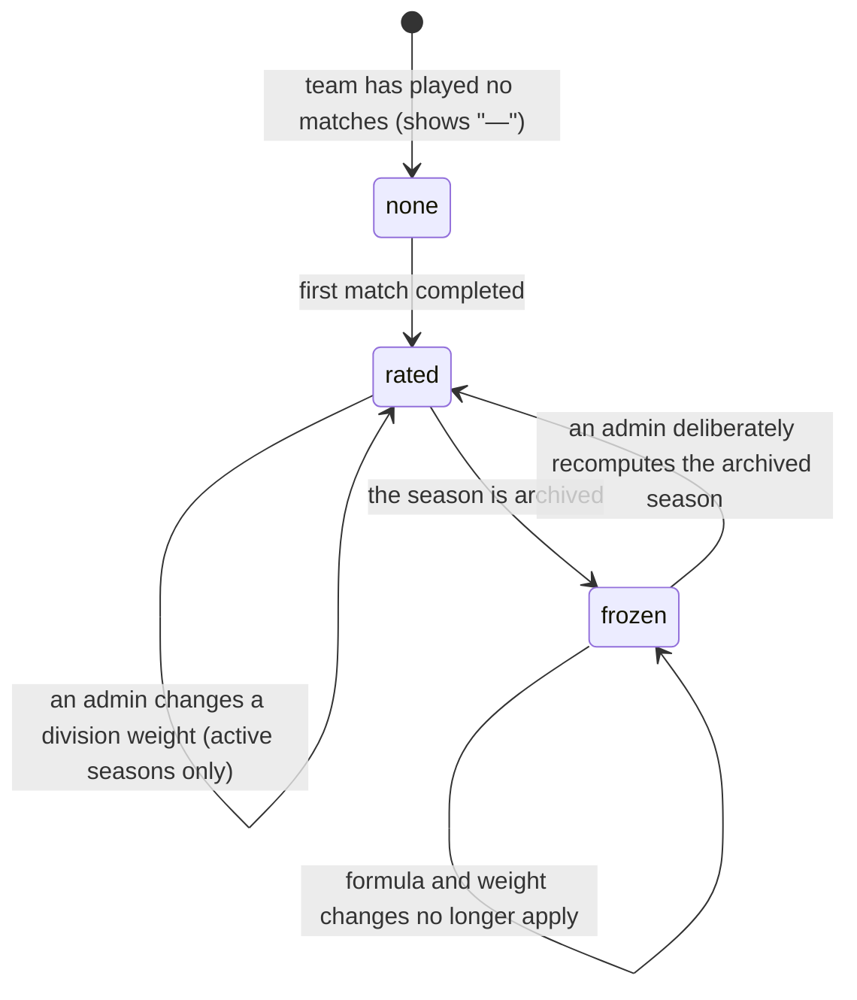

# Power score

## Summary

Power score is 717rec's rating of how good a team is. It is one number between 0
and 100, shown to one decimal, and it is the number the standings are ordered by.
It is **not** a count of wins and it is **not** a running total. It is a weighted
average of everything a team has done this season, so a single result can move it
either way.

Three things go into it: how often the team wins matches, how often it wins
individual games, and how strong its opponents have been. Every one of those
terms is weighted by the opponent's division, and the division used is the one
the opponent was in **on the day the match was played**.

This document owns what the number means, how it moves, and every place it
appears. The table it orders is owned by
[`standings-and-rankings.md`](standings-and-rankings.md). The season rules that
freeze it are owned by [`foundations/seasons.md`](../foundations/seasons.md).

## The simple case

A player looks at their team on `/stats` and sees **62.4** in the Power column,
in orange. Their team's page shows the same 62.4 inside a circular gauge, with
their overall rank beside it.

Their team wins a match against a strong Competitive team. Some hours later the
number has gone up. A week later they beat a Recreational team who have not won a
game all season, and the number goes **down** — because the average of everything
they have done now includes a very easy win.

Nothing on the screen explains that. There is one sentence under the standings
heading, "Based on opponent-weighted win percentage, strength of schedule (SOS),
and game-level performance", and no further explanation anywhere in the app
except the help page's summary of the live weights.

## The interaction, event by event

Power score is a number, not a screen, so its "interaction" is the loop between a
result being recorded and the number changing.



### Arrive

The number is computed on the server and read by the browser as a plain number.
Nothing about the calculation happens in the page, so there is no moment where
the browser is "working it out" and no way for two screens to disagree about
arithmetic.

A team with no completed match has **no** power score. The column shows "—", the
gauge shows neutral grey, and the team sorts to the bottom. This is different
from a score of 0, which is a real rating a very poor team can reach.

A team in the **Hidden** division also has no power score, by design.

### Leave without changing anything

Nothing. Reading a power score records nothing and changes nothing.

### Begin editing

Nobody edits a power score. There is no control anywhere in the product that sets
one. What can be edited, all of it by an admin, is the input:

- **Completing, reopening, or correcting a match** changes the results the score
  is computed from.
- **Changing a division's weight** changes how heavily its teams count as
  opponents — from the date of the change onwards.
- **The three weights in the formula** are admin-adjustable in the Power Score
  Sandbox and apply to every season at once.

### While editing

The recalculation is not instant and is not announced. A result approved by an
admin sets off badge processing and a power score recalculation on the server, so
numbers elsewhere in the app change some time later rather than as the result is
saved. A user looking at the standings sees the old number until their page
refetches.

### Submit

There is no commit a user performs. The commit that matters is **completing a
match**, described in
[`live-scoring/finish-the-match.md`](../live-scoring/finish-the-match.md) and
[`scores/submit-a-score.md`](../scores/submit-a-score.md).

## What the number is made of

The season formula, with the league's default weights:

```
Power score = weighted match win rate × 40
            + weighted game win rate   × 15
            + strength of schedule     × 45
```

| Term | What it is |
| --- | --- |
| **Weighted match win rate** | Wins divided by matches, with every match weighted by the opponent's division weight. Winning every match reads 1.0 whoever was played, so this term rewards winning, not opponent strength. |
| **Weighted game win rate** | The same shape, counted in games rather than matches. |
| **Strength of schedule** | The average division weight of the opponents faced, held between 0.1 and 1.0. **This is the term that rewards a hard schedule.** It is not the average power score of opponents, which is what most people assume. |

Three consequences follow, and all three surprise people:

- **Beating a weak team can lower the score.** Both win-rate terms are averages,
  and the strength-of-schedule term drops. A team on a perfect record can still
  fall.
- **Nearly half the number is the schedule.** A team with no say in who it plays
  carries 45 points of a rating decided by the fixture list.
- **100 is unreachable.** The strength-of-schedule term is capped by the
  strongest division's weight, and no division carries a weight of 1.0. The real
  ceiling is 100 times the top division's weight, and it moves when the league
  re-weights a division.

**The three weights are not fixed.** 40/45/15 is the league's current setting,
kept as data and changed through the admin sandbox. Changing them rewrites every
season's stored score at once. The help page quotes whatever is live rather than
the numbers above.

## Which division an opponent counts as

An opponent is rated by the division they were in **when the match was played**,
not the division they are in today. The reason is that there is no "withdrew"
flag in the product: a team that stops playing is moved to the Hidden division,
which overwrites the division they actually played in.

Before that rule existed, everyone who had beaten a dropped-out team was punished
for it, badly enough to push a real team's rating below zero. The rule is what
stops an archived season moving when the league re-tiers a team.

Working out the historical division runs down a chain of seven sources, from the
weekly snapshot nearest the match date down to the last division ever seen for
that team. If every step fails, the match is dropped from the three weighted
terms — **and only from them**. Wins, losses, games won and games lost always
count every match, so a team's record and its rating can be built from slightly
different sets of matches without anything saying so.

## Season, career, and why they disagree

There are **three** power scores in the product and they are computed three
different ways.

| Number | Where it appears | How it is built |
| --- | --- | --- |
| **Season power score** | The standings, the team page gauge, insights, trends | The formula above, for the active season. |
| **Season career score** | Stored per season, feeding the career number | The same formula with an earned-schedule floor: a team performing below a threshold keeps only part of its schedule credit. A single rough season should not crush a live standing, so the floor applies to the long run only. |
| **Career power score** | The "Career Statistics" card, the all-teams career chart | A weighted average of each season's score, weighted by matches played, plus playoff bonuses for titles, runner-up finishes, and a playoff record over .500 — each scaled by the square of the division the result happened in, and capped in total by the strongest such division. |

Because they are built differently, **a team can be higher in the standings than
in the career table, or the other way round, with nothing wrong**. Nothing in the
app warns about this.

A team with no matches at all has a career score of 0, so it sits at the foot
of the career table. Unlike the standings, where an unplayed team shows "—"
and no rating, the career table gives it a real number.

## Where a power score appears

- **`/stats`** — the Power column, the mobile gauge, the top-three leaderboard,
  the "Top 8 Power Scores" chart, and the career table.
- **`/insights`** — the average and median, the division strength chart, the
  parity index, and "Top Power Score" among the top performers. See
  [`insights.md`](insights.md).
- **A team's page** — the gauge, the rank card, the stat breakdown, the report
  card grades, and the career chart. See
  [`teams/team-details.md`](../teams/team-details.md).
- **`/compare`** — both teams' scores side by side.
- **The home page** — the top-teams list and the week's biggest riser.
- **Power Score Trends** — week-over-week and season-over-season movement, built
  from snapshots captured every Thursday at 11pm Eastern.
- **Badges** — the King Slayer and Gatekeeper badges are decided by power score.
  King Slayer uses the same career score the career table shows. See
  [`badges.md`](badges.md).

The colour is meaningful everywhere it is shown: eight bands from gold at 85 and
above, through green, blue, orange, amber, pink and purple, to red below 20. A
missing score is neutral grey.

## Modifiers

| Modifier | Set at arrival | Changed while editing |
| --- | --- | --- |
| The user's role | No effect. Everyone sees the same number. Only an admin can change anything that feeds it. | No effect. |
| The record's state | A team with no completed match has no score and shows "—". A hidden team has no score. A completed match feeds the score; a pending score submission does not, until it is approved. | A match being reopened reverses everything the original result contributed. |
| The season's state | An active season's scores move. **An archived season's scores are frozen** and no longer respond to a formula change, a weight change, or a re-tiering. | Archiving a season freezes it at that moment. An admin can deliberately recompute an archived season, which is the only way a frozen number ever changes. |
| Viewport | On a wide screen the score is a coloured number in a table cell. On a phone it is a number in a card, and in detailed view an animated circular gauge. | No effect. |
| Keys the app honours | None. A power score is text, not a control. | None. |

**Two seasons' power scores are not always comparable**, because they may have
been produced by different formulas or different division weights. Nothing in the
app says so.

## Cancel and interrupt

| Event | Before the first edit | While editing or submitting |
| --- | --- | --- |
| Escape, or a Cancel button | No effect. A power score has no controls. | No effect. |
| In-app navigation away, or switching tab within the page | Nothing is lost. The number is on the server. | Nothing. A recalculation already running on the server finishes whether or not anybody is watching. |
| Browser back or forward | No effect. | No effect. |
| Reload, or the tab closed | Refetches the number. | The number is refetched, so a reload is the fastest way to see a recalculation land. |
| Network lost mid-request | The number cannot load and its page shows its own failure state. | A number already on screen stays on screen, unchanged and possibly wrong, with nothing marking it stale. |
| The request fails or times out | As above. | As above. |
| The session expires | No effect. Power scores are public. | No effect. |
| The same record changed in another tab, or by another user | Not applicable. | **This is the normal case.** Somebody else's match being completed changes the whole league's numbers. There is no realtime anywhere power score is shown, so every screen keeps its old number until it refetches — up to five minutes on the standings, ten on the career tables. |
| Browser autofill or a password manager writes into the form | No effect. | No effect. |
| The window loses focus | No effect. | Returning to the tab refetches, which is the most common moment for a number to change under the reader. |

## Interactions with other systems

**Permissions and roles.** Reading needs nothing. Changing weights, correcting
matches, and recomputing an archived season are all admin-only. See
[`cross-cutting/permissions.md`](../cross-cutting/permissions.md).

**Season scoping.** Season power score means "in this season" everywhere it
appears without a label. Career numbers say so in their heading. See
[`foundations/seasons.md`](../foundations/seasons.md).

**Validation and error display.** Nothing to validate. A missing score is shown
as "—" rather than as an error, everywhere.

**Unsaved changes.** Not applicable.

**Optimistic updates and rollback.** None. A power score is never shown
optimistically; it appears only once the server has recomputed it.

**Realtime.** None, anywhere a power score is shown.

**Offline.** Nothing to show. No power score is cached for offline reading.

**Toasts and notifications.** None. A power score changing is never announced,
by toast or by push, even when it changes a team's rank.

**URL state.** None. There is no link to a power score.

**On a phone.** The gauge replaces the plain number in detailed view and animates
from zero on every render. See
[`cross-cutting/on-a-phone.md`](../cross-cutting/on-a-phone.md).

**Accessibility.** The number is plain text everywhere and reads correctly. Its
colour band carries meaning that nothing else conveys — an 88 and a 42 are
announced identically — and the animated gauge counts up from zero on every
render rather than settling once, which is motion nobody asked for. See
[`cross-cutting/accessibility.md`](../cross-cutting/accessibility.md).

**Side effects the user can notice.** Completing a match sets off a
recalculation for the whole league, so numbers for teams that did not play change
too. That is correct — the schedule-strength term depends on everyone — but it
looks like a bug to anyone watching one team.

## Edge cases

- **A win can lower the score.** This is the single most surprising thing about
  the number and it is never explained on screen.
- **"—" is not zero.** A team that has not played is unrated; a team rated 0 has
  played and done badly. They sort to different places.
- **A negative score is impossible now, but the stored history remembers when it
  was not.** The trend charts read snapshots, which were deliberately not
  rewritten when the formula changed, so a one-time jump is visible in the movers
  the week the change shipped.
- **A team's record and its rating can be built from different matches**, when a
  match's historical division cannot be resolved.
- **Re-weighting a division moves every active-season score at once**, including
  for teams that never played that division, through the schedule-strength term.
- **An archived season and the current season can be rated by different
  formulas**, which makes a cross-season comparison meaningless without saying
  so.
- **The career table can rank a team above a team that beats it in the
  standings**, because the two numbers are different calculations.
- **A team with no matches has a career score of 0**, which places it at the
  bottom of the career table, below every team with a record. The two tables
  differ here on purpose: the standings show "—" and no rating for the same
  team.

## Open questions and verification

- **Nothing in the app explains that beating a weak team can lower the score.**
  This is the league's most predictable support question and the product answers
  it nowhere. A product decision rather than a defect.
- **Nothing warns that two seasons' scores may not be comparable.** The history
  pages present them side by side.
- Not confirmed by hand: how long the recalculation takes after a result is
  approved, and therefore how long a user sees the old number.
- Not confirmed by hand: how many matches in the live database fail to resolve a
  historical division, and therefore how often the record and the rating are
  built from different matches.
- Not confirmed by hand: whether the weekly snapshot job actually runs at 11pm
  Eastern on Thursdays, which everything about trends depends on.
- Not confirmed by hand: the live division weights, and therefore the real
  ceiling of the number. They are edited through the admin screen and no
  migration holds the current values.

Verified against `717rec` commit `ea5c8f4`, except the career score the King
Slayer badge is decided by, which was changed after that commit — see
[B-35](../bug-triage.md#b-35-a-stale-fourth-career-power-score-formula-decides-one-badge).
