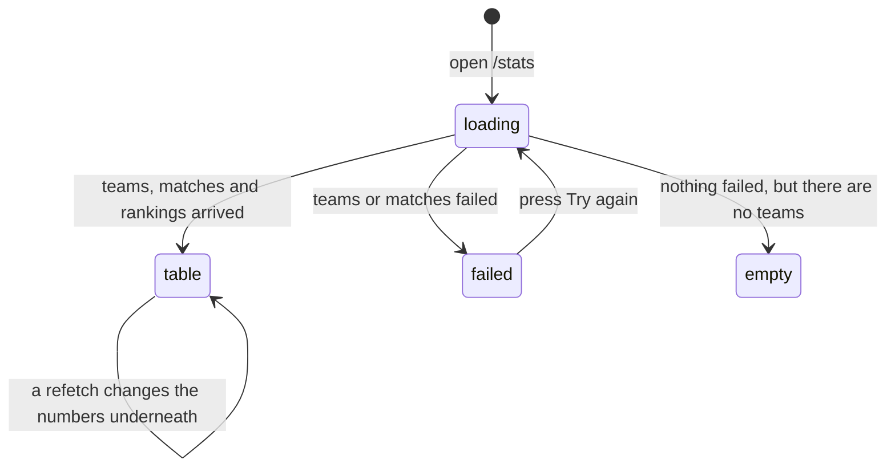

# Standings and rankings

## Summary

`/stats` is the league table. It shows every team in the active season with its
record, its power score, its strength of schedule, its streak, and whether it has
moved since the last snapshot. It is the page a player checks to see where their
team sits.

The page is read-only and public. Nothing on it can be changed by anybody,
including an admin. What a user *can* change is how it is arranged: by division
or as one list, sorted by any column that has values of its own — eight on a
wide screen, four on a phone — and, on a phone, compact or detailed. None of those choices is in the address, so none of them survives
leaving the page.

The standings are ordered by **power score**, which is a rating rather than a
count of wins. What power score is and how it moves is owned by
[`power-score.md`](power-score.md); this document owns the table around it.

## The simple case

A player opens `/stats`. A small badge names the season and the week — "Winter
2026 • Week 4" — and a button offers "Insights". Under that is a card headed
"Current Standings", described as "Based on opponent-weighted win percentage,
strength of schedule (SOS), and game-level performance".

Inside the card the teams are split by division, strongest division first, each
division its own table. Rows are ordered by power score, best first. Each row
shows the team's rank inside its division with its overall rank in brackets, its
logo, its name, any badges it has earned, then Power, W-L, Win %, Games, Game %,
SOS, Streak, and a trend arrow.

Below the standings are three more cards, all collapsed: "Performance Charts",
an all-teams career power score chart, and "Career Statistics".

## The interaction, event by event

### Arrive

Three things load together: every team with its season numbers, every match, and
the previous ranking snapshot used for the trend arrows. Until all three are
back, the whole page is a skeleton in the shape of the content — a table of five
grey rows, four summary cards, two chart panels and a list.

The ranking itself is worked out in the browser from the teams that arrive. The
power score is not: it is computed on the server and read as a number.

Teams in the **Hidden** division are dropped before the table is built, so a team
that stopped playing disappears from the standings while its results still count
for everyone it played.

**Nothing is written by arriving.** The trend baseline is written by a scheduled
job on the server, never by a page being opened.

The page restores its scroll position when the user comes back to it with the
browser's back button.

### Leave without changing anything

Nothing is recorded and nothing is kept, except the compact-or-detailed choice on
a phone, which is remembered in the browser. Division-or-all and the sort order
are both forgotten.

### Begin editing

There is nothing to edit. The table has four controls and none of them writes
anything:

- **Division / All.** Splits the table by division, or shows one list of every
  team. On a wide screen this is in the card header and disappears when the card
  is collapsed; on a phone it sits above the cards.
- **A column heading.** Sorts by that column, and pressing the same heading again
  reverses it. Every heading except **#**, **Division** and **Trend** sorts. Each
  one is a button, so Tab reaches it and Enter or Space sorts.
- **A row.** Pressing a row highlights it. On a phone in compact view it also
  opens two extra numbers and a "Compare Team" button.
- **The chevron.** Collapses the whole standings card.

### While editing

Sorting re-orders every division at once and re-numbers the division ranks to
match, so the number in brackets — the overall rank — and the number before it
can disagree in ways that only make sense for the column being sorted.

Switching to **All** sorts the whole list by power score regardless of the column
chosen, then applies whatever sort is set on top of it. The division column
appears and the bracketed overall rank disappears, because in that view the two
are the same number.

Nothing about any of this changes the address. `/stats` is `/stats` throughout.

### Submit

Not applicable. This page has no commit of any kind.

## How the table is ordered

The default order is **power score, highest first**. Ties are broken in this
order, and only for power score:

1. **Higher division first.** Competitive, then Intermediate, then Recreational.
   A stronger division outranks a better record.
2. **Higher win percentage.**
3. **Team name, alphabetically.**

Two rules matter more than they look:

- **The comparison uses the number as displayed**, rounded to one decimal. Two
  teams shown as 62.4 are a tie and go to the tiebreakers, even when the stored
  numbers differ in the third decimal.
- **A missing Power or Streak sorts last**, whichever direction the sort is set
  to. A team that has not played has no rating rather than a rating of zero, so
  its Power column reads "—", and it has no streak, so its Streak column reads
  "N/A". Sorting either column ascending therefore does not put those teams
  first, which surprises people. The rule covers those two columns only: on
  W-L, Win %, Games, Game % and SOS the same team sorts as a zero, because zero
  wins and zero games are true of it.
- **Streaks sort by run length, wins above losses.** `W10` is above `W2`, which
  is above `L1`, which is above `L9`.

Division rank is worked out inside each division using the same sort. Overall
rank is the row's position in the full sorted list.

## What each column means

| Column | What it is | Shown |
| --- | --- | --- |
| # | Division rank, with overall rank in brackets. In All view, overall rank alone. **Not sortable** — the number is the row's position under the current sort, so it has no values of its own. | always |
| Team | Name, logo, and up to four badges. Links to the team's page. A compare icon appears on hover. | always |
| Division | The team's division. | All view only |
| Power | Power score, one decimal, coloured in eight bands from gold down to red. "—" when the team has not played. | always |
| W-L | Matches won and lost. | always |
| Win % | Match win percentage, one decimal, coloured in four bands. | always |
| Games | Games won and lost across all matches. | wide screens |
| Game % | Game win percentage. | very wide screens |
| SOS | Strength of schedule, three decimals. The average division weight of the opponents faced — **not** the average power score of opponents. | always |
| Streak | The current run, as `W3` or `L2`. "N/A" for a team with no completed match. | always |
| Trend | How far the team has moved since the last snapshot: a green up arrow, a red down arrow, or nothing. | always |

The streak counts **playoff matches too**. The matches this page loads include
completed playoff matches for the season being shown, so a team that lost its
first playoff match shows `L1` even after a winning regular season.

## Modifiers

| Modifier | Set at arrival | Changed while editing |
| --- | --- | --- |
| The user's role | No effect. A visitor, a player, and an admin see an identical table. Nothing is highlighted for the signed-in user's own team. | No effect. |
| The record's state | A team with no completed match shows "—" for Power, "N/A" for Streak, and sorts to the bottom. A hidden team is absent. | A result approved elsewhere changes a team's numbers on the next refetch, with no announcement. |
| The season's state | The table always shows the active season and never says which one, except through the season badge above it. There is no season picker here — past seasons are at [`history/past-seasons.md`](../history/past-seasons.md). | A season activated elsewhere changes the whole table under the user once the ten-minute season cache expires. |
| Viewport | On a wide screen the table is a real table, with Games appearing at medium width and Game % at large. On a phone it is a list of cards with a top-three leaderboard above it, a compact/detailed toggle, and four sort pills instead of column headings. | Rotating a phone into landscape does not switch to the desktop table; the breakpoint is width alone. |
| Keys the page honours | Nothing is focused on arrival and there are no shortcuts. Tab reaches the Insights button, the toggles, each sortable column heading, then each team link and compare link in turn. | A focused heading sorts on Enter or Space. Each heading also carries its sort state for screen readers. |

## Cancel and interrupt

| Event | Before the first edit | While editing or submitting |
| --- | --- | --- |
| Escape, or a Cancel button | No effect. There is no Cancel on this page. | No effect. Nothing on this page can be cancelled, because nothing is in progress. |
| In-app navigation away, or switching tab within the page | Nothing is lost. | The division-or-all choice, the sort, and the expanded row are all lost. The compact/detailed choice on a phone survives, because it is stored in the browser. |
| Browser back or forward | Returns to the previous page. | Coming back restores the scroll position but not the sort or the view. A user who sorted by SOS, opened a team, and came back is looking at a differently-ordered table at the same scroll offset. |
| Reload, or the tab closed | Reloads everything. | Same as navigating away, and the scroll position is not restored either. |
| Network lost mid-request | The page shows a full-screen red panel: "There was an error loading the statistics data. Please try refreshing the page", with the underlying message and a "Try again" button. | Nothing in flight to lose. A background refetch that fails leaves the old numbers on screen with no sign that it failed. |
| The request fails or times out | As above. Reads are retried once before the panel appears. | As above. |
| The session expires | No effect. The standings are public. | No effect. |
| The same record changed in another tab, or by another user | Not applicable before arriving. | **There is no realtime here.** A score approved by an admin does not reach the table until something causes a refetch — returning to the tab, or remounting the page. Numbers then change under the user with no announcement and no highlight. |
| Browser autofill or a password manager writes into the form | No effect. There are no fields on this page. | No effect. |
| The window loses focus | No effect. | Returning to the tab refetches the teams and matches. The table can therefore re-order itself while the user is reading it, and the trend arrows re-run their flash animation. |

## Interactions with other systems

**Permissions and roles.** None. Everything here is public and read-only. See
[`cross-cutting/permissions.md`](../cross-cutting/permissions.md).

**Season scoping.** Everything on the page except the two career cards is the
active season. The career cards say so in their headings. See
[`foundations/seasons.md`](../foundations/seasons.md).

**Validation and error display.** Nothing to validate. A failure to load teams or
matches replaces the whole page; a failure inside the career or chart cards is
contained to that card.

**Unsaved changes.** None.

**Optimistic updates and rollback.** None.

**Realtime.** None. See
[`foundations/saving-and-freshness.md`](../foundations/saving-and-freshness.md).

**Offline.** The page shows its full-screen failure panel. Nothing is cached for
offline reading.

**Toasts and notifications.** None. This page produces no messages at all.

**URL state.** None beyond the path. The sort, the view, the expanded row, and
the collapsed cards are all lost on navigation, so a particular arrangement of
the table cannot be shared or bookmarked.

**On a phone.** The table becomes cards. A "League Leaderboard" strip at the top
shows the top three by power score with gold, silver and bronze borders — always
by power score, whatever the sort is set to. Compact shows rank, team, record and
power; detailed adds a power gauge and a four-box grid of Games, Win %, SOS and
Game %. The choice is remembered between visits. See
[`cross-cutting/on-a-phone.md`](../cross-cutting/on-a-phone.md).

**Accessibility.** Each sortable column heading is a button inside the header
cell, so it is a Tab stop and sorts on Enter or Space; the cell carries a sort
state that a screen reader announces. Each rank cell has a spoken label
that includes the movement — "Division rank 3, overall rank 7, moved up 2
positions". Rows are deliberately not focusable, because they contain links.
Trend arrows animate on every render.

**Side effects the user can notice.** None. Opening the standings changes
nothing, records nothing, and writes no snapshot.

## Edge cases

- **The sort is not remembered.** Every visit starts at power score, descending.
- **The rank column does not sort.** The number in it is the row's position
  under whatever sort is set, so there is nothing of its own to sort by.
- **A team's own row is never highlighted.** The page works out which team the
  signed-in player belongs to and then does not use it.
- **Expanding a row on a desktop shows nothing.** It tints the row and that is
  all; the extra numbers exist only on a phone in compact view.
- **Division and overall rank can look contradictory** when sorting by a column
  the tiebreakers do not cover, because the bracketed overall rank comes from a
  differently-tied list. Teams tied on the sorted column keep power-score order.
- **A division named anything unexpected still gets a table**, headed
  "Unassigned" when a team has no division at all.
- **The leaderboard strip counts every team**, including teams with no matches,
  in its "N teams" label.
- **The trend arrow is blank, not zero, for a team that has never been ranked**;
  a team that has not moved shows "0".

## Open questions and verification

- **The signed-in user's own team is computed, passed through three components,
  and never used.** Either the highlight was lost or it was never finished.
  **May be worth treating as a bug rather than documenting.**
- **The matches used for streaks are fetched without a season filter.** The page
  relies on old seasons' matches having been moved to the archive table. If any
  remain, a streak can run across a season boundary.
- Not confirmed by hand: how often the trend arrows are actually non-blank, which
  depends on the weekly snapshot job having run.
- Not confirmed by hand: whether the page feels like it re-orders under the
  reader in practice after returning to the tab.
- Assumption: "Based on opponent-weighted win percentage, strength of schedule
  (SOS), and game-level performance" is meant as an explanation of power score
  rather than of the sort order.

Verified against `717rec` commit `ea5c8f4`, except the sorting and keyboard
behaviour above, which was changed after that commit — see
[B-34](../bug-triage.md#b-34-four-standings-columns-silently-sort-by-power-score-instead).
